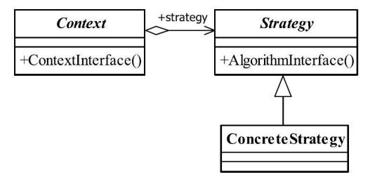

[TOC]


# 一、前言

# 二、基本概念

策略模式（Strategy Pattern）是一种比较简单的模式，也叫做政策模式（Policy Pattern）。

## 1.定义

定义一组算法，将每个算法都封装起来，并且使它们之间可以互换。

> Define a family of algorithms, encapsulate each one, and make them interchangeable.


## 2.适用场景

- 多个类只有在算法或行为上稍有不同的场景。


- 算法需要自由切换的场景。


- 需要屏蔽算法规则的场景。


注意事项：

> 如果系统中的一个策略家族的具体策略<u>***数量超过4个***</u>，则需要考虑使用混合模式，解决策略类膨胀和对外暴露的问题，否则日后的系统维护就会成为一个烫手山芋，谁都不想接。


## 3.优劣

### 3.1 优点

- 算法可以自由切换


- 避免使用多重条件判断


- 扩展性良好


### 3.2 缺点

- 策略类数量增多


- 所有的策略类都需要对外暴露

> 上层模块必须知道有哪些策略，然后才能决定使用哪一个策略，这与迪米特法则是相违背的，我只是想使用了一个策略，我凭什么就要了解这个策略呢？那要你的封装类还有什么意义？这是原装策略模式的一个缺点，幸运的是，**我们可以使用其他模式来修正这个缺陷，如工厂方法模式、代理模式或享元模式**。


## 4.登场角色




策略模式使用的就是面向对象的继承和多态机制。


### 4.1 Context（封装角色）

也叫做上下文角色，起承上启下封装作用，屏蔽高层模块对策略、算法的直接访问，封装可能存在的变化。


### 4.2 Strategy（抽象策略角色）

策略、算法家族的抽象，通常为接口，定义每个策略或算法必须具有的方法和属性。


### 4.3 ConcreteStrategy（具体策略角色）

实现抽象策略中的操作，该类含有具体的算法。


## 5.通用源码

### 5.1 Strategy


```java
public interface Strategy {
   
   //策略模式的运算法则
   public void doSomething();
}
```


### 5.2 ConcreteStrategy


- ConcreteStrategy1

```java
public class ConcreteStrategy1 implements Strategy {

   public void doSomething() {
      System.out.println("具体策略1的运算法则");
   }

}
```


- ConcreteStrategy2

```java
public class ConcreteStrategy2 implements Strategy {

   public void doSomething() {
      System.out.println("具体策略2的运算法则");
   }

}
```


### 5.3 Context

策略模式的重点就是封装角色，它是借用了代理模式的思路：

> 策略模式的封装角色和被封装的策略类不用是同一个接口，如果是同一个接口那就成为了代理模式。


```java
public class Context {
   //抽象策略
   private Strategy strategy = null;
   
   //构造函数设置具体策略
   public Context(Strategy _strategy){
      this.strategy = _strategy;
   }
   
   //封装后的策略方法
   public void doAnythinig(){
      this.strategy.doSomething();
   }
}
```


# 三、代码实例


# 四、相关设计模式


# 五、源码分析


# 六、参考资料
1. [CyC2018/CS-Notes](https://github.com/CyC2018/CS-Notes/blob/master/notes/%E8%AE%BE%E8%AE%A1%E6%A8%A1%E5%BC%8F.md) 
2. [quanke/design-pattern-java-source-code](https://github.com/quanke/design-pattern-java-source-code)
3. [图说设计模式](https://design-patterns.readthedocs.io/zh_CN/latest/)
4. [图解设计模式-CSDN-wujunyucg](https://blog.csdn.net/wujunyucg/article/category/7301352/1)