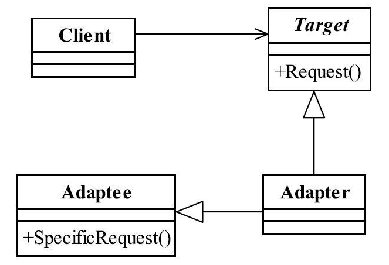
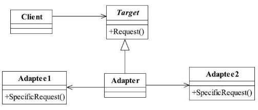

[TOC]


# 一、前言

适配器解决的问题是：适配，即接口不相容问题。


适配器模式又叫做变压器模式，也叫做包装模式（Wrapper）（还包括装饰模式），就是把一个接口或类转换成其他的接口或类。


# 二、基本概念
## 1.定义
将一个类的接口变换成客户端所期待的另一种接口，从而使原本因接口不匹配而无法在一起工作的两个类能够在一起工作。

> Convert the interface of a class into another interface clients expect.Adapter lets classes work together that couldn't otherwise because of incompatible interfaces.
>


>根据委托方式可分为：
>
>- 类适配器：类间继承
>- 对象适配器：类间关联


## 2.登场角色

此图为类适配器类图




### 2.1 Target（目标）

定义把其他类转换为何种接口，也就是我们的期望接口。


### 2.2 Adaptee（源）

带转换的角色，适配器将源角色转换成目标角色。


### 2.3 Adapter（适配器角色）

适配器模式的核心角色，其他两个角色都是已经存在的角色，而适配器角色是需要新建立的，它的职责非常简单：<u>把源角色转换为目标角色</u>，怎么转换？<u>通过继承或是类关联的方式。</u>


## 3.通用源码

### 3.1 Target

（1）Target

目标角色是一个已经在正式运行的角色，你不可能去修改角色中的方法，你能做的就是如何去实现接口中的方法，而且通常情况下，目标角色是一个接口或者是抽象类，一般不会是实现类。

```java
/**
 * 目标角色
 */
public interface Target {
   
   //目标角色有自己的方法
   public void request();
}
```


（2）ConcreteTarget

一个正在服役的目标角色如下

```java
public class ConcreteTarget implements Target {

   public void request() {
      System.out.println("I have nothing to do. if you need any help,pls call me!"); }

}
```


### 3.2 Adaptee

源角色也是处于服役状态，它是一个正常的类。

```java
/**
 * 源角色
 */
public class Adaptee {
   
   //原有的业务逻辑
   public void doSomething(){
      System.out.println("I'm kind of busy,leave me alone,pls!");
   }
}
```


### 3.3 Adapter

（1）类适配器

```java
/**
 * 适配器
 */
public class Adapter extends Adaptee implements Target {
   
   public void request() {
      super.doSomething();
   }

}
```


### 3.4  Client

```java
public class Client {
   
   public static void main(String[] args) {
      //原有的业务逻辑
      Target target = new ConcreteTarget();
      target.request();
      
      //现在增加了适配器角色后的业务逻辑
      Target target2 = new Adapter();
      target2.request();
   }
}
```


## 4.对象适配器

通过关联方式进行委托





## 5.优劣

（1） 适配

（2）增加类的透明性

（3）增加类的复用度

（4）灵活性好


## 6.适用场景

（1）扩展应用

当你有动机修改一个已经投产中的接口时，适配器模式可能是最适合你的模式。


> 在详细设计阶段不用考虑适配器模式，它不是为了解决还处在开发阶段的问题，而是解决正在服役的项目问题。


## 7.最佳实践

适配器模式是一个补偿模式，或者说是一个“补救”模式，通常用来解决接口不相容的问题。


# 三、代码实例


# 四、相关设计模式


# 五、源码分析


# 六、参考资料
1. [CyC2018/CS-Notes](https://github.com/CyC2018/CS-Notes/blob/master/notes/%E8%AE%BE%E8%AE%A1%E6%A8%A1%E5%BC%8F.md) 
2. [quanke/design-pattern-java-source-code](https://github.com/quanke/design-pattern-java-source-code)
3. [图说设计模式](https://design-patterns.readthedocs.io/zh_CN/latest/)
4. [图解设计模式-CSDN-wujunyucg](https://blog.csdn.net/wujunyucg/article/category/7301352/1)