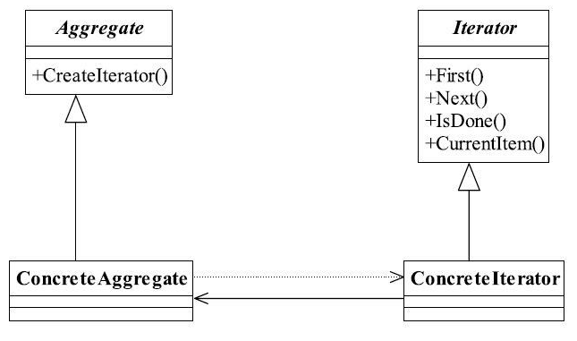

[TOC]


# 一、前言

迭代器模式解决的问题是：遍历

迭代器就相当于一个游标。


> 迭代器模式（IteratorPattern）目前已经是一个没落的模式，基本上没人会单独写一个迭代器，除非是产品性质的开。


# 二、基本概念
## 1.定义
提供一种方法访问一个容器对象中各个元素，而又不需暴露该对象的内部细节。

> Provide a way to access the elements of an aggregate object sequentially without exposing its underlying representation.
>


> 能容纳对象的所有类型都可以称之为容器，例如Collection集合类型、Set类型等，迭代器模式就是为解决遍历这些容器中的元素而诞生的。


## 2.登场角色





迭代器模式提供了遍历容器的方便性，容器只要管理增减元素就可以了，需要遍历时交由迭代器进行。


### 2.1 Iterator（抽象迭代器）

负责定义访问和遍历元素的接口，而且基本上是有固定的3个方法：

- first()获得第一个元素
- next()访问下一个元素
- isDone()是否已经访问到底部（Java叫做hasNext()方法）。


### 2.2 ConcreteIterator（具体迭代器）

实现迭代器接口，完成容器元素的遍历。


### 2.3 Aggregate（抽象容器）

需提供创建具体迭代器角色的接口，必然提供一个类似 createIterator() 这样的方法，在Java中一般是iterator()方法。


### 2.4 ConcreteAggregate（具体容器）

具体容器实现容器接口定义的方法，创建出容纳迭代器的对象。


## 3.通用源码

### 3.1 Iterator

迭代器的主要作用体现在游标上。


（1）Iterator

```java
/**
 * 抽象迭代器
 */
public interface Iterator {
	
	//遍历到下一个元素
	public Object next();
	
	//是否已经遍历到尾部
	public boolean hasNext();
	
	//删除当前指向的元素
	public boolean remove();
}
```


（2）ConcreteIterator

> 迭代器的删除方法应该完成两个逻辑：一是删除当前元素，二是当前游标指向下一个元素。


```java
/**
 * 具体迭代器
 */
public class ConcreteIterator implements Iterator {
	private Vector<Object> vector = new Vector<Object>();
	//定义当前游标
	public int cursor = 0;

	public ConcreteIterator(Vector<Object> _vector) {
		this.vector = _vector;
	}

	//判断是否到达尾部
	public boolean hasNext() {
		if (this.cursor == this.vector.size()) {
			return false;
		} else {
			return true;
		}
	}

	//返回下一个元素
	public Object next() {
		Object result = null;

		if (this.hasNext()) {
			result = this.vector.get(this.cursor++);
		} else {
			result = null;
		}
		return result;
	}

	//删除当前元素
	public boolean remove() {
		this.vector.remove(this.cursor);
		return true;
	}

}
```


### 3.2 Aggregate

- Aggregate

```java
/**
 * 抽象容器
 */
public interface Aggregate {

	//是容器必然有元素的增加
	public void add(Object object);

	//减少元素
	public void remove(Object object);

	//由迭代器来遍历所有的元素
	public Iterator iterator();
}
```


- ConcreteAggregate

```java
/**
 * 具体容器
 */
public class ConcreteAggregate implements Aggregate {
   //容纳对象的容器
   private Vector<Object> vector = new Vector<Object>();

   //增加一个元素
   public void add(Object object) {
      this.vector.add(object);
   }

   //返回迭代器对象
   public Iterator iterator() {
      return new ConcreteIterator(this.vector);
   }

   //删除一个元素
   public void remove(Object object) {
     this.vector.remove(object);
   }

}
```


### 3.3 Client

```java
public class Client {
	private static Aggregate agg;
	private static Iterator iterator;

	public static void main(String[] args) {
		//声明出容器
		agg = new ConcreteAggregate();

		//产生对象数据放进去
		agg.add("abc");
		agg.add("aaa");
		agg.add("1234");

		//遍历一下
		iterator = agg.iterator();
		while (iterator.hasNext()) {
			System.out.println(iterator.next());
		}
	}
}
```


## 4.适用场景

需要遍历的时候都可以用迭代器模式，不过Java API 都提供好了遍历接口了，无需我们自己实现。


## 5.最佳实践

如果你是做Java开发，尽量不要自己写迭代器模式！省省吧，使用Java提供的Iterator一般就能满足你的要求了。


# 三、代码实例


# 四、相关设计模式


# 五、源码分析


# 六、参考资料
1. [CyC2018/CS-Notes](https://github.com/CyC2018/CS-Notes/blob/master/notes/%E8%AE%BE%E8%AE%A1%E6%A8%A1%E5%BC%8F.md) 
2. [quanke/design-pattern-java-source-code](https://github.com/quanke/design-pattern-java-source-code)
3. [图说设计模式](https://design-patterns.readthedocs.io/zh_CN/latest/)
4. [图解设计模式-CSDN-wujunyucg](https://blog.csdn.net/wujunyucg/article/category/7301352/1)