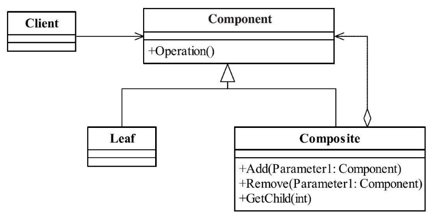
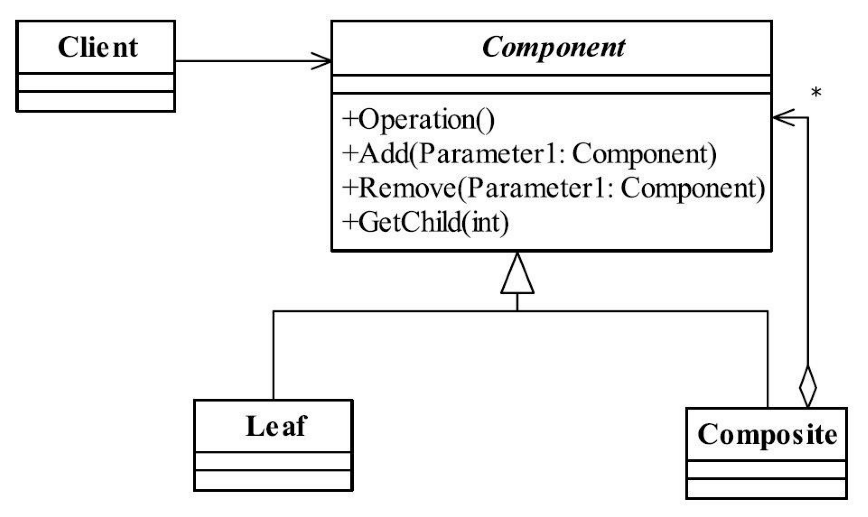

[TOC]


# 一、前言

组合模式解决的问题是：树形结构（部分与整体的层次结构）

组合模式(Composite Pattern)也叫合成模式，有时又叫做部分-整体模式（Part-Whole），主要是用来描述部分与整体的关系，

# 二、基本概念

## 1.定义

将对象组合成树形结构以表示“部分-整体”的层次结构，使得用户对单个对象和组合对象的使用具有一致性。

> Compose objects into tree structures to represent part-whole hierarchies.Composite lets clients treat individual objects and compositions of objects uniformly.


> 分为：
>
> - 安全模式：
> - 透明模式：


## 2.优劣

### 2.1 优点

（1）高层模块调用简单

一棵树形机构中的所有节点都是Component，局部和整体对调用者来说没有任何区别，也就是说，高层模块不必关心自己处理的是单个对象还是整个组合结构，简化了高层模块的代码。

（2）节点增加自由

### 2.2 缺点

（1）违背依赖倒置原则

违背依赖倒置原则，破坏面向接口编程，场景类中直接使用实现类。


## 3.适用场景

只要涉及到部分-整体关系、树形结构，就可考虑使用组合模式。

（1）维护和展示部分-整体关系的场景，如树形菜单、文件和文件夹管理。

（2）从一个整体中能够独立出部分模块或功能的场景。


## 4.最佳实践

只要涉及到部分-整体关系、树形结构，就可考虑使用组合模式。


# 三、安全模式


## 1.登场角色

安全模式的通用类图





### 1.1 Component（抽象节点）

定义参加组合对象的共有方法和属性，可以定义一些默认的行为或属性，


### 1.2 Leaf（叶子节点）

叶子节点


### 1.3 Composite（非叶子节点）

树枝节点，职责是组合树枝节点和叶子节点形成一个树形结构。


## 2.通用源码

### 2.1 Component

```java
/**
 * 抽象节点
 */
public abstract class Component {
   
   //个体和整体都具有的共享
   public void doSomething(){
      //编写业务逻辑
   }
}
```


### 2.2 Composite

```java
/**
 * 树枝节点
 */
public class Composite extends Component {
	//构件容器
	private ArrayList<Component> componentArrayList = new ArrayList<Component>();

	//增加一个叶子构件或树枝构件
	public void add(Component component) {
		this.componentArrayList.add(component);
	}

	//删除一个叶子构件或树枝构件
	public void remove(Component component) {
		this.componentArrayList.remove(component);
	}

	//获得分支下的所有叶子构件和树枝构件
	public ArrayList<Component> getChildren() {
		return this.componentArrayList;
	}
}
```


### 2.3 Leaf

空接口有何意义呀？有意义！它是每个叶子节点的代表，系统扩容的时候你就会发现它是多么“栋梁”。


```java
public class Leaf extends Component {
   /*
    * 可以覆写父类方法
    * public void doSomething(){
    * 
    * }
    */
}
```


### 2.4 Client

```java
public class Client {

	public static void main(String[] args) {
		//创建一个根节点
		Composite root = new Composite();
		root.doSomething();

		//创建一个树枝构件
		Composite branch = new Composite();
		//创建一个叶子节点
		Leaf leaf = new Leaf();

		//建立整体
		root.add(branch);
		branch.add(leaf);
	}

	//通过递归遍历树
	public static void display(Composite root) {

		for (Component c : root.getChildren()) {
			if (c instanceof Leaf) { //叶子节点
				c.doSomething();
			} else { //树枝节点
				display((Composite) c);
			}
		}

	}
}
```


# 四、透明模式


## 1.登场角色





（1）透明模式与安全模式的区别

透明模式是把用来组合使用的方法放到抽象类中，然后通过判断是getChildren的返回值确认是叶子节点还是树枝节点。


（2）不安全的原因

透明模式是把用来组合使用的方法放到抽象类中，比如add()、remove()以及getChildren等方法（顺便说一下，getChildren一般返回的结果为Iterable的实现类，很多，大家可以看JDK的帮助），不管叶子对象还是树枝对象都有相同的结构，通过判断是getChildren的返回值确认是叶子节点还是树枝节点，如果处理不当，这个会在运行期出现问题，不是很建议的方式；安全模式就不同了，它是把树枝节点和树叶节点彻底分开，树枝节点单独拥有用来组合的方法，这种方法比较安全，我们的例子使用了安全模式。


## 2.通用源码

### 2.1 Component

抽象构件定义了树枝节点和树叶节点都必须具有的方法和属性，这样树枝节点的实现就不需要任何变化


```java
/**
 * 抽象节点
 */
public abstract class Component {

   //个体和整体都具有的共享
   public void doSomething() {
      //编写业务逻辑
   }

   //增加一个叶子构件或树枝构件
   public abstract void add(Component component);

   //删除一个叶子构件或树枝构件
   public abstract void remove(Component component);

   //获得分支下的所有叶子构件和树枝构件
   public abstract ArrayList<Component> getChildren();
}
```


### 2.2 Leaf

树叶节点继承了Component抽象类，不想让它改变有点难，它必须实现三个抽象方法，因此给个空方法。

```java
/**
 * 叶子节点
 */
public class Leaf extends Component {
   @Deprecated
   public void add(Component component) throws UnsupportedOperationException {
      //空实现,直接抛弃一个“不支持请求”异常
      throw new UnsupportedOperationException();
   }

   @Deprecated
   public void remove(Component component) throws UnsupportedOperationException {
      //空实现
      throw new UnsupportedOperationException();
   }

   @Deprecated
   public ArrayList<Component> getChildren() throws UnsupportedOperationException {
      //空实现
      throw new UnsupportedOperationException();
   }
}
```


为什么要加个Deprecated注解呢？就是在编译器期告诉调用者，你可以调我这个方法，但是可能出现错误哦，我已经告诉你“该方法已经失效”了，你还使用那在运行期也会抛出UnsupportedOperationException异常。


### 2.3 Composite

```java
/**
 * 非叶子节点
 */
public class Composite extends Component {
   //构件容器
   private ArrayList<Component> componentArrayList = new ArrayList<Component>();

   //增加一个叶子构件或树枝构件
   public void add(Component component) {
      this.componentArrayList.add(component);
   }

   //删除一个叶子构件或树枝构件
   public void remove(Component component) {
      this.componentArrayList.remove(component);
   }

   //获得分支下的所有叶子构件和树枝构件
   public ArrayList<Component> getChildren() {
      return this.componentArrayList;
   }
}
```


### 2.4 Client

```java
public class Client {

   public static void main(String[] args) {
      //创建一个根节点
      Composite root = new Composite();
      root.doSomething();

      //创建一个树枝构件
      Composite branch = new Composite();
      //创建一个叶子节点
      Leaf leaf = new Leaf();

      //建立整体
      root.add(branch);
      branch.add(leaf);
   }

   //通过递归遍历树
   public static void display(Component root) {

      for (Component c : root.getChildren()) {
         if (c instanceof Leaf) { //叶子节点
            c.doSomething();
         } else { //树枝节点
            display(c);
         }
      }

   }
}
```


# 三、代码实例


# 四、相关设计模式


# 五、源码分析


# 六、参考资料
1. [CyC2018/CS-Notes](https://github.com/CyC2018/CS-Notes/blob/master/notes/%E8%AE%BE%E8%AE%A1%E6%A8%A1%E5%BC%8F.md) 
2. [quanke/design-pattern-java-source-code](https://github.com/quanke/design-pattern-java-source-code)
3. [图说设计模式](https://design-patterns.readthedocs.io/zh_CN/latest/)
4. [图解设计模式-CSDN-wujunyucg](https://blog.csdn.net/wujunyucg/article/category/7301352/1)