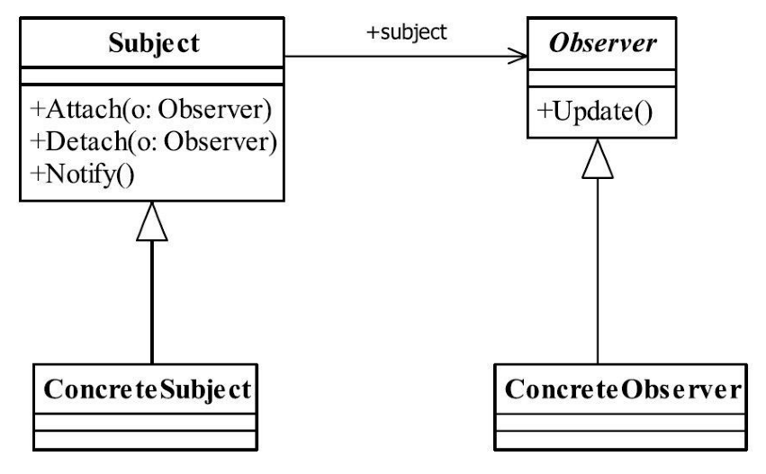

[TOC]


# 一、前言

观察者模式解决的问题是：发布订阅。


观察者模式（ObserverPattern）也叫做发布订阅模式（Publish/subscribe）,它是一个在项目中经常使用的模式。


牵一发动全身。


# 二、基本概念
## 1.定义
定义对象间一种一对多的依赖关系，使得每当一个对象改变状态，则所有依赖于它的对象都会得到通知并被自动更新。

> Define a one-to-many dependency between objects so that when one object changes state, all its dependents are notified and updated automatically.


## 2.登场角色





### 2.1 Subject（被观察者）

定义被观察者必须实现的职责：管理观察者并通知观察者


### 2.2 Observer（观察者）

观察者接收到消息后，即进行update（更新方法）操作，对接收到的信息进行处理。


### 2.3 ConcreteSubject（具体的被观察者）

定义被观察者自己的业务逻辑，同时定义对哪些事件进行通知。


### 2.4 ConcreteObserver（具体的观察者）

定义在收到消息后，对消息的具体处理反应。


## 3.通用源码

### 3.1 Subject

（1）Subject

被观察者抽象中需要维护一个观察者列表，管理并通知观察者。

```java
/**
 * 被观察者抽象
 */
public abstract class Subject {

	//定一个一个观察者数组
	private Vector<Observer> obsVector = new Vector<Observer>();

	//增加一个观察者
	public void addObserver(Observer o) {
		this.obsVector.add(o);
	}

	//删除一个观察者
	public void delObserver(Observer o) {
		this.obsVector.remove(o);
	}

	//通知所有观察者
	public void notifyObserver() {
		for (Observer o : this.obsVector) {
			o.update();
		}
	}
}

```


（2）ConcreteSubject

```java
/**
 * 具体的被观察者
 */
public class ConcreteSubject extends Subject {

	//具体的业务
	public void doSomething() {
		/*
		 * do something
		 */
		super.notifyObserver();
	}
}

```


### 3.2 Observer

（1）Observer

```java
public interface Observer {

	//更新方法
	public void update();
}
```


（2）ConcreteObserver

```java
public class ConcreteObserver implements Observer {

   //实现更新方法
   public void update() {
      System.out.println("接收到信息，并进行处理！");
   }

}
```


### 3.3  Client

```java
public class Client {

	public static void main(String[] args) {
		//创建一个被观察者
		ConcreteSubject subject = new ConcreteSubject();
        
		//定义一个观察者
		Observer obs = new ConcreteObserver();
        
		//观察者 观察 被观察者
		subject.addObserver(obs);
        
		//观察者开始活动了
		subject.doSomething();
	}
}
```


## 5.优劣

### 5.1 优点

（1） 观察者和被观察者之间是抽象耦合

（2）观察者和被观察者之间是抽象耦合


## 5.2 缺点

（1）开发效率

（2）运行效率


> 观察者模式需要考虑一下开发效率和运行效率问题，一个被观察者，多个观察者，开发和调试就会比较复杂，而且在Java中消息的通知默认是顺序执行，一个观察者卡壳，会影响整体的执行效率。在这种情况下，一般考虑采用异步的方式。
>
> 多级触发时的效率更是让人担忧，大家在设计时注意考虑。


## 6.适用场景

（1）行为关联场景

需要注意的是，关联行为是可拆分的，而不是“组合”关系。

（2）事件多级触发场景。

（3）跨系统的消息交换场景，如消息队列的处理机制。


## 7.注意事项

（1）广播链问题

A -> B -> C -> D

根据经验建议，在一个观察者模式中，最多出现一个对象既是观察者又是被观察者，也就是消息最多传递两次，这样比较好控制。


（2）异步处理问题


# 三、代码实例


# 四、相关设计模式


# 五、源码分析


# 六、参考资料
1. [CyC2018/CS-Notes](https://github.com/CyC2018/CS-Notes/blob/master/notes/%E8%AE%BE%E8%AE%A1%E6%A8%A1%E5%BC%8F.md) 
2. [quanke/design-pattern-java-source-code](https://github.com/quanke/design-pattern-java-source-code)
3. [图说设计模式](https://design-patterns.readthedocs.io/zh_CN/latest/)
4. [图解设计模式-CSDN-wujunyucg](https://blog.csdn.net/wujunyucg/article/category/7301352/1)