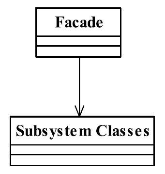

[TOC]


# 一、前言

门面解决的问题是：统一访问


门面模式（Facade Pattern）也叫做外观模式，是一种比较常用的封装模式


# 二、基本概念
## 1.定义
要求一个子系统的外部与其内部的通信必须通过一个统一的对象进行。门面模式提供一个高层次的接口，使得子系统更易于使用。

> Provide a unified interface to a set of interfaces in a subsystem.Facade defines a higher-level interface that makes the subsystem easier to use.
>


> 门面模式注重“统一的对象”，也就是提供一个访问子系统的接口，除了这个接口不允许有任何访问子系统的行为发生，


## 2.登场角色





### 2.1 Facade（门面）

外界通过门面来访问子系统。门面是一个委托类，不包含实际的业务逻辑，也就是说，通常，外界的请求会被门面转发到子系统。


### 2.2 Subsystem Classes（子系统）

由子系统来处理具体的业务逻，可以同时又一个或多个子系统。


## 3.通用源码

### 3.1 Subsystem Classes


- ClassA

```java
public class ClassA {
	
	public void doSomethingA(){
		//业务逻辑
	}
}
```


- ClassB

```java
public class ClassB {
   
   public void doSomethingB(){
      //业务逻辑
   }
}
```


- ClassC

```java
public class ClassC {

   public void doSomethingC() {
      //业务逻辑
   }
}
```


### 3.2 Facade

一个子系统可以有多个门面

- Facade

```java
public class Facade {
	//被委托的对象
	private ClassA a = new ClassA();
	private ClassB b = new ClassB();
	private ClassC c = new ClassC();
	
	//提供给外部访问的方法
	public void methodA(){
		this.a.doSomethingA();
	}
	
	public void methodB(){
		this.b.doSomethingB();
	}
	
	public void methodC(){
		this.c.doSomethingC();
	}
}
```


- Facade2

```java
public class Facade2 {
   //引用原有的门面
   private Facade facade = new Facade();
   
   //对外提供唯一的访问子系统的方法
   public void methodB(){
      this.facade.methodB();
   }
}
```


## 5.优劣

### 5.1 优点

（1） 减少系统的相互依赖

（2）提高了灵活性

（3）提高了安全性


### 5.2 缺点

不符合开闭原则


## 6.适用场景

（1）为一个复杂的模块或子系统提供一个供外界访问的接口

（2）子系统相对独立——外界对子系统的访问只要黑箱操作即可

（3）预防低水平人员带来的风险扩散


## 7.最佳实践

（1）为复杂子系统提供门面

（2）使用门面避免风险扩散到子系统外部


# 三、代码实例


# 四、相关设计模式


# 五、源码分析


# 六、参考资料
1. [CyC2018/CS-Notes](https://github.com/CyC2018/CS-Notes/blob/master/notes/%E8%AE%BE%E8%AE%A1%E6%A8%A1%E5%BC%8F.md) 
2. [quanke/design-pattern-java-source-code](https://github.com/quanke/design-pattern-java-source-code)
3. [图说设计模式](https://design-patterns.readthedocs.io/zh_CN/latest/)
4. [图解设计模式-CSDN-wujunyucg](https://blog.csdn.net/wujunyucg/article/category/7301352/1)