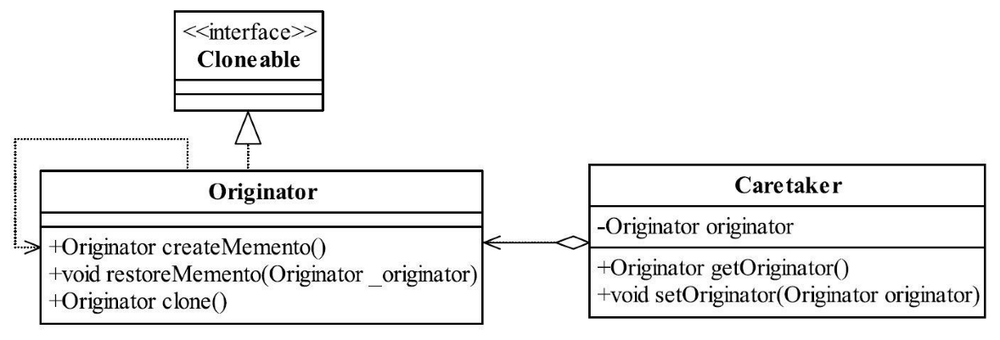
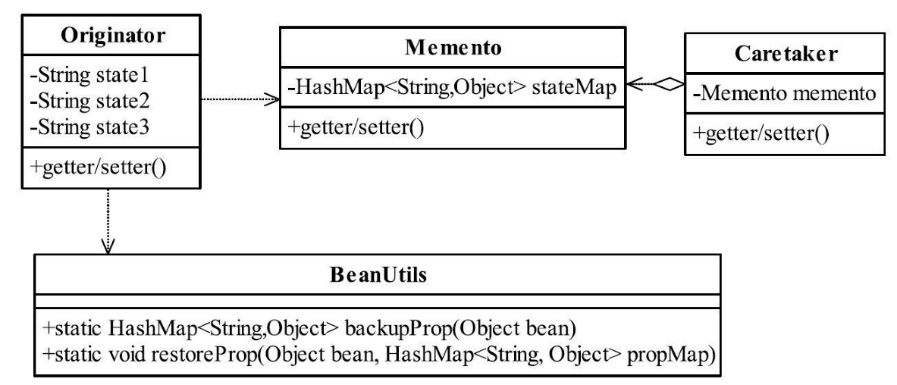

[TOC]


# 一、前言

备忘录模式解决的问题是：游戏存档


通俗地说，备忘录模式就是一个对象的备份模式，提供了一种程序数据的备份方法。（备份与恢复）


# 二、基本概念
## 1.定义
在不破坏封装性的前提下，捕获一个对象的内部状态，并在该对象之外保存这个状态。这样以后就可将该对象恢复到原先保存的状态。（即备份恢复）

> Without violating encapsulation, capture and externalize an object's internal state so that the object can be restored to this state later.
>


## 2.优劣

### 2.1 优点


### 2.2 缺点


## 3.适用场景

（1）备份与恢复

需要保存和恢复数据的相关状态场景。

（2）回滚

提供一个可回滚（rollback）的操作，比如Word中的CTRL+Z组合键，IE浏览器中的后退按钮，文件管理器上的backspace键等。

（3）需要监控的副本场景中。

例如要监控一个对象的属性，但是监控又不应该作为系统的主业务来调用，它只是边缘应用，即使出现监控不准、错误报警也影响不大，因此一般的做法是备份一个主线程中的对象，然后由分析程序来分析。

（4）事务

数据库连接的事务管理就是用的备忘录模式，想想看，如果你要实现一个JDBC驱动，你怎么来实现事务？还不是用备忘录模式嘛！

## 4.最佳实践


# 三、标准备忘录模式

## 1.登场角色


### 1.1 Originator（发起人）

记录当前时刻的内部状态，负责定义哪些属于备份范围的状态，负责创建和恢复备忘录数据。


### 1.2 Memento（备忘录）

负责存储Originator发起人对象的内部状态，在需要的时候提供发起人需要的内部状态。


### 1.3 Caretaker（备忘录管理员）

对备忘录进行管理、保存和提供备忘录。


## 2.通用源码

### 2.1 Originator

```java
/**
 * 发起人
 */
public class Originator {

	//内部状态
	private String state = "";

	public String getState() {
		return state;
	}

	public void setState(String state) {
		this.state = state;
	}

	//创建一个备忘录
	public Memento createMemento() {
		return new Memento(this.state);
	}

	//恢复一个备忘录
	public void restoreMemento(Memento _memento) {
		this.setState(_memento.getState());
	}
}
```


### 2.2 Memento


```java
/**
 * 备忘录
 */
public class Memento {

	//发起人的内部状态
	private String state = "";

	//构造函数传递参数
	public Memento(String _state) {
		this.state = _state;
	}

	public String getState() {
		return state;
	}

	public void setState(String state) {
		this.state = state;
	}

}
```


### 2.3 Caretaker


```java
/**
 * 备忘录管理员
 */
public class Caretaker {

   //备忘录对象
   private Memento memento;

   public Memento getMemento() {
      return memento;
   }

   public void setMemento(Memento memento) {
      this.memento = memento;
   }

}
```


### 2.4 Client


```java
public class Client {

   public static void main(String[] args) {
      //定义出发起人
      Originator originator = new Originator();
      //定义出备忘录管理员
      Caretaker caretaker = new Caretaker();
      //创建一个备忘录
      caretaker.setMemento(originator.createMemento());
      //恢复一个备忘录
      originator.restoreMemento(caretaker.getMemento());
   }
}
```


# 四、Clone方式的备忘录

## 1.登场角色





## 2.通用源码

### 2.1 Originator


```java
public class Originator implements Cloneable {

   //内部状态
   private String state = "";

   public String getState() {
      return state;
   }

   public void setState(String state) {
      this.state = state;
   }

   //创建一个备忘录
   public Originator createMemento() {
      return this.clone();
   }

   //恢复一个备忘录
   public void restoreMemento(Originator _originator) {
      this.setState(_originator.getState());
   }

   //克隆当前对象
   @Override
   protected Originator clone() {

      try {
         return (Originator) super.clone();
      } catch (CloneNotSupportedException e) {
         e.printStackTrace();
      }
      return null;
   }
}
```


### 2.2 Caretaker


```java
public class Caretaker {

   //发起人对象
   private Originator originator;

   public Originator getOriginator() {
      return originator;
   }

   public void setOriginator(Originator originator) {
      this.originator = originator;
   }

}
```


## 3.发起人自主备份和恢复

上面的这种模式还可以继续简化，去掉备忘录管理员，由发起人自主备份和恢复。


- Originator

```java
public class Originator implements Cloneable {
   private Originator backup;
   
   //内部状态
   private String state = "";

   public String getState() {
      return state;
   }

   public void setState(String state) {
      this.state = state;
   }

   //创建一个备忘录
   public void createMemento() {
      this.backup = this.clone();
   }

   //恢复一个备忘录
   public void restoreMemento() {
      //在进行恢复前应该进行断言，防止空指针
      this.setState(this.backup.getState());
   }

   //克隆当前对象
   @Override
   protected Originator clone() {

      try {
         return (Originator) super.clone();
      } catch (CloneNotSupportedException e) {
         e.printStackTrace();
      }
      return null;
   }
}
```


- Client

```java
public class Client {

   public static void main(String[] args) {
      //定义发起人
      Originator originator = new Originator();
      //建立初始状态
      originator.setState("初始状态...");
      System.out.println("初始状态是：" + originator.getState());
      //建立备份
      originator.createMemento();
      //修改状态
      originator.setState("修改后的状态...");
      System.out.println("修改后状态是：" + originator.getState());
      //恢复原有状态
      originator.restoreMemento();
      System.out.println("恢复后状态是：" + originator.getState());
   }
}
```


# 五、多状态的备忘录模式

前面的都是单状态的情况，一个对象肯定不止一个状态，那么如何处理对象全状态备份：

- 使用对象Clone
- 数据存储：HashMap等临时缓存、数据库持久化存储


## 1. 登场角色




使用HashMap存储比直接存储Originator，代码更具通用性。


## 2.通用源码

### 2.1 Originator


```java
public class Originator {

   //内部状态
   private String state1 = "";
   private String state2 = "";
   private String state3 = "";

   public String getState1() {
      return state1;
   }

   public void setState1(String state1) {
      this.state1 = state1;
   }

   public String getState2() {
      return state2;
   }

   public void setState2(String state2) {
      this.state2 = state2;
   }

   public String getState3() {
      return state3;
   }

   public void setState3(String state3) {
      this.state3 = state3;
   }

   //创建一个备忘录
   public Memento createMemento() {
      return new Memento(BeanUtils.backupProp(this));
   }

   //恢复一个备忘录
   public void restoreMemento(Memento _memento) {
      BeanUtils.restoreProp(this, _memento.getStateMap());
   }

   //增加一个toString方法
   @Override
   public String toString() {
      return "state1=" + state1 + "\nstat2=" + state2 + "\nstate3=" + state3;
   }
}
```


### 2.2 BeanUtils工具类


```java
public class BeanUtils {

   //把bean的所有属性及数值放入到Hashmap中
   public static HashMap<String, Object> backupProp(Object bean) {
      HashMap<String, Object> result = new HashMap<String, Object>();
      try {
         //获得Bean描述
         BeanInfo beanInfo = Introspector.getBeanInfo(bean.getClass());
         //获得属性描述
         PropertyDescriptor[] descriptors = beanInfo.getPropertyDescriptors();
         //遍历所有属性
         for (PropertyDescriptor des : descriptors) {
            //属性名称
            String fieldName = des.getName();
            //读取属性的方法
            Method getter = des.getReadMethod();
            //读取属性值
            Object fieldValue = getter.invoke(bean, new Object[]{});
            if (!fieldName.equalsIgnoreCase("class")) {
               result.put(fieldName, fieldValue);
            }
         }
      } catch (Exception e) {
         //异常处理
      }
      return result;
   }

   //把HashMap的值返回到bean中
   public static void restoreProp(Object bean, HashMap<String, Object> propMap) {
      try {
         //获得Bean描述
         BeanInfo beanInfo = Introspector.getBeanInfo(bean.getClass());
         //获得属性描述
         PropertyDescriptor[] descriptors = beanInfo.getPropertyDescriptors();
         //遍历所有属性
         for (PropertyDescriptor des : descriptors) {
            //属性名称
            String fieldName = des.getName();
            //如果有这个属性
            if (propMap.containsKey(fieldName)) {
               //写属性的方法
               Method setter = des.getWriteMethod();
               setter.invoke(bean, new Object[]{propMap.get(fieldName)});
            }
         }
      } catch (Exception e) {
         //异常处理
         System.out.println("shit");
         e.printStackTrace();
      }
   }

}
```


### 2.3 Memento

```java
public class Memento {

   //接受HashMap作为状态
   private HashMap<String, Object> stateMap;

   //接受一个对象，建立一个备份
   public Memento(HashMap<String, Object> map) {
      this.stateMap = map;
   }

   public HashMap<String, Object> getStateMap() {
      return stateMap;
   }

   public void setStateMap(HashMap<String, Object> stateMap) {
      this.stateMap = stateMap;
   }


}
```


### 2.4 Caretaker


```java
public class Caretaker {

   //备忘录对象
   private Memento memento;

   public Memento getMemento() {
      return memento;
   }

   public void setMemento(Memento memento) {
      this.memento = memento;
   }

}
```


### 2.5 Client


```java
public class Client {

   public static void main(String[] args) {
      //定义出发起人
      Originator ori = new Originator();
      //定义出备忘录管理员
      Caretaker caretaker = new Caretaker();
      //初始化
      ori.setState1("中国");
      ori.setState2("强盛");
      ori.setState3("繁荣");
      System.out.println("===初始化状态===\n" + ori);
      //创建一个备忘录
      caretaker.setMemento(ori.createMemento());
      //修改状态值
      ori.setState1("软件");
      ori.setState2("架构");
      ori.setState3("优秀");
      System.out.println("\n===修改后状态===\n" + ori);
      //恢复一个备忘录
      ori.restoreMemento(caretaker.getMemento());
      System.out.println("\n===恢复后状态===\n" + ori);
   }
}
```


# 六、多状态的备忘录模式

五中的备忘录只支持一个备份，那么如何支持多个备份呢？我们将五中的 Caretaker 稍作修改。

- Caretaker

```java
public class Caretaker {
    
   //容纳备忘录的容器
   private HashMap<String,Memento> memMap = new HashMap<String,Memento>();

   public Memento getMemento(String idx) {
      return memMap.get(idx);
   }

   public void setMemento(String idx,Memento memento) {
      this.memMap.put(idx, memento);
   }
   
}
```


- Client

```java
public class Client {

   public static void main(String[] args) {
      //定义出发起人
      Originator originator = new Originator();
      //定义出备忘录管理员
      Caretaker caretaker = new Caretaker();
      //创建两个备忘录
      caretaker.setMemento("001", originator.createMemento());
      caretaker.setMemento("002", originator.createMemento());
      //恢复一个指定标记的备忘录
      originator.restoreMemento(caretaker.getMemento("001"));
   }
}
```


> 内存溢出问题，该备份一旦产生就装入内存，没有任何销毁的意向，这是非常危险的。因此，在系统设计时，要严格限定备忘录的创建，建议增加Map的上限，否则系统很容易产生内存溢出情况。


# 七、代码实例


# 八、相关设计模式


# 九、源码分析


# 十、参考资料
1. [CyC2018/CS-Notes](https://github.com/CyC2018/CS-Notes/blob/master/notes/%E8%AE%BE%E8%AE%A1%E6%A8%A1%E5%BC%8F.md) 
2. [quanke/design-pattern-java-source-code](https://github.com/quanke/design-pattern-java-source-code)
3. [图说设计模式](https://design-patterns.readthedocs.io/zh_CN/latest/)
4. [图解设计模式-CSDN-wujunyucg](https://blog.csdn.net/wujunyucg/article/category/7301352/1)