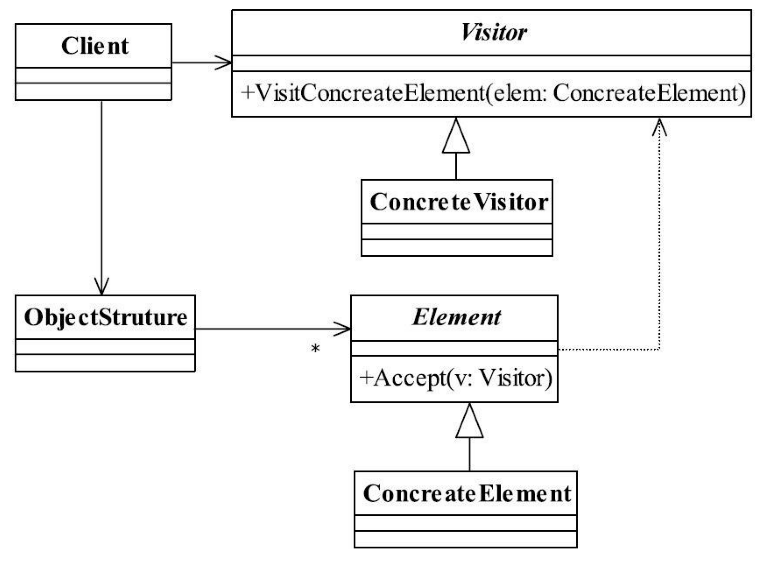

[TOC]


# 一、前言

访问者模式解决的问题是：功能集中化


# 二、基本概念

## 1.定义

封装一些作用于某种数据结构中的各元素的操作，它可以在不改变数据结构的前提下定义作用于这些元素的新的操作。

> Represent an operation to be performed on the elements of an object structure. Visitor lets you define a new operation without changing the classes of the elements on which it operates.
>


## 2.登场角色





### 2.1 Visitor（抽象访问者）

抽象类或者接口，声明访问者可以访问哪些元素，具体到程序中就是visit方法的参数定义哪些对象是可以被访问的。


### 2.2 ConcreteVisitor（具体访问者）

定义访问逻辑


### 2.3 Element（抽象元素）

接口或者抽象类，声明接受哪一类访问者访问，程序上是通过accept方法中的参数来定义的。


### 2.4 ConcretElement（具体元素）

实现accept方法，通常是visitor.visit(this)，基本上都形成了一种模式了。


### 2.5 ObjectStructure（结构对象）

元素产生者，一般容纳在多个不同类、不同接口的容器，如List、Set、Map等，在项目中，一般很少抽象出这个角色。


## 3.通用源码

### 3.1 Element

抽象元素由两类方法：

- 本身的业务逻辑
- 定义允许哪个访问者来访问


```java
/**
 * 抽象元素
 */
public abstract class Element {
   //定义业务逻辑
   public abstract void doSomething();

   //允许谁来访问
   public abstract void accept(IVisitor visitor);
}
```


### 3.2 ConcretElement

- ConcreteElement1

```java
public class ConcreteElement1 extends Element {

	//完善业务逻辑
	public void doSomething() {
		//业务处理
	}

	//允许那个访问者访问
	public void accept(IVisitor visitor) {
		visitor.visit(this);
	}
}

```


- ConcreteElement2

```java
public class ConcreteElement2 extends Element {

   //完善业务逻辑
   public void doSomething() {
      //业务处理
   }

   //允许那个访问者访问
   public void accept(IVisitor visitor) {
      visitor.visit(this);
   }
}
```


### 3.3 Visitor

- IVisitor

一般是有几个具体元素就有几个访问方法

```java
public interface IVisitor {

	//可以访问哪些对象
	public void visit(ConcreteElement1 el1);

	public void visit(ConcreteElement2 el2);
}
```


- Visitor

```java
public class Visitor implements IVisitor {

   //访问el1元素
   public void visit(ConcreteElement1 el1) {
      el1.doSomething();
   }

   //访问el2元素
   public void visit(ConcreteElement2 el2) {
      el2.doSomething();
   }
}
```


### 3.4 ObjectStruture

由结构对象产生出不同的元素对象，我们使用工厂方法模式来模拟，

```java
public class ObjectStruture {

   //对象生成器，这里通过一个工厂方法模式模拟
   public static Element createElement() {
      Random rand = new Random();
      if (rand.nextInt(100) > 50) {
         return new ConcreteElement1();
      } else {
         return new ConcreteElement2();
      }
   }
}
```


### 3.4  Client

通过增加访问者，只要是具体元素就非常容易访问，对元素的遍历就更加容易了，甭管它是什么对象，只要它在一个容器中，都可以通过访问者来访问，任务集中化。这就是访问者模式。

```java
public class Client {

	public static void main(String[] args) {
		for (int i = 0; i < 10; i++) {
			//获得元素对象
			Element el = ObjectStruture.createElement();
			//接受访问者访问
			el.accept(new Visitor());
		}
	}
}
```


## 4.优劣

### 4.1 优点

（1）符合单一职责

> 将具体的访问逻辑从具体元素中抽离出来，扔到访问者中集中处理。
>
> 具体元素角色也就是Employee抽象类的两个子类负责数据的加载，而Visitor类则负责报表的展现，两个不同的职责非常明确地分离开来，各自演绎变化。


（2）扩展性优秀

> 由于职责分开，继续增加对数据的操作是非常快捷的，例如，现在要增加一份给大老板的报表，这份报表格式又有所不同，直接在Visitor中增加一个方法，传递数据后进行整理打印。


（3）灵活性非常高


### 4.2 缺点

（1）具体元素对访问者公布细节

> 访问者要访问一个类就必然要求这个类公布一些方法和数据，也就是说访问者关注了其他类的内部细节，这是迪米特法则所不建议的。


（2）具体元素变更比较困难

> 具体元素角色的增加、删除、修改都是比较困难的，就上面那个例子，你想想，你要是想增加一个成员变量，如年龄age，Visitor就需要修改，如果Visitor是一个还好办，多个呢？业务逻辑再复杂点呢？


（3）违背了依赖倒置转原则

> 访问者依赖的是具体元素，而不是抽象元素，这破坏了依赖倒置原则，特别是在面向对象的编程中，抛弃了对接口的依赖，而直接依赖实现类，扩展比较难。


## 5.注意事项

（1）双分派问题


## 6.适用场景

业务规则要求遍历多个不同的对象，然后执行不同的操作。

（1）一个对象结构包含很多类对象，它们有不同的接口，而你想对这些对象实施一些依赖于其具体类的操作，也就说是用迭代器模式已经不能胜任的情景。

（2）需要对一个对象结构中的对象进行很多不同并且不相关的操作，而你想避免让这些操作“污染”这些对象的类。


> 总结一下，在这种地方你一定要考虑使用访问者模式：业务规则要求遍历多个不同的对象。这本身也是访问者模式出发点，迭代器模式只能访问同类或同接口的数据（当然了，如果你使用instanceof，那么能访问所有的数据，这没有争论），而==访问者模式是对迭代器模式的扩充，可以遍历不同的对象，然后执行不同的操作==，也就是针对访问的对象不同，执行不同的操作。访问者模式还有一个用途，就是==充当拦截器（Interceptor）角色==，这个我们将在混编模式中讲解。


示例场景：

- 统计功能：汇总、报表


## 7.最佳实践

功能集中化

> 访问者模式是一种集中规整模式，特别适用于大规模重构的项目，在这一个阶段需求已经非常清晰，原系统的功能点也已经明确，通过访问者模式可以很容易把一些功能进行梳理，达到最终目的——功能集中化，如一个统一的报表运算、UI展现等，我们还可以与其他模式混编建立一套自己的过滤器或者拦截器，请大家参考混编模式的相关章节。


# 三、代码实例


# 四、相关设计模式


# 五、源码分析


# 六、参考资料

1. [CyC2018/CS-Notes](https://github.com/CyC2018/CS-Notes/blob/master/notes/%E8%AE%BE%E8%AE%A1%E6%A8%A1%E5%BC%8F.md) 
2. [quanke/design-pattern-java-source-code](https://github.com/quanke/design-pattern-java-source-code)
3. [图说设计模式](https://design-patterns.readthedocs.io/zh_CN/latest/)
4. [图解设计模式-CSDN-wujunyucg](