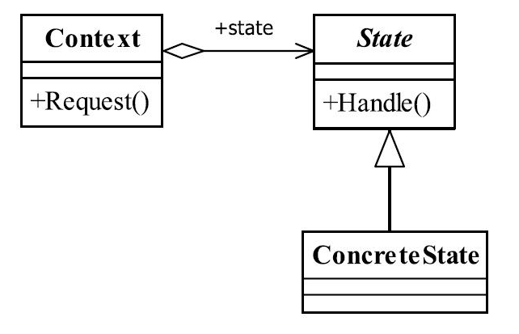

[TOC]


# 一、前言

状态模式解决的问题是：状态变更引起行为变更


# 二、基本概念

## 1.定义

当一个对象内在状态改变时允许其改变行为，这个对象看起来像改变了其类。

> Allow an object to alter its behavior when its internal state changes.The object will appear to change its class.
>


> 状态模式的核心是封装，状态的变更引起了行为的变更，从外部看起来就好像这个对象对应的类发生了改变一样。


## 2.登场角色





### 2.1 State（抽象状态）

接口或抽象类，负责对象状态定义，并且封装环境角色以实现状态切换。


### 2.2 ConcreteState（具体状态）

每一个具体状态必须完成两个职责：本状态的行为管理以及趋向状态处理，通俗地说，就是本状态下要做的事情，以及本状态如何过渡到其他状态。


### 2.3 Context（环境）

定义客户端需要的接口，并且负责具体状态的切换。


## 3.通用源码

### 3.1 State

```java
public abstract class State {

   //定义一个环境角色，提供子类访问
   protected Context context;

   //设置环境角色
   public void setContext(Context _context) {
      this.context = _context;
   }

   //行为1
   public abstract void handle1();

   //行为2
   public abstract void handle2();
}
```


### 3.2 ConcreteState

具体状态角色有两个职责：处理本状态必须完成的任务，决定是否可以过渡到其他状态

- ConcreteState1

```java
public class ConcreteState1 extends State {

	@Override
	public void handle1() {
		//本状态下必须处理的逻辑
	}


	@Override
	public void handle2() {
		//设置当前状态为stat2
		super.context.setCurrentState(Context.STATE2);
		//过渡到state2状态，由Context实现
		super.context.handle2();
	}

}
```


- ConcreteState2

```java
public class ConcreteState2 extends State {

	@Override
	public void handle1() {
		//设置当前状态为stat1
		super.context.setCurrentState(Context.STATE1);
		//过渡到state1状态，由Context实现
		super.context.handle1();
	}

	@Override
	public void handle2() {
		//本状态下必须处理的逻辑
	}

}
```


### 3.3 Context

环境角色有两个不成文的约束：

（1）把状态对象声明为静态常量，有几个状态对象就声明几个静态常量。

（2）环境角色具有抽象状态角色定义的所有行为，具体执行使用委托方式。

```java
public class Context {
	//定义状态
	public final static State STATE1 = new ConcreteState1();
	public final static State STATE2 = new ConcreteState2();

	//当前状态
	private State CurrentState;

	//获得当前状态
	public State getCurrentState() {
		return CurrentState;
	}

	//设置当前状态
	public void setCurrentState(State currentState) {
		this.CurrentState = currentState;
		//切换状态
		this.CurrentState.setContext(this);
	}

	//行为委托
	public void handle1() {
		this.CurrentState.handle1();
	}

	public void handle2() {
		this.CurrentState.handle2();
	}

}
```


### 3.4  Client

```java
public class Client {

	public static void main(String[] args) {
		//定义环境角色
		Context context = new Context();
		//初始化状态
		context.setCurrentState(new ConcreteState1());
		//行为执行
		context.handle1();
		context.handle2();
	}
}
```


我们已经隐藏了状态的变化过程，它的切换引起了行为的变化。对外来说，我们只看到行为的发生改变，而不用知道是状态变化引起的。


## 4.优劣

### 4.1 优点

（1）结构清晰

（2）遵循了开闭原则和单一职责原则

（3）封装性非常好

> 状态变换放置到类的内部来实现，外部的调用不用知道类内部如何实现状态和行为的变换。


### 4.2 缺点

（1）类膨胀


## 5.注意事项

状态模式适用于当某个对象在它的状态发生改变时，它的行为也随着发生比较大的变化，也就是说在行为受状态约束的情况下可以使用状态模式，而且使用时对象的状态最好不要超过5个。


Context 升级为状态机


## 6.适用场景

（1）行为随状态改变而改变的场景

> 这也是状态模式的根本出发点，例如权限设计，人员的状态不同即使执行相同的行为结果也会不同，在这种情况下需要考虑使用状态模式。


（2）条件、分支判断语句的替代者

> 在程序中大量使用switch语句或者if判断语句会导致程序结构不清晰，逻辑混乱，使用状态模式可以很好地避免这一问题，它通过扩展子类实现了条件的判断处理。


## 7.最佳实践

状态模式适用于当某个对象在它的状态发生改变时，它的行为也随着发生比较大的变化，也就是说在行为受状态约束的情况下可以使用状态模式，而且使用时对象的状态最好不要超过5个。


# 三、代码实例


# 四、相关设计模式


# 五、源码分析


# 六、参考资料

1. [CyC2018/CS-Notes](https://github.com/CyC2018/CS-Notes/blob/master/notes/%E8%AE%BE%E8%AE%A1%E6%A8%A1%E5%BC%8F.md) 
2. [quanke/design-pattern-java-source-code](https://github.com/quanke/design-pattern-java-source-code)
3. [图说设计模式](https://design-patterns.readthedocs.io/zh_CN/latest/)
4. [图解设计模式-CSDN-wujunyucg](