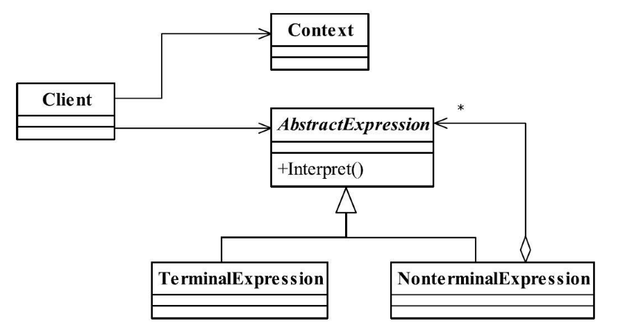

[TOC]


# 一、前言

解释器模式解决的问题是：语法分析


> 解释器模式（InterpreterPattern）是一种按照规定语法进行解析的方案，在现在项目中使用较少.


# 二、基本概念

## 1.定义

给定一门语言，定义它的文法的一种表示，并定义一个解释器，该解释器使用该表示来解释语言中的句子。

> Given a language, define a representation for its grammar along with an interpreter that uses the representation to interpret sentences in the language.
>


## 2.登场角色





### 2.1 AbstractExpression（抽象解释器）

抽象解释器


### 2.2 TerminalExpression（终结符表达式）

实现与文法中的元素相关联的解释操作，通常一个解释器模式中只有一个终结符表达式，但有多个实例，对应不同的终结符。


### 2.3 NonterminalExpression（非终结符表达式）

文法中的每条规则对应于一个非终结表达式。

如加减法规则分别对应到AddExpression和SubExpression两个类。非终结符表达式根据逻辑的复杂程度而增加，原则上每个文法规则都对应一个非终结符表达式。


### 2.4 Context（环境角色）


## 3.通用源码

### 3.1 Expression

抽象表达式是生成语法集合（也叫做语法树）的关键，每个语法集合完成指定语法解析任务，它是通过递归调用的方式，最终由最小的语法单元进行解析完成。

```java
public abstract class Expression {

	//每个表达式必须有一个解析任务
	public abstract Object interpreter(Context ctx);
}
```


### 3.2 TerminalExpression

终结符表达式主要是处理场景元素和数据的转换。

```java
public class TerminalExpression extends Expression {

	//通常终结符表达式只有一个，但是有多个对象
	public Object interpreter(Context ctx) {
		return null;
	}

}
```


### 3.3 NonterminalExpression

每个非终结符表达式都代表了一个文法规则，并且每个文法规则都只关心自己周边的文法规则的结果（注意是结果），因此这就产生了每个非终结符表达式调用自己周边的非终结符表达式，然后最终、最小的文法规则就是终结符表达式.


```java
public class NonterminalExpression extends Expression {

   //每个非终结符表达式都会对其他表达式产生依赖
   public NonterminalExpression(Expression... expression) {

   }

   public Object interpreter(Context ctx) {
      //进行文法处理
      return null;
   }

}
```


### 3.4  Client

通常Client是一个封装类，封装的结果就是传递进来一个规范语法文件，解析器分析后产生结果并返回，避免了调用者与语法解析器的耦合关系。


```java

public class Client {
	private static Context ctx;
	private static Stack<Expression> stack;

	public static void main(String[] args) {
		ctx = new Context();
		//通常定一个语法容器，容纳一个具体的表达式，通常为ListArray,LinkedList,Stack等类型
		stack = new Stack<Expression>();
		stack.add(new TerminalExpression());
		/*
		for(;;){
			//进行语法判断，并产生递归调用
		}
		*/
		//产生一个完整的语法树，由各各个具体的语法分析进行解析
		Expression exp = stack.pop();
		
		//具体元素进入场景
		exp.interpreter(ctx);
	}
}
```


## 4.优劣

### 4.1 优点

扩展性良好


### 4.2 缺点

（1）类膨胀

（2）递归调用引起的调试复杂、运行效率低


## 5.适用场景

（1）语法解析


## 6.注意事项

尽量不要在重要的模块中使用解释器模式，否则维护会是一个很大的问题。在项目中可以使用shell、JRuby、Groovy等脚本语言来代替解释器模式，弥补Java编译型语言的不足。


## 7.最佳实践

解释器模式在实际的系统开发中使用得非常少，因为它会引起效率、性能以及维护等问题，一般在大中型的框架型项目能够找到它的身影，如一些数据分析工具、报表设计工具、科学计算工具等，若你确实遇到“一种特定类型的问题发生的频率足够高”的情况，准备使用解释器模式时，可以考虑一下Expression4J、MESP（MathExpressionStringParser）、Jep等开源的解析工具包（这三个开源产品都可以通过百度、Google搜索到，请读者自行查询），功能都异常强大，而且非常容易使用，效率也还不错。


# 三、代码实例


# 四、相关设计模式


# 五、源码分析


# 六、参考资料

1. [CyC2018/CS-Notes](https://github.com/CyC2018/CS-Notes/blob/master/notes/%E8%AE%BE%E8%AE%A1%E6%A8%A1%E5%BC%8F.md) 
2. [quanke/design-pattern-java-source-code](https://github.com/quanke/design-pattern-java-source-code)
3. [图说设计模式](https://design-patterns.readthedocs.io/zh_CN/latest/)
4. [图解设计模式-CSDN-wujunyucg](