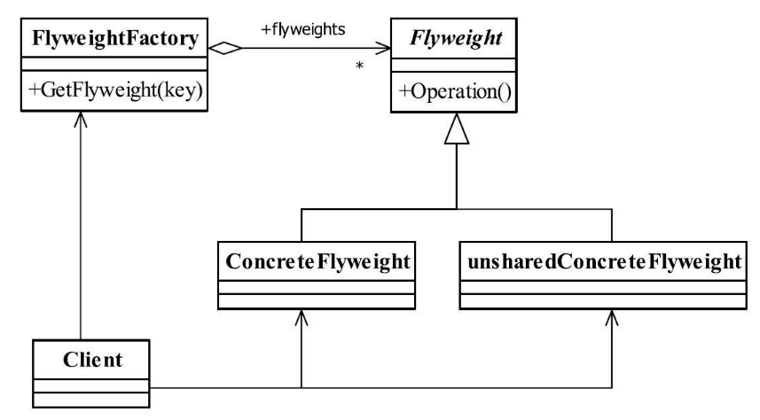

[TOC]


# 一、前言

享元模式解决的问题是：共享对象


> 享元模式（FlyweightPattern）是池技术的重要实现方式


# 二、基本概念

## 1.定义

使用共享对象可有效地支持大量的细粒度的对象

> Use sharing to support large numbers of fine-grained objects efficiently.
>


对象状态：

> 要求细粒度对象，那么不可避免地使得对象数量多且性质相近，那我们就将这些对象的信息分为两个部分：内部状态（intrinsic）与外部状态（extrinsic）。
>
> - 内部状态是对象可共享出来的信息，存储在享元对象内部并且不会随环境改变而改变.
> - 外部状态是对象得以依赖的一个标记，是随环境改变而改变的、不可以共享的状态.


## 2.登场角色

享元模式的目的在于运用共享技术，使得一些细粒度的对象可以共享，我们的设计确实也应该这样，多使用细粒度的对象，便于重用或重构。





### 2.1 Flyweight（抽象享元角色）

它简单地说就是一个产品的抽象类，同时定义出对象的外部状态和内部状态的接口或实现。


### 2.2 ConcreteFlyweight（具体享元角色）

具体的一个产品类，实现抽象角色定义的业务。

该角色中需要注意的是内部状态处理应该与环境无关，不应该出现一个操作改变了内部状态，同时修改了外部状态，这是绝对不允许的。

### 2.3 unsharedConcreteFlyweight（不可共享的享元角色）

不存在外部状态或者安全要求（如线程安全）不能够使用共享技术的对象，该对象一般不会出现在享元工厂中。


### 2.4 FlyweightFactory（享元工厂）

职责非常简单，就是构造一个池容器，同时提供从池中获得对象的方法。


## 3.通用源码

### 3.1 Flyweight

抽象享元角色一般为抽象类，在实际项目中，一般是一个实现类，它是描述一类事物的方法。在抽象角色中，一般需要把外部状态和内部状态（当然了，可以没有内部状态，只有行为也是可以的）定义出来，避免子类的随意扩展。

```java
public abstract class Flyweight {
	//内部状态
	private String intrinsic;
	//外部状态
	protected final String Extrinsic;

	//要求享元角色必须接受外部状态
	public Flyweight(String _Extrinsic) {
		this.Extrinsic = _Extrinsic;
	}

	//定义业务操作
	public abstract void operate();
	
	//内部状态的getter/setter
	public String getIntrinsic() {
		return intrinsic;
	}

	public void setIntrinsic(String intrinsic) {
		this.intrinsic = intrinsic;
	}

}

```


### 3.2 ConcreteFlyweight

- ConcreteFlyweight1

```java
public class ConcreteFlyweight1 extends Flyweight {

	//接受外部状态
	public ConcreteFlyweight1(String _Extrinsic) {
		super(_Extrinsic);
	}

	//根据外部状态进行逻辑处理
	public void operate() {
		//业务逻辑
	}


}
```


- ConcreteFlyweight2

```java
public class ConcreteFlyweight2 extends Flyweight {

   //接受外部状态
   public ConcreteFlyweight2(String _Extrinsic) {
      super(_Extrinsic);
   }

   //根据外部状态进行逻辑处理
   public void operate() {
      //业务逻辑
   }
}
```


### 3.3 FlyweightFactory


```java
public class FlyweightFactory {
	//定义一个池容器
	private static HashMap<String, Flyweight> pool = new HashMap<String, Flyweight>();
	
	//享元工厂
	public static Flyweight getFlyweight(String Extrinsic) {
		//需要返回的对象
		Flyweight flyweight = null;
		//在池中没有改对象
		if (pool.containsKey(Extrinsic)) {
			flyweight = pool.get(Extrinsic);
		} else {
			//根据外部状态创建享元对象
			flyweight = new ConcreteFlyweight1(Extrinsic);
			//放置到池中
			pool.put(Extrinsic, flyweight);
		}

		return flyweight;
	}

}
```


## 4.优劣

享元模式是一个非常简单的模式，它可以大大减少应用程序创建的对象，降低程序内存的占用，增强程序的性能，但它同时也提高了系统复杂性，需要分离出外部状态和内部状态，而且外部状态具有固化特性，不应该随内部状态改变而改变，否则导致系统的逻辑混乱。


## 5.适用场景

（1）系统中存在大量的相似对象。

（2）细粒度的对象都具备较接近的外部状态，而且内部状态与环境无关，也就是说对象没有特定身份。

（3）需要缓冲池的场景。


# 三、代码实例


# 四、相关设计模式


# 五、源码分析


# 六、参考资料

1. [CyC2018/CS-Notes](https://github.com/CyC2018/CS-Notes/blob/master/notes/%E8%AE%BE%E8%AE%A1%E6%A8%A1%E5%BC%8F.md) 
2. [quanke/design-pattern-java-source-code](https://github.com/quanke/design-pattern-java-source-code)
3. [图说设计模式](https://design-patterns.readthedocs.io/zh_CN/latest/)
4. [图解设计模式-CSDN-wujunyucg](