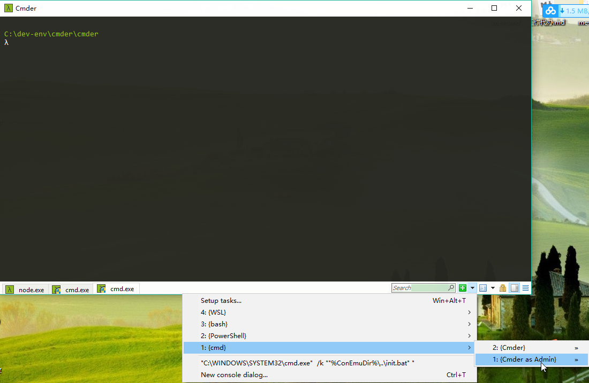
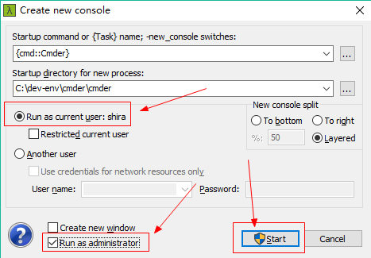
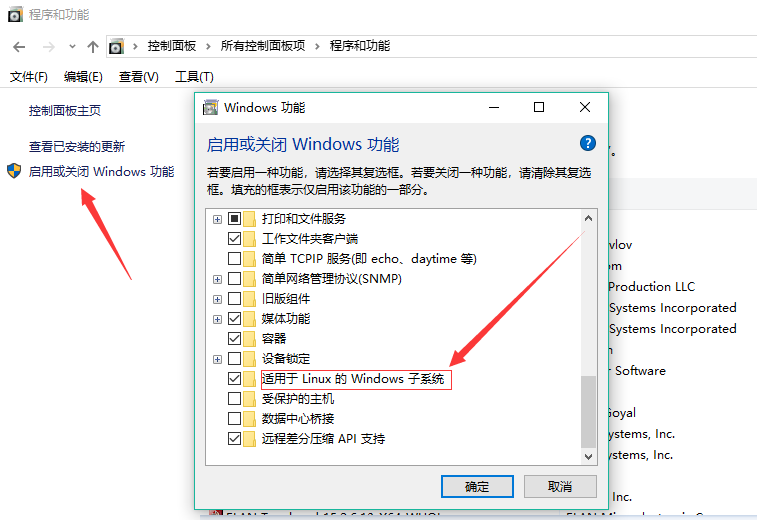
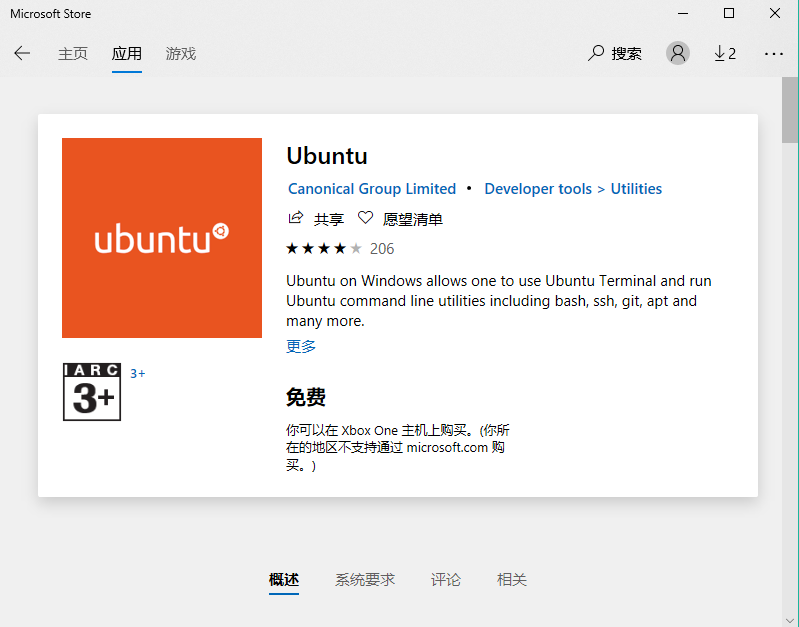
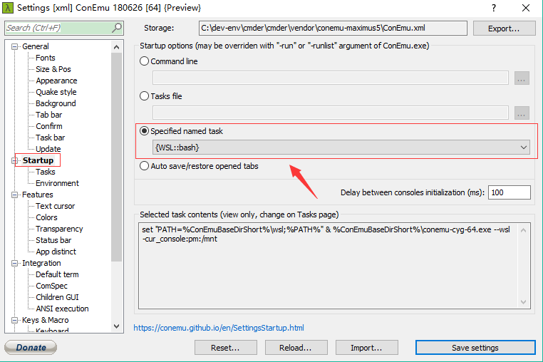
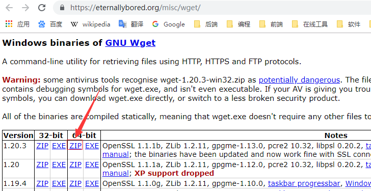
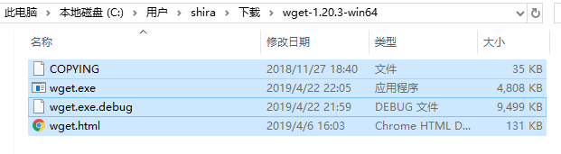

[TOC]

# 一、cmder

## 1.简介


## 2.安装及配置

### 2.1 安装

> 下载地址：https://cmder.net/

下载后解压即可


### 2.2 配置环境变量

```properties
CMDER_HOME= C:\dev-env\cmder\cmder    # Cmder.exe 所在目录
path=%CMDER_HOME%;
```


### 2.3 添加 cmder 到右键菜单

（1）**打开一个管理员权限终端**

方式一：




方式二：

按 ctrl + t 类打开一个新窗口，然后勾选下图中红框选项





然后点击start，这样就打开了一个有管理员权限的终端，在里面输入如下语句，即可将cmder加入右键菜单。

```
Cmder.exe /REGISTER ALL
```


## 3.Cmder执行linux命令

参见

> - [Linux 安装指南适用于 Windows 10 的 Windows 子系统](https://docs.microsoft.com/zh-cn/windows/wsl/install-win10)
> - [win10安装Linux子系统(WSL)时遇到的两个问题](https://blog.csdn.net/AI_Fanatic/article/details/82185437)


### 3.1 安装适用于 Linux 的 Windows 子系统

#### 3.1.1 启用功能 "适用于Windowd的Linux子系统"

在之前安装 WSL 任何 Linux 发行版，您必须确保"Windows 子系统为 Linux"已启用可选功能：

（1）可在控制面板中开启




（2）也可在命令行执行如下命令

1. 以管理员身份打开 PowerShell 并运行：

    ```bash
    Enable-WindowsOptionalFeature -Online -FeatureName Microsoft-Windows-Subsystem-Linux
    ```

2. 然后会出现提示信息，询问是否重启计算机，选择Y，重启即可


#### 3.1.2 安装所选的 Linux 分发版

打开Window应用商店搜索 ubuntu，然后安装并启动即可





#### 3.1.3 设置启动时打开wsl命令行





## 4.Cmder添加wegt命令

参考自：[How to install Wget into Cmder Console emulator](https://awesomedetect.com/install-wget-cmder-console-emulator/)


（1）访问如下地址，下载64位 wget 命令工具

> https://eternallybored.org/misc/wget/
>
> 
>
> 


（2）下载后解压，并拷贝全部文件




（3）将上一步拷贝的文件添加到  `%CMDER_HOME%/bin`目录下，如下图


# 参考资料

1. [Win下必备神器之Cmder](https://www.jeffjade.com/2016/01/13/2016-01-13-windows-software-cmder/)


