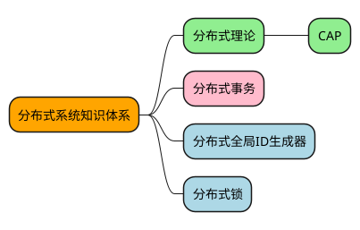

# 分布式系统-01-概述

[toc]

## 推荐阅读

> - [左耳朵耗子推荐：分布式系统架构经典资料](https://www.infoq.cn/article/2018/05/distributed-system-architecture)
> - [一文读懂分布式架构知识体系（内含超全核心知识大图）](https://juejin.cn/post/6844903967701336078)
> - [云原生时代，分布式系统设计必备知识图谱（内含22个知识点）](https://mp.weixin.qq.com/s?__biz=MzUzNzYxNjAzMg==&mid=2247486600&idx=1&sn=0ad92a1fe535f141fe2e8c87ffbd1229&chksm=fae50747cd928e51c05c41d2cc206069babbe9dfdba5957c52ac6e77cb754192169bb6b3e898&scene=21#wechat_redirect)
> - [分布式架构知识体系](https://www.cnblogs.com/i-hard-working/p/10393613.html)
> - [架构 - 知识体系](https://www.pdai.tech/md/arch/arch-x-overview.html)
> - [分布式缓存设计](https://github.com/crossoverJie/JCSprout/blob/master/MD/Cache-design.md)

## 一、概览

