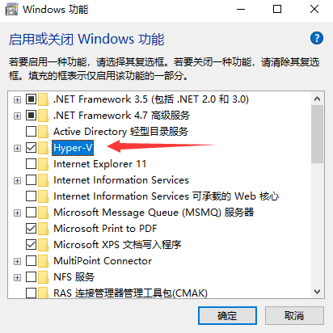
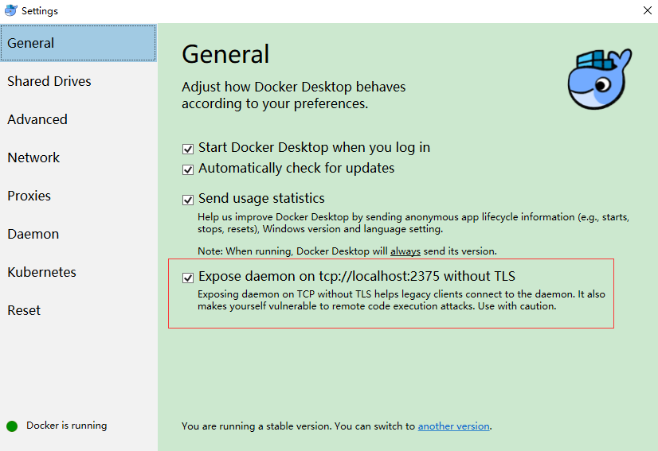
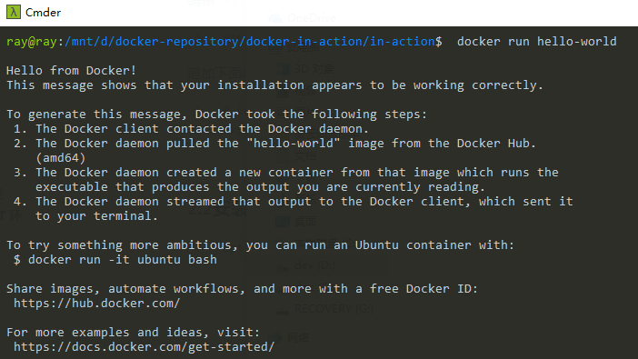

[TOC]


# 前言


# 一、Deepin下安装 Docker CE

> 参考： 
>
> - [Get Docker Engine - Community for Debian](https://docs.docker.com/install/linux/docker-ce/debian/)
> - [Deepin15.10安装Docker](https://www.jianshu.com/p/4c1aba15f7fe)


## 1.卸载旧版本

```bash
sudo apt-get remove docker docker-engine docker.io containerd runc
```


## 2.更新软件源

（1）安装docker-ce与密钥管理及相关下载工具

```bash
sudo apt-get install apt-transport-https ca-certificates curl gnupg2 software-properties-common
```

> 注意：主要包括curl命令、add-apt-reposiory工具（利用software-properties-common提供该工具）和密钥管理工具。


（2）添加CPG密钥

```bash
curl -fsSL https://mirrors.ustc.edu.cn/docker-ce/linux/debian/gpg | sudo apt-key add -
```

使用上述命令，出现如下异常：

```
curl: (35) error:140770FC:SSL routines:SSL23_GET_SERVER_HELLO:unknown protocol
gpg: no valid OpenPGP data found.
```

可将命令拆成两步执行

```bash
wget https://mirrors.ustc.edu.cn/docker-ce/linux/debian/gpg
sudo apt-key add gpg
```


查看密钥是否安装成功

```
sudo apt-key fingerprint 0EBFCD88
```

如果安装成功，显示如下信息：

```
pub   rsa4096 2017-02-22 [SCEA]
      9DC8 5822 9FC7 DD38 854A  E2D8 8D81 803C 0EBF CD88
uid   [ 未知 ] Docker Release (CE deb) <docker@docker.com>
sub   rsa4096 2017-02-22 [S]

```


（3）添加 docker 软件源

```bash
# 创建 typora 软件源文件
sudo vim /etc/apt/sources.list.d/docker.list

# 文件内键入以下内容，保存退出即可
deb [arch=amd64] https://mirrors.ustc.edu.cn/docker-ce/linux/debian stretch stable
```


其中：stretch为Debian版本号，这个和Ubuntu系统利用 $(lsb_release -cs)命令设置系统版本号不同，需要手动指定Debian版本号。

查看Deepin系统中Debian版本号可以用查看：

```
cat /etc/debian_version
```

根据查看的版本号替换对应的版本名称即可：

```properties
Debian 9（"stretch"） — 当前的稳定版
Debian 8（"jessie"） — 被淘汰的稳定版
Debian 7（"wheezy"） — 被淘汰的稳定版
Debian 6.0（"squeeze"） — 被淘汰的稳定版
Debian GNU/Linux 5.0（"lenny"） — 被淘汰的稳定版
Debian GNU/Linux 4.0（"etch"） — 被淘汰的稳定版
Debian GNU/Linux 3.1（"sarge"） — 被淘汰的稳定版
Debian GNU/Linux 3.0（"woody"） — 被淘汰的稳定版
Debian GNU/Linux 2.2（"potato"） — 被淘汰的稳定版
Debian GNU/Linux 2.1（"slink"） — 被淘汰的稳定版
Debian GNU/Linux 2.0（"hamm"） — 被淘汰的稳定版
```

Deepin15.11 对应的Debian版本号为9，版本代号为stretch，进行相应的替换即可。


（4）更新缓存

```bash
sudo apt-get update
```


## 3.安装docker-ce

（1）安装docker-ce

```bash
sudo apt-get install docker-ce
```


（2）修改 docker.service

安装完成后，需要修改相应的文件：/lib/systemd/system/docker.service.
把如下位置内容：

```properties
ExecStart=/usr/bin/dockerd -H fd:// 
```

修改为：

```properties
ExecStart=/usr/bin/dockerd 
```


（3）启动docker：

```bash
systemctl start docker
```


## 4.验证是否安装成功

（1）首先启动 docker 服务

```
systemctl start docker
```


（2）查看 Docker 版本信息

```bash
sudo docker version
```


（3）然后，我们就通过运行 `hello-world`来验证是否安装成功

```bash
sudo docker run hello-world
```


## 5.更新Docker用户组

当执行docker相关命令，如`docker version`时，可以看到存在权限不足的问题，是因为docker只允许root用户执行

```bash
ray@ray:~$ docker version
Client: Docker Engine - Community
 Version:           19.03.2
 API version:       1.40
 Go version:        go1.12.8
 Git commit:        6a30dfca03
 Built:             Thu Aug 29 05:29:49 2019
 OS/Arch:           linux/amd64
 Experimental:      false
Got permission denied while trying to connect to the Docker daemon socket at unix:///var/run/docker.sock: Get http://%2Fvar%2Frun%2Fdocker.sock/v1.40/version: dial unix /var/run/docker.sock: connect: permission denied
```


为解决此问题，可将当前用户添加到Docker用户组，然后注销用户重新登录即可。

```bash
sudo usermod -aG docker ${USER}
```


# 二、WSL上使用docker

windows 用户建议先安装 WSL （适用于Windowd的Linux子系统），安装教程参考：[02-命令行工具.md](../dev-tools/02-命令行工具.md)


　**不过令人遗憾的是目前WSL是不支持Docker的守护进程**，但您可以使用[Docker CLI](https://nickjanetakis.com/blog/get-to-know-dockers-ecosystem#docker-cli)连接到通过[Docker for Windows](https://nickjanetakis.com/blog/should-you-use-the-docker-toolbox-or-docker-for-mac-windows)或您创建的任何其他VM 运行的远程Docker守护进程

## 1.安装WSL

参考 [02-命令行工具.md](../dev-tools/02-命令行工具.md)

## 2.安装Docker Desktop for Windows

（1）去官网下载 [Docker Desktop for Windows](https://hub.docker.com/editions/community/docker-ce-desktop-windows)


（2）然后在控制面板-> 程序和功能 -> 启用或关闭Window功能 -> 勾选 Hyper-V




（3）然后一路默认安装即可


（4）暴露守护进程端口，以便让 docker 客户端进行连接Docker守护进程




## 3.WSL连接Dokcer守护进程

> 关于Linux环境变量持久化，请参见[Linux_04_环境变量](../Linux/Linux_01_基础知识/Linux_04_环境变量.md)


### 3.1 配置 DOCKER_HOST 环境变量

我们配置一个 DOCKER_HOST 环境变量，指定下Docker守护进程的地址


编辑 `~/.bashrc`

```
vim ~/.bashrc
```

追加下面内容

```
# config for the docker client to connect docker daemon
export DOCKER_HOST=tcp://127.0.0.1:2375
```


### 3.2 安装 docker 客户端

```
apt install docker.io
```


## 4.验证WSL是否能成功运行Docker

我们就通过运行 `hello-world`来验证是否安装成功

```
 sudo docker run hello-world
```


发现已经可以运行Docker了




# 三、配置docker

为了避免每次使用docker命令都要用特权身份，可以将当前用户加入安装中自动创建的docker用户组：

```
sudo usermod -aG docker USER_NAME
```

如：

```
sudo usermod -aG docker ray
```


# 参考资料

1. [Get Docker CE for Ubuntu](https://docs.docker.com/install/linux/docker-ce/ubuntu/)
2. [在Linux的Windows子系统上(WSL)使用Docker（Ubuntu）](https://www.cnblogs.com/xiaoliangge/p/9134585.html)
3. [Docker 技术入门与实战](https://item.jd.com/12453318.html)
4. 


