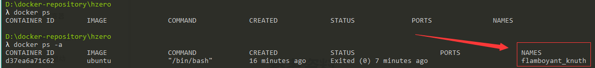
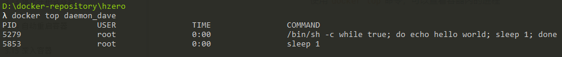
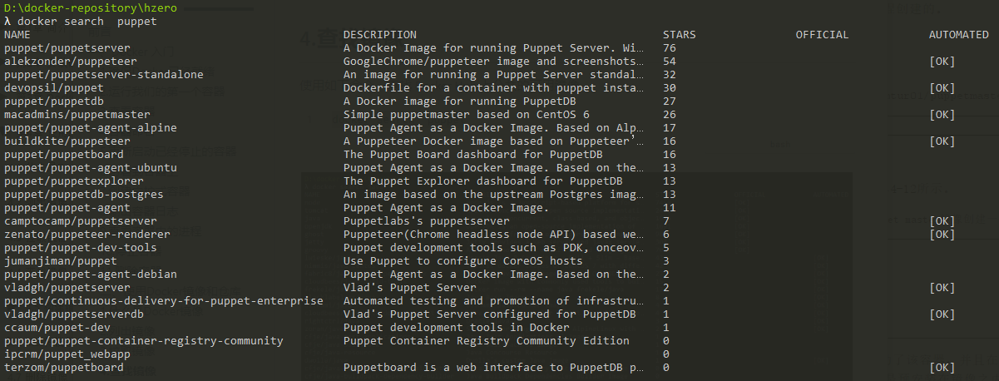

[TOC]


# 前言

**本系列总结转自[《第一本Dokcer书》](https://item.jd.com/11909234.html)，仅作读书笔记用**


# 一、Docker 入门

## 1.确保Docker已经就绪

可使用如下命令，若显示了 Dokcer 版本，则说明Docker已成功安装

```bash
λ docker -v
Docker version 18.09.2, build 6247962
```


也使用如下命令，查看Docker信息，该命令会返回

> - 所有容器和镜像的数量
> - Docker使用的执行驱动和存储驱动
> - Docker的基本配置

```bash
docker info
```


## 2.运行我们的第一个容器

```bash
docker run [OPTIONS] IMAGE [COMMAND] [ARG...]
```


`docker run`命令提供了 Docker 容器从创建到启动的功能

```bash
docker run -it ubuntu /bin/bash 
```

> （1）首先，我们告诉Docker执行`docker run`命令，并指定了`-i`和`-t`两个命令行参数。
>
> - `-i`：保持容器中 `STDIN`（标准输入）是开启的，不管我们是否附着到容器
> - `-t`：告诉Docker为要创建的容器分配一个伪tty终端
>
> （2）然后，我们告诉Docker基于什么镜像来创建容器，示例中使用的是ubuntu镜像
>
> Docker 会检查本地是否存在 ubuntu镜像，如果本地没有，那么Docker会从 `Docker Hub`（Docker的中央仓库）查看是否有该镜像，若有，则下载并保存该镜像到本地宿主机。随后，Docker在文件系统内部用这个镜像创建了一个容器。
>
> （3）最后，我们告诉Docker在新容器中要运行什么命令
>
> 示例中我们在容器中运行 /bin/bash 命令启动一个 Bash Shell


上述命令会使用ubuntu镜像创建一个容器，并打开一个Bash shell。这是一个完整的 ubuntu 系统，可以用它做任何事：

```bash
λ docker run -it ubuntu /bin/bash
#### 显示容器主机名
root@d37ea6a71c62:/# hostname
d37ea6a71c62
#### 查看host文件
root@d37ea6a71c62:/# cat /etc/hosts
127.0.0.1       localhost
::1     localhost ip6-localhost ip6-loopback
fe00::0 ip6-localnet
ff00::0 ip6-mcastprefix
ff02::1 ip6-allnodes
ff02::2 ip6-allrouters
172.17.0.2      d37ea6a71c62
#### 显示正在运行的进程
root@d37ea6a71c62:/# ps -aux
USER       PID %CPU %MEM    VSZ   RSS TTY      STAT START   TIME COMMAND
root         1  0.0  0.1  18504  3380 pts/0    Ss   06:17   0:00 /bin/bash
root        13  0.0  0.1  34396  2864 pts/0    R+   06:18   0:00 ps -aux
#### 显示文件列表
root@d37ea6a71c62:/# ls
bin  boot  dev  etc  home  lib  lib64  media  mnt  opt  proc  root  run  sbin  srv  sys  tmp  usr  var
#### 进入 /tmp 文件
root@d37ea6a71c62:/# cd /tmp
root@d37ea6a71c62:/tmp# ls
#### 创建文件
root@d37ea6a71c62:/tmp# touch 1.txt
root@d37ea6a71c62:/tmp# ls
1.txt
#### 安装 vim 编辑器
root@d37ea6a71c62:/tmp# apt-get update && apt-get install vim

```


在容器中的 bash 命令行执行`exit`即可退出容器

```
root@d37ea6a71c62:/tmp# exit
exit

D:\docker-repository\hzero
λ
```


只有在指定的 `/bin/bash` 命令处于运行状态的时候，我们的容器也才会相应地处于运行状态。一旦退出容器，`/bin/bash`命令也就结束了，这时容器也随之停止了运行。


## 3.查看容器

```bash
docker ps   # 列出正在运行的容器
docker ps -a  # 列出所有容器，包括正在运行的和已经停止的
```





如图，可以看到 Docker 创建容器时，自动为容器生成了一个名称，这个名称是可以指定的


## 4.容器命名

通过`--name`参数可指定容器的名称，容器名称必须唯一

```bash
docker run --name ray-ubuntu  -it ubuntu /bin/bash
```

上述命令，以 ubuntu 为基础镜像，创建了一个名为 ray-ubuntu 的容器，并打开了一个 bash 命令行


注意：

> 在很多 docker 命令中，都可以使用容器名称代替容器ID，且能使用容器名称的地方都可以使用容器ID.


## 5.重新启动已经停止的容器

例如：

```bash
docker start  ray-ubuntu
```


## 6.附着到容器上


Docker容器重新启动的时候，会沿用`docker run`命令时指定的参数来运行，因此我们的容器重新启动后会运行一个交互式会话shell。此外，也可以用`docker attach`命令，重新附着到该容器的会话上

```bash
docker attach ray-ubuntu
```


## 7.创建守护式容器

通过 `-d`参数指定容器以守护进程的形式在后台长期运行

```bash
docker run --name daemon_dave -d ubuntu /bin/sh -c "while  true; do echo hello world; sleep 1; done"
```

`-c`参数指定容器运行后要执行的命令，这里我们让容器在后台不断打印 hello word


注：

> 在cmder中以 cmd.exe 来运行上述命令，会发现没用，改用 powershell.exe 或者 bash.exe 执行即可


## 8.输出容器日志

使用`docker logs`命令，可以获取容器的日志

```
λ docker logs daemon_dave
hello world
hello world
```


## 9.查看容器内的进程

使用`docker top`命令，可以查看容器内的进程




## 10.停止容器

使用`docker stop`命令，可停止守护式容器

```bash
docker stop daemon_dave
```


使用如下命令，可停止所有容器

```bash
docker stop $(docker ps -q)
```


## 11.删除容器

使用以下命令，删除指定容器

```bash
docker rm daemon_dave
```


使用以下命令，删除所有容器（容器删除前必须先停止）

```bash
docker rm $(docker ps -aq)
```


使用以下命令，停用并删除所有容器

```bash
docker stop $(docker ps -q)
docker rm $(docker ps -aq)
```


# 二、使用Docker镜像和仓库

## 1.什么是Docker镜像


## 2.列出镜像

使用如下命令，列出docker镜像

```bash
docker images 					 ## 列出所有镜像
docker images ray-ubuntu         ## 列出指定镜像
```


## 3.拉取镜像

使用如下命令，从Docker Hub 拉取镜像到本地，默认下载 latest 标签的，也可手动指定标签

```bash
docker pull fedora:20
```


## 4.查找镜像

使用如下命令，查找 Docker Hub 上公共的可用镜像

```bash
docker search  puppet
```





我们从上面的结果中拉取一个镜像

```bash
docker pull devopsil/puppet
```

接着可以用这个镜像构建一个容器

```bash
docker run -it devopsil/puppet /bin/bash
```


## 5.构建镜像

构建Docker镜像有如下两种方式：

> - 使用 docker commit 命令
> - 编写Dockerfile之后使用 docker build 命令


### 5.1 使用 docker commit

创建 Docker 镜像的第一种方法是使用`docker commit`命令。可以将此想象为我们是在往版本控制系统里提交变更。我们先创建一个容器，并在容器里做出修改，就像修改代码一样，最后再将修改提交为一个新镜像。


（1）先从创建一个新容器开始，这个容器基于我们前面已经见过的ubuntu镜像

```bash
docker run -it ubuntu /bin/bash
```

（2）接下来安装 Apache

```bash
root@3698d234aae2:/# apt-get  update
root@3698d234aae2:/# apt-get -y install apache2
```


（3）这样，我们就启动了一个容器，并在里面安装了Apache。我们会将这个容器作为一个Web服务器来运行，所以我们想把它的当前状态保存下来。这样就不必每次都创建一个新容器并再次在里面安装Apache了。

为了完成此项工作，需要先使用exit命令从容器里退出，之后再运行 `docker commit`命令

```bash
docker commit 3698d234aae2 shirayenr/apache2
```

> - `3698d234aae2`：指定刚刚修改的容器id，可用`docker ps -a`来查看
>
> - `shirayenr/apache2`: 指定目标镜像仓库和镜像名
>
> - `docker commit`提交的只是创建容器的镜像与容器的当前状态之间有差异的部分
>
>     


也可以在提交时指定更多的信息

```bash
docker commit -m"A new custom image" -a"shirayenr" [img_id] shirayenr/apache2:webserver
```

> - `-m`：指定提交信息
> - `-a`: 指定该镜像的作者
> - 接着就是镜像id
> - 最后的 `shirayenr/apache2:webserver`则指定了 仓库名、镜像名、标签


如果想从刚刚创建的一个镜像来运行容器：

```bash
docker run -it shirayenr/apache2:webserver /bin/bash
```


### 5.2 使用 Dockerfile构建镜像

#### 5.2.1 编写 Dockerfile

（1）首先创建一个目录并在里面创建初始的Dockerfile

```bash
mkdir static_web
cd static_web
touch Dockerfile
```

这个目录就是我们的构建环境（build environment），Docker则称此环境为上下文（context）或构建上下文（build context）。

Docker 会在构建镜像时将构建上下文和该上下文中的文件和目录上传到Docker的守护进程。


（2）编写 Dockerfile

```dockerfile
# Version 0.0.1
FROM ubuntu:14.04
MAINTAINER shirayenr "1766211120@qq.com"
RUN apt-get update && apt-get install -y nginx
RUN echo 'Hi, I am in your container' \
    >/usr/share/nginx/html/index.html
EXPOSE 80
```

该Dockerfile由一系列指令和参数组成。每条指令，如FROM，都必须为大写字母，且后面要跟随一个参数，Dockerfile中的指令会按顺序从上到下执行，每条指令都会创建一个新的镜像层并对镜像进行提交。Docker大体上按照如下流程执行Dockerfile中的指令：

> - Docker从基础镜像运行一个容器。
> - 执行一条指令，对容器做出修改。
> - 执行类似dockercommit的操作，提交一个新的镜像层。
> - Docker再基于刚提交的镜像运行一个新容器。
> - 执行Dockerfile中的下一条指令，直到所有指令都执行完毕。


（3）指令含义：

> - FORM：指定基础镜像
>
>     > 每个Dockerfile的第一条指令必须是FROM。FROM指令指定一个已经存在的镜像，后续指令都将基于该镜像进行，这个镜像被称为**基础镜像**（baseiamge）。
>
> 
>
> - MAINTAINER ： 维护者
>
>     > 这条指令会告诉Docker该镜像的作者是谁，以及作者的电子邮件地址。这有助于标识镜像的所有者和联系方式。
>
> 
>
> - RUN：运行指定命令
>
>     > - RUN指令会在当前镜像中运行指定的命令
>     >
>     > - 每条RUN指令都会创建一个新的镜像层，如果该指令执行成功，就会将此镜像层提交，之后继续执行Dockerfile中的下一条指令。
>     >
>     > - 默认情况下，RUN指令会在shell里使用命令包装器/bin/sh-c来执行。如果是在一个不支持shell的平台上运行或者不希望在shell中运行（比如避免shell字符串篡改），也可以使用exec格式的RUN指令：
>     >
>     >     ```dockerfile
>     >     RUN [ "apt-get", " install", "-y", "nginx" ]
>     >     ```
>     >
>     >     在这种方式中，我们使用一个数组来指定要运行的命令和传递给该命令的每个参数。
>
>     
>
> - EXPOSE：指定对外暴露的端口
>
>     > - 这条指令告诉Docker该容器内的应用程序将会使用容器的指定端口
>     > - 若外部想访问容器内的应用程序，则需要在执行 docker run 命令时，建立本地宿主机与Docker容器的端口映射关系


#### 5.2.2 基于Dockerfile构建镜像

执行`docker build`命令时，Dockerfile中的所有指令都会被执行并且提交，并且在该命令成功结束后返回一个新镜像。

```dockerfile
docker build -t="shirayner/static_web:v1" .
```


> - `docker build`：构建镜像
>
> - `-t`：为新镜像设置仓库、名称、标签
>
> - `.`：当前目录。告诉docker到本地当前目录中寻找 Dockerfile 文件，也可执行一个git仓库地址来指定 Dockerfile的位置：
>
>     ```dockerfile
>     docker build -t="shirayner/static_web:v1"  \ git@github.com:shirayner/docker-static-web.git
>     ```


#### 5.2.3 从新镜像启动容器


```bash
docker run -d -p 80 --name static_web shirayner/static_web:v1  \　nginx -g "daemon off;" 
```


我使用 `docker run`命令，基于刚才构建的镜像的名字，启动了一个名为 static_web 的新容器。

> - 我们同时指定了`-d `选项，告诉Docker以分离（detached）的方式在后台运行。
>
> - 我们也指定了需要在容器中运行的命令：nginx -g "daemon off;"。
>
> - `-p`：指定Docker容器端口与本地宿主机端口的映射关系
>
>     - Docker可以在宿主机上随机选择一个位于32768~61000的一个比较大的端口号来映射到容器中的80端口上。
>
>         ```bash
>         docker run -d -p 80 --name static_web shirayner/static_web:v1  \　nginx -g "daemon off;" 
>         ```
>
>         
>
>     - 可以在Docker宿主机中指定一个具体的端口号（8088）来映射到容器中的80端口上。
>
>         ```
>         docker run -d -p 8088:80 --name static_web shirayner/static_web:v1  \　nginx -g "daemon off;" 
>         ```


容器启动成功后，可以通过如下命令查看本地宿主机与容器的端口映射关系

```
docker ps -l
dokcer port static_web 80
```


## 6.将镜像推送到Docker Hub


## 7.删除镜像

删除指定镜像

```bash
docker rmi shirayner/static_web:v1
```


删除所有镜像

```bash
docker rmi $(docker images -aq)
```


# 参考资料

1. [《第一本Dokcer书》](https://item.jd.com/11909234.html)


