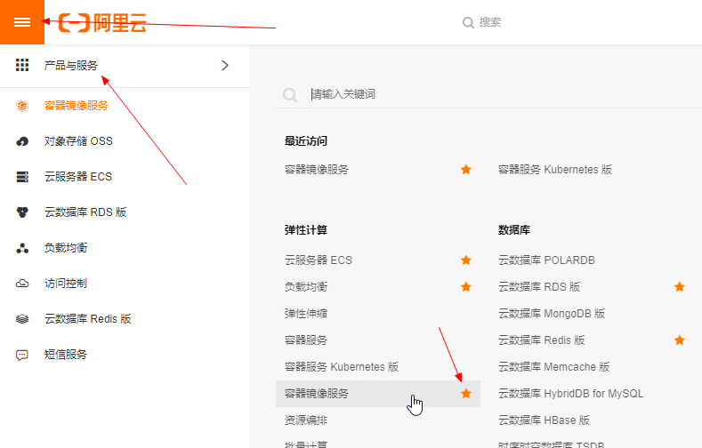
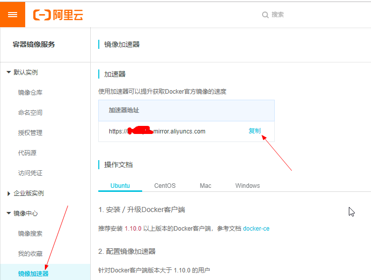
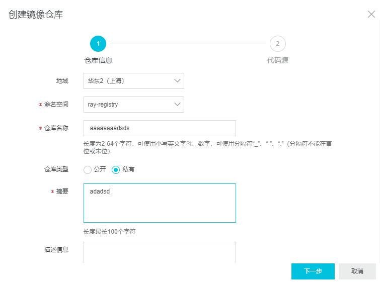
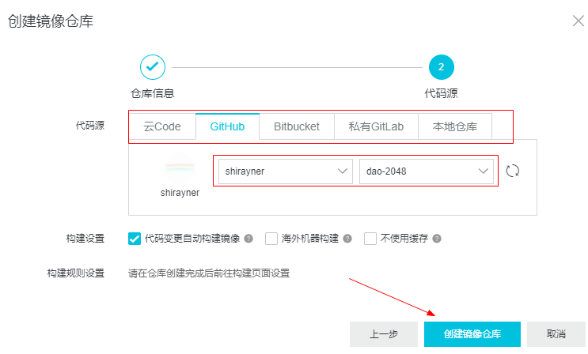
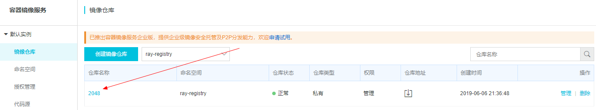

[TOC]


# 前言


# 一、Docker Hub Mirror 

Docker Hub Mirror  可以提供Docker Registry（Docker Hub）在中国的镜像代理服务。

Docker Hub 在国内的镜像仓库主要有：

> - [DaoCloud](https://link.jianshu.com/?t=https://www.daocloud.io/)：首个提供国内免费Docker Hub镜像的团体
> - 阿里云：<https://cr.console.aliyun.com/>
> - 网易云：<https://c.163.com/hub#/m/home/> 


# 二、阿里云镜像仓库

## 1.配置阿里云镜像加速器

（1）获取自己专属的加速器地址

- 登录阿里云管理后台 -> 产品与服务 -> 弹性计算 -> 容器镜像服务




- 容器镜像服务 -> 镜像中心 -> 镜像加速器 -> 复制加速器地址

    


（2）参照操作文档来配置 registry-mirrors 

需要修改 daemon.json 配置文件，文件路径如下：

> - linux（ubuntu/centos）:  `/etc/docker/daemon.json`
> - windows : `C:\Users\shira\.docker\daemon.json`


将加速器地址添加到 registry-mirrors 中（下面的地址是无效的，需要填写你自己的地址）：

```json
{
  "registry-mirrors": ["https://bsddsdslfe.mirror.aliyuncs.com"]
}
```


然后重启docker即可


## 2.通过代码源创建镜像仓库


（1）首先要创建命名空间，用来管理一组镜像

> 容器镜像服务 -> 默认实例 -> 命名空间 -> 创建命名空间 -> 然后填写命名空间即可


（2）创建镜像仓库

> - 容器镜像服务 -> 默认实例 ->  镜像仓库 -> 创建镜像仓库 -> 然后填写仓库信息 
>
> 
>
> - 选择一个代码托管平台 -> 然后选择一个代码仓库 -> 然后点击创建镜像即可
>
>     


（3）查看镜像信息




点击镜像名称，会出现镜像相关信息


注意仔细读一遍这里的操作指南


## 3.本地推送镜像到阿里云镜像仓库

根据上面的操作指南（以下内容就抄自这个操作指南）：

### 3.1 登录阿里云Docker Registry

```bash
$ sudo docker login --username=shiray1994@163.com registry.cn-shanghai.aliyuncs.com
```

> - 用于登录的用户名为阿里云账号全名，密码为开通服务时设置的密码。
> - 您可以在产品控制台首页修改登录密码。


### 3.2 从Registry中拉取镜像

```bash
$ sudo docker pull registry.cn-shanghai.aliyuncs.com/ray-registry/2048:[镜像版本号]
```


### 3.3 将镜像推送到Registry

```
$ sudo docker login --username=shiray1994@163.com registry.cn-shanghai.aliyuncs.com
$ sudo docker tag [ImageId] registry.cn-shanghai.aliyuncs.com/ray-registry/2048:[镜像版本号]
$ sudo docker push registry.cn-shanghai.aliyuncs.com/ray-registry/2048:[镜像版本号]

```

请根据实际镜像信息替换示例中的[ImageId]和[镜像版本号]参数。


