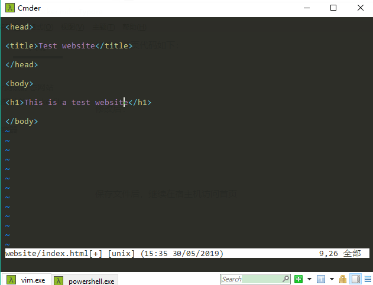
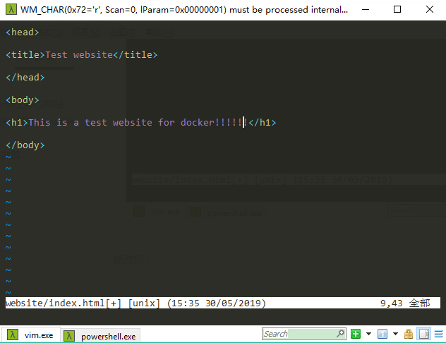

[TOC]


# 前言

**本系列总结转自[《第一本Dokcer书》](https://item.jd.com/11909234.html)，仅作读书笔记用**


# 一、使用Dokcer测试静态网站

将Docker作为本地Web开发环境是Docker的一个最简单的应用场景。

这样的环境可以完全复制生产环境，并确保用户开发的东西在生产环境中也能运行。下面从将NginxWeb服务器安装到容器来架构一个简单的网站开始。这个网站暂且命名为Sample。


## 1.sample网站初始的Dockerfile

（1）创建一个工作目录，保存Dockerfile

```bash
mkdir sample
cd sample
touch Dockerfile
```


（2）创建 nginx 配置文件

```bash
mkdir nginx && cd nginx
wget https://raw.githubusercontent.com/jamtur01/dockerbook-code/master/code/5/sample/nginx/global.conf
wget https://raw.githubusercontent.com/jamtur01/dockerbook-code/master/code/5/sample/nginx/nginx.conf
```


（3）编写Dockerfile

```dockerfile
FROM ubuntu:18.04
LABEL maintainer="james@example.com"
ENV REFRESHED_AT 2014-06-01

RUN apt-get -qq update && apt-get -qq install nginx

RUN mkdir -p /var/www/html/website
ADD nginx/global.conf /etc/nginx/conf.d/
ADD nginx/nginx.conf /etc/nginx/

EXPOSE 80
```


## 2.构建镜像

构建镜像

```bash
docker build -t jamtur01/nginx .
```


## 3.从镜像构建容器

（1）添加sample网站的首页代码

```
mkdir website && cd website
wget https://raw.githubusercontent.com/jamtur01/dockerbook-code/master/code/5/sample/website/index.html
cd ..
```


（2）从镜像运行容器（在cmder中要以powershell.exe运行）

```bash
docker run -d -p 8088:80 --name website -v $PWD/website:/var/www/html/website jamtur01/nginx nginx
```


> - `-v`这个选项允许我们将宿主机的目录作为卷，挂载到容器里。
> - 在nginx的配置文件中，我们指定了网站的站点目录为 `/var/www/html/website`，而我们又将宿主机的 `$PWD/website`目录挂载到了容器中的`/var/www/html/website`目录，这就实现了容器中的nginx发布本地指定目录作为站点


什么是卷:

> 卷在Docker里非常重要，也很有用。卷是在一个或者多个容器内被选定的目录，可以绕过分层的联合文件系统（UnionFileSystem），为Docker提供持久数据或者共享数据。这意味着对卷的修改会直接生效，并绕过镜像。当提交或者创建镜像时，卷不被包含在镜像里。

卷的作用：

> 当我们因为某些原因不想把应用或者代码构建到镜像中时，就体现出卷的价值了。例如：
>
> - 希望同时对代码做开发和测试；
> - 代码改动很频繁，不想在开发过程中重构镜像；
> - 希望在多个容器间共享代码。


（3）在宿主机访问容器中发布的网站

> http://localhost:8088/


## 4.修改网站

修改网站首页代码：

```
vi $PWD/website/index.html
```

修改前首页代码如下：




修改后：




保存文件后，继续在宿主机访问首页


# 参考资料

1. [《第一本Dokcer书》](https://item.jd.com/11909234.html)
2. [turnbullpress/dockerbook-code](https://github.com/turnbullpress/dockerbook-code)
3. [jaywcjlove/linux-command](https://github.com/jaywcjlove/linux-command)
4. 


