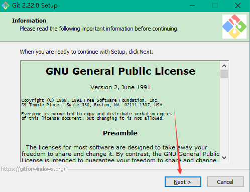
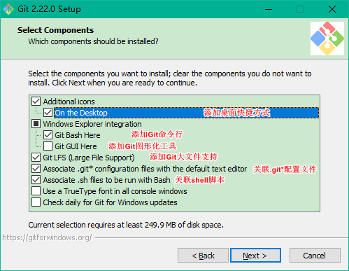
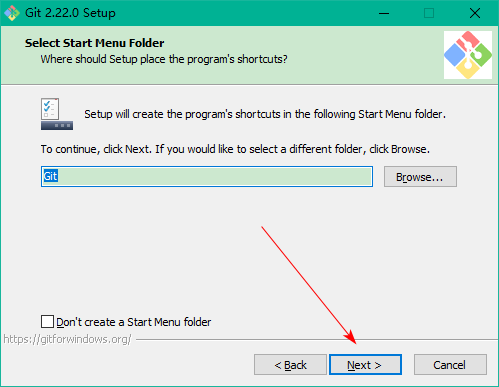
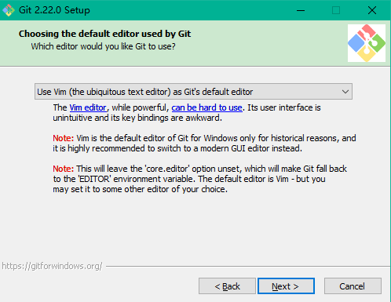
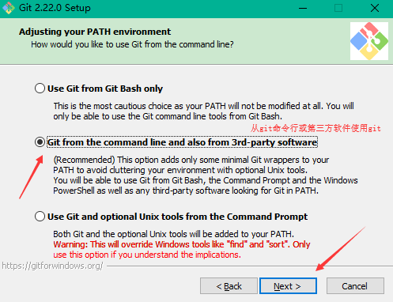
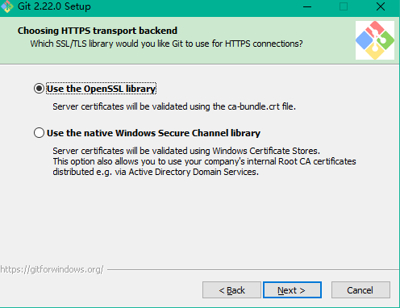

[TOC]


# 前言


# 一、Window下Git安装及配置

## 1.下载

去[Git Bash 官网](<https://git-scm.com/downloads>)下载安装文件


## 2.安装

> 总结一下：除了安装目录，其他一路默认安装即可

### 2.1 同意协议




### 2.2 自定义安装目录


### 2.3 选择安装组件




### 2.4 创建开始菜单文件夹




### 2.5 选择git默认文本编辑器




### 2.6 调整Git环境变量




### 2.7 选择Https传输库




### 2.8 选择换行编码

选择默认的 "检查Window风格的行尾，并统一转化成Unix风格的行尾"


### 2.9 配置Git bash终端仿真器


### 2.10 配置额外选项

勾选"启用文件系统缓存"、"启用Git认证管理器"


## 3.配置

### 3.1 配置环境变量

Git安装时已经自动添加了环境变量了，若发现没有配置，则配置一下即可

```properties
GIT_HOME=C:\dev-env\Git\InstallSite
Path=%GIT_HOME%\bin
```


### 3.2 配置Git全局用户信息

打开Git Bash 命令行，执行如下命令，来配置用户的用户名和邮箱，这也就是你在提交commit时的签名：

```bash
git config --global user.name "YourName"
git config --global user.email "email@example.com"
```


关于Git配置持久化：

> Git 提供了一个叫做 `git config` 的工具，专门用来配置或读取相应的工作环境变量，这些变量可以存放在以下三个不同的地方：
>
> -   `/etc/gitconfig` 文件：系统中对所有用户都普遍适用的配置。若使用 `git config` 时用 `--system` 选项，读写的就是这个文件。
> -   `~/.gitconfig` 文件：用户目录下的配置文件只适用于该用户。若使用 `git config` 时用 `--global` 选项，读写的就是这个文件。
> -   当前项目的 Git 目录中的配置文件（也就是工作目录中的 `.git/config` 文件）：这里的配置仅仅针对当前项目有效。每一个级别的配置都会覆盖上层的相同配置，所以 `.git/config` 里的配置会覆盖 `/etc/gitconfig` 中的同名变量。


### 3.3 配置远程仓库SSH公钥

使用 Git 时，一般要配合远程仓库（github、gitlab、gitee、阿里云code等）进行使用。那么你通过git访问远程仓库进行相关操作时，就需要进行认证，来将本地正在操作的用户与远程仓库的用户关联起来。

认证方式有两种：

> - HTTPS：通过用户名密码进行认证
> - SSH：通过SSH密钥进行认证

大多数 Git 服务器都会选择使用 SSH 公钥来进行授权。系统中的每个用户都必须提供一个公钥用于授权，没有的话就要生成一个。

#### 3.3.1 生成ssh密钥对

SSH 公钥默认储存在账户的主目录下的 `~/.ssh/id_rsa.pub` 文件中，若没有此文件，则在命令行中可执行如下命令（一路回车即可）来生成密钥对（公钥：id_rsa.pub  |  私钥：id_rsa  ）

```bash
 ssh-keygen -t rsa -C "your@mail.com"
```


#### 3.3.2 给远程仓库添加SSH 公钥

以 GitHub为例：

> 登录GitHub  ->   点击用户头像  ->  Settings  ->  SSH  and GPG keys -> New SSH key -> 然后将 `id_rsa.pub`公钥内容复制粘贴进去即可


# 参考资料

1. [GitBook_4 起步 - 安装 Git](https://git-scm.com/book/zh/v1/%E8%B5%B7%E6%AD%A5-%E5%AE%89%E8%A3%85-Git)
2.  [GitBook_5 起步 - 初次运行 Git 前的配置](https://git-scm.com/book/zh/v1/%E8%B5%B7%E6%AD%A5-%E5%88%9D%E6%AC%A1%E8%BF%90%E8%A1%8C-Git-%E5%89%8D%E7%9A%84%E9%85%8D%E7%BD%AE)
3. [SSH key的介绍与在Git中的使用](https://www.jianshu.com/p/1246cfdbe460)


