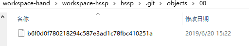

[TOC]


# 前言


我们打开一个git仓库目录


# 一、Git对象模型

## 1.Git对象

### 1.1 SHA

（1）**通过对象名来对项目历史信息文件进行索引**

所有用来表示项目历史信息的文件,是通过一个40个字符的（40-digit）“对象名”来索引的，对象名看起来像这样:

```
6ff87c4664981e4397625791c8ea3bbb5f2279a3
```

如下图：




（2）**每一个“对象名”都是对“对象”内容做SHA1哈希计算得来的**

每一个“对象名”都是对“对象”内容做SHA1哈希计算得来的，（SHA1是一种密码学的哈希算法）。这样就意味着两个不同内容的对象不可能有相同的“对象名”。


这样做会有几个好处：

> - Git只要比较对象名，就可以很快的判断两个对象是否相同。
> - 因为在每个仓库（repository）的“对象名”的计算方法都完全一样，如果同样的内容存在两个不同的仓库中，就会存在相同的“对象名”下。
> - Git还可以通过检查对象内容的SHA1的哈希值和“对象名”是否相同，来判断对象内容是否正确。


### 1.2 对象

每个对象(object) 包括三个部分：**类型**、**大小**、**内容**

（1）大小就是指内容的大小

（2）内容取决于对象的类型

（3）有四种类型的对象：`blob`、`tree`、 `commit` 、`tag`

> - `blob`：用来存储文件数据，通常是一个文件。
> - `tree`：有点像一个目录，它管理一些`tree`或是 `blob`（就像文件和子目录）
> - 一个`commit`只指向一个`tree`，它用来标记项目某一个特定时间点的状态。它包括一些关于时间点的元数据，如时间戳、最近一次提交的作者、指向上次提交（`commits`）的指针等等。
> - 一个`tag`是来标记某一个提交(`commit`) 的方法。


### 1.3 Blob对象

一个blob通常用来**存储文件的内容**.


你可以使用[git show](http://www.kernel.org/pub/software/scm/git/docs/git-show.html)命令来查看一个blob对象里的内容。假设我们现在有一个Blob对象的SHA1哈希值，我们可以通过下面的的命令来查看内容：

```
$ git show 6ff87c4664

 Note that the only valid version of the GPL as far as this project
 is concerned is _this_ particular version of the license (ie v2, not
 v2.2 or v3.x or whatever), unless explicitly otherwise stated.
...
```

一个"blob对象"就是一块二进制数据，它没有指向任何东西或有任何其它属性，甚至连文件名都没有.

因为blob对象内容全部都是数据，如两个文件在一个目录树（或是一个版本仓库）中有同样的数据内容，那么它们将会共享同一个blob对象。Blob对象和其所对应的文件所在路径、文件名是否改被更改都完全没有关系。


### 1.4 Tree 对象

一个tree对象有一串(bunch)指向blob对象或是其它tree对象的指针，它一般用来表示内容之间的目录层次关系。


[git show](http://www.kernel.org/pub/software/scm/git/docs/git-show.html)命令还可以用来查看tree对象，但是[git ls-tree](http://www.kernel.org/pub/software/scm/git/docs/git-ls-tree.html)能让你看到更多的细节。如果我们有一个tree对象的SHA1哈希值，我们可以像下面一样来查看它：

```
$ git ls-tree fb3a8bdd0ce
100644 blob 63c918c667fa005ff12ad89437f2fdc80926e21c    .gitignore
100644 blob 5529b198e8d14decbe4ad99db3f7fb632de0439d    .mailmap
100644 blob 6ff87c4664981e4397625791c8ea3bbb5f2279a3    COPYING
040000 tree 2fb783e477100ce076f6bf57e4a6f026013dc745    Documentation
100755 blob 3c0032cec592a765692234f1cba47dfdcc3a9200    GIT-VERSION-GEN
100644 blob 289b046a443c0647624607d471289b2c7dcd470b    INSTALL
100644 blob 4eb463797adc693dc168b926b6932ff53f17d0b1    Makefile
100644 blob 548142c327a6790ff8821d67c2ee1eff7a656b52    README
...
```

就如同你所见，一个tree对象包括一串(list)条目，每一个条目包括：mode、对象类型、SHA1值 和名字(这串条目是按名字排序的)。它用来表示一个目录树的内容。

**一个tree对象可以指向(reference)**: 一个包含文件内容的blob对象, 也可以是其它包含某个子目录内容的其它tree对象. Tree对象、blob对象和其它所有的对象一样，都用其内容的SHA1哈希值来命名的；只有当两个tree对象的内容完全相同（包括其所指向所有子对象）时，它的名字才会一样，反之亦然。这样就能让Git仅仅通过比较两个相关的tree对象的名字是否相同，来快速的判断其内容是否不同。


### 1.5 Commit对象

**"commit对象"指向一个"tree对象", 并且带有相关的描述信息.**


你可以用 --pretty=raw 参数来配合 [git show](http://www.kernel.org/pub/software/scm/git/docs/git-show.html) 或 [git log](http://www.kernel.org/pub/software/scm/git/docs/git-log.html) 去查看某个提交(commit):

```
$ git show -s --pretty=raw 2be7fcb476
commit 2be7fcb4764f2dbcee52635b91fedb1b3dcf7ab4
tree fb3a8bdd0ceddd019615af4d57a53f43d8cee2bf
parent 257a84d9d02e90447b149af58b271c19405edb6a
author Dave Watson <dwatson@mimvista.com> 1187576872 -0400
committer Junio C Hamano <gitster@pobox.com> 1187591163 -0700

    Fix misspelling of 'suppress' in docs

    Signed-off-by: Junio C Hamano <gitster@pobox.com>
```

你可以看到, 一个提交(commit)由以下的部分组成:

- 一个 **tree**　对象: tree对象的SHA1签名, 代表着目录在某一时间点的内容.
- **父对象** (parent(s)): 提交(commit)的SHA1签名代表着当前提交前一步的项目历史. 上面的那个例子就只有一个父对象; 合并的提交(merge commits)可能会有不只一个父对象. 如果一个提交没有父对象, 那么我们就叫它“根提交"(root commit), 它就代表着项目最初的一个版本(revision). 每个项目必须有至少有一个“根提交"(root commit). 一个项目可能有多个"根提交“，虽然这并不常见(这不是好的作法).
- **作者** : 做了此次修改的人的名字,　还有修改日期.
- **提交者**（committer): 实际创建提交(commit)的人的名字, 同时也带有提交日期. TA可能会和作者不是同一个人; 例如作者写一个补丁(patch)并把它用邮件发给提交者, 由他来创建提交(commit).
- **注释** 用来描述此次提交.

注意: 一个提交(commit)本身并没有包括任何信息来说明其做了哪些修改; 所有的修改(changes)都是通过与父提交(parents)的内容比较而得出的. 值得一提的是, 尽管git可以检测到文件内容不变而路径改变的情况, 但是它不会去显式(explicitly)的记录文件的更名操作.　(你可以看一下 [git diff](http://www.kernel.org/pub/software/scm/git/docs/git-diff.html) 的 -M　参数的用法)

一般用 [git commit](http://www.kernel.org/pub/software/scm/git/docs/git-commit.html) 来创建一个提交(commit), 这个提交(commit)的父对象一般是当前分支(current HEAD),　同时把存储在当前索引(index)的内容全部提交.


### 1.6 标签对象


一个标签对象包括一个对象名(译者注:就是SHA1签名), 对象类型, 标签名, 标签创建人的名字("tagger"), 还有一条可能包含有签名(signature)的消息. 你可以用 [git cat-file](http://www.kernel.org/pub/software/scm/git/docs/git-cat-file.html) 命令来查看这些信息:

```
$ git cat-file tag v1.5.0
object 437b1b20df4b356c9342dac8d38849f24ef44f27
type commit
tag v1.5.0
tagger Junio C Hamano <junkio@cox.net> 1171411200 +0000

GIT 1.5.0
-----BEGIN PGP SIGNATURE-----
Version: GnuPG v1.4.6 (GNU/Linux)

iD8DBQBF0lGqwMbZpPMRm5oRAuRiAJ9ohBLd7s2kqjkKlq1qqC57SbnmzQCdG4ui
nLE/L9aUXdWeTFPron96DLA=
=2E+0
-----END PGP SIGNATURE-----
```

点击 [git tag](http://www.kernel.org/pub/software/scm/git/docs/git-tag.html), 可以了解如何创建和验证标签对象.


## 2.对象模型

现在我们已经了解了3种主要对象类型(blob, tree 和 commit), 好现在就让我们大概了解一下它们怎么组合到一起的.

如果我们一个小项目, 有如下的目录结构:

```
$>tree
.
|-- README
`-- lib
    |-- inc
    |   `-- tricks.rb
    `-- mylib.rb

2 directories, 3 files
```

如果我们把它提交(commit)到一个Git仓库中, 在Git中它们也许看起来就如下图:


你可以看到: 每个目录都创建了 **tree对象** (包括根目录), 每个文件都创建了一个对应的 **blob对象** . 最后有一个 **commit对象** 来指向根tree对象(root of trees), 这样我们就可以追踪项目每一项提交内容.


# 二、Git工作区域与状态

## 1.Git工作区域

Git有如下工作区域：


解读如下：

Git有如下工作区域：

> - Workspace：工作目录
> - Index / Stage：暂存区
> - Repository：本地仓库
> - Remote：远程仓库


- Workspace

  > Git 用来保存项目的元数据和对象数据库的地方

- Index / Stage：暂存区

  > 保存了下次要提交的文件列表信息， 有时候也被称作"索引"

- Repository：本地仓库

  >  Git 用来保存项目的元数据和对象数据库的地方。这是 Git 中最重要的部分，从其它计算机克隆仓库时，拷贝的就是这里的数据

- Remote：远程仓库

  > 托管网络中的你的项目的版本库


## 2.Git状态

Git 有三种状态，你的文件可能处于其中之一：

> - **已修改（modified）**:  修改了文件，但还没保存到数据库中。
> - **已暂存（staged）**: 对一个已修改文件的当前版本做了标记，使之包含在下次提交的快照中。
> - **已提交（committed）**: 数据已经安全的保存在本地数据库中


（1）在工作目录中，修改文件内容，此时文件状态为：modified

（2）通过`git add`命令，将其添加到暂存区中，此时文件状态为：staged

（3）通过`git commit`命令，将其从暂存区添加本地仓库，此时文件状态为：committed


# 参考资料

1. [GIT对象模型](http://gitbook.liuhui998.com/1_2.html)
2. [1.3 起步 - Git 基础]([https://git-scm.com/book/zh/v2/%E8%B5%B7%E6%AD%A5-Git-%E5%9F%BA%E7%A1%80](https://git-scm.com/book/zh/v2/起步-Git-基础))
3. [阮一峰_常用 Git 命令清单](http://www.ruanyifeng.com/blog/2015/12/git-cheat-sheet.html)


