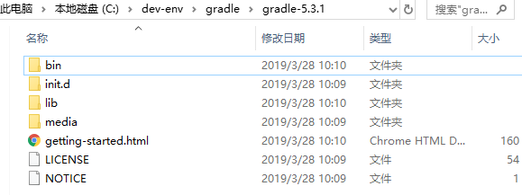

[TOC]

# 前言

本文参考自官方文档：[Installing Gradle](https://docs.gradle.org/current/userguide/installation.html#installing_gradle)


# 一、安装及配置

## 1.安装

（1）前往[发布页](https://gradle.org/releases/)，下载 Binary-only 版

> - Binary-only：只包含二进制文件
> - Complete： 除了二进制文件，还包含 docs 和 sources


（2）解压到自定义目录，如




## 2.配置环境变量


```properties
GRADLE_HOME = C:\dev-env\gradle\gradle-5.3.1
path = %GRADLE_HOME%\bin  # 追加
```


# 参考资料

1. [Installing Gradle](https://docs.gradle.org/current/userguide/installation.html#installing_gradle)

    


