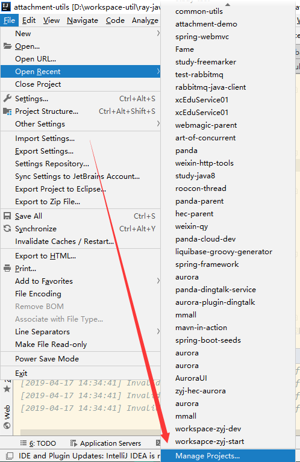
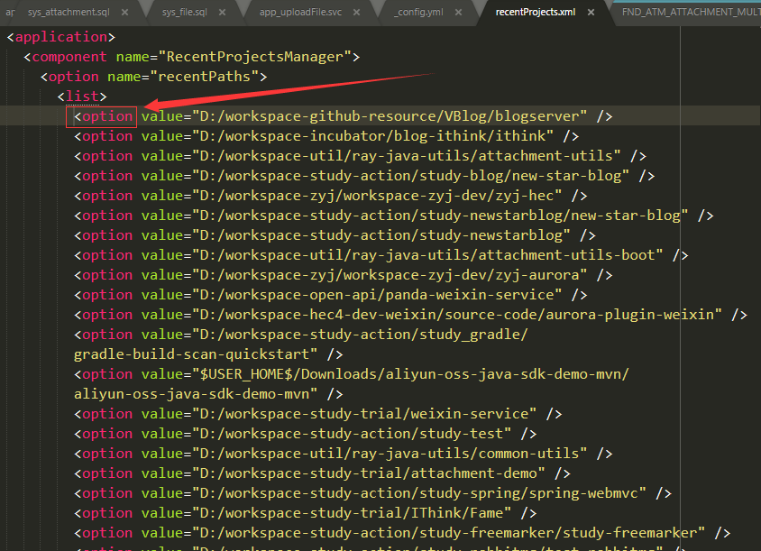

[TOC]


# 前言


# 一、清空最近打开的项目列表

有如下两种方法：


## 1.`Manage Projects`

（1） `File -> Open Recent -> Manage Projects ...`




（2）点击删除标志，一个一个删除


## 2.修改recentProjects.xml

（1）在用户目录下，找到`recentProjects.xml`

```
%home%\.IntelliJIdea2018.3\config\options\recentProjects.xml
```


（2）将 `<list>` 子节点 `<option>` 节点清空即可




# 参考资料

1. [IntelliJ Idea清除Open Recent里面的项目列表](https://www.jianshu.com/p/7d42c99d56f6)
2. 


