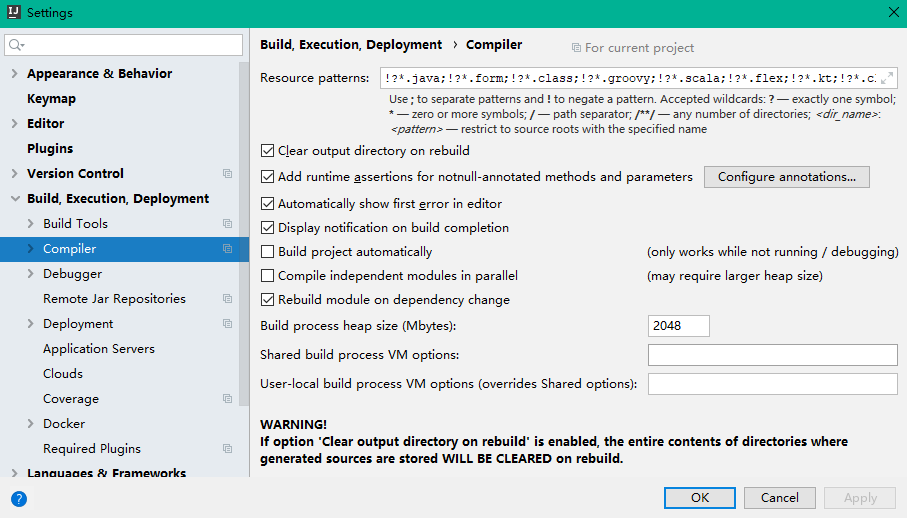
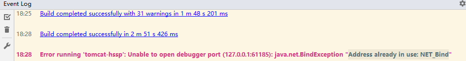

[TOC]


# 前言


# 一、相关异常

## 1.部署tomcat时报 No Artifacts Confiuered

### 1.1 异常现象


### 1.2 异常结局

（1）配置Maven 自动导入Maven项目

如下图，勾选 “Import Maven projects automatically”即可


（2）完成上一步后，发现异常还是没有解决，这可能是Maven版本导致的，我原本使用的是最新的 3.6 版本，换成Idea默认的Maven即可


## 2.java: OutOfMemoryError: insufficient memory 

### 2.1 异常信息

Idea运行项目前的build阶段，抛出如下错误：


### 2.2 异常解决

> 参见 [IDEA:Error: java: OutOfMemoryError: insufficient memory](https://blog.csdn.net/qq_36147916/article/details/84248572)

方式一：File ->  Invalidate Caches/ Restart...

方式二：配置 Compiler Process heap size 参数，默认为700M，调大一点




## 3.Address already in use: NET_Bind

### 3.1 异常信息

项目启动时，抛出如下错误信息：




### 3.2 异常原因

端口占用


### 3.2 异常解决

关闭占用的端口即可

```
netstat -ano | findstr 61185 //列出进程极其占用的端口，且包含 61185
tasklist | findstr 14592 // 查看是什么程序占用的
taskkill -PID 14592 -F //强制关闭某个进程
```


