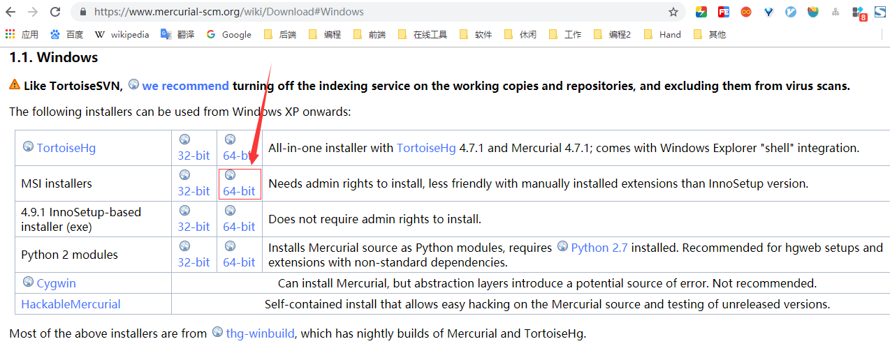

[TOC]


# 前言

本文转自：[芋道源码](<http://www.iocoder.cn/JDK/build-debugging-environment/>)


JDK 源码的调试环境，实际上暂时没有特别好的方案。

因为，我们程序运行以来 JDK ，但是我们如果在 JDK 上增加源码相关的注释，就会导致代码行数的错乱。所以，艿艿目前的想法是，如下两个步骤：

- 1、从官方的 Mercurial 获取 OpenJDK 源码，在上面添加源码注释。
- 2、自己搭建一个项目，使用 JDK11 ，然后进行调试。


# 一、OpenJDK 方式

> 图简单的话，可以直接使用艿艿提供 Github 地址 <https://github.com/YunaiV/openjdk> ，clone下来即可。

获取 OpenJDK 源码

## 1. Mercurial 安装及配置

因为官方的 OpenJDK 源码在 Mercurial 中，所以需要安装 Mercurial 。

### 1.1 Mercurial  安装

前往如下地址下载 Mercurial 

> <https://www.mercurial-scm.org/wiki/Download#Windows>

注意下载  `MSI installers`即可




下载完，执行安装程序，然后除了安装位置，其余一路默认安装即可。


### 1.2 Mercurial 环境变量配置

```properties
MERCURIAL_HOME = hg.exe所在目录
Path = %MERCURIAL_HOME%
```


## 2.拉取OpenJDK源码

拉取 OpenJDK11 源码（因为目前是 JDK11 版本是长期有效版本）

```bash
hg clone http://hg.openjdk.java.net/jdk/jdk11/
```


# 二、Oracle JDK方式

下载安装JDK后，在 %JAVA_HOME% 目录下（JDK8）或者 %JAVA_HOME% \lib 目录下，有一个src.zip，即为JDK源码。

这里以JDK 11 为例，将其解压，然并导入到 IDEA 中，然后一个一个将java的模块添加进去即可。


