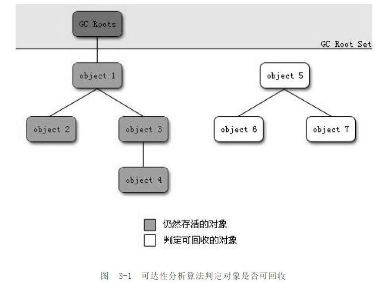

[TOC]

# 前言

为啥需要了解垃圾回收：

> 当需要排查各种内存溢出、内存泄漏问题时，当垃圾收集成为系统达到更高并发量的瓶颈时，我们就需要对这些“自动化”的技术实施必要的监控和调节。

JVM内存的哪些区域需要进行回收：

>线程共享的区域：Java 堆、方法区

从哪些方面了解垃圾回收：

> - 如何判定对象是否存活
> - 如何回收
> - 何时回收

# 一、如何判定对象是否存活

## 1.引用计数法

### 1.1 基本思路

给对象中添加一个引用计数器，每当有一个地方引用它时，计数器值就加1；当引用失效时，计数器值就减1；任何时刻计数器为0的对象就是不可能再被使用的。

### 1.2 存在问题

很难解决**对象间循环引用**问题

## 2.可达性分析算法

### 2.1 基本思路

通过一系列的称为"GCRoots"的对象作为起始点，从这些节点开始向下搜索，搜索所走过的路径称为引用链（ReferenceChain），当一个对象到GCRoots没有任何引用链相连（用图论的话来说，就是从GCRoots到这个对象不可达）时，则证明此对象是不可用的。

### 2.2 GC Roots

Java中，可作为GC Roots 的对象包括：

- 虚拟机栈（栈帧中的本地变量表）中引用的对象。
- 方法区中类静态属性引用的对象。
- 方法区中常量引用的对象。
- 本地方法栈中JNI（即一般说的Native方法）引用的对象。

### 2.3 两次标记过程

# 二、垃圾回收算法

