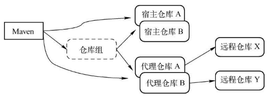

[TOC]


# 一、前言

私服是一种特殊的 Maven 远程仓库，通过建立自己的私服，就可以降低中央仓库负荷、节省外网带宽、加速Maven构建、自己部署构件等，从而高效地使用 Maven。


# 一、Nexus安装

Nexus是典型的JavaWeb应用，它有两种安装包：

- 一种是包含Jetty容器的Bundle包
- 另一种是不包含Web容器的war包。


## 1.下载地址

[官方下载地址](https://www.sonatype.com/download-oss-sonatype)


## 2.安装

将下载后的zip解压之后，会发现包含如下两个子目录：

- nexus-3.14.0-04 ：即HOME目录，该目录包含了Nexus运行所需要的文件，如启动脚本、依赖jar包等。
- sonatype-work  ：即工作目录，该目录包含Nexus生成的配置文件、日志文件、仓库文件等。Nexus会在运行时创建此目录。需要备份nexus的时候，备份此目录即可。


## 3.启动

用户只需要调用对应操作系统的脚本就可以启动Nexus。

windows下，以管理员权限运行cmd，进入到bin目录，然后执行如下命令：

```bash
nexus.exe  /run
```


# 二、Nexus的仓库与仓库组

## 1.内置仓库

### 1.1 仓库信息

仓库主要包含如下信息

- 仓库类型：
    - group（仓库组）
    - hosted（宿主）
    - proxy（代理）
    - virtual（虚拟）
- 仓库格式：
    - maven2
    - maven1
- Policy（策略）
    - Release（发布版本仓库）
    - Snapshot（快照版本仓库）
- 仓库状态
- 仓库路径


### 1.2 内置仓库列表

| 序号 | 仓库                         | 描述                                                         |
| :--: | :--------------------------- | ------------------------------------------------------------ |
|  1   | MavenCentral                 | 该仓库代理Maven中央仓库，其策略为Release，因此只会下载和缓存中央仓库中的发布版本构件 |
|  2   | Releases                     | 这是一个策略为Release的宿主类型仓库，用来部署组织内部的发布版本构件 |
|  3   | Snapshots                    | 这是一个策略为Snapshot的宿主类型仓库，用来部署组织内部的快照版本构件 |
|  4   | 3rd party                    | 这是一个策略为Release的宿主类型仓库，用来部署无法从公共仓库获得的第三方发布版本构件 |
|  5   | Apache Snapshots             | 这是一个策略为Snapshot的代理仓库，用来代理ApacheMaven仓库的快照版本构件 |
|  6   | Codehaus Snapshots           | 这是一个策略为Snapshot的代理仓库，用来代理CodehausMaven仓库的快照版本构件 |
|  7   | Google Code                  | 这是一个策略为Release的代理仓库，用来代理GoogleCodeMaven仓库的发布版本构件 |
|  8   | java.net-Maven 2             | 这是一个策略为Release的代理仓库，用来代理java.netMaven仓库的发布版本构件 |
|  9   | Public Repositories          | 该仓库组将上述所有策略为Release的仓库聚合并通过一致的地址提供服务 |
|  10  | Public Snapshot Repositories | 该仓库组将上述所有策略为Snapshot的仓库聚合并通过一致的地址提供服务 |


## 2.仓库分类





- Maven可以直接从宿主仓库下载构件；
- Maven也可以从代理仓库下载构件，而代理仓库会间接地从远程仓库下载并缓存构件；
- 最后，为了方便，Maven可以从仓库组下载构件，而仓库组没有实际内容（图中用虚线表示），它会转向其包含的宿主仓库或者代理仓库获得实际构件的内容。

### 2.1 创建宿主仓库


### 2.2 创建代理仓库


### 2.3 创建仓库组


# 三、Nexus相关配置

## 1.配置Maven从Nexus下载构建

### 1.1 配置Nexus仓库

配置Nexus仓库有两种方式：

- `pom.xml`  :  项目范围
- `~/.m2/setting.xml` : 用户范围


#### 1.1.1 pom.xml

通过 project 根元素下的 repositories 、pluginRepositories 元素，可以添加nexus远程仓库。

这样当maven需要下载构建的时候就会从nexus下载了，不过pom.xml中的配置只对当前项目生效，作用范围是项目范围。


```xml
  <!-- 私有仓库 -->
    <repositories>
        <repository>
            <id>RDC thirdparty</id>
            <name>RDC thirdparty Repository</name>
            <url>http://nexus.saas.hand-china.com/content/repositories/thirdparty</url>
        </repository>
    </repositories>

    <pluginRepositories>
        <pluginRepository>
            <id>RDC thirdparty</id>
            <name>RDC thirdparty Repository</name>
            <url>http://nexus.saas.hand-china.com/content/repositories/thirdparty</url>
        </pluginRepository>
    </pluginRepositories>
```


#### 1.1.2 ~/.m2/setting.xml

pom.xml 中的配置只对当前Maven项目有效，在实际应用中，我们往往想要通过一次配置就能让本机所有的Maven项目都使用自己的Maven私服，这时就需要用到  `~/.m2/setting.xml`


```xml
<settings>
  ...
  <profiles>
     <profile>
       <id>Nexus</id>

       <repositories>
         <repository>
           <id>nexus</id>
           <url>http://nexus.saas.hand-china.com/content/groups/public</url>
           <releases>
             <enabled>true</enabled>
           </releases>
           <snapshots>
             <enabled>true</enabled>
           </snapshots>
         </repository>
       </repositories>

       <pluginRepositories>
         <pluginRepository>
           <id>nexus</id>
           <url>http://nexus.saas.hand-china.com/content/groups/public</url>
           <releases>
             <enabled>true</enabled>
           </releases>
           <snapshots>
             <enabled>true</enabled>
           </snapshots>
         </pluginRepository>
       </pluginRepositories>

     </profile>
   </profiles>

   <activeProfiles>
     <activeProfile>
       Nexus
     </activeProfile>
   </activeProfiles>
...
</settings>
```


该配置中使用了一个id为nexus的profile，这个profile包含了相关的仓库配置，同时配置中又使用activeProfile元素将nexus这个profile激活，这样当执行Maven构建的时候，激活的profile会将仓库配置应用到项目中去。


### 1.2 配置镜像

配置镜像让Maven只使用私服：

> 可以创建一个匹配任何仓库的镜像，镜像的地址为私服，这样，Maven对任何仓库的构件下载请求都会转到私服中


```xml
<settings>
  ...
  <mirrors>
     <mirror>
       <id>nexus</id>
       <mirrorOf>*</mirrorOf>
       <url>http://nexus.saas.hand-china.com/content/groups/public</url>
     </mirror>
  </mirrors>

  <profiles>
     <profile>
       <id>Nexus</id>

       <repositories>
         <repository>
           <id>central</id>
           <url>http://central</url>
           <releases>
             <enabled>true</enabled>
           </releases>
           <snapshots>
             <enabled>true</enabled>
           </snapshots>
         </repository>
       </repositories>

       <pluginRepositories>
         <pluginRepository>
           <id>central</id>
           <url>http://central</url>
           <releases>
             <enabled>true</enabled>
           </releases>
           <snapshots>
             <enabled>true</enabled>
           </snapshots>
         </pluginRepository>
       </pluginRepositories>

     </profile>
   </profiles>

   <activeProfiles>
     <activeProfile>
       Nexus
     </activeProfile>
   </activeProfiles>
...
</settings>
```


## 2.部署构件至Nexus

对于一些组织内部发布的，或者一些无法从公共仓库中获得的第三方构件，可以将其部署至Nexus，供大家下载使用。

用户可以配置Maven自动部署构件至Nexus的宿主仓库，也可以通过界面手动上传构件。


日常开发生成的快照版本构件可以直接部署到Nexus中策略为Snapshot的宿主仓库中，项目正式发布的构件则应该部署到Nexus中策略为Release的宿主仓库中。


### 2.1 配置Maven部署构件至Nexus

#### 2.1.1 `distributionManagement`

在 `pom.xm `  中通过`distributionManagement`配置构件要发布至仓库

```xml
    <distributionManagement>
        <repository>
            <id>releases</id>
            <url>http://nexus.saas.hand-china.com/content/repositories/panda-release</url>
        </repository>

        <snapshotRepository>
            <id>snapshots</id>
            <url>http://nexus.saas.hand-china.com/content/repositories/panda-snapshot</url>
        </snapshotRepository>
    </distributionManagement>
```


#### 2.1.2 `servers`

Nexus的仓库对于匿名用户是只读的。为了能够部署构件，还需要在settings.xml中配置认证信息。

```xml
  <servers>
     <server>
       <id>releases</id>
       <username>hec-deployer</username>
       <password>123456</password>
     </server>
     <server>
       <id>snapshots</id>
       <username>hec-deployer</username>
       <password>123456</password>
     </server>
     <server>
       <id>3rd</id>
       <username>hec-deployer</username>
       <password>123456</password>
     </server>
   </servers>
```


### 2.2 手动部署第三方构件至Nexus

去nexus中操作。


