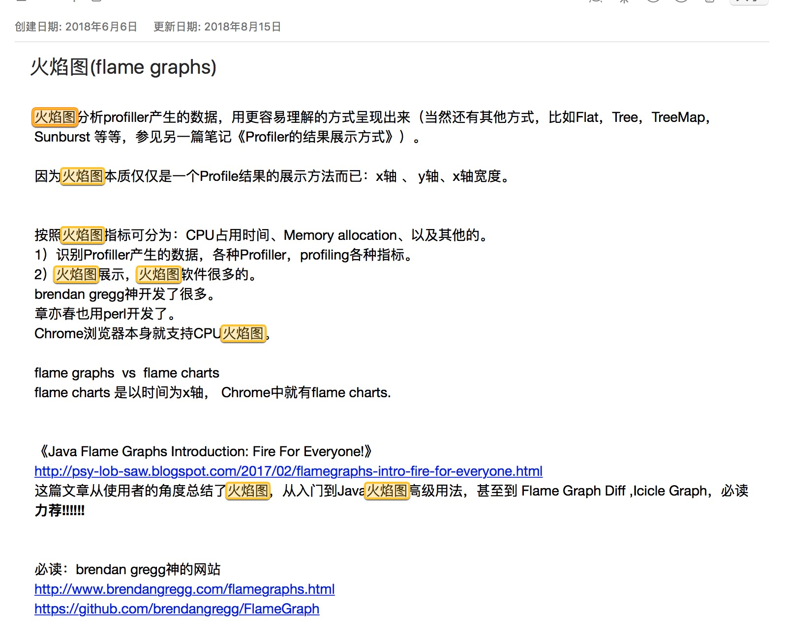
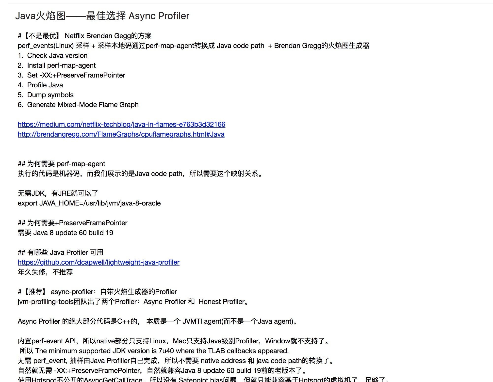
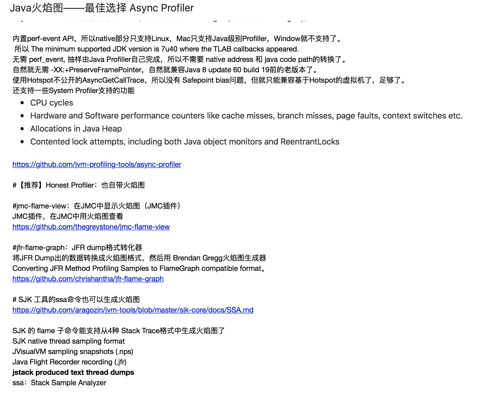
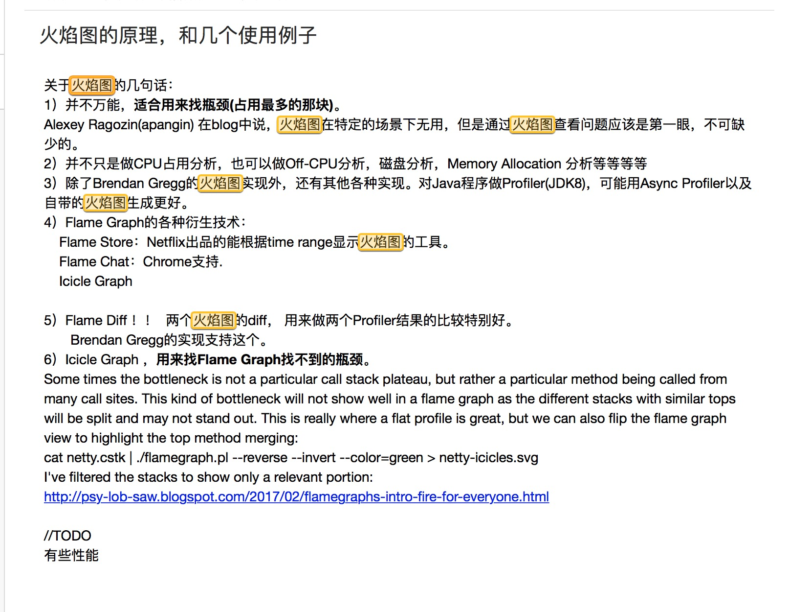
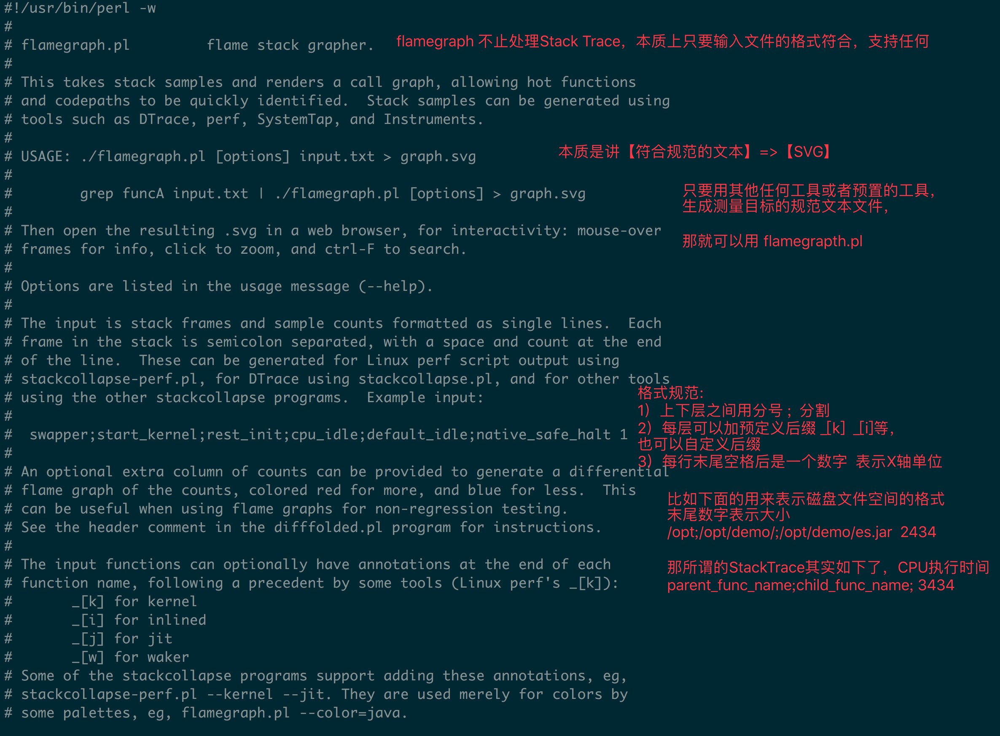

> 本文来自 for 神

北京-liufor<liu.liuunix@gmail.com>  15:40:45
多个jstack的结果，JFR的结果 这些都能用火焰图的方式表现出来，三方工具转出来。
还有那些自带火焰图的profiler，比如 async-profiler，Honest Profiler,SJK等。

brendan gregg 的 [flamegraph.pl](http://flamegraph.pl) 代码很少，我读过那1000行代码，做了笔记。

