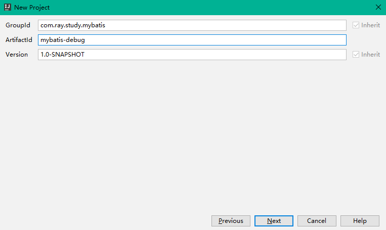
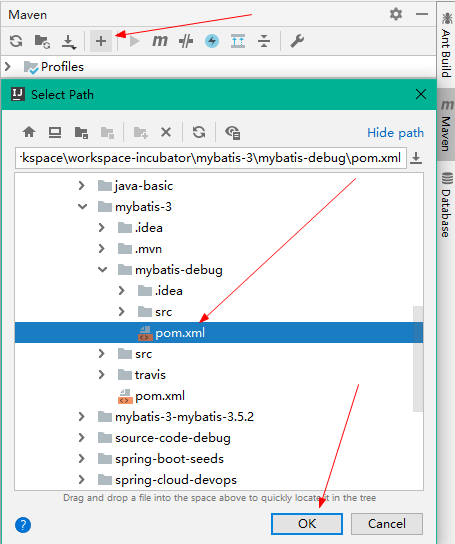

[TOC]


# 前言

关于Mybatis的源码阅读，推荐github上一个带中文注释的mybatis源码

> https://github.com/tuguangquan/mybatis


# 一、Mybatis源码调试环境搭建

> - 源码地址：https://github.com/mybatis/mybatis-3
> - 官方文档：http://www.mybatis.org/mybatis-3/zh/index.html

## 1.获取源码

（1）去 github 上 fork 一份 Mybatis 的源码，然后 clone 到本地

```bash
git clone git@github.com:shirayner/mybatis-3.git
```

（2）基于目标版本切换出自己源码调试的分支

```bash
# 本文编写时，最新版本为 mybatis-3.5.2，因此基于此tag切换出自己的分支
git checkout mybatis-3.5.2
# 基于 mybatis-3.5.2 创建并切换到自己的源码调试分支
git checkout -b mybatis-3.5.2-ray
```


## 2.导入Idea

打开Idea，直接点击 `Open` ，选择刚刚获取的 `mybatis-3` 项目，即可将项目导入到Idea中。

然后在项目根目录编译并安装项目到本地：

```
mvn clean install
```


## 3.创建测试工程

### 3.1 创建测试工程

在当前目录，创建一个测试工程，用于编写Mybatis测试用例，方便我们对源码进行调试。

（1）依次选择 File -> New -> Project... -> Maven -> Next


（2）填写测试项目的坐标

```properties
com.ray.study.mybatis
mybatis-debug-ray
```




（3）选择项目的目录为Mybatis工程的子目录


（3）将测试工程加入到当前窗口




### 3.2 引入依赖


## 数据库准备

```sql
create database mybatis_debug;
use mybatis_debug;
CREATE TABLE `user`  (
    `id` bigint(12) NOT NULL AUTO_INCREMENT COMMENT '主键自增',
    `name` varchar(50) NOT NULL COMMENT '用户名',
    `age` int (3) unsigned DEFAULT 3 COMMENT '年龄',
    `creation_date` datetime(0) NOT NULL DEFAULT CURRENT_TIMESTAMP  COMMENT '创建日期',
    `last_update_date` datetime(0) NOT NULL DEFAULT CURRENT_TIMESTAMP  COMMENT '上次更新日期',
    PRIMARY KEY (`id`)
) ENGINE=InnoDB DEFAULT CHARSET=utf8 COMMENT='用户表';

```


# 参考资料

1. [入门_Mybatis官方文档](http://www.mybatis.org/mybatis-3/zh/getting-started.html)
2. [Mybatis3.x 源码阅读-01环境搭建](https://blog.csdn.net/qq157538651/article/details/88555198)
3. [MyBatis源码阅读准备](https://www.jianshu.com/p/e739afb8fe31)


