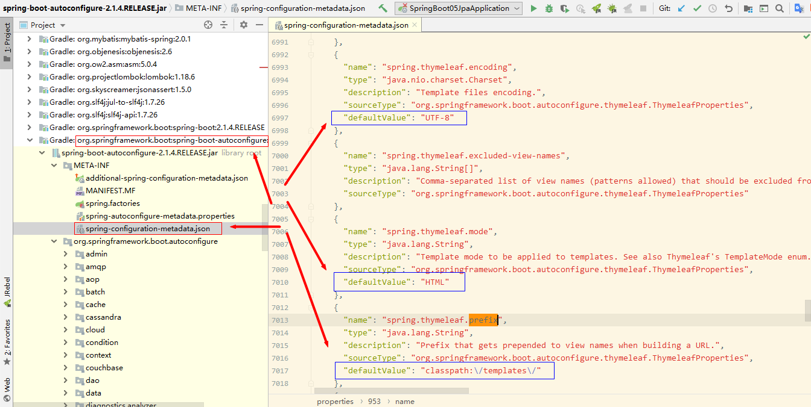

[TOC]


# 前言

这一节主要记录 SpringBoot 整合 Thymeleaf 的过程，关于Thymeleaf 用法请参见[Thymeleaf总结](../Thymeleaf/)


# 一、SpringBoot 整合Thymeleaf

## 1.创建子模块

这里我们创建一个子模块，创建步骤同 [SpringBoot_01_入门示例](./SpringBoot_01_入门示例.md)

```properties
group = 'com.ray.study'
artifact ='spring-boot-03-thymeleaf'
```


## 2.引入依赖

### 2.1 继承父工程依赖

在父工程`spring-boot-seeds` 的 `settings.gradle`加入子工程

```properties
rootProject.name = 'spring-boot-seeds'
include 'spring-boot-01-helloworld'
include 'spring-boot-02-restful-test'
include 'spring-boot-03-thymeleaf'
```


这样，子工程`spring-boot-03-thymeleaf`就会自动继承父工程中`subprojects` `函数里声明的依赖，主要包含如下依赖：

```groovy
        implementation 'org.springframework.boot:spring-boot-starter-web'
        testImplementation 'org.springframework.boot:spring-boot-starter-test'

        compileOnly 'org.projectlombok:lombok'
        annotationProcessor 'org.projectlombok:lombok'
```


### 2.2 引入`thymeleaf`依赖

直接依赖 `spring-boot-starter-thymeleaf`即可

将子模块`spring-boot-03-thymeleaf` 的`build.gradle`修改为如下内容：

```groovy
dependencies {
    implementation 'org.springframework.boot:spring-boot-starter-thymeleaf'
}

```


## 3.修改配置

### 3.1 `thymeleaf`默认配置

`ThymeleafProperties`类中设置了 `thymeleaf`默认配置，如下所示：

```java
@ConfigurationProperties(prefix = "spring.thymeleaf")
public class ThymeleafProperties {

	private static final Charset DEFAULT_ENCODING = StandardCharsets.UTF_8;

	public static final String DEFAULT_PREFIX = "classpath:/templates/";

	public static final String DEFAULT_SUFFIX = ".html";

	/**
	 * Whether to check that the template exists before rendering it.
	 */
	private boolean checkTemplate = true;

	/**
	 * Whether to check that the templates location exists.
	 */
	private boolean checkTemplateLocation = true;

	/**
	 * Prefix that gets prepended to view names when building a URL.
	 */
	private String prefix = DEFAULT_PREFIX;

	/**
	 * Suffix that gets appended to view names when building a URL.
	 */
	private String suffix = DEFAULT_SUFFIX;

	/**
	 * Template mode to be applied to templates. See also Thymeleaf's TemplateMode enum.
	 */
	private String mode = "HTML";

	/**
	 * Template files encoding.
	 */
	private Charset encoding = DEFAULT_ENCODING;

	/**
	 * Whether to enable template caching.
	 */
	private boolean cache = true;

```


由`ThymeleafProperties`类可看出，默认配置了

> - **模板文件编码**：`UTF-8`
> - **模板文件前缀**：`classpath:/templates/`
> - **模板文件后缀**：`.html`，由前缀和后缀可得出模板文件路径为：`src/main/resources/templates/{viewName}.html`
> - **开启了模板缓存**：由于开发时，需要经常修改模板，模板缓存会使我们的修改无法及时生效，因此开发时需要禁用模板缓存
> - **设置了模板模式为** `HTML`：我们会将此修改为`HTML5`


关于默认配置也可在`spring-boot-autoconfigure`工程下的的`spring-configuration-metadata.json`文件中查看，如下图：




### 3.2 修改`application.yml`

```yml
server:
  port: 8088
  servlet:
    context-path: /

# ThymeLeaf配置
## 默认配置见 ThymeleafProperties
spring:
  thymeleaf:
    mode: HTML5     # 设置模板模式，支持 HTML, XML TEXT JAVASCRIPT
    cache: false    # 禁用模板缓存：开发配置为false,避免修改模板还要重启服务器


```


## 4.业务实现

所谓模板引擎，就是模板+数据

这里我们将实现一个显示用户列表的功能

### 4.1 准备数据

#### 4.1.1 model

```java
package com.ray.study.springboot03thymeleaf.model;


import lombok.AllArgsConstructor;
import lombok.Data;
import lombok.NoArgsConstructor;

/**
 * description
 *
 * @author shira 2019/04/28 15:01
 */
@Data
@NoArgsConstructor
@AllArgsConstructor
public class User {

	private Long id;

	private String name;

	private Integer age;
}


```


#### 4.1.2 controller

```java
package com.ray.study.springboot03thymeleaf.controller;


import com.ray.study.springboot03thymeleaf.model.User;
import org.springframework.stereotype.Controller;
import org.springframework.ui.Model;
import org.springframework.web.bind.annotation.GetMapping;
import org.springframework.web.bind.annotation.RequestMapping;
import org.springframework.web.servlet.ModelAndView;

import java.util.ArrayList;
import java.util.List;

/**
 * UserController
 *
 * @author shira 2019/04/28 15:45
 */
@Controller
@RequestMapping(value = "/users")     // 通过这里配置使下面的映射都在/users下
public class UserController {


	@GetMapping("/index1")
	public ModelAndView index1() {

		List<User> userList = listUser();

		ModelAndView view = new ModelAndView();
		// 设置跳转的视图 默认映射到 src/main/resources/templates/{viewName}.html
		view.setViewName("index");

		// 设置属性
		view.addObject("title", "SpringBoot 整合 Thymeleaf");
		view.addObject("userList", userList);

		return view;
	}


	@GetMapping("/index2")
	public String index2(Model model) {
		List<User> userList = listUser();

		model.addAttribute("title", "SpringBoot 整合 Thymeleaf");
		model.addAttribute("userList", userList);

		// 设置跳转的视图 默认映射到 src/main/resources/templates/{viewName}.html
		return "index";
	}


	private List<User> listUser(){
		List<User> userList = new ArrayList<>();
		for (int i=0 ; i<3; i++){
			userList.add(new User(1L+i,"tom"+i,21+i));
		}

		return userList;
	}

}

```


### 4.2 准备模板

在`src/main/resources`下创建`templates`目录，并在此目录下创建`index.html`，内容如下：

```html
<!DOCTYPE html>
<!--
  description  
  @author shira 2019/05/07 12:41 
-->
<html lang="en" xmlns:th="http://www.thymeleaf.org">
<head>
    <meta charset="UTF-8">
    <title th:text="${title}"></title>
</head>
<body>
    <h1 th:text="${title}"></h1>

    <table>
        <tr>
            <th>id</th>
            <th>name</th>
            <th>age</th>
        </tr>
        <tr th:each="user : ${userList}">
            <td th:text="${user.id}">id</td>
            <td th:text="${user.name}">userName</td>
            <td th:text="${user.age}">age</td>
        </tr>
    </table>


</body>
</html>
```


## 5.最终效果

启动项目，然后访问如下两个网址

> - http://localhost:8088/users/index1
> - http://localhost:8088/users/index2


会出现下图页面：

> 


# 参考资料

1. [一起来学SpringBoot | 第四篇：整合Thymeleaf模板](https://blog.battcn.com/2018/04/28/springboot/v2-web-thymeleaf/)
2. [SpringBoot之整合Thymeleaf-基于SpringBoot2.0.2版本](https://blog.csdn.net/weixin_39723544/article/details/82721279)