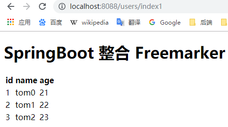

[TOC]


# 前言

有时在我们的项目中可能要使用多个模板引擎，来解析不同的视图，比如`.jsp`、`.html`、`.ftl`等。

在SpringBoot中同时引入thymeleaf 、freemarker模板引擎，`.html`和`.ftl`视图是能正常渲染的，但是`.jsp`等其他视图则无法渲染。

原因在于： `spring-boot-starter-freemarker`、`spring-boot-starter-thymeleaf`中已经自动装配了其相应的视图解析器，而`.jsp`却没有对应的视图解析器。

解决方法：为相应视图装配其对应的视图解析器


# 一、SpringBoot 引入多个模板引擎

这里我们将引入thymleaf 、freemarker模板引擎

## 1.创建子模块

这里我们创建一个子模块，创建步骤同 [SpringBoot_01_入门示例](./SpringBoot_01_入门示例.md)

```properties
group = 'com.ray.study'
artifact ='spring-boot-03-muti-view-resolver'
```


## 2.引入依赖

### 2.1 继承父工程依赖

在父工程`spring-boot-seeds` 的 `settings.gradle`加入子工程

```properties
rootProject.name = 'spring-boot-seeds'
include 'spring-boot-01-helloworld'
include 'spring-boot-02-restful-test'
include 'spring-boot-03-thymeleaf'
include 'spring-boot-03-freemarker'
include 'spring-boot-03-muti-view-resolver'
```


这样，子工程`muti-view-resolver`就会自动继承父工程中`subprojects` `函数里声明的依赖，主要包含如下依赖：

```groovy
        implementation 'org.springframework.boot:spring-boot-starter-web'
        testImplementation 'org.springframework.boot:spring-boot-starter-test'

        compileOnly 'org.projectlombok:lombok'
        annotationProcessor 'org.projectlombok:lombok'
```


### 2.2 引入模板引擎依赖

将子模块`spring-boot-03-muti-view-resolver` 的`build.gradle`修改为如下内容：

```groovy
dependencies {
    implementation 'org.springframework.boot:spring-boot-starter-freemarker'
}

```


## 3.修改配置

### 3.1 `freemarker`默认配置

`FreeMarkerProperties`类及其父类中设置了 `freemarker`默认配置，如下所示：

```java
@ConfigurationProperties(prefix = "spring.freemarker")
public class FreeMarkerProperties extends AbstractTemplateViewResolverProperties {

	public static final String DEFAULT_TEMPLATE_LOADER_PATH = "classpath:/templates/";

	public static final String DEFAULT_PREFIX = "";

	public static final String DEFAULT_SUFFIX = ".ftl";
}

```


由`ThymeleafProperties`类及其父类，默认配置了

```yml
# Freemarker 默认配置
spring:
  freemarker:
    # 禁用模板缓存
    cache: false
    # 编码格式
    charset: UTF-8
    # 是否为该技术启用MVC视图解析
    enabled: true
    # Content-Type值
    content-type: text/html
    # #模板加载路径
    template-loader-path: classpath:/templates/
    prefix: 空串
    # freemarker模板后缀 默认是 .ftl
    suffix: .ftl
```


关于默认配置也可在`spring-boot-autoconfigure`工程下的的`spring-configuration-metadata.json`文件中查看


### 3.2 修改`application.yml`

```yml
server:
  port: 8088
  servlet:
    context-path: /

# Freemarker的配置使用上述默认配置即可，或者可设置前缀
```


## 4.业务实现

所谓模板引擎，就是模板+数据

这里我们将实现一个显示用户列表的功能

### 4.1 准备数据

#### 4.1.1 model

```java
package com.ray.study.springboot03freemarker.model;


import lombok.AllArgsConstructor;
import lombok.Data;
import lombok.NoArgsConstructor;

/**
 * description
 *
 * @author shira 2019/04/28 15:01
 */
@Data
@NoArgsConstructor
@AllArgsConstructor
public class User {

	private Long id;

	private String name;

	private Integer age;
}

```


#### 4.1.2 controller

```java
package com.ray.study.springboot03freemarker.controller;


import com.ray.study.springboot03freemarker.model.User;
import org.springframework.stereotype.Controller;
import org.springframework.ui.Model;
import org.springframework.web.bind.annotation.GetMapping;
import org.springframework.web.bind.annotation.RequestMapping;
import org.springframework.web.servlet.ModelAndView;

import java.util.ArrayList;
import java.util.List;

/**
 * UserController
 *
 * @author shira 2019/04/28 15:45
 */
@Controller
@RequestMapping(value = "/users")     // 通过这里配置使下面的映射都在/users下
public class UserController {


	@GetMapping("/index1")
	public ModelAndView index1() {

		List<User> userList = listUser();

		ModelAndView view = new ModelAndView();
		// 设置跳转的视图 默认映射到 src/main/resources/templates/{viewName}.html
		view.setViewName("index");

		// 设置属性
		view.addObject("title", "SpringBoot 整合 Freemarker");
		view.addObject("userList", userList);

		return view;
	}


	@GetMapping("/index2")
	public String index2(Model model) {
		List<User> userList = listUser();

		model.addAttribute("title", "SpringBoot 整合 Freemarker");
		model.addAttribute("userList", userList);

		// 设置跳转的视图 默认映射到 src/main/resources/templates/{viewName}.html
		return "index";
	}


	private List<User> listUser(){
		List<User> userList = new ArrayList<>();
		for (int i=0 ; i<3; i++){
			userList.add(new User(1L+i,"tom"+i,21+i));
		}

		return userList;
	}

}

```


### 4.2 准备模板

在`src/main/resources`下创建`templates`目录，并在此目录下创建`index.ftl`，内容如下：

```html
<!DOCTYPE html>
<!--
  description  
  @author shira 2019/05/07 12:41 
-->
<html lang="en">
<head>
    <meta charset="UTF-8">
    <title> ${title} </title>
</head>
<body>
    <h1>${title}</h1>

    <table>
        <tr>
            <th>id</th>
            <th>name</th>
            <th>age</th>
        </tr>
        <#list userList as user>
            <tr>
                <td>${user.id}</td>
                <td>${user.name}</td>
                <td>${user.age}</td>
            </tr>
        </#list>
    </table>


</body>
</html>
```


## 5.最终效果

启动项目，然后访问如下两个网址

> - http://localhost:8088/users/index1
> - http://localhost:8088/users/index2


会出现下图页面：

> 


# 参考资料

1. [**Springboot配置多个视图解析器，项目同时有jsp和html**](https://blog.csdn.net/qq_29611427/article/details/88867549)
2. [Springboot2.x配置thymeleaf和jsp双视图解析器](https://blog.csdn.net/KyrellLupin/article/details/90074192)
3. [Spring Boot配置接口 WebMvcConfigurer](https://blog.csdn.net/fmwind/article/details/81235401)
4. 