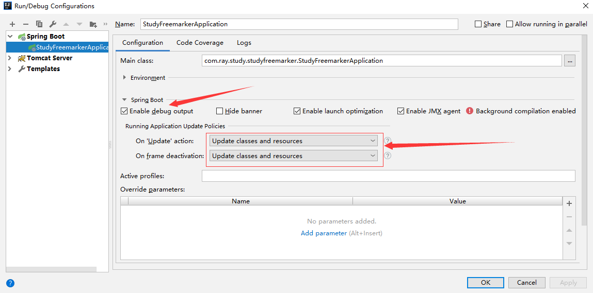
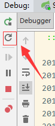
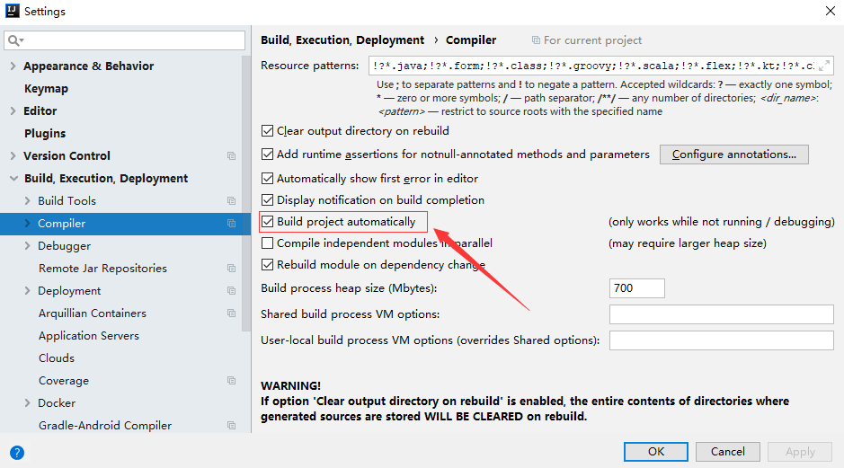
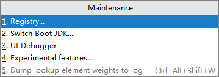
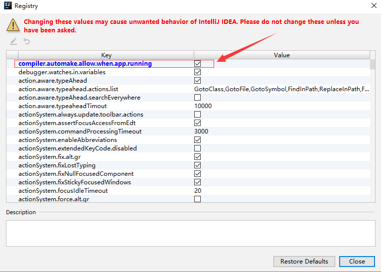

[TOC]


# 前言

SpringBoot的热部署有如下方式：

> - Idea自带的Debug
> - spring-boot-devtools
> - springloaded
> - Jrerebel


# 一、Idea自带的Debug

## 1. 设置更新策略

在 `Run/Debug Configurations` 中设置更新策略为：

> 将 `On 'Update' action` 以及 `on frame deactivation` 都设置为 ` Update classes and resources`


如下图：




## 2. 以Debug方式启动


## 3. 点击update

当有文件更新时，点击下图按钮




# 二、spring-boot-devtools

## 0.热部署原理：

> - 使用一个 `ClassLoader` 加载不变的类，使用另一个 `restart ClassLoader`加载修改的类
> - devtools 会监听 classpath 下的文件变动，发现有变动时会立即重启应用
> - 每次重启时，会将 `restart ClassLoader`重新加载修改的类，因为每次修改的类很少，这个重启的过程就很快，几乎不影响。


## 1.pom.xml

（1）引入依赖

```xml
<dependency>
      <groupId>org.springframework.boot</groupId>
      <artifactId>spring-boot-devtools</artifactId>
      <optional>true</optional>
      <scope>true</scope>    <!-- 需要设置为true，否则不生效-->
</dependency>

```


（2）配置编译插件

```xml
<plugin>
      <groupId>org.springframework.boot</groupId>
      <artifactId>spring-boot-maven-plugin</artifactId>
      <configuration>
       	   <source>${java.version}</source>                   <!-- 源代码使用的JDK版本 -->
           <target>${java.version}</target>                <!-- 需要生成的目标class文件的编译版本 -->
           <encoding>${project.build.sourceEncoding}}</encoding><!-- 字符集编码 -->
          
           <fork>true</fork>   <!-- 没有该配置，devtools 不生效 -->
      </configuration>
</plugin>
```


## 2.设置自动编译

依次点击  `File -> Settings -> Build，Execution，Deployment -> Compiler -> 勾选‘Build project automatically’ `  ，如下图




## 3.勾选 `compiler.automake.allow`

（1）使用快捷键`Shift+Ctrl+Alt+/`，然后选择Registry




（2）勾选 `compiler.automake.allow.when.app.running`，如下图




## 4.重启应用

然后重启应用即可


# 参考资料

1. [SpringBoot 设置热部署-devtools](https://blog.csdn.net/liu_shi_jun/article/details/79985575)

