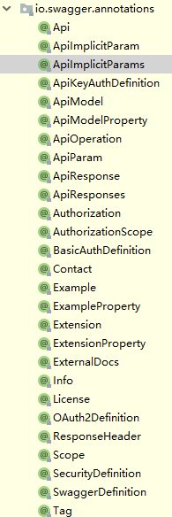
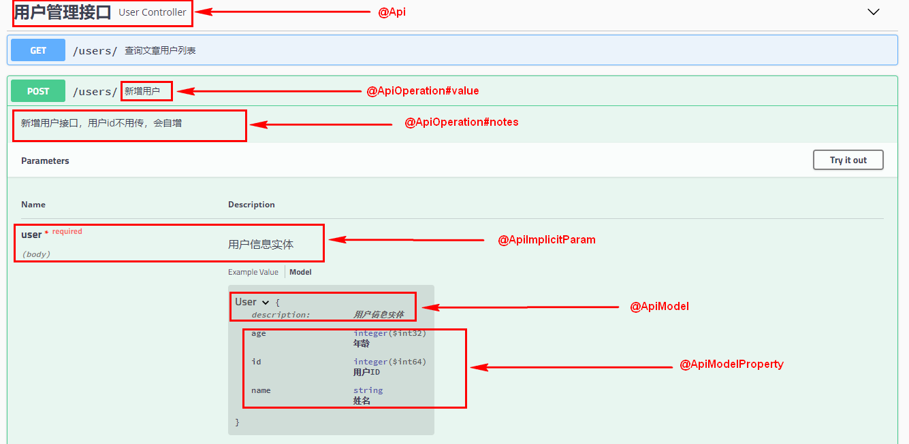
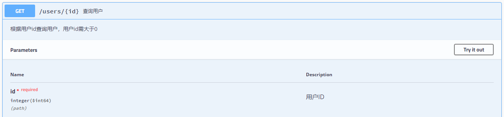
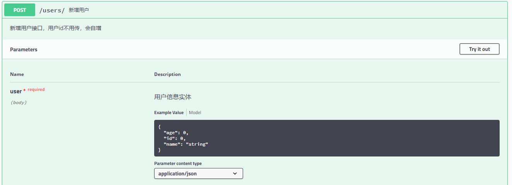
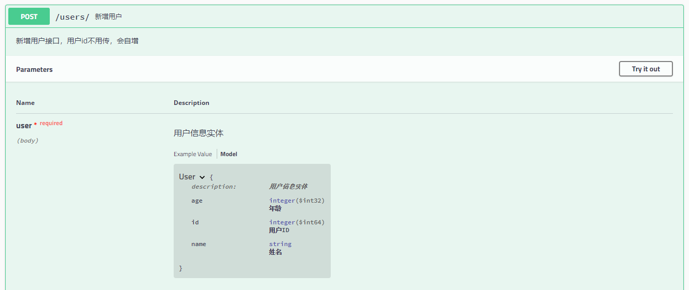

[TOC]


# 前言


# 一、SpringBoot 整合Swagger2

## 1.创建子模块

这里我们创建一个子模块，创建步骤同 [SpringBoot_01_入门示例](./SpringBoot_01_入门示例.md)

```properties
group = 'com.ray.study'
artifact ='spring-boot-04-swagger2'
```


## 2.引入依赖

### 2.1 继承父工程依赖

在父工程`spring-boot-seeds` 的 `settings.gradle`加入子工程

```properties
rootProject.name = 'spring-boot-seeds'
include 'spring-boot-01-helloworld'
include 'spring-boot-02-restful-test'
include 'spring-boot-03-thymeleaf'
include 'spring-boot-04-swagger2'
```


这样，子工程`spring-boot-04-swagger2`就会自动继承父工程中`subprojects` `函数里声明的依赖，主要包含如下依赖：

```groovy
		implementation 'org.springframework.boot:spring-boot-starter-web'
        testImplementation 'org.springframework.boot:spring-boot-starter-test'

        compileOnly 'org.projectlombok:lombok'
        annotationProcessor 'org.projectlombok:lombok'
```


### 2.2 引入`swagger2`依赖

将子模块`spring-boot-04-swagger2` 的`build.gradle`修改为如下内容：

```groovy
dependencies {
    implementation 'io.springfox:springfox-swagger2:2.9.2'
    implementation 'io.springfox:springfox-swagger-ui:2.9.2'
}
```


## 3.修改配置

### 3.1 修改`application.yml`

改下应用端口和上下文名称

```yml
server:
  port: 8088
  servlet:
    context-path: /

```

### 3.2 新建`Swagger2`配置类

在`config`包下，创建配置类`SwaggerConfig`，主要作用是注册`Swagger`相关`bean`

```java
package com.ray.study.springboot04swagger2.config;

import org.springframework.context.annotation.Bean;
import org.springframework.context.annotation.Configuration;
import springfox.documentation.builders.ApiInfoBuilder;
import springfox.documentation.builders.PathSelectors;
import springfox.documentation.builders.RequestHandlerSelectors;
import springfox.documentation.service.ApiInfo;
import springfox.documentation.spi.DocumentationType;
import springfox.documentation.spring.web.plugins.Docket;
import springfox.documentation.swagger2.annotations.EnableSwagger2;

/**
 * Swagger2配置类
 *
 * @author shira 2019/05/07 17:10
 */
@Configuration     // 声明该类是一个配置类(等同于xml配置中的applicationContext.xml)，可以用来注册bean
@EnableSwagger2    // 启用Swagger2
public class Swagger2Config {
	
	@Bean
	public Docket createRestApi() {
		//设置 Swagger 扫描的包
		String basePackage = "com.ray.study.springboot04swagger2.controller";

		return new Docket(DocumentationType.SWAGGER_2)
				.apiInfo(apiInfo())
				.select()
				.apis(RequestHandlerSelectors.basePackage(basePackage))
				.paths(PathSelectors.any())
				.build();
	}


	private ApiInfo apiInfo() {
		return new ApiInfoBuilder()
				.title("SpringBoot_04_整合Swagger2构建RESTfulAPI文档")
				.description("原文地址：https://github.com/shirayner/java-knowledge-hierarchy")
				.termsOfServiceUrl("https://blog.csdn.net/qq_26981333/")
				.contact("shirayner")
				.version("v1.0")
				.build();
	}
}

```


`Swagger` 通过扫描指定包下符合指定路径匹配规则的 `RequestMapping` 来生成API接口文档

> - `.apis(RequestHandlerSelectors.basePackage(basePackage))`：设置要扫描的包
> - `.paths(PathSelectors.any())`：设置路径匹配规则


路径匹配规则可以采用正则表达式或Ant模式来设置，具体可看`PathSelectors`源码

```java
public class PathSelectors {
  private PathSelectors() {
    throw new UnsupportedOperationException();
  }

  /**
   * Any path satisfies this condition
   *
   * @return predicate that is always true
   */
  public static Predicate<String> any() {
    return Predicates.alwaysTrue();
  }

  /**
   * No path satisfies this condition
   *
   * @return predicate that is always false
   */
  public static Predicate<String> none() {
    return Predicates.alwaysFalse();
  }

  /**
   * Predicate that evaluates the supplied regular expression
   *
   * @param pathRegex - regex
   * @return predicate that matches a particular regex
   */
  public static Predicate<String> regex(final String pathRegex) {
    return new Predicate<String>() {
      @Override
      public boolean apply(String input) {
        return input.matches(pathRegex);
      }
    };
  }

  /**
   * Predicate that evaluates the supplied ant pattern
   *
   * @param antPattern - ant Pattern
   * @return predicate that matches a particular ant pattern
   */
  public static Predicate<String> ant(final String antPattern) {
    return new Predicate<String>() {
      @Override
      public boolean apply(String input) {
        AntPathMatcher matcher = new AntPathMatcher();
        return matcher.match(antPattern, input);
      }
    };
  }
}

```


## 4.业务实现

通过完成前面的步骤

> （1）引入`swagger2`依赖
>
> （2）新建`swagger2`配置类

我们现在就可以使用`swagger2`的注解来帮助我们生成API文档了，先看示例（主要拷贝[SpringBoot_02_构建RESTful API与单元测试](./SpringBoot_02_构建RESTful API与单元测试.md)中的代码），后面我们再对这些注解加以解释说明


### 4.1 model

这里用到了Swagger注解：

> - `@ApiModel`：修饰实体类，描述实体类
> - `@ApiModelProperty`：修饰实体类属性，描述属性

```java
package com.ray.study.springboot04swagger2.model;

import io.swagger.annotations.ApiModel;
import io.swagger.annotations.ApiModelProperty;
import lombok.AllArgsConstructor;
import lombok.Data;
import lombok.NoArgsConstructor;

/**
 * description
 *
 * @author shira 2019/04/28 15:01
 */
@ApiModel(description = "用户信息实体")
@Data
@NoArgsConstructor
@AllArgsConstructor
public class User {

	@ApiModelProperty("用户ID")
	private Long id;

	@ApiModelProperty("姓名")
	private String name;

	@ApiModelProperty("年龄")
	private Integer age;
}

```


### 4.2 service

这里没有用到`swagger`注解

- `UserService`

    ```java
    package com.ray.study.springboot04swagger2.service;
    
    
    import com.ray.study.springboot04swagger2.model.User;
    
    import java.util.List;
    
    /**
     * description
     *
     * @author shira 2019/04/28 15:45
     */
    public interface UserService {
    
    	/**
    	 * 获取用户列表
    	 * @return
    	 */
    	List<User> list();
    
    	/**
    	 * 根据id获取用户
    	 * @param id
    	 * @return
    	 */
    	User get(Long id);
    
    	/**
    	 * 新增用户
    	 * @param user
    	 * @return
    	 */
    	User insert(User user);
    
    	/**
    	 * 更新用户
    	 * @param user
    	 * @return
    	 */
    	User update(User user);
    
    	/**
    	 * 删除用户
    	 * @param id
    	 * @return
    	 */
    	boolean delete(Long id);
    
    }
    
    ```

    


- `UserServiceImpl`

    ```java
    package com.ray.study.springboot04swagger2.service.impl;
    
    import com.ray.study.springboot04swagger2.model.User;
    import com.ray.study.springboot04swagger2.service.UserService;
    import org.springframework.stereotype.Service;
    
    import java.util.*;
    
    /**
     * UserServiceImpl
     *
     * @author shira 2019/04/28 15:46
     */
    @Service
    public class UserServiceImpl  implements UserService {
    
    	/** 创建线程安全的Map **/
    	private static Map<Long, User> users = Collections.synchronizedMap(new HashMap<>());
    
    	@Override
    	public List<User> list() {
    		return new ArrayList<>(users.values());
    	}
    
    	@Override
    	public User get(Long id) {
    		return users.get(id);
    	}
    
    	@Override
    	public User insert(User user) {
    		users.put(user.getId(), user);
    		return user;
    	}
    
    
    
    	@Override
    	public User update(User user) {
    		User u = users.get(user.getId());
    		u.setName(user.getName());
    		u.setAge(user.getAge());
    		users.put(user.getId(), u);
    		return u;
    	}
    
    
    	@Override
    	public boolean delete(Long id) {
    		users.remove(id);
    		return true;
    	}
    
    }
    
    ```

    


### 4.3 controller

这里用到了Swagger注解：

> - `@Api `: 修饰`Controller`类，对API接口进行描述
> - `@ApiOperation`: 修饰`Controller`方法，对具体的API接口方法进行描述
> - `@ApiImplicitParam`：修饰`Controller`方法，对具体的API接口方法的方法参数进行描述


```java
package com.ray.study.springboot04swagger2.controller;

import com.ray.study.springboot04swagger2.model.User;
import com.ray.study.springboot04swagger2.service.UserService;
import io.swagger.annotations.Api;
import io.swagger.annotations.ApiImplicitParam;
import io.swagger.annotations.ApiOperation;
import org.springframework.beans.factory.annotation.Autowired;
import org.springframework.web.bind.annotation.*;

import java.util.List;

/**
 * UserController
 *
 * @author shira 2019/04/28 15:45
 */
@Api(tags = {"用户管理接口"})
@RestController
@RequestMapping(value = "/users")     // 通过这里配置使下面的映射都在/users下
public class UserController {

	@Autowired
	UserService userService;

	/**
	 * 获取用户列表：
	 * 		处理"/users/"的GET请求，用来获取用户列表
	 * 		还可以通过@RequestParam从页面中传递参数来进行查询条件或者翻页信息的传递
	 *
	 * @return
	 */
	@ApiOperation(value = "查询文章用户列表")
	@GetMapping("/")
	public List<User> list() {
		return userService.list();
	}


	/**
	 * 获取用户信息：
	 * 		处理"/users/{id}"的GET请求，用来获取url中id值的User信息
	 * 		url中的id可通过@PathVariable绑定到函数的参数中
	 * @param id id
	 * @return user
	 */
	@ApiOperation(value = "查询用户",  notes = "根据用户id查询用户，用户id需大于0")
	@ApiImplicitParam(name = "id", value = "用户ID", required = true, dataType = "Long")
	@GetMapping("/{id}")
	public User get(@PathVariable Long id) {
		return userService.get(id);
	}


	/**
	 * 创建用户：
	 *  	处理"/users/"的POST请求，用来创建User
	 * 		除了@ModelAttribute绑定参数之外，还可以通过@RequestParam从页面中传递参数
	 * @param user user
	 * @return user
	 */
	@ApiOperation(value = "新增用户", notes="新增用户接口，用户id不用传，会自增")
	@ApiImplicitParam(name = "user", value = "用户信息实体", required = true, dataType = "User", paramType = "body")
	@PostMapping("/")
	public User insert(@RequestBody User user) {
		return userService.insert(user);
	}


	/** 更新用户
	 * 		处理"/users"的PUT请求，用来更新User信息
	 * @param user user
	 * @return user
	 */
	@ApiOperation(value = "更新用户")
	@ApiImplicitParam(name = "user", value = "用户信息实体", required = true, dataType = "User", paramType = "body")
	@PutMapping("/")
	public User update(@RequestBody User user) {
		return userService.update(user);
	}

	/**
	 * 删除用户
	 * 		处理"/users/{id}"的DELETE请求，用来删除User
	 * @param id id
	 * @return success
	 */
	@ApiOperation(value = "删除用户")
	@ApiImplicitParam(name = "id", value = "用户ID", required = true, dataType = "Long")
	@RequestMapping(value = "/{id}", method = RequestMethod.DELETE)
	public String delete(@PathVariable Long id) {
		boolean result = userService.delete(id);
		return "success";
	}

}

```


## 5.最终效果

访问如下网址，会出现下图：

> http://localhost:8088/swagger-ui.html


## 6.相关异常

### 6.1 java.lang.NumberFormatException: For input string: ""

#### 6.1.1 异常信息

访问Swagger首页时，出现以下异常信息：

````verilog
java.lang.NumberFormatException: For input string: ""
	at java.lang.NumberFormatException.forInputString(NumberFormatException.java:65) ~[na:1.8.0_161]
	at java.lang.Long.parseLong(Long.java:601) ~[na:1.8.0_161]
	at java.lang.Long.valueOf(Long.java:803) ~[na:1.8.0_161]
	at io.swagger.models.parameters.AbstractSerializableParameter.getExample(AbstractSerializableParameter.java:412) ~[swagger-models-1.5.20.jar:1.5.20]
	at sun.reflect.NativeMethodAccessorImpl.invoke0(Native Method) ~[na:1.8.0_161]
	at sun.reflect.NativeMethodAccessorImpl.invoke(NativeMethodAccessorImpl.java:62) ~[na:1.8.0_161]
	at sun.reflect.DelegatingMethodAccessorImpl.invoke(DelegatingMethodAccessorImpl.java:43) ~[na:1.8.0_161]
	at java.lang.reflect.Method.invoke(Method.java:498) ~[na:1.8.0_161]
	at com.fasterxml.jackson.databind.ser.BeanPropertyWriter.serializeAsField(BeanPropertyWriter.java:688) [jackson-databind-2.9.8.jar:2.9.8]
	at com.fasterxml.jackson.databind.ser.std.BeanSerializerBase.serializeFields(BeanSerializerBase.java:719) [jackson-databind-2.9.8.jar:2.9.8]
````


参考资料：

> - [swagger2异常:java.lang.NumberFormatException:For input string:""](https://lilyssh.cn/exception/3-swagger-NumberFormatException/)
> - [Swagger2 异常 NumberFormatException:For input string:""](https://blog.csdn.net/weixin_38319645/article/details/86514177)


#### 6.1.2 异常原因

在 Swagger2 中， `@ApiModelProperties` 如果为数字类型，但添加注解后，又不指定example的值，会默认为""，swagger在后续处理的时候强行转化空字符串就会抛出异常


我们注意到异常信息中的这一行：

```
at io.swagger.models.parameters.AbstractSerializableParameter.getExample(AbstractSerializableParameter.java:412)
```

对应源码如下：

```java
  @JsonProperty("x-example")
    public Object getExample() {
        if (example == null) {
            return null;
        }
        try {
            if (BaseIntegerProperty.TYPE.equals(type)) {
                return Long.valueOf(example);
            } else if (DecimalProperty.TYPE.equals(type)) {
                return Double.valueOf(example);
            } else if (BooleanProperty.TYPE.equals(type)) {
                if ("true".equalsIgnoreCase(example) || "false".equalsIgnoreCase(defaultValue)) {
                    return Boolean.valueOf(example);
                }
            }
        } catch (NumberFormatException e) {
            LOGGER.warn(String.format("Illegal DefaultValue %s for parameter type %s", defaultValue, type), e);
        }
        return example;
    }
```

由于默认 example 为空串""，因此在转Long的时候，报数字转型异常。


#### 6.1.3 异常解决

给字段类型为数值类型（Integer/Long等）的 `@ApiModelProperties` 增加`example`属性的赋值即可，如下所示：

```java
@ApiModel(description = "用户信息实体")
@Data
@NoArgsConstructor
@AllArgsConstructor
public class User {

	@ApiModelProperty(value = "用户ID", example = "10001")
	private Long id;

	@ApiModelProperty("姓名")
	private String name;

	@ApiModelProperty(value = "年龄", example = "21")
	private Integer age;
}

```


# 二、Swagger注解说明

Swagger提供了如下注解



这里我们只对常用注解进行说明

另外若想了解注解的所有属性，可去看源码注释，也可参考：[swagger常用注解说明](https://www.cnblogs.com/hyl8218/p/8520994.html)


下面通过一张图来对每个注解负责那一块区域做一个大概的了解：




## 1. `@Api`

修饰`Controller`类，对此API接口合辑进行描述

| 属性     | 含义     | 说明                                                         |
| -------- | -------- | ------------------------------------------------------------ |
| `value`  | 值       | 若设置了`tag`，则`value`会被忽略；若没有设置`tag`，则将`value`赋值给`tag` |
| `tags`   | 标签     | 用于对`swagger`资源操作的逻辑分组                            |
| `hidden` | 是否隐藏 | 默认为false，若为ture，则将在API文档中隐藏                   |


示例：

```java
@Api(tags = {"用户管理接口"})
@RestController
@RequestMapping(value = "/users")     // 通过这里配置使下面的映射都在/users下
public class UserController {
```


## 2. `@ApiOperation`

修饰`Controller`方法（准确地说是RequestMapping方法），对API接口方法进行描述

| 属性     | 含义     | 说明                                          |
| -------- | -------- | --------------------------------------------- |
| `value`  | 值       | 对操作进行一个简短的描述，最长不超过120个字符 |
| `notes`  | 注释     | 用于对`swagger`资源操作的逻辑分组             |
| `hidden` | 是否隐藏 | 默认为false，若为ture，则将在API文档中隐藏    |


示例：

```java
	@ApiOperation(value = "查询用户",  notes = "根据用户id查询用户，用户id需大于0")
	@ApiImplicitParam(name = "id", value = "用户ID", required = true, dataType = "Long")
	@GetMapping("/{id}")
	public User get(@PathVariable Long id) {
		return userService.get(id);
	}
```





## 3.`@ApiImplicitParams`/`@ApiImplicitParam`

修饰`Controller`方法，对API接口方法的方法参数进行描述

`ApiImplicitParam`的属性如下：

| 属性           | 含义         | 说明                                                         |
| -------------- | ------------ | ------------------------------------------------------------ |
| `name`         | 参数名称     | 通常与方法的参数名称保持一致                                 |
| `value`        | 值           | 对方法参数的简短描述                                         |
| `defaultValue` | 默认值       | 描述方法参数的默认值                                         |
| `required`     | 是否必需     | 默认为false，非必需                                          |
| `dataType`     | 数据类型     | 方法参数的数据类型，默认为String，可设置为其他基本类型或类名 |
| `paramType`    | 参数来源类型 | 有效值为：path、query、body、header、form                    |
| `readOnly`     | 是否只读     | 默认为false，若为true，则在API文档中无法编辑此属性的值       |


示例：

```java
@ApiOperation(value = "新增用户")
@ApiImplicitParam(name = "user", value = "用户信息实体", required = true, dataType = "User", paramType = "body")
@PostMapping("/")
public User insert(@RequestBody User user) {
   return userService.insert(user);
}
```





## 4.`@ApiResponses`/`@ApiResponse`

修饰`Controller`类或者`Controller`方法，对响应结果进行描述，一般用于表达一个错误的响应信息

| 属性名称 | 说明                      |
| -------- | ------------------------- |
| code     | http的状态码              |
| message  | 状态的描述信息            |
| response | 状态相应，默认响应类 Void |


[示例](https://github.com/swagger-api/swagger-core/wiki/annotations#apiresponses-apiresponse)：

```java
  @ApiResponses({
  	 @ApiResponse(code = 400, message = "Invalid ID supplied"),
     @ApiResponse(code = 404, message = "Pet not found")
  })
  public Response getPetById(...) {...}
```


## 5.`@ApiIgnore`

修饰`Controller`类、方法或者方法参数，用于在文档中忽略这个API

| 属性名称 | 说明                                  |
| -------- | ------------------------------------- |
| value    | 默认为空串，简要描述为什么要忽略此API |


示例：

```java
@ApiIgnore
public boolean delete(@PathVariable("id") int id)
```


## 6.`@ApiModel`

修饰 `model`，用于描述Swagger模型


| 属性名称    | 说明                                         |
| ----------- | -------------------------------------------- |
| value       | 默认为`model`类名，用于指定Swagger模型的名称 |
| description | 对`model`进行描述                            |
| parent      | 指定父类，可以继承父类的描述                 |


示例：

```java
@ApiModel(description = "用户信息实体")
@Data
@NoArgsConstructor
@AllArgsConstructor
public class User {

	@ApiModelProperty(value = "用户ID", example = "10001")
	private Long id;

	@ApiModelProperty("姓名")
	private String name;

	@ApiModelProperty(value = "年龄", example = "21")
	private Integer age;
}

```





## 7.`@ApiModelProperty`

修饰`model`属性，用于描述Swagger模型的属性

| 属性名称 | 说明                                                         |
| -------- | ------------------------------------------------------------ |
| value    | 对参数的简要描述                                             |
| name     | 参数名，用于覆盖默认的参数名（即model属性名），不常用        |
| dataType | 参数的数据类型，用于覆盖默认的参数类型（即model属性数据类型），不常用 |
| example  | 参数值的示例                                                 |
| required | 是否必需                                                     |
| hidden   | 是否隐藏                                                     |


注意：

> - 在 Swagger2 中， `@ApiModelProperties` 如果为数值类型，但添加注解后，又不指定example的值，会默认为""，swagger在后续处理的时候强行转化空字符串就会抛出异常，见 **第一部分第6小节[相关异常]**
> - 因此，对数据类型为数值类型的属性，添加`@ApiModelProperties`注解时，要对 `example`属性进行赋值


示例：

```java
@ApiModel(description = "用户信息实体")
@Data
@NoArgsConstructor
@AllArgsConstructor
public class User {

	@ApiModelProperty(value = "用户ID", example = "10001")
	private Long id;

	@ApiModelProperty("姓名")
	private String name;

	@ApiModelProperty(value = "年龄", example = "21")
	private Integer age;
}

```


# 参考资料

## 1. SpringBoot 整合 Swagger2 

1. [翟永超__Spring Boot中使用Swagger2构建强大的RESTful API文档](http://blog.didispace.com/springbootswagger2/)
2. [Spring Boot2整合Swagger2.9.2](https://tycoding.cn/2019/02/27/spring-boot-swagger/)


## 2. Swagger2 用法

1. [Springfox Reference Documentation](https://springfox.github.io/springfox/docs/current/#springfox-configuration-and-demo-applications)
2. [Swagger-Core Annotations](https://github.com/swagger-api/swagger-core/wiki/annotations)
3. [swagger注解API](http://docs.swagger.io/swagger-core/current/apidocs/index.html?io/swagger/annotations)
4. [Spring Boot中使用Swagger2构建API文档 #1](https://github.com/Yuicon/blog/issues/1)
5. [SpringBoot集成Swagger2，以及Swagger2常用API](https://blog.csdn.net/fly910905/article/details/79006747)
6. [在 Spring Boot 项目中使用 Swagger 文档](https://www.ibm.com/developerworks/cn/java/j-using-swagger-in-a-spring-boot-project/index.html)
7. [Swagger2常用注解及其说明](https://blog.csdn.net/ZZY1078689276/article/details/80315031)
8. [swagger注释API详细说明](https://blog.csdn.net/xupeng874395012/article/details/68946676)
9. [swagger注解总结](http://www.leeyom.top/2017/09/25/tech-swagger-annotation/)
10. [swagger2常用注解说明](https://blog.csdn.net/u014231523/article/details/76522486)
11. [swagger2注解使用教程](https://www.jianshu.com/p/f30e0c646c63)