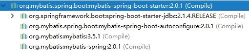
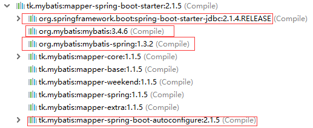

[TOC]


# 前言


# 一、SpringBoot 集成通用Mapper与分页插件

## 1.创建子模块

这里我们创建一个子模块，创建步骤同 [SpringBoot_01_入门示例](./SpringBoot_01_入门示例.md)

```properties
group = 'com.ray.study'
artifact ='spring-boot-05-tk-mybatis'
```


## 2.引入依赖

### 2.1 继承父工程依赖

在父工程`spring-boot-seeds` 的 `settings.gradle`加入子工程

```properties
rootProject.name = 'spring-boot-seeds'
include 'spring-boot-01-helloworld'
include 'spring-boot-02-restful-test'
include 'spring-boot-03-thymeleaf'
include 'spring-boot-04-swagger2'
include 'spring-boot-05-jpa'
include 'spring-boot-05-mybatis'
include 'spring-boot-05-tk-mybatis'
```


这样，子工程`spring-boot-05-tk-mybatis`就会自动继承父工程中`subprojects` `函数里声明的依赖，主要包含如下依赖：

```groovy
		implementation 'org.springframework.boot:spring-boot-starter-web'
        testImplementation 'org.springframework.boot:spring-boot-starter-test'

        compileOnly 'org.projectlombok:lombok'
        annotationProcessor 'org.projectlombok:lombok'
```


### 2.2 引入`Mybatis`依赖

将子模块`spring-boot-05-Mybatis` 的`build.gradle`修改为如下内容：

```groovy
dependencies {    
    // mysql 驱动
    implementation 'mysql:mysql-connector-java'
    
    // 通用 mapper
    implementation 'tk.mybatis:mapper-spring-boot-starter:2.1.5'
    
    // mybatis 分页插件
    implementation  'com.github.pagehelper:pagehelper-spring-boot-starter:1.2.10'

}
```


**以下为补充内容**，主要是一开始我也很困惑：

看到网上很多博客都是既依赖了`tk.mybatis:mapper-spring-boot-starter`又依赖了`mybatis-spring-boot-starter`，其实这是没必要的：

（1）我们先来看下`mybatis-spring-boot-starter`中依赖了哪些jar包



（2）再看`tk.mybatis:mapper-spring-boot-starter`中依赖了哪些jar包



我们发现`tk.mybatis:mapper-spring-boot-starter`中已经有了`mybatis-spring-boot-starter`所依赖的jar包了，除了一个自动化配置的jar包，但这些自动化配置应该包括在通用mapper的自动化配置jar包中，因此没必要依赖`mybatis-spring-boot-starter`


## 3.数据库准备

> 若已经在上一节 [SpringBoot_05_数据访问_02_整合Mybatis(上)](./SpringBoot_05_数据访问_02_整合Mybatis(上).md)中创建了数据库`integrate-mybatis`，则忽略这一步

创建数据库`integrate-mybatis`，然后创建`user`表，建表语句如下：

```sql
DROP TABLE IF EXISTS `user`;
CREATE TABLE `user`  (
    `id` bigint(12) NOT NULL AUTO_INCREMENT COMMENT '主键自增',
    `name` varchar(50) NOT NULL COMMENT '用户名',
    `age` int (3) unsigned DEFAULT 3 COMMENT '年龄',
    `creation_date` datetime(0) NOT NULL DEFAULT CURRENT_TIMESTAMP  COMMENT '创建日期',
    `last_update_date` datetime(0) NOT NULL DEFAULT CURRENT_TIMESTAMP  COMMENT '上次更新日期',
    PRIMARY KEY (`id`)
) ENGINE=InnoDB DEFAULT CHARSET=utf8 COMMENT='用户表';
```


## 4.修改`application.yml`

主要配置了：

> - 应用端口与上下文路径
> - 数据源
> - Mybatis自身配置
> - 通用Mapper配置
> - 分页插件


```yml
server:
  port: 8088
  servlet:
    context-path: /

spring:
  datasource:       # 配置数据源
    driver-class-name: com.mysql.cj.jdbc.Driver
    url: jdbc:mysql://localhost:3306/integrate-mybatis?useUnicode=true&characterEncoding=utf8&serverTimezone=GMT%2B8
    username: root
    password: root

########## Mybatis 自身配置 ##########
mybatis:
  type-aliases-package: com.ray.study.springboot05tkmybatis.entity
  mapper-locations: classpath:mapper/*.xml
  configuration:
    map-underscore-to-camel-case: true  # 驼峰命名规范 如：数据库字段是  order_id 那么 实体字段就要写成 orderId


########## 通用Mapper ##########
mapper:
  identity: MYSQL
  mappers: tk.mybatis.mapper.common.BaseMapper
  not-empty: true
  enum-as-simple-type: true

########## 分页插件 ##########
pagehelper:
  helper-dialect: mysql
  params: count=countSql
  reasonable: false
  support-methods-arguments: true


```

（1）配置属性的来源

Mybatis以及通用Mapper的可选配置项可见`tk.mybatis：mapper-spring-boot-autoconfigure`工程下的`spring-configuration-metadata.json`文件，在这个json文件中，我们可以看到有哪些可选配置项，配置项的描述，以及配置项是对应那个Java类的哪个属性

通用Mapper的配置主要集中在`tk.mybatis.mapper.entity.Config`类中，注释很详细。


（2）部分配置的说明

以下对上述配置中出现的部分配置给出说明

```properties
mapper.identity=MYSQL   # 主键自增回写方法,默认值MYSQL,详细说明请看文档
mapper.mappers=tk.mybatis.mapper.common.BaseMapper  # 通用Mapper接口,其他Mapper接口需要继承此接口
mapper.not-empty=true   # 设置 insert 和 update 中，是否判断字符串类型!=''
mapper.enum-as-simple-type=true # 枚举按简单类型处理
```


## 5.业务实现

### 5.1 entity

```java
package com.ray.study.springboot05tkmybatis.entity;

import lombok.AllArgsConstructor;
import lombok.Data;
import lombok.NoArgsConstructor;

import javax.persistence.GeneratedValue;
import javax.persistence.GenerationType;
import javax.persistence.Id;
import javax.persistence.Table;
import java.io.Serializable;
import java.util.Date;

/**
 * description
 *
 * @author shira 2019/05/09 21:26
 */
@Data
@AllArgsConstructor
@NoArgsConstructor
@Table(name = "user")
public class User implements Serializable {

	private static final long serialVersionUID = 8655851615465363473L;

	@Id
	@GeneratedValue(strategy = GenerationType.IDENTITY)
	private Long id;

	private String name;

	private Integer age;

	private Date creationDate;

	private Date lastUpdateDate;

}

```


### 5.1 mapper

（1）UserMapper接口

```java
package com.ray.study.springboot05tkmybatis.mapper;

import com.ray.study.springboot05tkmybatis.entity.User;
import org.apache.ibatis.annotations.Mapper;
import tk.mybatis.mapper.common.BaseMapper;

/**
 * description
 *
 * @author shira 2019/05/09 21:27
 */
@Mapper
public interface UserMapper extends BaseMapper<User> {

	/**
	 * 根据用户名查询用户
	 * @param name 用户名
	 * @return  user
	 */
	User findByName(String name);


}
```


（2）UserMapper.xml

```xml
<?xml version="1.0" encoding="UTF-8" ?>
<!DOCTYPE mapper PUBLIC "-//mybatis.org//DTD Mapper 3.0//EN" "http://mybatis.org/dtd/mybatis-3-mapper.dtd" >
<mapper namespace="com.ray.study.springboot05tkmybatis.mapper.UserMapper">

    <select id="findByName" resultType="com.ray.study.springboot05tkmybatis.entity.User">
         select
            u.id,
            u.name,
            u.age
        from user u
        where u.name =#{name}
  </select>
</mapper>
```


## 6.单元测试

- UserMapperTest

```java
package com.ray.study.springboot05tkmybatis.mapper;

import com.github.pagehelper.PageHelper;
import com.github.pagehelper.PageInfo;
import com.ray.study.springboot05tkmybatis.entity.User;
import org.junit.Test;
import org.junit.runner.RunWith;
import org.springframework.beans.factory.annotation.Autowired;
import org.springframework.boot.test.context.SpringBootTest;
import org.springframework.test.annotation.Rollback;
import org.springframework.test.context.junit4.SpringRunner;
import org.springframework.transaction.annotation.Transactional;

import java.util.List;

import static org.hamcrest.CoreMatchers.is;
import static org.hamcrest.CoreMatchers.notNullValue;
import static org.hamcrest.MatcherAssert.assertThat;
import static org.hamcrest.number.OrderingComparison.lessThanOrEqualTo;

/**
 * description
 *
 * @author shira 2019/05/10 14:40
 */
@RunWith(SpringRunner.class)
@SpringBootTest
@Transactional
@Rollback
public class UserMapperTest {

	@Autowired
	private UserMapper userMapper;

	@Test
	public void testUserMapper() {
		//1. 测试插入，主键回写
		for(int i = 0; i < 30; i++) {
			User user = new User();
			user.setName("tom"+i);
			user.setAge(20+i);

			userMapper.insertSelective(user);
			assertThat(user.getId(), is(notNullValue()));
		}

		//2. 测试手写sql
		User  user0 =userMapper.findByName("tom0");
		assertThat(user0, is(notNullValue()));


		// 3.分页+排序
		int pageSize =10;
		// 3.1 lambda 写法
		final PageInfo<User> pageInfo = PageHelper
				.startPage(1, pageSize)
				.setOrderBy("id desc")
				.doSelectPageInfo(() -> this.userMapper.selectAll());
		assertThat(pageInfo.getSize(), lessThanOrEqualTo(pageSize));

		// 3.2 普通写法
		PageHelper.startPage(1, pageSize).setOrderBy("id desc");
		List<User> userList = userMapper.selectAll();
		final PageInfo<User> userPageInfo = new PageInfo<>(userList);
		assertThat(userPageInfo.getSize(), lessThanOrEqualTo(pageSize));

	}
}
```


# 二、通用Mapper相关知识

未完待续，暂时请参见

> - [abel533/Mapper/wiki__MyBatis 通用 Mapper4](https://github.com/abel533/Mapper/wiki)


# 参考资料

1. [abel533__Spring Boot 集成 MyBatis, 分页插件 PageHelper, 通用 Mapper](https://github.com/abel533/MyBatis-Spring-Boot)
2. [唐亚峰__一起来学SpringBoot | 第八篇：通用Mapper与分页插件的集成](https://blog.battcn.com/2018/05/10/springboot/v2-orm-mybatis-plugin/)