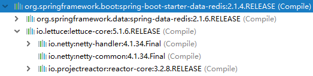

[TOC]


# 前言

## 1.Redis简介

- Redis是一个开源的使用ANSI C语言编写、支持网络、可基于内存亦可持久化的日志型、Key-Value数据库，并提供多种语言的API。

- 相比`Memcached`它支持存储的类型相对更多**（字符、哈希、集合、有序集合、列表、GEO）**，**同时Redis是线程安全的**。

- 除此之外，Redis 还提供一些类数据库的特性，比如事务，HA，主从库。可以说 Redis 兼具了缓存系统和数据库的一些特性，因此有着丰富的应用场景。


> - [Redis官网](http://redis.io/)
> - [Redis中文社区](http://www.redis.cn/)


## 2.Lettuce简介

`Lettuce` 和 `Jedis` 的都是连接`Redis Server`的客户端程序，Spring Boot 1.x  默认使用的是 Jedis 客户端，2.x 替换成 Lettuce ：

> - `Jedis`在**实现上是直连redis server，多线程环境下非线程安全，除非使用连接池，为每个Jedis实例增加物理连接**。
> - `Lettuce`基于Netty的连接实例（StatefulRedisConnection），**可以在多个线程间并发访问，且线程安全，满足多线程环境下的并发访问，同时它是可伸缩的设计，一个连接实例不够的情况也可以按需增加连接实例**。


来自 [Lettuce官网](https://lettuce.io/) 的一段描述：

> Lettuce is a scalable [Redis](https://redis.io/) client for building non-blocking Reactive applications
>
> （Lettuce 是构建非阻塞响应式应用的一个可伸缩的Redis客户端）


# 一、SpringBoot 整合 Redis

## 1.创建子模块

这里我们创建一个子模块，创建步骤同 [SpringBoot_01_入门示例](./SpringBoot_01_入门示例.md)

```properties
group = 'com.ray.study'
artifact ='spring-boot-06-nosql-redis'
```


## 2.引入依赖

### 2.1 继承父工程依赖

在父工程`spring-boot-seeds` 的 `settings.gradle`加入子工程

```properties
rootProject.name = 'spring-boot-seeds'
include 'spring-boot-01-helloworld'
include 'spring-boot-02-restful-test'
include 'spring-boot-03-thymeleaf'
include 'spring-boot-04-swagger2'
include 'spring-boot-05-jpa'
include 'spring-boot-05-mybatis'
include 'spring-boot-06-nosql-redis'
```


这样，子工程`spring-boot-05-redis`就会自动继承父工程中`subprojects` `函数里声明的依赖，主要包含如下依赖：

```groovy
		implementation 'org.springframework.boot:spring-boot-starter-web'
        testImplementation 'org.springframework.boot:spring-boot-starter-test'

        compileOnly 'org.projectlombok:lombok'
        annotationProcessor 'org.projectlombok:lombok'
```


### 2.2 引入`Redis`依赖

将子模块`spring-boot-05-redis` 的`build.gradle`修改为如下内容：

```groovy
dependencies {
    // redis 依赖
    implementation 'org.springframework.boot:spring-boot-starter-data-redis'
    
    // common pool2
    implementation 'org.apache.commons:commons-pool2'
}

```


可以看到`spring-boot-starter-data-redis`中依赖了`lettuce`




## 4.修改配置

### 4.1 修改`application.yml`

这一步如果没有必要，可以省略，因为SpringBoot提供了默认的配置，默认配置如下所示：

```properties
spring.redis.host=localhost
spring.redis.port=6379 
spring.redis.password=空
# Redis默认情况下有16个分片，这里配置具体使用的分片，默认是0
spring.redis.database=0
# 连接池最大连接数（使用负值表示没有限制） 默认 8
spring.redis.lettuce.pool.max-active=8
# 连接池最大阻塞等待时间（使用负值表示没有限制） 默认 -1
spring.redis.lettuce.pool.max-wait=-1
# 连接池中的最大空闲连接 默认 8
spring.redis.lettuce.pool.max-idle=8
# 连接池中的最小空闲连接 默认 0
spring.redis.lettuce.pool.min-idle=0
```


更多的可配置选项，请查看`mybatis-spring-boot-autoconfigure`工程下的`spring-configuration-metadata.json`文件，在这个json文件中，我们可以看到有哪些可选配置项，配置项的描述，以及配置项是对应那个Java类的哪个属性


### 4.2 注册Bean

这里我们注册了一个自定义RedisTemplate，可以方便我们存储实体类

```java
package com.ray.study.springboot06nosqlredis.config;

import org.springframework.boot.autoconfigure.AutoConfigureAfter;
import org.springframework.boot.autoconfigure.data.redis.RedisAutoConfiguration;
import org.springframework.context.annotation.Bean;
import org.springframework.context.annotation.Configuration;
import org.springframework.data.redis.connection.lettuce.LettuceConnectionFactory;
import org.springframework.data.redis.core.RedisTemplate;
import org.springframework.data.redis.serializer.GenericJackson2JsonRedisSerializer;
import org.springframework.data.redis.serializer.StringRedisSerializer;

import java.io.Serializable;

/**
 * description
 *
 * @author shira 2019/05/10 22:05
 */
@Configuration
@AutoConfigureAfter(RedisAutoConfiguration.class)
public class RedisCacheAutoConfiguration {

	@Bean
	public RedisTemplate<String, Serializable> redisCacheTemplate(LettuceConnectionFactory redisConnectionFactory) {
		RedisTemplate<String, Serializable> template = new RedisTemplate<>();
		template.setKeySerializer(new StringRedisSerializer());
		template.setValueSerializer(new GenericJackson2JsonRedisSerializer());
		template.setConnectionFactory(redisConnectionFactory);
		return template;
	}

}

```


默认的RedisTemplate配置如下：

```java
/*
 * Copyright 2012-2018 the original author or authors.
 *
 * Licensed under the Apache License, Version 2.0 (the "License");
 * you may not use this file except in compliance with the License.
 * You may obtain a copy of the License at
 *
 *      https://www.apache.org/licenses/LICENSE-2.0
 *
 * Unless required by applicable law or agreed to in writing, software
 * distributed under the License is distributed on an "AS IS" BASIS,
 * WITHOUT WARRANTIES OR CONDITIONS OF ANY KIND, either express or implied.
 * See the License for the specific language governing permissions and
 * limitations under the License.
 */

package org.springframework.boot.autoconfigure.data.redis;

import java.net.UnknownHostException;

import org.springframework.boot.autoconfigure.EnableAutoConfiguration;
import org.springframework.boot.autoconfigure.condition.ConditionalOnClass;
import org.springframework.boot.autoconfigure.condition.ConditionalOnMissingBean;
import org.springframework.boot.context.properties.EnableConfigurationProperties;
import org.springframework.context.annotation.Bean;
import org.springframework.context.annotation.Configuration;
import org.springframework.context.annotation.Import;
import org.springframework.data.redis.connection.RedisConnectionFactory;
import org.springframework.data.redis.core.RedisOperations;
import org.springframework.data.redis.core.RedisTemplate;
import org.springframework.data.redis.core.StringRedisTemplate;

/**
 * {@link EnableAutoConfiguration Auto-configuration} for Spring Data's Redis support.
 *
 * @author Dave Syer
 * @author Andy Wilkinson
 * @author Christian Dupuis
 * @author Christoph Strobl
 * @author Phillip Webb
 * @author Eddú Meléndez
 * @author Stephane Nicoll
 * @author Marco Aust
 * @author Mark Paluch
 */
@Configuration
@ConditionalOnClass(RedisOperations.class)
@EnableConfigurationProperties(RedisProperties.class)
@Import({ LettuceConnectionConfiguration.class, JedisConnectionConfiguration.class })
public class RedisAutoConfiguration {

	@Bean
	@ConditionalOnMissingBean(name = "redisTemplate")
	public RedisTemplate<Object, Object> redisTemplate(
			RedisConnectionFactory redisConnectionFactory) throws UnknownHostException {
		RedisTemplate<Object, Object> template = new RedisTemplate<>();
		template.setConnectionFactory(redisConnectionFactory);
		return template;
	}

	@Bean
	@ConditionalOnMissingBean
	public StringRedisTemplate stringRedisTemplate(
			RedisConnectionFactory redisConnectionFactory) throws UnknownHostException {
		StringRedisTemplate template = new StringRedisTemplate();
		template.setConnectionFactory(redisConnectionFactory);
		return template;
	}

}

```

可看到默认配置了两个RedisTemplate：

> - `redisTemplate`：存储类型为 RedisTemplate<Object, Object>
> - `stringRedisTemplate`：存储类型为 RedisTemplate<String, String>


## 5.entity


```java
package com.ray.study.springboot06nosqlredis.entity;

import lombok.AllArgsConstructor;
import lombok.Data;
import lombok.NoArgsConstructor;

import java.io.Serializable;

/**
 * description
 *
 * @author shira 2019/05/09 21:26
 */
@Data
@AllArgsConstructor
@NoArgsConstructor
public class User implements Serializable {

	private static final long serialVersionUID = 8655851615465363473L;

	private Long id;

	private String name;

	private Integer age;

}

```


## 6.单元测试

```java
package com.ray.study.springboot06nosqlredis;

import com.ray.study.springboot06nosqlredis.entity.User;
import org.junit.Test;
import org.junit.runner.RunWith;
import org.slf4j.Logger;
import org.slf4j.LoggerFactory;
import org.springframework.beans.factory.annotation.Autowired;
import org.springframework.boot.test.context.SpringBootTest;
import org.springframework.data.redis.core.RedisTemplate;
import org.springframework.data.redis.core.StringRedisTemplate;
import org.springframework.test.context.junit4.SpringRunner;

import java.io.Serializable;
import java.util.concurrent.ExecutorService;
import java.util.concurrent.Executors;
import java.util.stream.IntStream;

import static org.hamcrest.CoreMatchers.equalTo;
import static org.hamcrest.CoreMatchers.is;
import static org.hamcrest.MatcherAssert.assertThat;

/**
 * description
 *
 * @author shira 2019/05/10 22:13
 */
@RunWith(SpringRunner.class)
@SpringBootTest
public class RedisTemplateTest {
	private static final Logger log = LoggerFactory.getLogger(RedisTemplateTest.class);

	@Autowired
	private StringRedisTemplate stringRedisTemplate;

	@Autowired
	private RedisTemplate<String, Serializable> redisCacheTemplate;


	@Test
	public void get() throws InterruptedException {

		// 1.测试线程安全
		ExecutorService executorService = Executors.newFixedThreadPool(1000);
		IntStream.range(0, 1000).forEach( i ->
				// increment("k", 1): 将redis中 k 的值，自增1
				executorService.execute(() -> stringRedisTemplate.opsForValue().increment("k", 1))
		);

		Thread.sleep(6000);
		// public class StringRedisTemplate extends RedisTemplate<String, String> ,值是以String类型存放，因此与"1000"对比
		assertThat(stringRedisTemplate.opsForValue().get("k"), is("1000"));


		// 2.测试字符串存取
		stringRedisTemplate.opsForValue().set("name", "tom");
		assertThat(stringRedisTemplate.opsForValue().get("name"), is("tom"));


		// 3.测试对象存取
		String key = "battcn:user:1";
		User user = new User(1L, "u1", 20);
		redisCacheTemplate.opsForValue().set(key, user);
		assertThat((User) redisCacheTemplate.opsForValue().get(key), equalTo(user));

	}
}

```


# 二、Redis相关知识

参见Redis分类

> - [Redis官网](https://redis.io/)
> 2. [Redis官网中文版](http://www.redis.cn/)
> 3. [Redis中文网](http://www.redis.net.cn/)


# 参考资料

1. [纯洁的微笑__Spring Boot(三)：Spring Boot 中 Redis 的使用](http://www.ityouknow.com/springboot/2016/03/06/spring-boot-redis.html)
2. [唐亚峰__一起来学SpringBoot | 第九篇：整合Lettuce Redis](https://blog.battcn.com/2018/05/11/springboot/v2-nosql-redis/)
3. [程序猿DD__Spring Boot中使用Redis数据库](http://blog.didispace.com/springbootredis/)
4. 

