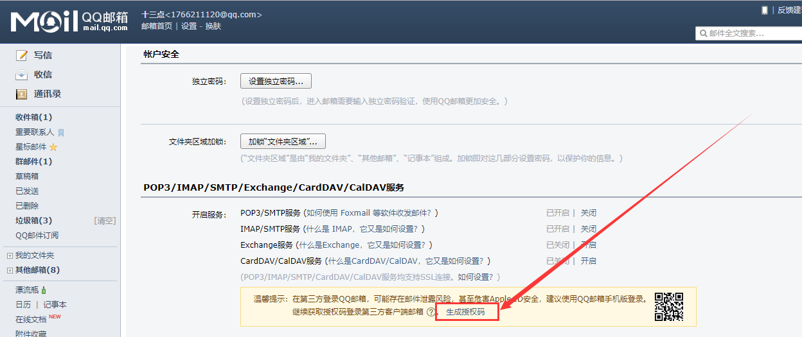
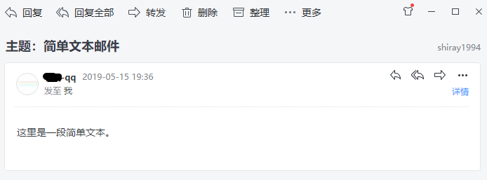
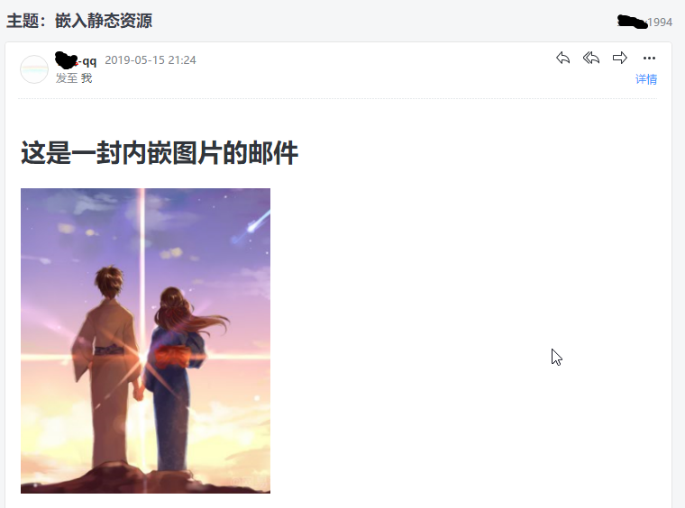
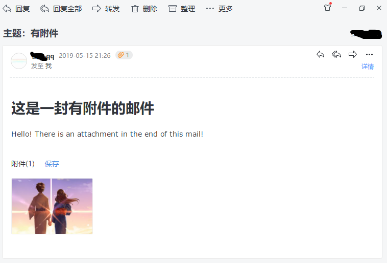
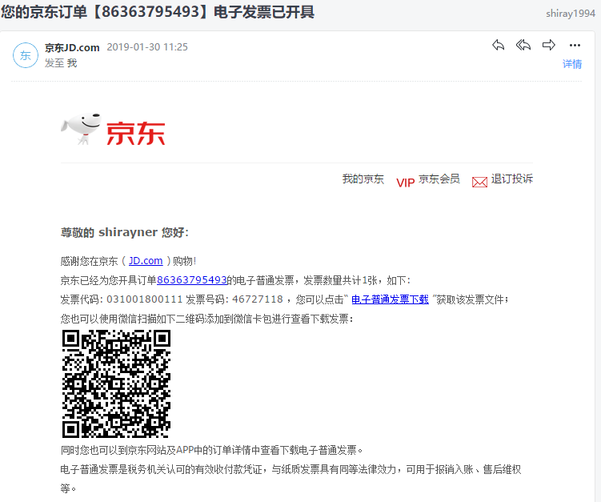
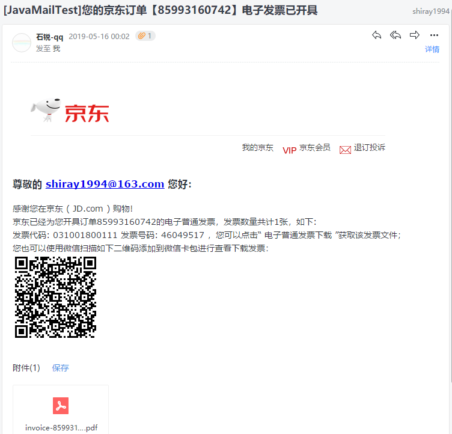

[TOC]


# 前言


# 一、使用SpringBoot 发送邮件

## 1.创建子模块

这里我们创建一个子模块，创建步骤同 [SpringBoot_01_入门示例](./SpringBoot_01_入门示例.md)

```properties
group = 'com.ray.study'
artifact ='spring-boot-09-other-sendmail'
```


## 2.引入依赖

### 2.1 继承父工程依赖

在父工程`spring-boot-seeds` 的 `settings.gradle`加入子工程

```properties
rootProject.name = 'spring-boot-seeds'
include 'spring-boot-01-helloworld'
include 'spring-boot-02-restful-test'
include 'spring-boot-03-thymeleaf'
include 'spring-boot-04-swagger2'
include 'spring-boot-05-jpa'
include 'spring-boot-05-mybatis'
include 'spring-boot-05-tk-mybatis'
include 'spring-boot-06-nosql-redis'
include 'spring-boot-06-nosql-mongodb'
include 'spring-boot-07-cache-concurrentmap'
include 'spring-boot-07-cache-ehcache'
include 'spring-boot-07-cache-caffeine'
include 'spring-boot-07-cache-redis'
include 'spring-boot-08-messaging-rabbitmq'
include 'spring-boot-09-other-sendmail'
```


这样，子工程`spring-boot-09-other-sendmail`就会自动继承父工程中`subprojects` `函数里声明的依赖，主要包含如下依赖：

```groovy
		implementation 'org.springframework.boot:spring-boot-starter-web'
        testImplementation 'org.springframework.boot:spring-boot-starter-test'

        compileOnly 'org.projectlombok:lombok'
        annotationProcessor 'org.projectlombok:lombok'
```


### 2.2 引入`Mail`依赖

将子模块`spring-boot-09-other-sendmail` 的`build.gradle`修改为如下内容：

```groovy
dependencies {
    implementation 'org.springframework.boot:spring-boot-starter-mail'
}

```


## 3.拿到邮箱授权码

这里以qq邮箱为例：登录qq邮箱 -> 设置 -> 账户 -> **POP3/IMAP/SMTP/Exchange/CardDAV/CalDAV服务** -> 点击生成授权码




然后就可以拿到邮箱授权码


## 4.修改`application.yml`

需要配置邮箱：SMTP邮件服务器地址、用户的邮箱地址、用户的邮箱授权码（也就是3中拿到的邮箱授权码）

```yml
spring:
  mail:
    host:  SMTP server host
    username: 用户的邮箱地址
    password: 用户的邮箱授权码

```

这里，我们以qq邮箱为例，给出一个示例配置（数据是错误的，大家需要改成自己的），其他邮箱也是一样的：

```properties
spring:
  mail:
    host: smtp.qq.com
    username: 1766211231@qq.com
    password: jfufgbyurcklfaff
```

> - smtp：邮件发送协议
> - pop3：邮件接收协议


如果是网易邮箱：

```properties
spring:
  mail:
    host: smtp.163.com
    username: 1766211231@163.com
    password: jfufgbyurcklfaff
```


## 5.业务实现

这里我们实现一个邮件发送的service

（1）MailService

```java
package com.ray.study.springboot09othersendmail.service;

import java.util.Map;

/**
 * description
 *
 * @author shira 2019/05/15 16:56
 */
public interface MailService {

	/**
	 * 1.发送包含简单文本的邮件
	 * @param to 收件人
	 * @param subject 主题
	 * @param text 内容
	 */
	void sendSimpleMail(String to, String subject, String text);

	/**
	 * 发送复杂邮件: html / 内嵌静态资源 / 带附件
	 * @param to 收件人
	 * @param subject 主题
	 * @param text 内容
	 * @param inlineMap  内嵌静态资源map    key:contentId     value:filePathName
	 * @param attachmentMap 邮件末尾附件map
	 */
	void sendMimeMail(String to, String subject, String text, Map<String,String> inlineMap,  Map<String,String> attachmentMap);


	/**
	 * 2.在邮件正文中嵌入静态资源
	 * @param to 收件人
	 * @param subject 主题
	 * @param text 内容
	 * @param  inlineMap  内嵌静态资源map    key:contentId     value:filePathName
	 */
	void sendInlineMail(String to, String subject, String text, Map<String,String> inlineMap ) ;


	/**
	 * 3.发送包含附件的邮件
	 * @param to 收件人
	 * @param subject 主题
	 * @param text 内容
	 * @param attachmentMap 邮件末尾附件map
	 */
	void sendAttachmentMail(String to, String subject, String text, Map<String,String> attachmentMap);

}

```


（2）MailServiceImpl

```
package com.ray.study.springboot09othersendmail.service.impl;

import com.ray.study.springboot09othersendmail.service.MailService;
import lombok.extern.slf4j.Slf4j;
import org.springframework.beans.factory.annotation.Autowired;
import org.springframework.beans.factory.annotation.Value;
import org.springframework.core.io.FileSystemResource;
import org.springframework.mail.SimpleMailMessage;
import org.springframework.mail.javamail.JavaMailSender;
import org.springframework.mail.javamail.MimeMessageHelper;
import org.springframework.stereotype.Service;

import javax.mail.MessagingException;
import javax.mail.internet.MimeMessage;
import java.io.File;
import java.util.Collections;
import java.util.Iterator;
import java.util.Map;

/**
 * description
 *
 * @author shira 2019/05/15 18:28
 */
@Service
@Slf4j
public class MailServiceImpl implements MailService {

	@Autowired
	private JavaMailSender mailSender;

	@Value("${spring.mail.username}")
	private String from;

	@Override
	public void sendSimpleMail(String to, String subject, String text) {
		SimpleMailMessage simpleMailMessage = new SimpleMailMessage();
		// 设置发件人、收件人、主题、内容
		simpleMailMessage.setFrom(from);
		simpleMailMessage.setTo(to);
		simpleMailMessage.setSubject(subject);
		simpleMailMessage.setText(text);
		// 发送邮件
		mailSender.send(simpleMailMessage);

		log.debug("邮件发送成功：{} -> {}", from, to);
	}

	@Override
	public void sendMimeMail(String to, String subject, String text, Map<String, String> inlineMap, Map<String, String> attachmentMap) {
		try {

			MimeMessage mimeMessage = mailSender.createMimeMessage();
			MimeMessageHelper helper = new MimeMessageHelper(mimeMessage, true);
			helper.setFrom(from);
			helper.setTo(to);
			helper.setSubject(subject);
			// 启用html
			helper.setText(text, true);

			// 添加邮件中内嵌的静态资源
			Iterator<Map.Entry<String, String>> inlineEntries = inlineMap.entrySet().iterator();
			while (inlineEntries.hasNext()){
				Map.Entry<String, String> entry = inlineEntries.next();
				String contentId = entry.getKey();
				String filePathName = entry.getValue();
				FileSystemResource file = new FileSystemResource(new File(filePathName));
				helper.addInline(contentId, file);
			}

			// 添加邮件末尾的附件
			Iterator<Map.Entry<String, String>> attachmentEntries = attachmentMap.entrySet().iterator();
			while (attachmentEntries.hasNext()){
				Map.Entry<String, String> entry = attachmentEntries.next();
				String contentId = entry.getKey();
				String filePathName = entry.getValue();
				FileSystemResource file = new FileSystemResource(new File(filePathName));
				helper.addAttachment(contentId, file);
			}


			mailSender.send(mimeMessage);

		} catch (MessagingException e) {
			e.printStackTrace();
		}


		log.debug("邮件发送成功：{} -> {}", from, to);

	}

	@Override
	public void sendInlineMail(String to, String subject, String text, Map<String, String> inlineMap) {
		this.sendMimeMail(to, subject, text, inlineMap, Collections.emptyMap());
	}


	@Override
	public void sendAttachmentMail(String to, String subject, String text, Map<String, String> attachmentMap) {
		this.sendMimeMail(to, subject, text, Collections.emptyMap(), attachmentMap);
	}
}

```


## 6.单元测试

- MailServiceTest

```java
package com.ray.study.springboot09othersendmail.service;

import org.junit.Test;
import org.junit.runner.RunWith;
import org.springframework.beans.factory.annotation.Autowired;
import org.springframework.boot.test.context.SpringBootTest;
import org.springframework.test.context.junit4.SpringRunner;

import java.util.HashMap;
import java.util.Map;

/**
 * description
 *
 * @author shira 2019/05/15 16:54
 */
@RunWith(SpringRunner.class)
@SpringBootTest
public class MailServiceTest {

	@Autowired
	MailService mailService;

	/**
	 * 1.发送包含简单文本的邮件
	 */
	@Test
	public void sendSimpleMail() {
		String to = "shiray1994@163.com";
		String subject = "主题：简单文本邮件";
		String text = "这里是一段简单文本。";
		mailService.sendSimpleMail(to, subject, text);
	}


	/**
	 * 2.在邮件正文中嵌入静态资源
	 */
	@Test
	public void sendInlineMail() {
		String to = "shiray1994@163.com";
		String subject = "主题：嵌入静态资源";
		String text = "<html><body><h1>这是一封内嵌图片的邮件</h1></body></html>";

		Map<String,String> inlineMap = new HashMap<>();
		inlineMap.put("img1", "C:\\Users\\shira\\Pictures\\img\\110.png");

		mailService.sendInlineMail(to, subject, text, inlineMap);
	}


	/**
	 * 3.发送包含附件的邮件
	 */
	@Test
	public void sendAttachmentMail()  {
		String to = "shiray1994@163.com";
		String subject = "主题：有附件";
		String text = "<html><body><h1>这是一封有附件的邮件</h1><p> Hello! There is an attachment in the end of this mail! </p></body></html>";

		Map<String,String> attachmentMap = new HashMap<>();
		attachmentMap.put("110.png", "C:\\Users\\shira\\Pictures\\img\\110.png");

		mailService.sendAttachmentMail(to, subject, text, attachmentMap);
	}

}
```


效果如下图：

（1）简单文本



（2）内嵌静态资源




（3）带附件




# 二、结合模板引擎来发送模板邮件

- 通过模板引擎技术，可以定制发送邮件的模板

> 通常我们使用邮件发送服务的时候，都会有一些固定的场景，比如重置密码、注册确认等，给每个用户发送的内容可能只有小部分是变化的。
>
> 所以，很多时候我们会使用模板引擎来为各类邮件设置成模板，这样我们只需要在发送时去替换变化部分的参数即可。


在这一部分，我们将在上一部分的基础上结合 `thymeleaf` 来发送邮件模板


参考资料

> - [SpringBoot_03_模板引擎_01_整合Thymeleaf](./SpringBoot_03_模板引擎_01_整合Thymeleaf.md)
> - [Sending email in Spring with Thymeleaf](https://www.thymeleaf.org/doc/articles/springmail.html)

## 1.修改依赖

在模块`spring-boot-09-other-sendmail` 的`build.gradle`中加入 thymeleaf 依赖

```groovy
dependencies {
    implementation 'org.springframework.boot:spring-boot-starter-mail'
    implementation 'org.springframework.boot:spring-boot-starter-thymeleaf'
}

```


## 2.修改 `application.yml`

在 application.yml 文件中加入 thymeleaf 配置

```yml
spring:
  mail:
    host: smtp.qq.com
    username: 1766211231@qq.com
    password: jfufgbyurcklfaff
  thymeleaf:
    mode: HTML5
```


## 3.业务实现

### 3.1 entity

（1）Mail

```java
package com.ray.study.springboot09othersendmail.entity;

import lombok.AllArgsConstructor;
import lombok.Data;
import lombok.NoArgsConstructor;

import java.io.Serializable;
import java.util.Collections;
import java.util.Map;

/**
 * description
 *
 * @author shira 2019/05/15 22:59
 */
@Data
@NoArgsConstructor
@AllArgsConstructor
public class Mail  implements Serializable {

	// 发件人
	private String from;

	// 收件人
	private String to;

    //邮件主题
	private String subject;

	// 邮件内容
	private String text;

	// 内嵌静态资源map
	private Map<String,String> inlineMap = Collections.emptyMap();

	// 附件map
	private Map<String,String> attachmentMap = Collections.emptyMap();

	// 模板
	private MailTemplate MailTemplate;

}

```


（2）MailTemplate

```java
package com.ray.study.springboot09othersendmail.entity;

import lombok.AllArgsConstructor;
import lombok.Getter;
import lombok.NoArgsConstructor;
import lombok.Setter;
import org.thymeleaf.context.Context;

/**
 * description
 *
 * @author shira 2019/05/15 23:27
 */
@Getter
@Setter
@NoArgsConstructor
@AllArgsConstructor
public class MailTemplate {

	// 模板路径
	private String filePath;

	// 模板模型map
	private Context context;
}

```


### 3.2 service

- TemplateMailService

    ```java
    package com.ray.study.springboot09othersendmail.service;
    
    import com.ray.study.springboot09othersendmail.entity.Mail;
    
    /**
     * 邮件发送类
     *
     * @author shira 2019/05/15 21:47
     */
    public interface TemplateMailService {
    
    	/**
    	 * 发送邮件：
    	 *  (1)当邮件有模板时按模板发送
    	 * （2）无模板时按内容发送
    	 * @param mail 邮件
    	 */
    	void send(Mail mail);
    }
    
    ```


- TemplateMailServiceImpl

    ````java
    package com.ray.study.springboot09othersendmail.service.impl;
    
    import com.ray.study.springboot09othersendmail.entity.Mail;
    import com.ray.study.springboot09othersendmail.service.TemplateMailService;
    import lombok.extern.slf4j.Slf4j;
    import org.springframework.beans.factory.annotation.Autowired;
    import org.springframework.beans.factory.annotation.Value;
    import org.springframework.core.io.FileSystemResource;
    import org.springframework.mail.javamail.JavaMailSender;
    import org.springframework.mail.javamail.MimeMessageHelper;
    import org.springframework.stereotype.Service;
    import org.springframework.util.StringUtils;
    import org.thymeleaf.TemplateEngine;
    
    import javax.mail.MessagingException;
    import javax.mail.internet.MimeMessage;
    import java.io.File;
    import java.util.Iterator;
    import java.util.Map;
    
    /**
     * description
     *
     * @author shira 2019/05/15 21:49
     */
    @Service
    @Slf4j
    public class TemplateMailServiceImpl  implements TemplateMailService {
    
    	@Autowired
    	private JavaMailSender mailSender;
    
    	@Value("${spring.mail.username}")
    	private String from;
    
    	@Autowired
    	private TemplateEngine templateEngine;
    
    	@Override
    	public void send(Mail mail) {
    		if(mail.getMailTemplate()!=null
    				&& !StringUtils.isEmpty(mail.getMailTemplate().getFilePath())){
    			sendByTemplate( mail);
    		}else{
    			sendByText(mail);
    		}
    	}
    
    
    	/**
    	 * 根据邮件文本内容发送邮件
    	 * @param mail
    	 */
    	private void sendByText(Mail mail){
    		try {
    
    			MimeMessage mimeMessage = mailSender.createMimeMessage();
    			MimeMessageHelper helper = new MimeMessageHelper(mimeMessage, true);
    			helper.setFrom(from);
    			helper.setTo(mail.getTo());
    			helper.setSubject(mail.getSubject());
    			// 启用html
    			helper.setText(mail.getText(), true);
    
    			// 添加邮件中内嵌的静态资源
    			Iterator<Map.Entry<String, String>> inlineEntries = mail.getInlineMap().entrySet().iterator();
    			while (inlineEntries.hasNext()){
    				Map.Entry<String, String> entry = inlineEntries.next();
    				String contentId = entry.getKey();
    				String filePathName = entry.getValue();
    				FileSystemResource file = new FileSystemResource(new File(filePathName));
    				helper.addInline(contentId, file);
    			}
    
    			// 添加邮件末尾的附件
    			Iterator<Map.Entry<String, String>> attachmentEntries = mail.getAttachmentMap().entrySet().iterator();
    			while (attachmentEntries.hasNext()){
    				Map.Entry<String, String> entry = attachmentEntries.next();
    				String contentId = entry.getKey();
    				String filePathName = entry.getValue();
    				FileSystemResource file = new FileSystemResource(new File(filePathName));
    				helper.addAttachment(contentId, file);
    			}
    
    
    			mailSender.send(mimeMessage);
    
    		} catch (MessagingException e) {
    			e.printStackTrace();
    		}
    
    
    		log.debug("邮件发送成功：{} -> {}", from, mail.getTo());
    	}
    
    
    	/**
    	 * 根据模板发送邮件
    	 * @param mail 邮件
    	 */
    	private void sendByTemplate(Mail mail){
    		String text = templateEngine.process(mail.getMailTemplate().getFilePath(), mail.getMailTemplate().getContext());
    		mail.setText(text);
    		sendByText(mail);
    	}
    
    
    
    
    }
    
    ````

    


### 3.3 模板及静态资源文件

#### 3.3.1 模板文件



如上图，这里我们模仿京东发送电子发票的邮件：

在`resources/templates/mail`目录文件夹下创建模板`mail-template.html`：

```html
<!DOCTYPE html>
<!--
  description  
  @author shira 2019/05/15 22:02 
-->
<html lang="en" xmlns:th="http://www.thymeleaf.org">
<head>
    <meta charset="UTF-8">
    <title>以京东开具电子发票为例</title>
</head>
<body>
<div>
    
</div>
<div>
    <h3>尊敬的 <span th:text="${to}"></span> 您好：</h3>

    <p>感谢您在京东 ( JD.com ) 购物!</p>
    <p>京东已经为您开具订单85993160742的电子普通发票，发票数量共计1张，如下:</p>
    <p>发票代码: 031001800111 发票号码: 46049517 ，您可以点击“ 电子普通发票下载 ”获取该发票文件；</p>
    <p>您也可以使用微信扫描如下二维码添加到微信卡包进行查看下载发票：</p>
    <div>
        
    </div>
</div>


</body>
</html>
```


#### 3.3.2 静态资源文件

> - `resources/static/img`： 图片目录
> - `resources/static/pdf`：电子发票目录


## 4.单元测试

- TemplateMailServiceTest

```java
package com.ray.study.springboot09othersendmail.service;

import com.ray.study.springboot09othersendmail.entity.Mail;
import com.ray.study.springboot09othersendmail.entity.MailTemplate;
import org.junit.Test;
import org.junit.runner.RunWith;
import org.springframework.beans.factory.annotation.Autowired;
import org.springframework.boot.test.context.SpringBootTest;
import org.springframework.test.context.junit4.SpringRunner;
import org.springframework.util.ResourceUtils;
import org.thymeleaf.context.Context;

import java.io.FileNotFoundException;
import java.util.HashMap;
import java.util.Map;

/**
 * description
 *
 * @author shira 2019/05/15 21:50
 */
@RunWith(SpringRunner.class)
@SpringBootTest
public class TemplateMailServiceTest {

	@Autowired
	private TemplateMailService templateMailService;

	@Test
	public void send() throws FileNotFoundException {
		// to、subject
		String to = "shiray1994@163.com";
		String subject = "[JavaMailTest]您的京东订单【85993160742】电子发票已开具";

		// inlineMap
		String jdMailHeaderImgPath = ResourceUtils
				.getFile(ResourceUtils.CLASSPATH_URL_PREFIX + "static/img/jd-mail-header.png").getAbsolutePath();
		String invoiceQrCodeImgPath = ResourceUtils
				.getFile(ResourceUtils.CLASSPATH_URL_PREFIX + "static/img/invoice-qrcode.png").getAbsolutePath();
		Map<String, String> inlineMap = new HashMap<>();
		inlineMap.put("jdMailHeader", jdMailHeaderImgPath);
		inlineMap.put("invoiceQrCode", invoiceQrCodeImgPath);

		// attachmentMap
		String invoicePdfPath = ResourceUtils
				.getFile(ResourceUtils.CLASSPATH_URL_PREFIX + "static/pdf/invoice1.pdf").getAbsolutePath();
		Map<String,String> attachmentMap = new HashMap<>();
		attachmentMap.put("invoice-85993160742.pdf", invoicePdfPath);

		// mailTemplate
		Context ctx = new Context();
		ctx.setVariable("to", to);
		String templateFilePath = "mail/mail-template.html";
		MailTemplate mailTemplate = new MailTemplate(templateFilePath, ctx);


		// send mail
		Mail mail = new Mail();
		mail.setTo(to);
		mail.setSubject(subject);
		mail.setInlineMap(inlineMap);
		mail.setAttachmentMap(attachmentMap);
		mail.setMailTemplate(mailTemplate);

		templateMailService.send(mail);
	}
}
```


效果如下图：





# 参考资料

1. [程序猿DD__Spring Boot中使用JavaMailSender发送邮件](http://blog.didispace.com/springbootmailsender/)
2. [梁桂钊__Spring Boot 揭秘与实战（七） 实用技术篇 - Java Mail 发送邮件](http://blog.720ui.com/2017/springboot_07_othercore_javamail/)
3. [Sending email in Spring with Thymeleaf](https://www.thymeleaf.org/doc/articles/springmail.html)

