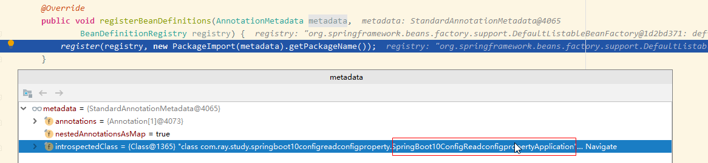
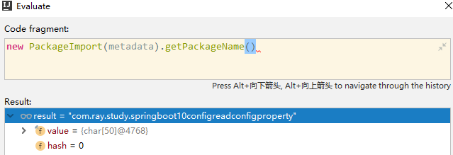

[TOC]


# 前言

SpringBoot 自动配置的实现中大量使用了条件注解，为了解 SpringBoot 自动配置，我们先来看看条件注解


# 一、Spring Java 配置与条件注解

## 1.Java 配置

在 Spring 中显示配置 bean 的方式有两种：

> - XML 配置方式
> - Java 配置方式


XML配置方式我们大多都很熟悉，这里给出一个简单示例，想了解更多可参考：[Spring_总结_03_装配Bean(三)_XML配置](https://www.cnblogs.com/shirui/p/9383246.html)

```xml
<beans>
	<bean id=” user ” class= ”com.ray.study.model.User”></bean>
</beans>
```


那么对应的Java配置示例如下：

```java
@Configuration  //1.声明配置类
public class BeanConfig {

  	@Bean   //2.1 声明一个bean，spring会将其注册为上下文中的bean。bean的名称默认为方法名驼峰形式
    public User user(){
    	User u = new User();
    	u.setId(100L);
    	u.setName("阿飞");
        return u;
    }
    
}
```

通过 `@Configuration`声明这是一个配置类（等效于声明这是一个`beans.xml`），然后通过 `@Bean`声明要向容器中注入bean（等效于一个`<bean>`）


关于 Spring 装配，不管是XML 配置，还是Java配置

> - 核心目的就是向Spring容器中注册Bean，以及维护Bean的依赖关系（这是为注册Bean服务的）


## 2.条件注解 @Conditional

参见 [Spring_总结_04_高级配置(二)_条件注解@Conditional](https://www.cnblogs.com/shirui/p/9427045.html)


# 二、SpringBoot 条件注解

## 1.条件注解清单

SpringBoot 为了进行自动配置，扩展了@Conditional 注解，派生出如下注解（都在 spring-boot-autoconfigure 工程下）：

| 条件注解                        | 描述                                                         |
| :------------------------------ | :----------------------------------------------------------- |
| @ConditionalOnBean              | 当上下文中存在指定Bean对象时，matche                         |
| @ConditionalOnMissingBean       | 当上下文中不存在指定Bean对象时，matche                       |
| @ConditionalOnClass             | 当 classpath 中存在指定类时，matche                          |
| @ConditionalOnMissingClass      | 当 classpath 中不存在指定类时，matche                        |
| @ConditionalOnExpression        | 当表达式为 true 时，matche，支持SpEL表达式                   |
| @ConditionalOnJava              | 当存在指定Java版本时，matche                                 |
| @ConditionalOnJndi              | 参数值给定的JNDI位置必须存在一个，如果没有参数，则要有JNDI InitialContext |
| @ConditionalOnProperty          | 当存在符合条件的 Environment 属性时，matche                  |
| @ConditionalOnResource          | 当 classpath中存在指定资源时，matche                         |
| @ConditionalOnWebApplication    | 若当前应用程序是 web 程序，matche                            |
| @ConditionalOnNotWebApplication | 若当前应用程序不是 web 程序，matche                          |


这些注解都被 @Conditional 修饰，因此都是条件注解，而且都是自定义条件注解的例子

`ConditionalOnBean`注解源码如下：

```java
@Target({ ElementType.TYPE, ElementType.METHOD })
@Retention(RetentionPolicy.RUNTIME)
@Documented
 // 是自定义条件注解的一个运用，匹配条件在 Condition 接口的 matches方法中
@Conditional(OnBeanCondition.class)
public @interface ConditionalOnBean {

	Class<?>[] value() default {};

	String[] type() default {};

	Class<? extends Annotation>[] annotation() default {};

	String[] name() default {};

	SearchStrategy search() default SearchStrategy.ALL;

	Class<?>[] parameterizedContainer() default {};

}

```


## 2.条件注解用法实例

以 ConditionalOnMissingBean、ConditionalOnClass、ConditionalOnWebApplication 为例，其他的类似

这些条件注解的用法实例如下：

```java
@Configuration   // <1>
@ConditionalOnWebApplication(type = Type.SERVLET)   //<2>
@ConditionalOnClass({ Servlet.class, DispatcherServlet.class, WebMvcConfigurer.class }) //<3>
@ConditionalOnMissingBean(WebMvcConfigurationSupport.class) //<4>
@AutoConfigureOrder(Ordered.HIGHEST_PRECEDENCE + 10) //<5>
@AutoConfigureAfter({ DispatcherServletAutoConfiguration.class, 
		TaskExecutionAutoConfiguration.class, ValidationAutoConfiguration.class })//<5>
public class WebMvcAutoConfiguration {
```


`WebMvcAutoConfiguration`是 SpringBoot 自动配置 SpringMVC 所需Bean的一个配置类：

> - `<1>`：声明这是一个配置类
>
> 
>
> - `<2>`：当前应用是 servlet web 应用时才进行装配； 
>
>     - 当应用中存在`org.springframework.web.context.support.GenericWebApplicationContext`类（Type.SERVLET）时，为 servlet web 应用；
>     - 当应用中存在`org.springframework.web.reactive.HandlerResult`（Type.REACTIVE）时，为 reactive  web 应用
>     - 默认为Type.ANY，也就是前两种都满足
>
>     
>
> - `<3>`:  当 classpath 中中存在 Servlet.class, DispatcherServlet.class, WebMvcConfigurer.class 这三个类时，进行装配。这三个类分别来自 内嵌的tomcat jar包、spring-webmvc jar包，也就是说只有当前工程直接或间接依赖了这三个jar 就进行装配。
>
> 
>
> - `<4>`: 当上下文中不存在 WebMvcConfigurationSupport.class 类型的bean时，才进行装配。也就是说你可以采取继承这个类的方式来使SpringMvc的自动配置失效。这也是为什么 当你使用 @EnableWebMvc 注解时，SpringMvc的自动配置会失效的原因


# 三、SpringBoot自动配置注解与自动配置原理

## AutoConfiguration 注解清单

| 条件注解                  | 描述                                                         |
| :------------------------ | :----------------------------------------------------------- |
| @Import                   | 导入配置                                                     |
| @AutoConfigurationPackage | 将被修饰类所在的包及其子包下的所有的组件，都注入到 Spring 容器中去 |
| @EnableAutoConfiguration  | 启用自动配置：<br/>(1)扫描包：将主配置类所在的包及其子包下的所有的组件，都注入到 Spring 容器中去<br/>(2)SPI: 根据所有jar包中`META-INF/spring.factories`加载相应配置 |
| @ImportAutoConfiguration  | 导入并应用指定的自动配置类                                   |
| @SpringBootConfiguration  | 声明这是一个 SpringBoot 配置类，其实就是一个`@Configuration` |
| @AutoConfigureOrder       | Spring Framework 的 `Order` 注解的变种，允许自动配置类之间进行排序，而不会影响配置类传递到 `AnnotationConfigApplicationContext.register(Class...)`的顺序. |
| @AutoConfigureAfter       | 声明自动配置应在指定的自动配置类之后进行                     |
| @AutoConfigureBefore      | 声明自动配置应在指定的自动配置类之前进行                     |


## 1.@Import

> Spring注解，导入配置

- 导入配置，等效于xml配置中的 `<import/>`
- 可以导入`@Configuration`修饰的配置类、`ImportSelector`和`ImportBeanDefinitionRegistrar`的实现类以及常规 Component

```java
/**
 *  Indicates one or more {@link Configuration @Configuration} classes to import.
**/
@Target(ElementType.TYPE)
@Retention(RetentionPolicy.RUNTIME)
@Documented
public @interface Import {

	/**
	 * {@link Configuration}, {@link ImportSelector}, {@link ImportBeanDefinitionRegistrar}
	 * or regular component classes to import.
	 */
	Class<?>[] value();

}
```


（1）导入 Configuration

```java
@Configuration
@ConditionalOnClass({ RabbitTemplate.class, Channel.class })
@EnableConfigurationProperties(RabbitProperties.class)
@Import(RabbitAnnotationDrivenConfiguration.class)
public class RabbitAutoConfiguration {
```

（2）导入 Selector、Registrar

如果不确定要导入哪个配置类，可使用Selector来注入符合要求的Bean

```java
@Target(ElementType.TYPE)
@Retention(RetentionPolicy.RUNTIME)
@Documented
@Import(TransactionManagementConfigurationSelector.class)
public @interface EnableTransactionManagement {
	boolean proxyTargetClass() default false;
	AdviceMode mode() default AdviceMode.PROXY;
	int order() default Ordered.LOWEST_PRECEDENCE;
}

```


通过TransactionManagementConfigurationSelector类，根据注解@EnableTransactionManagement所指定的AdviceMode来选择使用哪种方式

```java
public class TransactionManagementConfigurationSelector extends AdviceModeImportSelector<EnableTransactionManagement> {

	/**
	 * Returns {@link ProxyTransactionManagementConfiguration} or
	 * {@code AspectJ(Jta)TransactionManagementConfiguration} for {@code PROXY}
	 * and {@code ASPECTJ} values of {@link EnableTransactionManagement#mode()},
	 * respectively.
	 */
	@Override
	protected String[] selectImports(AdviceMode adviceMode) {
		switch (adviceMode) {
			case PROXY:
				return new String[] {AutoProxyRegistrar.class.getName(),
						ProxyTransactionManagementConfiguration.class.getName()};
			case ASPECTJ:
				return new String[] {determineTransactionAspectClass()};
			default:
				return null;
		}
	}

	private String determineTransactionAspectClass() {
		return (ClassUtils.isPresent("javax.transaction.Transactional", getClass().getClassLoader()) ?
				TransactionManagementConfigUtils.JTA_TRANSACTION_ASPECT_CONFIGURATION_CLASS_NAME :
				TransactionManagementConfigUtils.TRANSACTION_ASPECT_CONFIGURATION_CLASS_NAME);
	}

}
```


（3）导入常规 Component

```java
@Configuration
@Import({ DataSourceInitializerInvoker.class,    // 导入一个普通类
		DataSourceInitializationConfiguration.Registrar.class })
class DataSourceInitializationConfiguration {
```


## 2.@AutoConfigurationPackage

SpringBoot注解，将被修饰类所在的包及其子包下的所有的组件，都注入到 Spring 容器中去

```java
/**
 * 声明被修饰类的父包应该被注册
 * Indicates that the package containing the annotated class should be registered with
 * {@link AutoConfigurationPackages}.
 *
 * @author Phillip Webb
 * @since 1.3.0
 * @see AutoConfigurationPackages
 */
@Target(ElementType.TYPE)
@Retention(RetentionPolicy.RUNTIME)
@Documented
@Inherited
@Import(AutoConfigurationPackages.Registrar.class)
public @interface AutoConfigurationPackage {

}
```


可以看到`AutoConfigurationPackage`中导入了`AutoConfigurationPackages.Registrar.class`

```java
	/**
	 * {@link ImportBeanDefinitionRegistrar} to store the base package from the importing
	 * configuration.
	 */
	static class Registrar implements ImportBeanDefinitionRegistrar, DeterminableImports {

		@Override
		public void registerBeanDefinitions(AnnotationMetadata metadata,
				BeanDefinitionRegistry registry) {
			register(registry, new PackageImport(metadata).getPackageName());
		}

		@Override
		public Set<Object> determineImports(AnnotationMetadata metadata) {
			return Collections.singleton(new PackageImport(metadata));
		}

	}

```


而在` AutoConfigurationPackages.Registrar.class`主要就是注册了启动类所在包（当然包括子包）







## 3.@EnableAutoConfiguration与自动配置原理

SpringBoot注解，@EnableAutoConfiguration 的作用是启用自动配置，主要做了一下两件事

> - （1）扫描包
>
>     - 将主配置类所在的包及其子包下的所有的组件，都注入到 Spring 容器中去
>     - 其实是注册当前项目下的Bean
>
> - （2）SPI
>
>     - 根据所有jar包中`META-INF/spring.factories`加载相应配置 
>     - 其实是注册Jar包中的Bean
>
>     通过这两步就可以实现SpringBoot的自动配置。
>


 那么何为自动配置?  这个问题显然就简单了：

> **在SpringBoot环境下，将原本在Spring应用中需要手动注册的Bean（手动配置），挪到了一些 Starter Jar 包中（相当于约定了一份默认配置），这样以约定大于配置的方式实现了自动配置**


```java
@Target(ElementType.TYPE)
@Retention(RetentionPolicy.RUNTIME)
@Documented
@Inherited
// (1)扫描包：将主配置类所在的包及其子包下的所有的组件，都注入到 Spring 容器中去
@AutoConfigurationPackage  
// (2)SPI: 根据所有jar包中`META-INF/spring.factories`加载相应配置
@Import(AutoConfigurationImportSelector.class) 
public @interface EnableAutoConfiguration {

	String ENABLED_OVERRIDE_PROPERTY = "spring.boot.enableautoconfiguration";

	/**
	 * Exclude specific auto-configuration classes such that they will never be applied.
	 * @return the classes to exclude
	 */
	Class<?>[] exclude() default {};

	/**
	 * Exclude specific auto-configuration class names such that they will never be
	 * applied.
	 * @return the class names to exclude
	 * @since 1.3.0
	 */
	String[] excludeName() default {};

}

```


`@AutoConfigurationPackage  `以及`@Import`注解前面已经讲过，这里直接看`AutoConfigurationImportSelector`，SpringBoot 自动配置的实现基本都在这里，方法执行流程：

> process -> getAutoConfigurationEntry -> getCandidateConfigurations -> SpringFactoriesLoader.loadFactoryNames
>
> - process  :   选择要导入哪些Bean，同selectImports
> - getAutoConfigurationEntry ：  获取项目实际用到的自动配置类
> - getCandidateConfigurations ：获取候选自动配置类，即spring-boot-autoconfigure-xxx.jar下的"META-INF/spring.factories"中定义的所有自动配置类，这也是SpringBoot所支持的最大自动配置
> - SpringFactoriesLoader.loadFactoryNames：加载"META-INF/spring.factories"


```java
// 实现 ImportSelector 接口，具体要导入哪些Bean需要覆写selectImports
public class AutoConfigurationImportSelector
		implements DeferredImportSelector, BeanClassLoaderAware, ResourceLoaderAware,
		BeanFactoryAware, EnvironmentAware, Ordered {
		
		
	/**
	 * 选择要导入哪些Bean
	**/
	@Override
	public String[] selectImports(AnnotationMetadata annotationMetadata) {
		if (!isEnabled(annotationMetadata)) {
			return NO_IMPORTS;
		}
		AutoConfigurationMetadata autoConfigurationMetadata = AutoConfigurationMetadataLoader
				.loadMetadata(this.beanClassLoader);
        // 获取自动配置类
		AutoConfigurationEntry autoConfigurationEntry = getAutoConfigurationEntry(
				autoConfigurationMetadata, annotationMetadata);
		return StringUtils.toStringArray(autoConfigurationEntry.getConfigurations());
	}
            
            
        /**
         * 选择要导入哪些Bean 
         * 作用同selectImports方法，不过此方法是 DeferredImportSelector.Group 下方法，默认就是执行的此方法
        **/
     	@Override
		public void process(AnnotationMetadata annotationMetadata,
				DeferredImportSelector deferredImportSelector) {
			Assert.state(
					deferredImportSelector instanceof AutoConfigurationImportSelector,
					() -> String.format("Only %s implementations are supported, got %s",
							AutoConfigurationImportSelector.class.getSimpleName(),
							deferredImportSelector.getClass().getName()));
              // 获取自动配置类
			AutoConfigurationEntry autoConfigurationEntry = ((AutoConfigurationImportSelector) deferredImportSelector)
					.getAutoConfigurationEntry(getAutoConfigurationMetadata(),
							annotationMetadata);
			this.autoConfigurationEntries.add(autoConfigurationEntry);
			for (String importClassName : autoConfigurationEntry.getConfigurations()) {
				this.entries.putIfAbsent(importClassName, annotationMetadata);
			}
		}     
            
            
            
            
	protected AutoConfigurationEntry getAutoConfigurationEntry(
			AutoConfigurationMetadata autoConfigurationMetadata,
			AnnotationMetadata annotationMetadata) {
		if (!isEnabled(annotationMetadata)) {
			return EMPTY_ENTRY;
		}
		AnnotationAttributes attributes = getAttributes(annotationMetadata);
// 获取候选自动配置类：即spring-boot-autoconfigure-xxx.jar下的"META-INF/spring.factories"中定义的所有自动配置类，这也是SpringBoot所支持的最大自动配置
		List<String> configurations = getCandidateConfigurations(annotationMetadata,
				attributes);
        // 去重
		configurations = removeDuplicates(configurations);
        // 去掉排除类
		Set<String> exclusions = getExclusions(annotationMetadata, attributes);
		checkExcludedClasses(configurations, exclusions);
		configurations.removeAll(exclusions);
        // 获取项目中实际用到的自动配置
		configurations = filter(configurations, autoConfigurationMetadata);
		fireAutoConfigurationImportEvents(configurations, exclusions);
		return new AutoConfigurationEntry(configurations, exclusions);
	}
            
   /**
    * 获取候选自动配置类： 即spring-boot-autoconfigure-xxx.jar下的"META-INF/spring.factories"中
    * 定义的所有自动配置类，这也是SpringBoot所支持的最大自动配置
   **/
   protected List<String> getCandidateConfigurations(AnnotationMetadata metadata,
			AnnotationAttributes attributes) {
       // 利用SPI接口扩展机制，获取所有自动配置类
		List<String> configurations = SpringFactoriesLoader.loadFactoryNames(
				getSpringFactoriesLoaderFactoryClass(), getBeanClassLoader());
		Assert.notEmpty(configurations,
				"No auto configuration classes found in META-INF/spring.factories. If you "
						+ "are using a custom packaging, make sure that file is correct.");
		return configurations;
	}
            
```


## 4.@ImportAutoConfiguration

> SpringBoot注解，导入并应用指定的自动配置类

与@EnableAutoConfiguration类似，都有导入自动配置的含义，都使用相同的排序规则，也都可以排除不想要的配置类，但是二者也有一定区别（以下翻译自源码注释）：

>-  `@ImportAutoConfiguration`只导入指定的自动配置类，而不像 `@EnableAutoConfiguration` 却是根据`spring.factories`导入配置
>- 通常，优先使用`@EnableAutoConfiguration`；然而在某些场景中，`@ImportAutoConfiguration`更合适，尤其是编写测试类的时候。


```java
/**
 * Import and apply the specified auto-configuration classes. Applies the same ordering
 * rules as {@code @EnableAutoConfiguration} but restricts the auto-configuration classes
 * to the specified set, rather than consulting {@code spring.factories}.
 * <p>
 * Can also be used to {@link #exclude()} specific auto-configuration classes such that
 * they will never be applied.
 * <p>
 * Generally, {@code @EnableAutoConfiguration} should be used in preference to this
 * annotation, however, {@code @ImportAutoConfiguration} can be useful in some situations
 * and especially when writing tests.
 *
 * @author Phillip Webb
 * @author Andy Wilkinson
 * @since 1.3.0
 */
@Target(ElementType.TYPE)
@Retention(RetentionPolicy.RUNTIME)
@Documented
@Inherited
@Import(ImportAutoConfigurationImportSelector.class)
public @interface ImportAutoConfiguration {
    @AliasFor("classes")
	Class<?>[] value() default {};
    
    @AliasFor("value")
	Class<?>[] classes() default {};
    
    Class<?>[] exclude() default {};
}
```


导入指定的自动配置类 的逻辑，就位于 `ImportAutoConfigurationImportSelector` 类中

```java
/**
 * Variant（变种） of {@link AutoConfigurationImportSelector} for {@link ImportAutoConfiguration}.
 * 
**/
class ImportAutoConfigurationImportSelector extends AutoConfigurationImportSelector
		implements DeterminableImports {
		
		
	private Collection<String> getConfigurationsForAnnotation(Class<?> source,
			Annotation annotation) {
		// 根据此注解指定的classes属性获取自动配置类，并注册到Spring容器中
		String[] classes = (String[]) AnnotationUtils
				.getAnnotationAttributes(annotation, true).get("classes");
		if (classes.length > 0) {
			return Arrays.asList(classes);
		}
		return loadFactoryNames(source);
	}
}
		
```


## 5.@SpringBootConfiguration

声明被修饰类是一个SpringBoot配置类，也可替换成`@Configuration`

```java
/**
 * Indicates that a class provides Spring Boot application
 * {@link Configuration @Configuration}. Can be used as an alternative（可选择的） to the Spring's
 * standard {@code @Configuration} annotation so that configuration can be found
 * automatically (for example in tests).
 * <p>
 * Application should only ever include <em>one</em> {@code @SpringBootConfiguration} and
 * most idiomatic Spring Boot applications will inherit it from
 * {@code @SpringBootApplication}.
 *
 * @author Phillip Webb
 * @since 1.4.0
 */
@Target(ElementType.TYPE)
@Retention(RetentionPolicy.RUNTIME)
@Documented
@Configuration
public @interface SpringBootConfiguration {

}

```


## 6.@AutoConfigureOrder

是SpringBoot注解，是Spring Framework 的 `Order` 注解的变种，允许自动配置类之间进行排序，而不会影响配置类传递到 `AnnotationConfigApplicationContext.register(Class...)`的顺序.


源码如下：

```java
/**
 * Auto-configuration specific（特定的） variant（变种） of Spring Framework's {@link Order} annotation.
 * Allows auto-configuration classes to be ordered among themselves without affecting the
 * order of configuration classes passed to
 * {@link AnnotationConfigApplicationContext#register(Class...)}.
 *
 * @author Andy Wilkinson
 * @since 1.3.0
 */
@Retention(RetentionPolicy.RUNTIME)
@Target({ ElementType.TYPE, ElementType.METHOD, ElementType.FIELD })
@Documented
public @interface AutoConfigureOrder {

	int DEFAULT_ORDER = 0;

	/**
	 * The order value. Default is {@code 0}.
	 * @see Ordered#getOrder()
	 * @return the order value
	 */
	int value() default DEFAULT_ORDER;

}
```


用法示例如下：

```java
@Configuration
@ConditionalOnWebApplication(type = Type.SERVLET)
@ConditionalOnClass({ Servlet.class, DispatcherServlet.class, WebMvcConfigurer.class })
@ConditionalOnMissingBean(WebMvcConfigurationSupport.class)
//数值越小，优先级越高，就越早进行配置加载，Ordered.HIGHEST_PRECEDENCE + 10， 表示此配置类次10级优先权
@AutoConfigureOrder(Ordered.HIGHEST_PRECEDENCE + 10)   
@AutoConfigureAfter({ DispatcherServletAutoConfiguration.class,
		TaskExecutionAutoConfiguration.class, ValidationAutoConfiguration.class })
public class WebMvcAutoConfiguration {
```


## 7.@AutoConfigureAfter

  声明自动配置应在指定的自动配置类之后进行

源码如下：

```java
/**
 * Hint（暗示） for that an {@link EnableAutoConfiguration auto-configuration} should be applied
 * after other specified auto-configuration classes.
 *
 * @author Phillip Webb
 */
@Retention(RetentionPolicy.RUNTIME)
@Target({ ElementType.TYPE })
@Documented
public @interface AutoConfigureAfter {

	/**
	 * The auto-configure classes that should have already been applied.
	 * @return the classes
	 */
	Class<?>[] value() default {};

	/**
	 * The names of the auto-configure classes that should have already been applied.
	 * @return the class names
	 * @since 1.2.2
	 */
	String[] name() default {};

}
```


## 8.@AutoConfigureBefore

声明自动配置应在指定的自动配置类之前进行

源码如下：

```java
/**
 * Hint（暗示） for that an {@link EnableAutoConfiguration auto-configuration} should be applied
 * before other specified auto-configuration classes.
 *
 * @author Phillip Webb
 */
@Retention(RetentionPolicy.RUNTIME)
@Target({ ElementType.TYPE })
@Documented
public @interface AutoConfigureBefore {

	/**
	 * The auto-configure classes that should have not yet been applied.
	 * @return the classes
	 */
	Class<?>[] value() default {};

	/**
	 * The names of the auto-configure classes that should have not yet been applied.
	 * @return the class names
	 * @since 1.2.2
	 */
	String[] name() default {};

}
```


# 参考资料

## 1.Java 配置及条件注解

- [Spring_总结_03_装配Bean(二)_Java配置](https://www.cnblogs.com/shirui/p/9382541.html)

- [springboot条件注解源码分析](https://blog.csdn.net/u010399009/article/details/79356188)


## 2.AutoConfiguration相关注解

- [Spring Boot启动源码分析](http://www.javacoder.cn/?p=1253)
- [【spring boot2】第1篇：入门HelloWorld](https://segmentfault.com/a/1190000017127528)
- [SpringBoot 自动扫描当前包的原理](https://my.oschina.net/u/3574106/blog/1820888)


