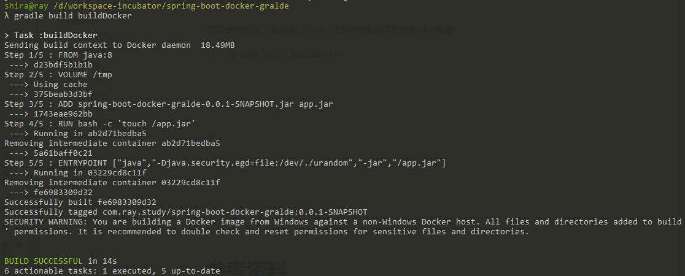
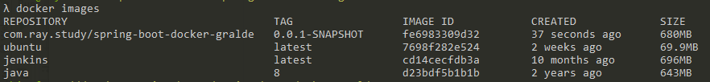
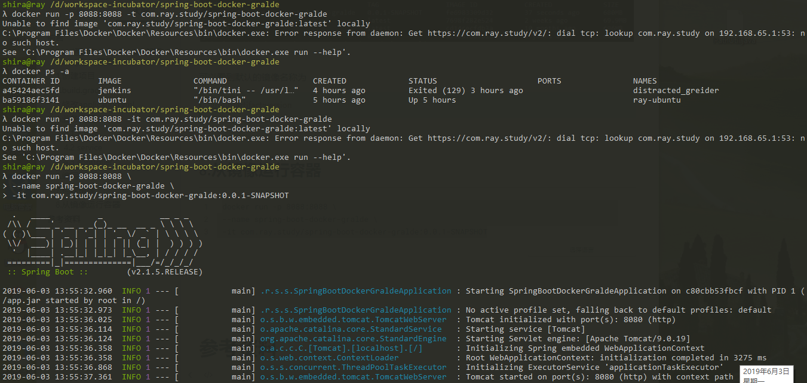
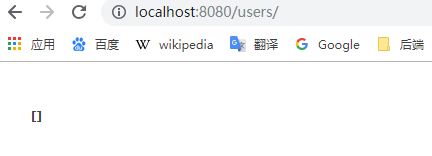
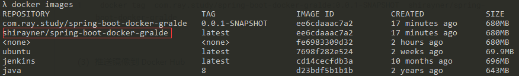
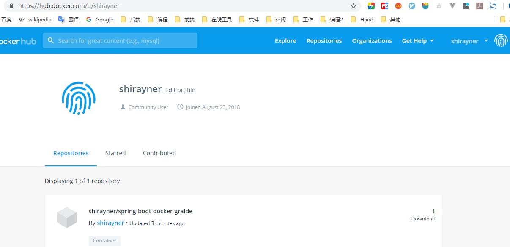

[TOC]


# 前言


# 一、通过Gradle+Docker部署SpringBoot项目

## 1.创建项目

```properties
group = 'com.ray.study'
artifact ='spring-boot-docker-gralde'
```


## 2.build.gradle

gradle 的 docker 的配置如下

```groovy
buildscript {
   .....
   dependencies {
      .....
      classpath('se.transmode.gradle:gradle-docker:1.2')
   }
}

group = 'spring-boot-tutorialspoint'

.....
apply plugin: 'docker'

task buildDocker(type: Docker, dependsOn: build) {
   applicationName = jar.baseName
   dockerfile = file('src/main/docker/Dockerfile')
   doFirst {
      copy {
         from jar
         into stageDir
      }
   }
}
```


完整的配置信息如下：

```groovy
buildscript {
    repositories {
        mavenCentral()
    }
    dependencies {
        classpath('se.transmode.gradle:gradle-docker:1.2')
    }
}


plugins {
    id 'org.springframework.boot' version '2.1.5.RELEASE'
    id 'java'
}
apply plugin: 'docker'
apply plugin: 'io.spring.dependency-management'

group = 'com.ray.study'
version = '0.0.1-SNAPSHOT'
sourceCompatibility = '1.8'

repositories {
    mavenCentral()
}

configurations {
    compile {
        extendsFrom annotationProcessor
    }
}

dependencies {
    implementation 'org.springframework.boot:spring-boot-starter-web'
    testImplementation 'org.springframework.boot:spring-boot-starter-test'

    compileOnly 'org.projectlombok:lombok'
    annotationProcessor 'org.projectlombok:lombok'
}


task buildDocker(type: Docker, dependsOn: build) {
    applicationName = jar.baseName
    dockerfile = file('src/main/docker/Dockerfile')
    doFirst {
        copy {
            from jar
            into stageDir
        }
    }
}
```


## 3.修改application.yml

```yml
server:
  port: 8088
  servlet:
    context-path: /

```


## 4.业务实现

### 4.1 entity

```java
package com.ray.study.springboot02.restfultest.model;


import lombok.*;

/**
 * description
 *
 * @author shira 2019/04/28 15:01
 */
@Data
@NoArgsConstructor
@AllArgsConstructor
public class User {

	private Long id;

	private String name;

	private Integer age;
}

```


### 4.2 service

（1）UserService

```
package com.ray.study.springboot02.restfultest.service;

import com.ray.study.springboot02.restfultest.model.User;

import java.util.List;

/**
 * description
 *
 * @author shira 2019/04/28 15:45
 */
public interface UserService {

	/**
	 * 获取用户列表
	 * @return
	 */
	List<User> list();

	/**
	 * 根据id获取用户
	 * @param id
	 * @return
	 */
	User get(Long id);

	/**
	 * 新增用户
	 * @param user
	 * @return
	 */
	User insert(User user);

	/**
	 * 更新用户
	 * @param user
	 * @return
	 */
	User update(User user);

	/**
	 * 删除用户
	 * @param id
	 * @return
	 */
	boolean delete(Long id);

}

```


（2）UserServiceImpl

```java
package com.ray.study.springboot02.restfultest.service.impl;

import com.ray.study.springboot02.restfultest.model.User;
import com.ray.study.springboot02.restfultest.service.UserService;
import org.springframework.stereotype.Service;

import java.util.*;

/**
 * UserServiceImpl
 *
 * @author shira 2019/04/28 15:46
 */
@Service
public class UserServiceImpl  implements UserService {

	/** 创建线程安全的Map **/
	private static Map<Long, User> users = Collections.synchronizedMap(new HashMap<>());

	@Override
	public List<User> list() {
		return new ArrayList<>(users.values());
	}

	@Override
	public User get(Long id) {
		return users.get(id);
	}

	@Override
	public User insert(User user) {
		users.put(user.getId(), user);
		return user;
	}


	@Override
	public User update(User user) {
		User u = users.get(user.getId());
		u.setName(user.getName());
		u.setAge(user.getAge());
		users.put(user.getId(), u);
		return u;
	}


	@Override
	public boolean delete(Long id) {
		users.remove(id);
		return true;
	}

}

```


### 4.3 controller

- UserController

```java
package com.ray.study.springboot02.restfultest.controller;

import com.ray.study.springboot02.restfultest.model.User;
import com.ray.study.springboot02.restfultest.service.UserService;
import org.springframework.beans.factory.annotation.Autowired;
import org.springframework.web.bind.annotation.*;

import java.util.*;

/**
 * UserController
 *
 * @author shira 2019/04/28 15:45
 */

@RestController
@RequestMapping(value = "/users")     // 通过这里配置使下面的映射都在/users下
public class UserController {
	@Autowired
	UserService userService;


	/**
	 * 获取用户列表：
	 * 		处理"/users/"的GET请求，用来获取用户列表
	 * 		还可以通过@RequestParam从页面中传递参数来进行查询条件或者翻页信息的传递
	 *
	 * @return
	 */
	@GetMapping("/")
	public List<User> list() {
		return userService.list();
	}


	/**
	 * 获取用户信息：
	 * 		处理"/users/{id}"的GET请求，用来获取url中id值的User信息
	 * 		url中的id可通过@PathVariable绑定到函数的参数中
	 * @param id
	 * @return
	 */
	@GetMapping("/{id}")
	public User get(@PathVariable Long id) {
		return userService.get(id);
	}


	/**
	 * 创建用户：
	 *  	处理"/users/"的POST请求，用来创建User
	 * 		除了@ModelAttribute绑定参数之外，还可以通过@RequestParam从页面中传递参数
	 * @param user
	 * @return
	 */
	@PostMapping("/")
	public User insert(@RequestBody User user) {
		return userService.insert(user);
	}


	/** 更新用户
	 * 		处理"/users"的PUT请求，用来更新User信息
	 * @param user
	 * @return
	 */
	@PutMapping("/")
	public User update(@RequestBody User user) {
		return userService.update(user);
	}

	/**
	 * 删除用户
	 * 		处理"/users/{id}"的DELETE请求，用来删除User
	 * @param id
	 * @return
	 */
	@RequestMapping(value = "/{id}", method = RequestMethod.DELETE)
	public String delete(@PathVariable Long id) {
		boolean result = userService.delete(id);
		return "success";
	}

}

```


## 6.编写Dockerfile

创建目录 `src/main/docker`，然后在此目录下创建 Dockerfile文件，内容如下：

```dockerfile
FROM java:8
VOLUME /tmp
ADD spring-boot-docker-gralde-0.0.1-SNAPSHOT.jar app.jar
RUN bash -c 'touch /app.jar'
ENTRYPOINT ["java","-Djava.security.egd=file:/dev/./urandom","-jar","/app.jar"]
```


## 7.构建镜像

在项目根目录下执行如下命令，即可构建此项目的docker镜像

```
gradle build buildDocker
```

可以看到docker构建镜像的过程如下图所示



Dockerfile中的指令会按顺序从上到下执行，每条指令都会创建一个新的镜像层并对镜像进行提交


此时，我们执行 `docker images `，就可以看到项目的镜像已经在docker中了




可以看到默认的镜像名称为 

> group/artifact:version


## 8.从镜像运行容器

执行如下命令即可从镜像运行容器

```
docker run -p 127.0.0.1:8080:8080 \
--name spring-boot-docker-gralde \
-it com.ray.study/spring-boot-docker-gralde:0.0.1-SNAPSHOT
```





在宿主机访问如下地址（即UserContoller）

```
http://localhost:8080/users/
```



返回空数组，说明成功了


## 9.推送 image 到 Docker Hub

（1）注册 Docker Hub 账号

（2）命令行登录 Docker Hub

```bash
docker login
```


（3）为镜像打上一个标签

```
 docker tag  com.ray.study/spring-boot-docker-gralde:0.0.1-SNAPSHOT  shirayner/spring-boot-docker-gralde
```

此时，我们执行 docker images ，会发现重新打了一个镜像，其实这两个镜像是一样的



我们这打标签的目的在于：Docker Hub 上用户自定义镜像的名称必须为： DockerID/*


（4）推送镜像到 Docker Hub

```bash
docker push shirayner/spring-boot-docker-gralde
```

上传成功之后，我们可以登录 docker hub ，再确认下是否真的上传成功





## 10.使用已经上传到Docker Hub上的镜像

当我们需要在一台新机器上部署我们的项目的时候，可以使用这个已经上传到Dokcer Hub上的镜像

```bash
docker run -p 127.0.0.1:8080:8080 \
--name spring-boot-docker-gralde \
-it shirayner/spring-boot-docker-gralde
```


# 参考资料

1. [Spring Boot - Creating Docker Image](https://www.tutorialspoint.com/spring_boot/spring_boot_creating_docker_image.htm)
2.  [实战Spring Boot 2.0系列(一) - 使用Gradle构建Docker镜像](https://juejin.im/post/5b27b7ac51882574c32c6588)
3. [用 Docker、Gradle 来构建、运行、发布一个 Spring Boot 应用](https://waylau.com/docker-spring-boot-gradle/)
4. [gitbook__Docker — 从入门到实践](https://yeasy.gitbooks.io/docker_practice/content/)


