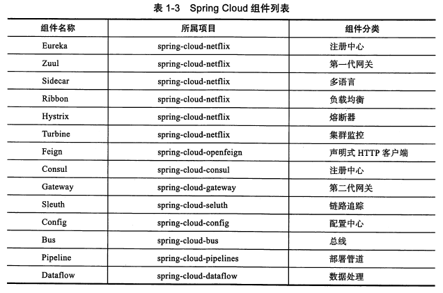
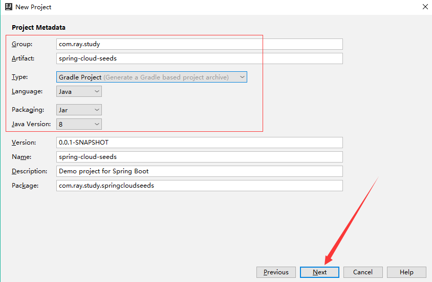
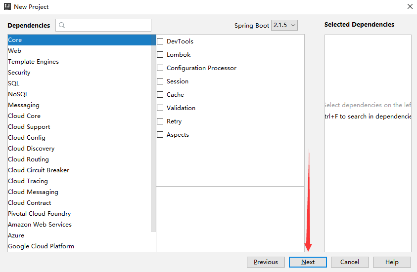
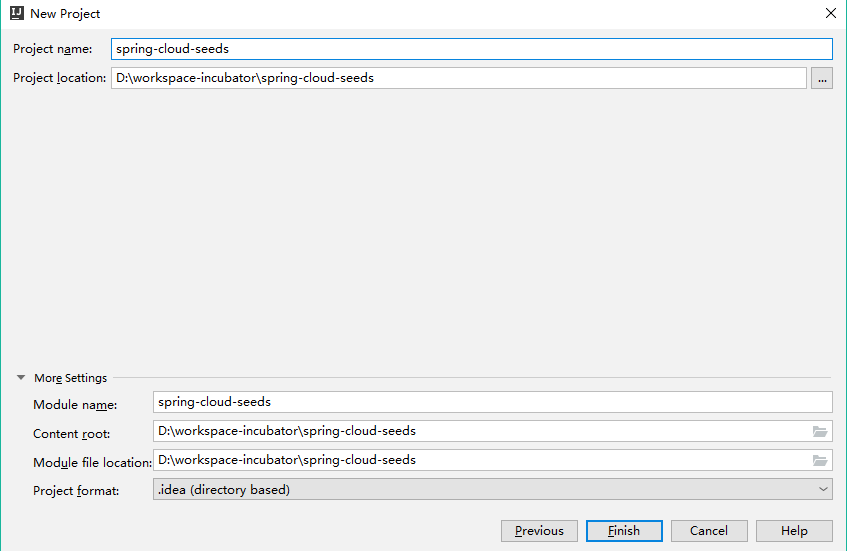
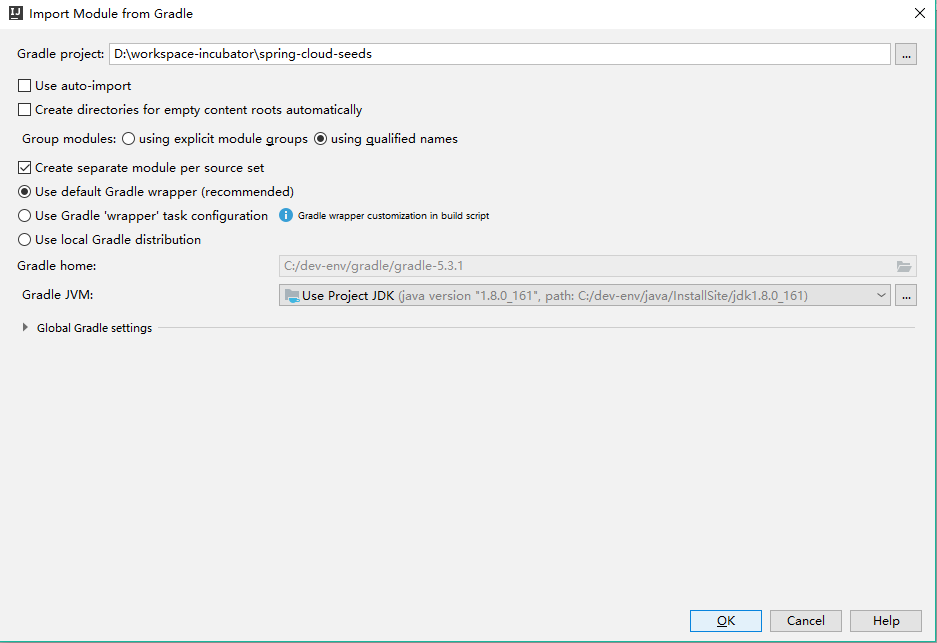
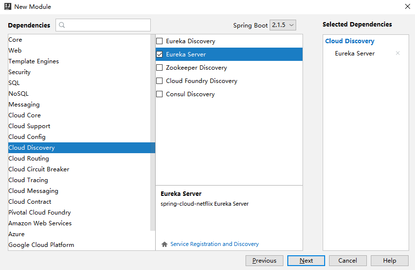
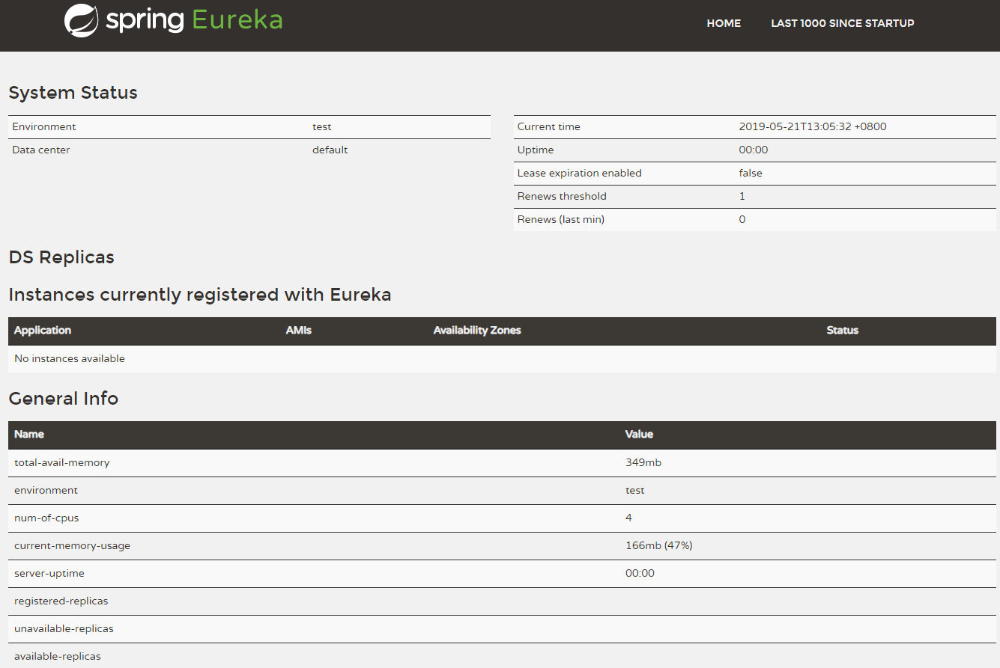
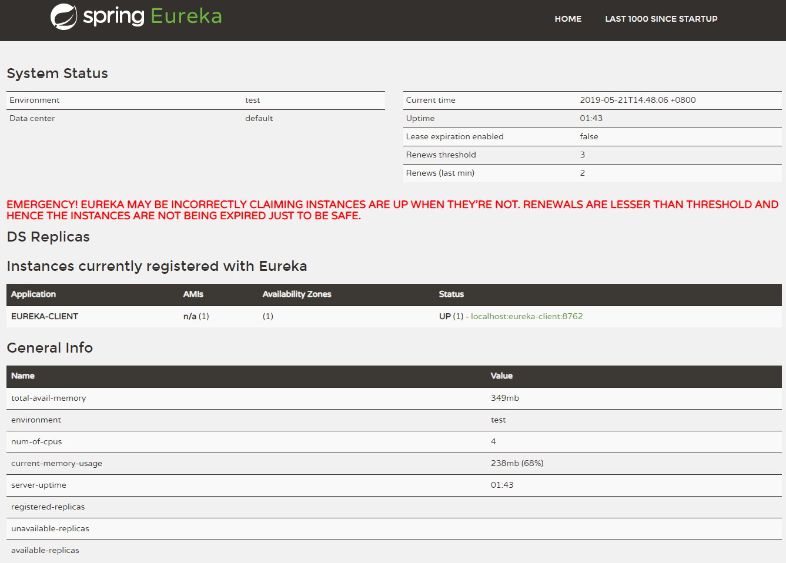
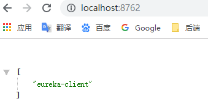

[TOC]

# 前言

## 1.微服务架构

什么是“微服务架构”？

> 简单的说，微服务架构就是**将一个完整的应用从数据存储开始垂直拆分成多个不同的服务，每个服务都能独立部署、独立维护、独立扩展，服务与服务间通过诸如RESTful API的方式互相调用**。


## 2.SpringCloud

SpringCloud 基于SpringBoot 开发，**提供了一套完整的微服务解决方案**，包括服务注册与发现、配置中心、全链路监控、API网关、熔断器等中立的开源组件，可以**随需扩展**和替换组装。


SpringCloud 微服务组件列表




下面我们来创建一个 Spring Cloud Eureka 入门实例


# 一、环境准备

接下来的系列总结，都是基于以下版本：

> - SpringBoot：2.1.5.RELEASE
> - SpringCloud：Greenwich.SR1


# 二、父项目准备

在入门实例开始前，我们来创建一个父项目，来管理接下来的系列总结对应项目源码的公共依赖、依赖的版本信息、仓库信息


## 1.创建父项目

```groovy
group = 'com.ray.study'
artifact ='spring-cloud-seeds'
```


### 1.1 New Project

打开Idea  ->  File -> New -> Project...  -> Spring Initializr ，选择JDK版本，然后Next


### 1.2 Project Metadata




### 1.3 Dependencies

直接点 Next，后面要加依赖，直接修改 `build.gradle`





### 1.4 Location

设置项目路径





### 1.5 Import Moudule from Gradle

直接点击OK，选择默认推荐的gradle wrapper




## 2.父项目变动

### 2.1 删除src目录

父项目主要管理公共依赖，没有源码，因此删除掉src目录。


### 2.2 build.gradle

修改build.gradle文件，将文件内容替换为如下内容，此文件是项目构建文件，类似Maven的pom.xml文件。

```groovy
buildscript {
    ext {
        springCloudVersion = 'Greenwich.SR1'
        springBootVersion = '2.1.5.RELEASE'
    }

    repositories {
        maven { url 'http://maven.aliyun.com/nexus/content/groups/public/' }
        mavenCentral()
    }

    dependencies {
        classpath("org.springframework.boot:spring-boot-gradle-plugin:${springBootVersion}")
    }
}

//配置所有项目
allprojects {
    //公共插件插件
    apply plugin: 'java'

    //公共属性
    group = 'com.ray.study'
    version = '0.0.1-SNAPSHOT'

    //编译版本
    sourceCompatibility = 1.8
    targetCompatibility = 1.8

}

//构建依赖
subprojects {

    //应用插件
    apply plugin: 'org.springframework.boot'
    apply plugin: 'io.spring.dependency-management'

    repositories {
        maven { url 'http://maven.aliyun.com/nexus/content/groups/public/' }
        mavenCentral()
    }

    dependencyManagement {
        imports {
            mavenBom "org.springframework.cloud:spring-cloud-dependencies:${springCloudVersion}"
        }
    }

}


repositories {
    maven { url 'http://maven.aliyun.com/nexus/content/groups/public/' }
    mavenCentral()
}


```


# 三、创建 Eureka 服务注册中心

## 1.创建子模块

我们按照上面创建父项目的过程，来创建一个子模块

子模块信息如下：

```groovy
group = 'com.ray.study'
artifact ='spring-cloud-01-discovery-01-eureka-server'
```


子模块依赖如下：



## 2.引入依赖

### 2.1 继承父工程依赖

在父工程`spring-cloud-seeds` 的 `settings.gradle`加入子工程

```groovy
rootProject.name = 'spring-cloud-seeds'
include 'spring-cloud-01-discovery-01-eureka-server'
```


这样，子工程`spring-cloud-01-discovery-01-eureka-server`就会自动继承父工程中`subprojects` 函数里声明的项目信息


### 2.2 引入`eureka-server`依赖

将子模块`spring-cloud-01-discovery-01-eureka-server` 的`build.gradle`修改为如下内容：

```groovy
dependencies {
    implementation 'org.springframework.cloud:spring-cloud-starter-netflix-eureka-server'
    testImplementation 'org.springframework.boot:spring-boot-starter-test'
}
```


## 3. 修改配置

需要修改 eureka-server 相关配置

### 3.1 修改`application.yml`

```yml
server:
  port: 8761  #服务端口

spring:
  application:
    name: eurka-server   #指定服务名

eureka:
  instance:
    hostname: localhost
  server:
    enable-self-preservation: false  #是否开启自我保护模式
    eviction-interval-timer-in-ms: 60000  #服务注册表清理间隔（单位毫秒，默认是60*1000）
  client:
    registerWithEureka: false  #服务注册，是否将自己注册到Eureka服务注册中心，单机版本时，为false就好
    fetchRegistry: false       #服务发现，是否从Eureka中获取注册信息
    serviceUrl:              #Eureka客户端与Eureka服务端的交互地址，高可用状态配置对方的地址，单机状态配置自己（如果不配置则默认本机8761端口）
      defaultZone: http://${eureka.instance.hostname}:${server.port}/eureka/


```


更多的可配置选项，请查看`spring-cloud-starter-netflix-eureka-server`以及`spring-cloud-starter-netflix-eureka-client`工程下的`spring-configuration-metadata.json`文件，在这个json文件中，我们可以看到有哪些可选配置项，配置项的描述，以及配置项是对应那个Java类的哪个属性


相关配置属性类为：EurekaServerConfigBean、EurekaClientConfigBean


### 3.2 启用 eureka-server

在启动类上添加`@EnableEurekaServer`注解即可启用 eureka 注册中心

```java
package com.ray.study.springcloud01discovery01eurekaserver;

import org.springframework.boot.SpringApplication;
import org.springframework.boot.autoconfigure.SpringBootApplication;
import org.springframework.cloud.netflix.eureka.server.EnableEurekaServer;

@EnableEurekaServer  // 启用 eureka-server
@SpringBootApplication
public class SpringCloud01Discovery01EurekaServerApplication {

	public static void main(String[] args) {
		SpringApplication.run(SpringCloud01Discovery01EurekaServerApplication.class, args);
	}

}
```


## 4.效果演示

按照 SpringBoot 工程启动方式启动工程，然后访问 eureka-server 的图形化界面：

> http://localhost:8761/

如下图所示，可以看到还没有发现任何服务。




# 四、创建服务提供者

## 1.创建子模块

按照前面创建 Eureka 服务注册中心 的过程，来创建服务提供者子模块

子模块信息如下：

```groovy
group = 'com.ray.study'
artifact ='spring-cloud-01-discovery-01-eureka-client'
```


## 2.引入依赖

### 2.1 继承父工程依赖

在父工程`spring-cloud-seeds` 的 `settings.gradle`加入子工程

```groovy
rootProject.name = 'spring-cloud-seeds'
include 'spring-cloud-01-discovery-01-eureka-server'
include 'spring-cloud-01-discovery-01-eureka-client'
```


这样，子工程`spring-cloud-01-discovery-01-eureka-client`就会自动继承父工程中`subprojects` 函数里声明的项目信息


### 2.2 引入 eureka-client 依赖

将子模块`spring-cloud-01-discovery-01-eureka-client` 的`build.gradle`修改为如下内容：

```groovy
dependencies {
    implementation 'org.springframework.boot:spring-boot-starter-web'
    testImplementation 'org.springframework.boot:spring-boot-starter-test'
    compileOnly 'org.projectlombok:lombok'
    annotationProcessor 'org.projectlombok:lombok'

    // 引入 eureka client 依赖
    implementation 'org.springframework.cloud:spring-cloud-starter-netflix-eureka-client'

}

```


## 3. 修改配置

需要修改 eureka-client 相关配置

### 3.1 修改`application.yml`

```yml
server:
  port: 8762

spring:
  application:
    name: eureka-client   #指定服务名

eureka:
  instance:
    prefer-ip-address: true
  client:
    registerWithEureka: true   #服务注册开关
    fetchRegistry: true        #服务发现开关
    serviceUrl:   #Eureka客户端与Eureka服务端进行交互的地址，多个中间用逗号分隔
      defaultZone: http://localhost:8761/eureka/    # 指定 Eureka Server 地址


```


### 3.2 启用 eureka-client

在启动类上添加`@EnableDiscoveryClient`注解即可启用 eureka 注册中心

```java
package com.ray.study.springcloud01discovery01eurekaclient;

import org.springframework.boot.SpringApplication;
import org.springframework.boot.autoconfigure.SpringBootApplication;
import org.springframework.cloud.client.discovery.EnableDiscoveryClient;

// 启用 eureka client 服务发现
@EnableDiscoveryClient
@SpringBootApplication
public class SpringCloud01Discovery01EurekaClientApplication {

	public static void main(String[] args) {
		SpringApplication.run(SpringCloud01Discovery01EurekaClientApplication.class, args);
	}

}

```


## 4.业务实现

- HelloController

这里我们写一个简单的controller，获取一下可用的服务列表

```java
package com.ray.study.springcloud01discovery01eurekaclient.controller;

import org.springframework.beans.factory.annotation.Autowired;
import org.springframework.beans.factory.annotation.Value;
import org.springframework.cloud.client.discovery.DiscoveryClient;
import org.springframework.web.bind.annotation.GetMapping;
import org.springframework.web.bind.annotation.RestController;

import java.util.List;

/**
 * description
 *
 * @author shira 2019/05/20 19:57
 */
@RestController
public class HelloController {

	@Autowired
	private DiscoveryClient discoveryClient;

	@Value("${server.port}")
	private String port;


	@GetMapping("/")
	public List<String>  listServices(){
		List<String> services = discoveryClient.getServices();
		return services;
	}

	@GetMapping("/hello")
	public String sayHello(){
		return "the service on prot:"+port+" says hello!";
	}
}

```


- UserController
 这个是留给后面测试 feign以及 hystrix 的，暂时不用管
```java

package com.ray.study.springcloud01discovery01eurekaclient.controller;

import com.ray.study.springcloud01discovery01eurekaclient.dto.User;
import org.springframework.web.bind.annotation.*;

/**
 * description
 *
 * @author shira 2019/05/27 10:38
 */
@RestController
@RequestMapping("/user")
public class UserController {

	/**
	 * get 路径请求参数传递
	 * @param id
	 * @return
	 */
	@GetMapping("/{id}")
	public String getUser1(@PathVariable("id") Long id) throws Exception {
		if(id == null || id <= 0){
			throw new Exception("invalid parameter: id="+ id);
		}

		return "the user's id is: "+id;
	}

	/**
	 * get 请求参数传递
	 * @param name
	 * @return
	 */
	@GetMapping("/get2")
	public String getUser2(@RequestParam String name,  @RequestHeader String token) {
		return "the user's name is: "+name +" and token is:"+ token;
	}

	/**
	 *  post 请求参数传递
	 * @param user
	 * @return
	 */
	@PostMapping("/get3")
	public User getUser3(@RequestBody User user) {
		return user;
	}


}
```

## 5.效果演示

按照 SpringBoot 工程启动方式启动本工程，然后访问 eureka-server 的图形化界面：

> http://localhost:8761/

如下图所示，在注册中心的服务列表已经可以看到本服务了




访问  HelloController （需要注意的是，需要等一段时间才会显示下图的服务列表，因为eureka客户端是定时从服务注册中心拉取服务列表的，因此需要等上这段时间，可通过配置参数来减少此时间）：

> http://localhost:8762/




# 参考资料

1. [Spring Cloud构建微服务架构：服务注册与发现（Eureka、Consul）【Dalston版】](http://blog.didispace.com/spring-cloud-starter-dalston-1/)
2. [SpringCloud教程第1篇：Eureka（F版本）](https://www.fangzhipeng.com/springcloud/2018/08/01/sc-f1-eureka.html)
3. [一起来学SpringCloud之-注册中心（Eureka/Consul）](https://blog.battcn.com/2017/07/25/springcloud/dalston/spring-cloud-discovery/#bootstrap-yml)


