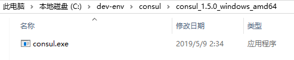
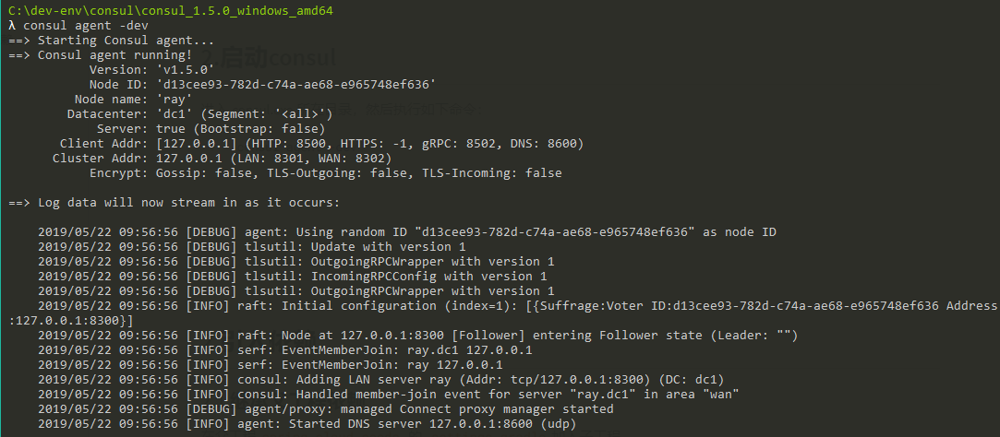
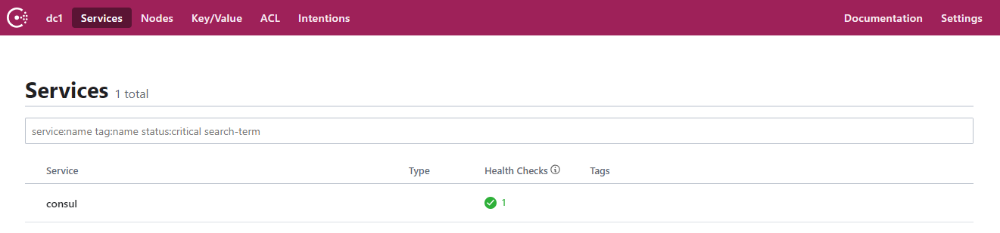
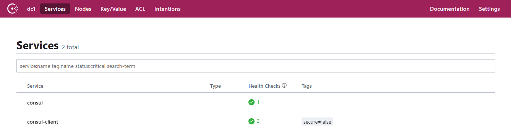
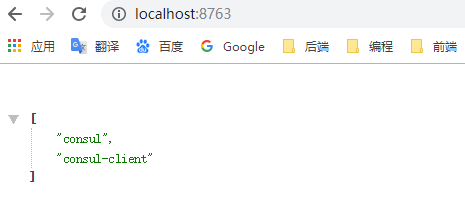

[TOC]

# 前言

consul是分布式的、高可用、横向扩展的。consul提供的一些关键特性：

> - **服务发现（service discovery）**：consul通过DNS或者HTTP接口使服务注册和服务发现变的很容易，一些外部服务，例如saas提供的也可以一样注册。
> - **健康检查（health checking）**：健康检测使consul可以快速的告警在集群中的操作；和服务发现的集成，可以防止服务转发到故障的服务上面。
> - **Key/Value存储（key/value storage）**：一个用来存储动态配置的系统。提供简单的HTTP接口，可以在任何地方操作。
> - **多数据中心（multi-datacenter）**：无需复杂的配置，即可支持任意数量的区域。


由于 Spring Cloud 对微服务基本组件做了一层抽象，因此对于对各组件的具体实现来说，我们可以无缝切换的，这也是面向抽象编程带来的好处。

所以我们要将 Eureka 换成 Consul 也是非常容易：

> - 启动 consul 
> - 切换服务提供者的依赖为 spring cloud consul，并修改其配置


# 一、启动 consul 服务端

## 1.下载 consul

> 官网下载地址：https://www.consul.io/downloads.html

去官网下载相应版本，然后解压缩




## 2.启动consul

进入 consul.exe 所在目录，然后执行如下命令即可：

```bash
consul agent -dev
```




启动成功后，访问 consul 可视化页面，如下图所示

> http://localhost:8500/





# 二、创建服务提供者

## 1.创建子模块

这里我们创建一个子模块，创建步骤同 [SpringCloud_01_Discovery_01_Eureka入门示例](./SpringCloud_01_Discovery_01_Eureka入门示例.md)

子模块信息如下：

```groovy
group = 'com.ray.study'
artifact ='spring-cloud-01-discovery-02-consul-client'
```


## 2.引入依赖

### 2.1 继承父工程依赖

在父工程`spring-cloud-seeds` 的 `settings.gradle`加入子工程

```groovy
rootProject.name = 'spring-cloud-seeds'
include 'spring-cloud-01-discovery-01-eureka-server'
include 'spring-cloud-01-discovery-01-eureka-client'
include 'spring-cloud-01-discovery-02-consul-client'
```


这样，子工程`spring-cloud-01-discovery-02-consul-client`就会自动继承父工程中`subprojects` 函数里声明的项目信息


### 2.2 引入 consul-client 依赖

将子模块`spring-cloud-01-discovery-02-consul-client` 的`build.gradle`修改为如下内容：

```groovy
dependencies {
    implementation 'org.springframework.boot:spring-boot-starter-web'
    testImplementation 'org.springframework.boot:spring-boot-starter-test'
    compileOnly 'org.projectlombok:lombok'
    annotationProcessor 'org.projectlombok:lombok'

    // consul client
    implementation 'org.springframework.cloud:spring-cloud-starter-consul-discovery'

    // actuator client
    implementation 'org.springframework.boot:spring-boot-starter-actuator'
}

```


## 3. 修改配置

按照需要修改 consul-client 相关配置

### 3.1 修改`application.yml`

```yml
server:
  port: 8763

spring:
  application:
    name: consul-client   #指定服务名

  # consul 环境
  cloud:
    consul:
      host: localhost
      port: 8500
      enabled: true
      discovery:
        enabled: true
        prefer-ip-address: true

```

可选配置项可查看 consul 的配置类：ConsulProperties、ConsulDiscoveryProperties

或者查看 `spring-cloud-consul-discovery`jar包中的`META-INF\spring-configuration-metadata.json`文件


部分默认配置如下：

```yml
spring:  
  cloud:
    consul:
      host: localhost          # Consul agent hostname ，即consul服务端host
      port: 8500               # Consul agent port
      enabled: true            # Is spring cloud consul enabled ：是否启用spring cloud consul
      discovery:
        enabled: true          # 是否启用服务发现 
        health-check-path: /actuator/health  # 健康检查地址
        health-check-interval: 10s   # 健康检查间隔
        prefer-ip-address: false     # 注册时使用ip而不是hostname
```


### 3.2 启用服务发现

在启动类上添加`@EnableDiscoveryClient`注解即可启用服务发现

```java
package com.ray.study.springcloud01discovery02consulclient;

import org.springframework.boot.SpringApplication;
import org.springframework.boot.autoconfigure.SpringBootApplication;
import org.springframework.cloud.client.discovery.EnableDiscoveryClient;

@EnableDiscoveryClient
@SpringBootApplication
public class SpringCloud01Discovery02ConsulClientApplication {

	public static void main(String[] args) {
		SpringApplication.run(SpringCloud01Discovery02ConsulClientApplication.class, args);
	}

}

```


## 4.业务实现

这里我们写一个简单的controller，获取一下可用的服务列表

```java
package com.ray.study.springcloud01discovery02consulclient.controller;

import org.springframework.beans.factory.annotation.Autowired;
import org.springframework.beans.factory.annotation.Value;
import org.springframework.cloud.client.discovery.DiscoveryClient;
import org.springframework.web.bind.annotation.GetMapping;
import org.springframework.web.bind.annotation.RestController;

import java.util.List;

/**
 * description
 *
 * @author shira 2019/05/20 19:57
 */
@RestController
public class HelloController {
	
	@Autowired
	private DiscoveryClient discoveryClient;

	@Value("${server.port}")
	private String port;


	@GetMapping("/")
	public List<String>  listServices(){
		List<String> services = discoveryClient.getServices();
		return services;
	}

	@GetMapping("/hello")
	public String sayHello(){
		return "the service on prot:"+port+" says hello!";
	}
}

```


## 5.效果演示

按照 SpringBoot 工程启动方式启动本工程，然后访问 consul 的图形化界面：

> http://localhost:8500/

如下图所示，在注册中心的服务列表已经可以看到本服务了




访问  HelloController ：

> http://localhost:8763/




# 参考资料

1. [Spring Cloud构建微服务架构：服务注册与发现（Eureka、Consul）【Dalston版】](http://blog.didispace.com/spring-cloud-starter-dalston-1/)
2. [SpringCloud教程第1篇：Eureka（F版本）](https://www.fangzhipeng.com/springcloud/2018/08/01/sc-f1-eureka.html)
3. [一起来学SpringCloud之-注册中心（Eureka/Consul）](https://blog.battcn.com/2017/07/25/springcloud/dalston/spring-cloud-discovery/#bootstrap-yml)


