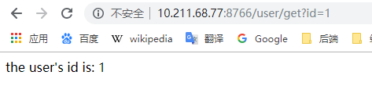

[TOC]


# 前言

前言部分请参考：[防雪崩利器：熔断器 Hystrix 的原理与使用](https://segmentfault.com/a/1190000005988895)

前言部分未完待续

## 1.雪崩效应

在微服务架构中通常会有多个服务层调用，底层服务提供者的不可用会导致其服务调用者不可用，并将不可用逐渐放大，形成级联故障，这种现象被称为雪崩效应。

> 例如，微服务调用链路： A -> B -> C -> D，服务D的不可用，回导致 C、B、A不可用，形成级联故障，造成雪崩效应


分布式系统中，造成服务不可用的原因通常包括：

> - 硬件故障
> - 网络连接缓慢造成的连接超时
> - 程序异常
> - 缓存击穿：一般发生在缓存应用重启，所有缓存被清空时，以及短时间内大量缓存失效时。大量的缓存不命中，使请求直击后端，造成服务提供者超负荷运行，引起服务不可用。
> - 用户大量请求


## 2.雪崩效应的应对方案

### 2.1 流程控制

可使用Nginx或网关来进行流量控制，对流量大的应用进行分流和限流


### 2.2 服务自动扩容

取决于硬件的限制，也可以使用第三方的云服务以达到扩容的效果。如果微服务构建得比较成熟，则可以通过容器的动态扩容来完成服务的扩容


### 2.3 降级和资源隔离

**资源隔离**

> 主要是对调用服务的线程池进行隔离，监控一般要细致到线程级别，当发现某个线程占用资源过高时，进行有效的处理来解决性能瓶颈。

**降级**

> 在网络访问中，为了优化用户体验，遇到超时的情况，可以直接放弃本次请求，不等待结果的返回，进行降级处理：
>
> - （1）可以降级为直接返回用户默认数据 
> - （2）也可以降级为从另一个服务或者使用缓存中设置的默认数据。

**熔断**

> 熔断是指错误达到某个设定的阀值，或者请求数量超过阀值后，系统自动（或手动）阻止代码或服务的执行调用，从而达到系统整体保护的效果。当检测到系统可用时，需要恢复访问。


## 3.熔断器模式


熔断器模式定义了熔断器开关相互转换的逻辑：

> 服务的健康状况 = 请求失败数 / 请求总数. 
>
> 熔断器开关由关闭到打开的状态转换是通过当前服务健康状况和设定阈值比较决定的.
>
> 1. 当熔断器开关关闭时, 请求被允许通过熔断器. 如果当前健康状况高于设定阈值, 开关继续保持关闭. 如果当前健康状况低于设定阈值, 开关则切换为打开状态.
> 2. 当熔断器开关打开时, 请求被禁止通过.
> 3. 当熔断器开关处于打开状态, 经过一段时间后, 熔断器会自动进入半开状态, 这时熔断器只允许一个请求通过. 当该请求调用成功时, 熔断器恢复到关闭状态. 若该请求失败, 熔断器继续保持打开状态, 接下来的请求被禁止通过.
>
> 熔断器的开关能保证服务调用者在调用异常服务时, 快速返回结果, 避免大量的同步等待. 并且熔断器能在一段时间后继续侦测请求执行结果, 提供恢复服务调用的可能.


​	Hystrix是一个延迟和容错库，旨在隔离对远程系统、服务和第三方库的访问点，停止级联故障，并在复杂的分布式系统中实现恢复能力


# 一、创建服务消费者

## 1.创建子模块

这里我们创建一个子模块，创建步骤同 [SpringCloud_01_Discovery_01_Eureka入门示例](./SpringCloud_01_Discovery_01_Eureka入门示例.md)

子模块信息如下：

```groovy
group = 'com.ray.study'
artifact ='spring-cloud-04-consumer-hystrix-feign'
```


## 2.引入依赖

### 2.1 继承父工程依赖

在父工程`spring-cloud-seeds` 的 `settings.gradle`加入子工程

```groovy
rootProject.name = 'spring-cloud-seeds'
include 'spring-cloud-01-discovery-01-eureka-server'
include 'spring-cloud-01-discovery-01-eureka-client'
include 'spring-cloud-01-discovery-02-consul-client'
include 'spring-cloud-02-consumer-ribbon'
include 'spring-cloud-03-consumer-feign'
include 'spring-cloud-04-consumer-hystrix-feign'
```


这样，子工程`spring-cloud-04-consumer-hystrix-feign`就会自动继承父工程中`subprojects` 函数里声明的项目信息


### 2.2 引入 hystrix 依赖


将子模块`spring-cloud-04-consumer-hystrix-feign` 的`build.gradle`修改为如下内容：

```groovy
dependencies {
    implementation 'org.springframework.boot:spring-boot-starter-web'
    testImplementation 'org.springframework.boot:spring-boot-starter-test'
    compileOnly 'org.projectlombok:lombok'
    annotationProcessor 'org.projectlombok:lombok'

    // eureka client
    implementation 'org.springframework.cloud:spring-cloud-starter-netflix-eureka-client'

    // feign
    implementation 'org.springframework.cloud:spring-cloud-starter-openfeign'

}

```


## 3. 修改配置

> 在 Feign 中，默认是自带 Hystrix 功能的；在D版本的Spring Cloud之后，它没有默认打开，所以需要自己通过配置文件打开

### 3.1 修改`application.yml`

开启 hystrix

```yml
server:
  port: 8766

spring:
  application:
    name: consumer-feign    #指定服务名

eureka:
  instance:
    prefer-ip-address: true
  client:
    registerWithEureka: true   #服务注册开关
    fetchRegistry: true        #服务发现开关
    serviceUrl:   #Eureka客户端与Eureka服务端进行交互的地址，多个中间用逗号分隔
      defaultZone: http://localhost:8761/eureka/    # 指定 Eureka Server 地址

feign:
  hystrix:
    enabled: true  # 在D版本之后，需要手动开启 feign的 hystrix

```


### 3.2 启用Hystrix

在启动类上

- 添加`@EnableDiscoveryClient`注解可启用服务发现
- 添加`@EnableFeignClients`注解可启用 Feign（启用feign之后，再由上一步配置文件中的`feign.hystrix.enabled=true`来启用Hystrix）

```java
package com.ray.study.springcloud03consumerfeign;

import org.springframework.boot.SpringApplication;
import org.springframework.boot.autoconfigure.SpringBootApplication;
import org.springframework.cloud.netflix.eureka.EnableEurekaClient;
import org.springframework.cloud.openfeign.EnableFeignClients;


@EnableFeignClients
@EnableDiscoveryClient
@SpringBootApplication
public class SpringCloud03ConsumerFeignApplication {

	public static void main(String[] args) {
		SpringApplication.run(SpringCloud03ConsumerFeignApplication.class, args);
	}

}

```


## 4.业务实现

### 4.1 dto

数据传输实体类

```java
package com.ray.study.springcloud03consumerfeign.dto;

import lombok.AllArgsConstructor;
import lombok.Data;
import lombok.NoArgsConstructor;

import java.util.Date;

/**
 * description
 *
 * @author shira 2019/05/27 10:36
 */
@Data
@AllArgsConstructor
@NoArgsConstructor
public class User {

	private Long id;

	private String name;

	private Integer age;

	private Date creationDate;

	private Date lastUpdateDate;

}

```


### 4.2 FeignClient

编写一个FeignClient用于调用远程服务提供者提供的服务，并通过 `fallback`属性来指定降级类

（1）UserService

```java
package com.ray.study.springcloud04consumerhystrixfeign.service;

import com.ray.study.springcloud04consumerhystrixfeign.dto.User;
import com.ray.study.springcloud04consumerhystrixfeign.service.impl.UserServiceFallback;
import org.springframework.cloud.openfeign.FeignClient;
import org.springframework.web.bind.annotation.*;

/**
 * description
 *
 * @author shira 2019/05/27 11:10
 */
@FeignClient(name = "eureka-client",path = "/user",fallback = UserServiceFallback.class)
public interface UserService {

	@GetMapping("/{id}")
	String getUser1(@PathVariable("id") Long id);

	@GetMapping("/get2")
	String getUser2(@RequestParam("name") String name, @RequestHeader("token") String token);

	@PostMapping("/get3")
	User getUser3(@RequestBody User user);

}

```


（2）UserServiceFallback

```
package com.ray.study.springcloud04consumerhystrixfeign.service.impl;

import com.ray.study.springcloud04consumerhystrixfeign.dto.User;
import com.ray.study.springcloud04consumerhystrixfeign.service.UserService;
import org.springframework.stereotype.Component;

/**
 * UserService 的降级 Fallback 类
 *
 * @author shira 2019/05/27 19:04
 */
@Component
public class UserServiceFallback implements UserService {


	/**
	 * 出错则调用该方法，返回友好错误
	 * @param id
	 * @return
	 */
	@Override
	public String getUser1(Long id) {
		return "The user dose not exist in this system, please confirm user's id:"+id;
	}

	/**
	 * 出错则调用该方法，返回友好错误
	 * @return
	 */
	@Override
	public String getUser2(String name, String token) {
		return "The user dose not exist in this system, please confirm user's name";
	}

	/**
	 * 出错则调用该方法，返回友好错误
	 * @return
	 */
	@Override
	public User getUser3(User user) {
		return null;
	}

}

```


### 4.3 UserController

```java
package com.ray.study.springcloud04consumerhystrixfeign.controller;

import com.ray.study.springcloud04consumerhystrixfeign.dto.User;
import com.ray.study.springcloud04consumerhystrixfeign.service.UserService;
import org.springframework.beans.factory.annotation.Autowired;
import org.springframework.web.bind.annotation.*;

import java.util.Date;

/**
 * description
 *
 * @author shira 2019/05/27 10:38
 */
@RestController
@RequestMapping("/user")
public class UserController {


	@Autowired
	UserService userService;

	/**
	 * get 路径请求参数传递
	 *  当 id<=0时抛出异常，被Hystrix降级处理
	 */
	@GetMapping("/get")
	public String getUser1(@RequestParam("id") Long id){
		return userService.getUser1(id);
	}

	/**
	 * get 请求参数传递
	 * @return
	 */
	@GetMapping("/get2")
	public String getUser2() {
		return userService.getUser2("张三", "271267312jhdsjfhdsjf3uwyruwe");
	}

	/**
	 *  post 请求参数传递
	 * @return
	 */
	@PostMapping("/get3")
	public User getUser3() {

		User user1 =  new User();
		user1.setId(10001L);
		user1.setName("张三");
		user1.setAge(22);
		user1.setCreationDate(new Date());

		return userService.getUser3(user1);

	}

}

```


## 5.测试

> 下面，我们将使用  [SpringCloud_01_Discovery_01_Eureka入门示例.md](./SpringCloud_01_Discovery_01_Eureka入门示例.md)  这一节中创建的 Eureka 注册中心和Eureka Client 服务提供者来进行演示


依次启动  

> - eurka-server： 服务注册中心
> - eureka-client：服务提供者
> - consumer-hystrix-feign：本节创建的服务消费者


访问 consumer-hystrix-feign 服务的 UserController 进行验证

（1）正常情况：当  id> 0时，正常返回如下信息




（2）异常情况：当 id<=0时，eureka-client 服务抛出异常，被降级处理


# 参考资料

3. [《重新定义Spring Cloud实战》(F版)](https://item.jd.com/12447280.html)
2.  [纯洁的微笑__springcloud(四)：熔断器Hystrix](http://www.ityouknow.com/springcloud/2017/05/16/springcloud-hystrix.html)
3.  [18 高并发之服务熔断与降级](https://www.jianshu.com/p/cda7c0366089)
4.  [防雪崩利器：熔断器 Hystrix 的原理与使用](https://segmentfault.com/a/1190000005988895)


