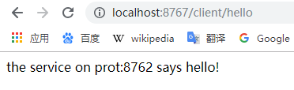

[TOC]


# 前言

Zuul 是从设备和网站到后端应用程序所有请求的前门，为内部服务提供可配置的对外URL到服务的映射关系。

简单来说，zuul就是一个微服务网关，是其他各个微服务的入口，其具备以下功能：

> - 认证与鉴权
> - 压力控制
> - 金丝雀测试
> - 动态路由
> - 负载削减
> - 静态响应处理
> - 主动流量管理

其底层基于Servlet，本质组件是一系列Filter所构成的责任链。


# 一、创建服务消费者

## 1.创建子模块

这里我们创建一个子模块，创建步骤同 [SpringCloud_01_Discovery_01_Eureka入门示例](./SpringCloud_01_Discovery_01_Eureka入门示例.md)

子模块信息如下：

```groovy
group = 'com.ray.study'
artifact ='spring-cloud-05-gateway-zuul'
```


## 2.引入依赖

### 2.1 继承父工程依赖

在父工程`spring-cloud-seeds` 的 `settings.gradle`加入子工程

```groovy
rootProject.name = 'spring-cloud-seeds'
include 'spring-cloud-01-discovery-01-eureka-server'
include 'spring-cloud-01-discovery-01-eureka-client'
include 'spring-cloud-01-discovery-02-consul-client'
include 'spring-cloud-02-consumer-ribbon'
include 'spring-cloud-03-consumer-feign'
include 'spring-cloud-04-consumer-hystrix-feign'
include 'spring-cloud-05-gateway-zuul'
```


这样，子工程`spring-cloud-05-gateway-zuul`就会自动继承父工程中`subprojects` 函数里声明的项目信息


### 2.2 引入 zuul 依赖


将子模块`spring-cloud-05-gateway-zuul` 的`build.gradle`修改为如下内容：

```groovy
dependencies {
    implementation 'org.springframework.boot:spring-boot-starter-web'
    testImplementation 'org.springframework.boot:spring-boot-starter-test'
    compileOnly 'org.projectlombok:lombok'
    annotationProcessor 'org.projectlombok:lombok'

    // eureka client
    implementation 'org.springframework.cloud:spring-cloud-starter-netflix-eureka-client'

    // zuul
    implementation 'org.springframework.cloud:spring-cloud-starter-netflix-zuul'

}

```


## 3. 修改配置


### 3.1 修改`application.yml`

开启 hystrix

```yml
server:
  port: 8767

spring:
  application:
    name: gateway-zuul   #指定服务名

eureka:
  instance:
    prefer-ip-address: true
  client:
    serviceUrl:   #Eureka客户端与Eureka服务端进行交互的地址，多个中间用逗号分隔
      defaultZone: http://localhost:8761/eureka/    # 指定 Eureka Server 地址

zuul:
  routes:
    eureka-client:
      path: /client/**
      serviceId: eureka-client


```


上面配置的路由为：将所欲 `/client/`开头的URL映射到 `client-a`这个服务中去，这样就实现了网关的作用，所有的请求，先经过网关，再由网关路由到具体的服务上。


### 3.2 启用ZuulProxy

在启动类上

- 添加`@EnableDiscoveryClient`注解可启用服务发现
- 添加`@EnableZuulProxy`注解可启用 zuul 网关

```java
package com.ray.study.springcloud05gatewayzuul;

import org.springframework.boot.SpringApplication;
import org.springframework.boot.autoconfigure.SpringBootApplication;
import org.springframework.cloud.client.discovery.EnableDiscoveryClient;
import org.springframework.cloud.netflix.zuul.EnableZuulProxy;


@SpringBootApplication
@EnableZuulProxy
@EnableDiscoveryClient
public class SpringCloud05GatewayZuulApplication {

	public static void main(String[] args) {
		SpringApplication.run(SpringCloud05GatewayZuulApplication.class, args);
	}

}

```


## 4.测试

> 下面，我们将使用  [SpringCloud_01_Discovery_01_Eureka入门示例.md](./SpringCloud_01_Discovery_01_Eureka入门示例.md)  这一节中创建的 Eureka 注册中心和Eureka Client 服务提供者来进行演示


依次启动  

> - eurka-server： 服务注册中心
> - eureka-client：服务提供者
> - gateway-zuul：本节创建的网关


下面通过网关 gateway-zuul 来访问eureka-client 服务提供者的的 HelloController

> http://localhost:8767/client/hello




如上图，显示提供服务的是 8762 端口的 eureka-client


# 参考资料

1. [《重新定义Spring Cloud实战》(F版)](https://item.jd.com/12447280.html)
2. [唐亚峰__一起来学SpringCloud之 - 路由网关（Zuul）](https://blog.battcn.com/2017/08/14/springcloud/dalston/spring-cloud-zuul/)

