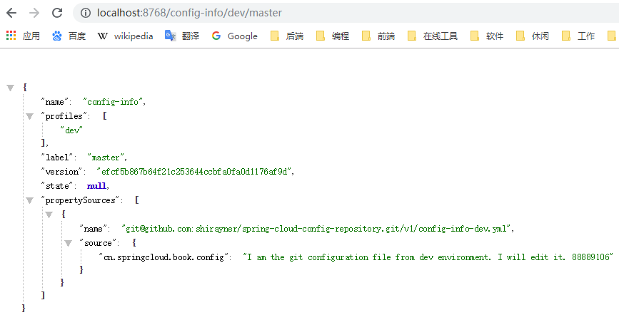
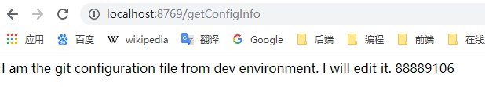

[TOC]


# 前言

Zuul 是从设备和网站到后端应用程序所有请求的前门，为内部服务提供可配置的对外URL到服务的映射关系。

简单来说，zuul就是一个微服务网关，是其他各个微服务的入口，其具备以下功能：

> - 认证与鉴权
> - 压力控制
> - 金丝雀测试
> - 动态路由
> - 负载削减
> - 静态响应处理
> - 主动流量管理

其底层基于Servlet，本质组件是一系列Filter所构成的责任链。


# 一、创建ConfigServer

## 1.创建子模块

这里我们创建一个子模块，创建步骤同 [SpringCloud_01_Discovery_01_Eureka入门示例](./SpringCloud_01_Discovery_01_Eureka入门示例.md)

子模块信息如下：

```groovy
group = 'com.ray.study'
artifact ='spring-cloud-06-config-01-configserver-git'
```


## 2.引入依赖

### 2.1 继承父工程依赖

在父工程`spring-cloud-seeds` 的 `settings.gradle`加入子工程

```groovy
rootProject.name = 'spring-cloud-seeds'
include 'spring-cloud-01-discovery-01-eureka-server'
include 'spring-cloud-01-discovery-01-eureka-client'
include 'spring-cloud-01-discovery-02-consul-client'
include 'spring-cloud-02-consumer-ribbon'
include 'spring-cloud-03-consumer-feign'
include 'spring-cloud-04-consumer-hystrix-feign'
include 'spring-cloud-05-gateway-zuul'
include 'spring-cloud-06-config-01-configserver-git'
```


这样，子工程`spring-cloud-06-config-01-configserver-git`就会自动继承父工程中`subprojects` 函数里声明的项目信息


### 2.2 引入 config 依赖


将子模块`spring-cloud-06-config-01-configserver-git` 的`build.gradle`修改为如下内容：

```groovy
dependencies {
    implementation 'org.springframework.boot:spring-boot-starter-web'
    testImplementation 'org.springframework.boot:spring-boot-starter-test'
    compileOnly 'org.projectlombok:lombok'
    annotationProcessor 'org.projectlombok:lombok'

    // actuator
    implementation 'org.springframework.boot:spring-boot-starter-actuator'
    
    // Spring cloud config-server
    implementation 'org.springframework.cloud:spring-cloud-config-server'
}

```


## 3.创建git仓库

创建一个名为 spring-cloud-config-repository 的仓库用来存放配置文件，并在仓库中创建目录 v1，然后在v1目录下创建prod、dev、test环境的配置文件


配置文件中定义了一个属性（三个环境的配置信息稍作区别即可）

```yml
           
cn: 
 springcloud: 
          book: 
            config: I am the git configuration file from dev environment. I will edit it. 88889106
```


## 4. 修改配置


### 4.1 修改`application.yml`

开启 hystrix

```yml
server:
  port: 8768

spring:
  application:
    name: config-server-git
  cloud:
    config:
      server:
        git:
          uri: git@github.com:shirayner/spring-cloud-config-repository.git     # git 仓库地址
          #username:                                                           # 若 git 仓库为私有的，则需要用户名密码
          #password:
          search-paths: v1                                                     # 指定要在git仓库的哪个路径（目录）下去搜索配置

```


### 4.2 启用配置中心

在启动类上

- 添加`@EnableConfigServer`注解可启用配置中心

    

```java
package com.ray.study.springcloud06config01configserver;

import org.springframework.boot.SpringApplication;
import org.springframework.boot.autoconfigure.SpringBootApplication;
import org.springframework.cloud.config.server.EnableConfigServer;

@SpringBootApplication
@EnableConfigServer
public class SpringCloud06Config01ConfigserverGitApplication {

	public static void main(String[] args) {
		SpringApplication.run(SpringCloud06Config01ConfigserverGitApplication.class, args);
	}

}

```


## 4.启动效果

我们将  config-server-git 启动，然后访问如下地址：

> http://localhost:8768/{application}/{profile}[/{label}]

> - `application`:  指定配置文件名（ 其值实际上为`spring.cloud.name.name`属性的值）
> - `profile`：指定哪个环境的配置
> - `label`：指定 git 分支


以dev环境为例，我们的配置文件为 config-info-dev.yml ，那么我们需要访问如下地址，即可显示配置信息

> http://localhost:8768/config-info/dev/master





说明我们的配置中心已经获取到 git 仓库中的配置了


# 二、创建Config-Client

下面我们将创建一个应用来获取配置中心的配置

## 1.创建子模块

这里我们创建一个子模块，创建步骤同 [SpringCloud_01_Discovery_01_Eureka入门示例](./SpringCloud_01_Discovery_01_Eureka入门示例.md)

子模块信息如下：

```groovy
group = 'com.ray.study'
artifact ='spring-cloud-06-config-01-configclient'
```


## 2.引入依赖

### 2.1 继承父工程依赖

在父工程`spring-cloud-seeds` 的 `settings.gradle`加入子工程

```groovy
rootProject.name = 'spring-cloud-seeds'
include 'spring-cloud-01-discovery-01-eureka-server'
include 'spring-cloud-01-discovery-01-eureka-client'
include 'spring-cloud-01-discovery-02-consul-client'
include 'spring-cloud-02-consumer-ribbon'
include 'spring-cloud-03-consumer-feign'
include 'spring-cloud-04-consumer-hystrix-feign'
include 'spring-cloud-05-gateway-zuul'
include 'spring-cloud-06-config-01-configserver-git'
include 'spring-cloud-06-config-01-configclient'
```


这样，子工程`spring-cloud-06-config-01-configclient`就会自动继承父工程中`subprojects` 函数里声明的项目信息


### 2.2 引入 config-client 依赖


将子模块`spring-cloud-06-config-01-configclient` 的`build.gradle`修改为如下内容：

```groovy
dependencies {
    implementation 'org.springframework.boot:spring-boot-starter-web'
    testImplementation 'org.springframework.boot:spring-boot-starter-test'
    compileOnly 'org.projectlombok:lombok'
    annotationProcessor 'org.projectlombok:lombok'
    
    // Spring cloud config-server
    implementation 'org.springframework.cloud:spring-cloud-config-client'
}

```


## 3. 修改配置

### 3.1 修改 `bootstrap.yml`

```yml
spring:
    cloud:
        config:
            uri: http://localhost:8768    # 配置中心地址
            name: config-info             # 配置文件的名称
            profile: dev                  # 哪个环境的环境
            label: master                 # git 分支

```


### 3.2 修改`application.yml`

开启 hystrix

```yml
server:
  port: 8769

spring:
  application:
    name: config-cient
```


## 4.业务实现

### 4.1 ConfigInfoProperties

我们创建一个类，用来映射配置中心中的配置信息

```java
package com.ray.study.springcloud06config01configclient.config;

import lombok.Data;
import org.springframework.boot.context.properties.ConfigurationProperties;
import org.springframework.stereotype.Component;

/**
 * <p>
 *  映射配置信息
 * </p>
 *
 * @author shira 2019/06/02 22:39
 */
@Component
@ConfigurationProperties(prefix = "cn.springcloud.book")
@Data
public class ConfigInfoProperties {

    private String config;
}

```


### 4.2 ConfigClientController

创建一个 controller 来使用配置中心中的配置

```java
package com.ray.study.springcloud06config01configclient.controller;


import com.ray.study.springcloud06config01configclient.config.ConfigInfoProperties;
import org.springframework.beans.factory.annotation.Autowired;
import org.springframework.web.bind.annotation.RequestMapping;
import org.springframework.web.bind.annotation.RestController;

@RestController
public class ConfigClientController {

    @Autowired
    private ConfigInfoProperties configInfoValue;

    @RequestMapping("/getConfigInfo")
    public String getConfigInfo(){
        return configInfoValue.getConfig();
    }
}

```


## 5.测试

我们启动   config-server-git 、config-client，然后访问 ConfigClientController即可获取配置中心的配置

> http://localhost:8769/getConfigInfo





# 参考资料

1. [《重新定义Spring Cloud实战》(F版)](https://item.jd.com/12447280.html)
2. [Spring Cloud Config官方文档中文](https://springcloud.cc/spring-cloud-config.html)
3. 

