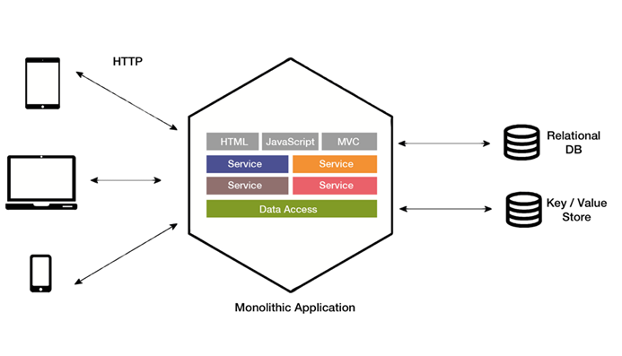

[TOC]

# 前言

# 一、微服务架构概述

## 1.应用架构的发展

架构的发展历程是从单体架构、分布式架构、SOA架构再到微服务架构

### 1.1 单体架构

> 一个归档包包含了应用所有功能的应用程序， 我们通常称之为单体应用。 

单体架构在小微企业比较常见，典型代表就是一个应用、一个数据库、一个web容器就可以跑起来。

### 1.2 分布式架构

### 1.3 面向服务的SOA架构

### 1.4 微服务架构

## 2.微服务架构基本组件

# 参考资料

1. [oKong__白话SpringCloud | 第一章：什么是SpringCloud](https://blog.lqdev.cn/categories/SpringCloud/)
2. [单体架构，SOA，微服务](https://blog.csdn.net/fxq8866/article/details/77141359)

