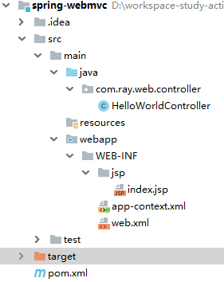
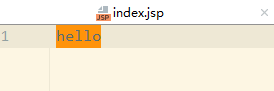

# 一、前言

这一节我们利用SpringMVC来实现一个简单的请求响应流程。


可通过如下两种方式实现：

- xml配置

- JavaConfig


# 二、XML配置实例

目录结构如下:





## 1.pom.xml

新建一个普通的maven工程

```xml
<?xml version="1.0" encoding="UTF-8"?>
<project xmlns="http://maven.apache.org/POM/4.0.0"
         xmlns:xsi="http://www.w3.org/2001/XMLSchema-instance"
         xsi:schemaLocation="http://maven.apache.org/POM/4.0.0 http://maven.apache.org/xsd/maven-4.0.0.xsd">
    <modelVersion>4.0.0</modelVersion>

    <groupId>com.ray.study</groupId>
    <artifactId>spring-webmvc</artifactId>
    <version>1.0-SNAPSHOT</version>
    <packaging>war</packaging>


    <dependencies>

        <!-- Servlet 3.1 API 依赖-->
        <dependency>
            <groupId>javax.servlet</groupId>
            <artifactId>javax.servlet-api</artifactId>
            <scope>provided</scope>
            <version>3.1.0</version>
        </dependency>

        <dependency>
            <groupId>javax.servlet</groupId>
            <artifactId>jstl</artifactId>
            <version>1.2</version>
        </dependency>

        <!-- Spring Web MVC 依赖 -->
        <dependency>
            <groupId>org.springframework</groupId>
            <artifactId>spring-webmvc</artifactId>
            <version>5.0.6.RELEASE</version>
        </dependency>

    </dependencies>

    <build>

        <plugins>
            <plugin>
                <groupId>org.apache.tomcat.maven</groupId>
                <artifactId>tomcat7-maven-plugin</artifactId>
                <version>2.1</version>
                <executions>
                    <execution>
                        <id>tomcat-run</id>
                        <goals>
                            <goal>exec-war-only</goal>
                        </goals>
                        <phase>package</phase>
                        <configuration>
                            <!-- ServletContext path -->
                            <path>/</path>
                        </configuration>
                    </execution>
                </executions>
            </plugin>
        </plugins>

    </build>


</project>
```


## 2.部署 DispatcherServlet 

web.xml内容如下：

```java
<web-app>

    <servlet>
        <servlet-name>app</servlet-name>
        <servlet-class>org.springframework.web.servlet.DispatcherServlet</servlet-class>
        <load-on-startup>1</load-on-startup>
        <init-param>
            <param-name>contextConfigLocation</param-name>
            <param-value>/WEB-INF/app-context.xml</param-value>
        </init-param>
    </servlet>

    <servlet-mapping>
        <servlet-name>app</servlet-name>
        <url-pattern>/</url-pattern>
    </servlet-mapping>

</web-app>
```


## 3.配置 Web MVC 组件 

app-context.xml 内容如下：

```java
<?xml version="1.0" encoding="UTF-8"?>
<beans xmlns="http://www.springframework.org/schema/beans"
       xmlns:xsi="http://www.w3.org/2001/XMLSchema-instance"
       xmlns:context="http://www.springframework.org/schema/context"
       xsi:schemaLocation="
        http://www.springframework.org/schema/beans
        http://www.springframework.org/schema/beans/spring-beans.xsd
        http://www.springframework.org/schema/context
        http://www.springframework.org/schema/context/spring-context.xsd">

    <context:component-scan base-package="com.ray.web"/>

    <bean class="org.springframework.web.servlet.mvc.method.annotation.RequestMappingHandlerMapping"/>

    <bean class="org.springframework.web.servlet.mvc.method.annotation.RequestMappingHandlerAdapter"/>

    <bean id="viewResolver" class="org.springframework.web.servlet.view.InternalResourceViewResolver">
        <property name="viewClass" value="org.springframework.web.servlet.view.JstlView"/>
        <property name="prefix" value="/WEB-INF/jsp/"/>
        <property name="suffix" value=".jsp"/>
    </bean>

</beans>
```


## 4.实现Controller

新建`com.ray.web.controller`包，在此包下新建Controller

```java
/**
 * HelloWorld {@link Controller}
 *
 * @author shirayner
 * @since 2018/12/6
 */
@Controller
public class HelloWorldController {


	@RequestMapping("")
	public String index() {
		return "index";
	}
}
```


其中index.jsp内容随意，如下：




## 5.运行项目

### 5.1 打包

在项目根目录执行如下命令：

```shell
mvn -Dmaven.test.skip -U clean package
```

将生成一个war包和一个可执行jar包

### 5.2 运行

运行可执行jar包

```shell
java -jar spring-webmvc-0.0.1-SNAPSHOT-war-exec.jar
```


# 三、JavaConfig实例

配置思路：将原本xml文件里配置bean用java的方式配置一遍.


基本配置步骤：

- 注解配置： @Configuration （ Spring 范式注解 ）
- 组件激活： @EnableWebMvc （Spring 模块装配）
- 自定义组件 ： WebMvcConfigurer （Spring Bean） 


## 1.pom.xml

同上


## 2.部署 DispatcherServlet 

这里采用servlet3.0 Java Config 的方式配置来配置web.xml


```java
package com.ray.web;

import com.ray.web.config.WebMvcConfig;
import org.springframework.web.WebApplicationInitializer;
import org.springframework.web.servlet.support.AbstractAnnotationConfigDispatcherServletInitializer;


/**
 * see the javadoc of {@link WebApplicationInitializer}
 *
 * WebApplicationInitializer  是Spring提供用来配置Servlet 3.0配置的接口，从而实现替代web.xml的位置。
 * 实现此接口将会自动被SpringServletContainerInitializer （用来启动Servlet 3.0 容器）获取到。
 *
 *
 *
 * @author shirayner
 * @since 2018/12/7
 *
 */
/*public class WebInitializer implements WebApplicationInitializer {

	public void onStartup(ServletContext servletContext) throws ServletException {
		// Create the 'root' Spring application context
        AnnotationConfigWebApplicationContext rootContext = new AnnotationConfigWebApplicationContext();
		rootContext.setServletContext(servletContext);
        rootContext.register(WebMvcConfig.class);

        // Register and map the dispatcher servlet
        ServletRegistration.Dynamic dispatcher = servletContext.addServlet("dispatcher", new DispatcherServlet(rootContext));
        dispatcher.setLoadOnStartup(1);
        dispatcher.addMapping("/");
	}
}*/

/**
 *  采用模板方法模式，具体逻辑同上述代码相同
 *  for getRootConfigClasses, you can see {@link AbstractAnnotationConfigDispatcherServletInitializer .createRootApplicationContext()}
 *  for getServletConfigClasses, you can see {@link AbstractAnnotationConfigDispatcherServletInitializer .createServletApplicationContext()}
 *  for getServletMappings , you can see {@link `AbstractDispatcherServletInitializer.registerDispatcherServlet()`}
 *
 *
 */
public class WebAppInitializer extends AbstractAnnotationConfigDispatcherServletInitializer {

	@Override
	protected Class<?>[] getRootConfigClasses() {  // web.xml
		return null;
	}

	@Override
	protected Class<?>[] getServletConfigClasses() { // DispatcherServlet
		return new Class[]{WebMvcConfig.class};
	}

	@Override
	protected String[] getServletMappings() {
		return new String[]{"/"};
	}

}

```


## 3.配置 Web MVC 组件 

```java
package com.ray.web.config;

import org.springframework.context.annotation.Bean;
import org.springframework.context.annotation.ComponentScan;
import org.springframework.context.annotation.Configuration;
import org.springframework.web.servlet.ViewResolver;
import org.springframework.web.servlet.config.annotation.EnableWebMvc;
import org.springframework.web.servlet.config.annotation.WebMvcConfigurer;
import org.springframework.web.servlet.view.InternalResourceViewResolver;
import org.springframework.web.servlet.view.JstlView;

/**
 * Spring Web MVC 配置（类）
 * see {@link WebMvcConfigurer}
 * @author shirayner
 * @since 2018/12/7
 */

@Configuration
@EnableWebMvc
@ComponentScan(basePackages = "com.ray.web")
public class WebMvcConfig  implements WebMvcConfigurer {

	/**
	 *  配置 ViewResolver
	 * @return
	 */
	@Bean
	public ViewResolver viewResolver(){
		InternalResourceViewResolver viewResolver = new InternalResourceViewResolver();
		viewResolver.setViewClass(JstlView.class);
		viewResolver.setPrefix("/WEB-INF/jsp/");
		viewResolver.setSuffix(".jsp");
		return viewResolver;
	}

}
```


## 4.实现Controller

同上


## 5.运行项目

同上


# 四、参考资料

1. [Spring Web MVC](https://docs.spring.io/spring/docs/5.1.4.BUILD-SNAPSHOT/spring-framework-reference/web.html#mvc-config)
2. [Spring MVC 4.2.4.RELEASE 中文文档](https://spring-mvc.linesh.tw/publish/21-15/code-based-servlet-container-initialization.html)


