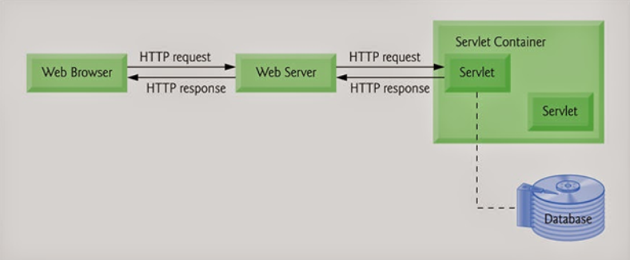
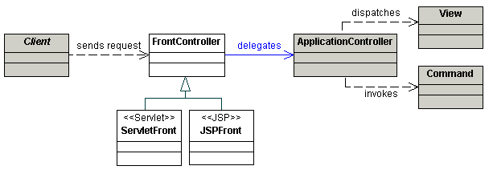
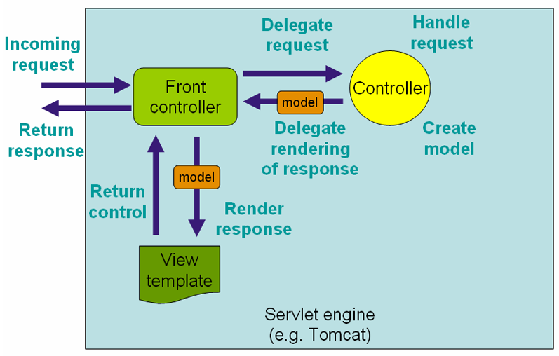

[TOC]

# 一、前言

这一节我们先从宏观上了解一下SpringMVC架构，这对后面的分析很有帮助

# 二、SpringMVC架构

## 1.基础架构：Servlet

- 特点
    - 请求/响应式(Request/Response)
    - 屏蔽网络通讯的细节
- API 特性
    - 面向 HTTP 协议
    - 完整生命周期 

## 2.核心架构：前端控制器(Front Controller) 

在servlet架构下继续职责分离，演变为前端控制器模式

> *Use a Front Controller as the initial point of contact for handling all related requests. The Front Controller centralizes control logic that might otherwise be duplicated, and manages the key request handling activities.*
>
>
>
> 
>
> ​																
>
> ​																——摘自 [corej2eepatterns.com](http://www.corej2eepatterns.com/FrontController.htm )

## 3.Spring Web MVC 架构 

​				——[《Spring 官方文档》:**The request processing workflow in Spring Web MVC (high level)**](https://docs.spring.io/spring/docs/4.3.22.BUILD-SNAPSHOT/spring-framework-reference/htmlsingle/#mvc-servlet)

上图展示了Spring Web MVC的`DispatcherServlet`  处理请求的工作流，

其中 `DispatcherServlet` 充当的就是前端控制器，其本质上是个`Servlet`（它继承自`HttpServlet`基类）

将上图流程继续职责分离、细化，得到下图：

SpringMVC 核心组件

| 组件 Bean 类型                        | 说明                                                         |
| ------------------------------------- | ------------------------------------------------------------ |
| HandlerMapping                        | 映射请求（Request）到处理器（Handler）加上其关联的拦截器 （HandlerInterceptor）列表，其映射关系基于不同的 HandlerMapping 实现的一些 标准细节。其中两种主要 HandlerMapping 实现， RequestMappingHandlerMapping 支持标注 @RequestMapping 的方法， SimpleUrlHandlerMapping 维护精确的URI 路径与处理器的映射 |
| HandlerAdapter                        | 帮助 DispatcherServlet 调用请求处理器（Handler），无需关注其中实际的调用 细节。比如，调用注解实现的 Controller 需要解析其关联的注解. HandlerAdapter 的主要目的是为了屏蔽与 DispatcherServlet 之间的诸多细节。 |
| HandlerExceptionResolver              | 解析异常，可能策略是将异常处理映射到其他处理器（Handlers） 、或到某个 HTML 错误页面，或者其他。 |
| ViewResolver                          | 从处理器（Handler）返回字符类型的逻辑视图名称解析出实际的 View 对象，该对 象将渲染后的内容输出到HTTP 响应中。 |
| LocaleResolver, LocaleContextResolver | 从客户端解析出 Locale ，为其实现国际化视图。                 |
| MultipartResolver                     | 解析多部分请求（如 Web 浏览器文件上传）的抽象实现            |

