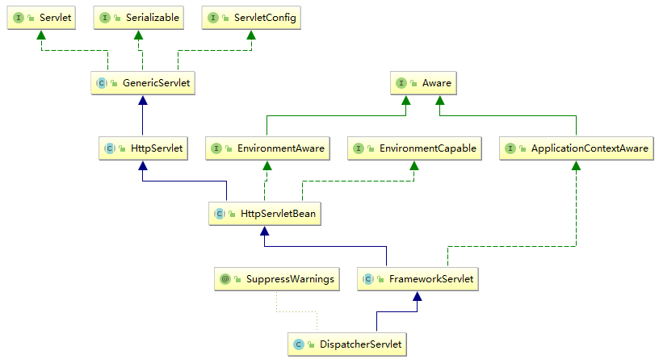
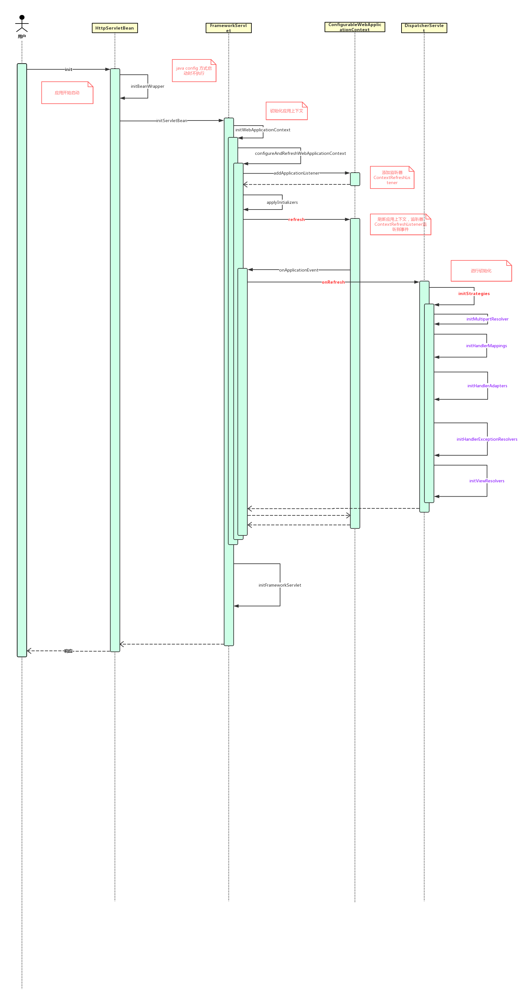
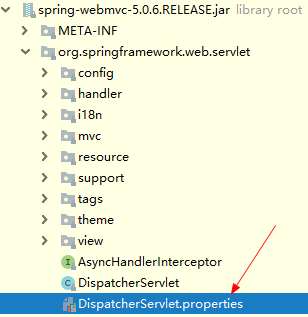

[TOC]


# 一、前言

上一节我们简单了解 SpringMVC 架构，这一节我们围绕前端控制器 DispatcherServlet 来详细分析一下SpringMVC启动流程。


# 二、DispatcherServlet 分析

## 1.SpringMVC组件


SpringMVC 核心组件

| 组件 Bean 类型                        | 说明                                                         |
| ------------------------------------- | ------------------------------------------------------------ |
| HandlerMapping                        | 映射请求（Request）到处理器（Handler）加上其关联的拦截器 （HandlerInterceptor）列表，其映射关系基于不同的 HandlerMapping 实现的一些 标准细节。其中两种主要 HandlerMapping 实现， RequestMappingHandlerMapping 支持标注 @RequestMapping 的方法， SimpleUrlHandlerMapping 维护精确的URI 路径与处理器的映射 |
| HandlerAdapter                        | 帮助 DispatcherServlet 调用请求处理器（Handler），无需关注其中实际的调用 细节。比如，调用注解实现的 Controller 需要解析其关联的注解. HandlerAdapter 的主要目的是为了屏蔽与 DispatcherServlet 之间的诸多细节。 |
| HandlerExceptionResolver              | 解析异常，可能策略是将异常处理映射到其他处理器（Handlers） 、或到某个 HTML 错误页面，或者其他。 |
| ViewResolver                          | 从处理器（Handler）返回字符类型的逻辑视图名称解析出实际的 View 对象，该对 象将渲染后的内容输出到HTTP 响应中。 |
| LocaleResolver, LocaleContextResolver | 从客户端解析出 Locale ，为其实现国际化视图。                 |
| MultipartResolver                     | 解析多部分请求（如 Web 浏览器文件上传）的抽象实现            |


## 2.类图

DispatcherServlet类图如下




> - `HttpServletBean` :  设置Environment 、设置 init-param
>
>     - 扩展自 `HttpServlet` 	: 因此具备Servlet功能。
>     - 扩展自 `EnvironmentAware` ：因此能得到 Spring 通知的 Environment 
>     - 扩展自`EnvironmentCapable`：因此能包含和暴露  Environment 引用
>
> - `FrameworkServlet` : 初始化 `WebApplicationContext` 
>
>     - 扩展自`HttpServletBean` ，实现其`initServletBean`方法
>     - 扩展自 `ApplicationContextAware` : 因此能得到Spring 通知的  ApplicationContext
>
> - `DispatcherServlet` : 初始化 `strategy`对象。
>
>     - 扩展自`FrameworkServlet`  ，实现其 `onRefresh` 方法，在 `WebApplicationContext`  刷新之后，初始化 DispatcherServlet 要用到的 `strategy`对象（即SpringMVC相应组件）。


# 三、DispatcherServlet 启动流程

## 1.流程图


## 2.时序图

> [01-SpringMVC启动流程](https://www.processon.com/view/5c1761e7e4b0b71ee4fd3e05)





## 3.流程详解

下面我们开始对着上面的时序图的每个流程进行详细的分析。

**建议读者自己按照上面的时序图进行debug断点调试，并自行验证下面分析。**


### 3.0 类加载过程

```java
    /**
     * Name of the class path resource (relative to the DispatcherServlet class)
     * that defines DispatcherServlet's default strategy names.
     */
    private static final String DEFAULT_STRATEGIES_PATH = "DispatcherServlet.properties";
    private static final Properties defaultStrategies;

    static {
        // Load default strategy implementations from properties file.
        // This is currently strictly internal and not meant to be customized
        // by application developers.
        try {
            ClassPathResource resource = new ClassPathResource(DEFAULT_STRATEGIES_PATH, DispatcherServlet.class);
            defaultStrategies = PropertiesLoaderUtils.loadProperties(resource);
        }
        catch (IOException ex) {
            throw new IllegalStateException("Could not load '" + DEFAULT_STRATEGIES_PATH + "': " + ex.getMessage());
        }
    }
```

 

在 `DispatcherServlet` 类加载阶段，会执行到其静态代码块，此静态代码块的主要目的是从类路径下的`DispatcherServlet.properties` 配置文件中加载默认的 strategy实现，然后存到`defaultStrategies`变量中，以待后续使用。

`DispatcherServlet.properties` 文件位置如下图所示：



文件内容如下：

```properties
# Default implementation classes for DispatcherServlet's strategy interfaces.
# Used as fallback when no matching beans are found in the DispatcherServlet context.
# Not meant to be customized by application developers.

org.springframework.web.servlet.LocaleResolver=org.springframework.web.servlet.i18n.AcceptHeaderLocaleResolver

org.springframework.web.servlet.ThemeResolver=org.springframework.web.servlet.theme.FixedThemeResolver

org.springframework.web.servlet.HandlerMapping=org.springframework.web.servlet.handler.BeanNameUrlHandlerMapping,\
	org.springframework.web.servlet.mvc.method.annotation.RequestMappingHandlerMapping

org.springframework.web.servlet.HandlerAdapter=org.springframework.web.servlet.mvc.HttpRequestHandlerAdapter,\
	org.springframework.web.servlet.mvc.SimpleControllerHandlerAdapter,\
	org.springframework.web.servlet.mvc.method.annotation.RequestMappingHandlerAdapter

org.springframework.web.servlet.HandlerExceptionResolver=org.springframework.web.servlet.mvc.method.annotation.ExceptionHandlerExceptionResolver,\
	org.springframework.web.servlet.mvc.annotation.ResponseStatusExceptionResolver,\
	org.springframework.web.servlet.mvc.support.DefaultHandlerExceptionResolver

org.springframework.web.servlet.RequestToViewNameTranslator=org.springframework.web.servlet.view.DefaultRequestToViewNameTranslator

org.springframework.web.servlet.ViewResolver=org.springframework.web.servlet.view.InternalResourceViewResolver

org.springframework.web.servlet.FlashMapManager=org.springframework.web.servlet.support.SessionFlashMapManager
```


此配置文件主要是为 `DispatcherServlet`  的 strategy 接口定义一些默认实现。后面会根据此配置实例化其默认实现，并放到bean容器中。


### 3.1 init

类加载之后，在`DispatcherServlet `初始化的时候，会执行`HttpServlet` 的 init 方法，此方法会在servlet初始化时执行，并且一生只执行一次。


- HttpServletBean

```java
/**
 * Map config parameters onto bean properties of this servlet, and
 * invoke subclass initialization.
 * @throws ServletException if bean properties are invalid (or required
 * properties are missing), or if subclass initialization fails.
 */
@Override
public final void init() throws ServletException {
   if (logger.isDebugEnabled()) {
      logger.debug("Initializing servlet '" + getServletName() + "'");
   }

   // Set bean properties from init parameters.
   // <1> 解析 <init-param /> 标签，封装到 PropertyValues pvs 中
   PropertyValues pvs = new ServletConfigPropertyValues(getServletConfig(), this.requiredProperties);
   // java config 时不需要配置 init-param，因此为空，不执行下面if代码块
   if (!pvs.isEmpty()) {
      try {
         // <2.1> 将当前的这个 Servlet 对象，转化成一个 BeanWrapper 对象。从而能够以 Spring 的方式来将 pvs 注入到该 BeanWrapper 对象中
         BeanWrapper bw = PropertyAccessorFactory.forBeanPropertyAccess(this);
         ResourceLoader resourceLoader = new ServletContextResourceLoader(getServletContext());
         // <2.2> 注册自定义属性编辑器，一旦碰到 Resource 类型的属性，将会使用 ResourceEditor 进行解析
         bw.registerCustomEditor(Resource.class, new ResourceEditor(resourceLoader, getEnvironment()));
          // <2.3> 空实现，留给子类覆盖
         initBeanWrapper(bw);
         // <2.4> 以 Spring 的方式来将 pvs 注入到该 BeanWrapper 对象中
         bw.setPropertyValues(pvs, true);
      }
      catch (BeansException ex) {
         if (logger.isErrorEnabled()) {
            logger.error("Failed to set bean properties on servlet '" + getServletName() + "'", ex);
         }
         throw ex;
      }
   }

   // <3> Let subclasses do whatever initialization they like.
   initServletBean();

   if (logger.isDebugEnabled()) {
      logger.debug("Servlet '" + getServletName() + "' configured successfully");
   }
}
```


如代码注释所示，此类主要做了如下操作：

- 设置  init-param 参数（即web.xml中的<init-param/> 配置的参数）
- `initServletBean` 空方法，由子类实现 Servlet 具体初始化操作


### 3.2 initServletBean


- FrameworkServlet

```
			...
			this.webApplicationContext = initWebApplicationContext();
			initFrameworkServlet();
			...
```


如上，此方法中主要有两个操作：

（1）初始化 `WebApplicationContext`

（2）初始化 FrameworkServlet，此方法留给子类做一些额外扩展，是一个空方法，DispatcherServlet暂未覆盖此方法。


###  3.3 initWebApplicationContext

此类的主要任务就是初始化  `WebApplicationContext`  并发布刷新事件。


```java
	/**
	 * Initialize and publish the WebApplicationContext for this servlet.
	 * <p>Delegates to {@link #createWebApplicationContext} for actual creation
	 * of the context. Can be overridden in subclasses.
	 * @return the WebApplicationContext instance
	 * @see #FrameworkServlet(WebApplicationContext)
	 * @see #setContextClass
	 * @see #setContextConfigLocation
	 */
	protected WebApplicationContext initWebApplicationContext() {
        // <1> 获取根上下文。上下文是具有父子关系的
		WebApplicationContext rootContext =
				WebApplicationContextUtils.getWebApplicationContext(getServletContext());
		WebApplicationContext wac = null;
        
        
        // 第一种情况，若Spring成功地使用 构造器注入了 webApplicationContext 实例，则直接使用
		if (this.webApplicationContext != null) {
			// A context instance was injected at construction time -> use it
			wac = this.webApplicationContext;
            
            // 如果是 ConfigurableWebApplicationContext 类型，并且未激活，则进行初始化
			if (wac instanceof ConfigurableWebApplicationContext) {
				ConfigurableWebApplicationContext cwac = (ConfigurableWebApplicationContext) wac;
                
				if (!cwac.isActive()) {  // 未激活
					// The context has not yet been refreshed -> provide services such as
					// setting the parent context, setting the application context id, etc
					if (cwac.getParent() == null) {
						// The context instance was injected without an explicit parent -> set
						// the root application context (if any; may be null) as the parent
                        //设置父级上下文
						cwac.setParent(rootContext);
					}
                    
                    // 配置 WebApplicationContex 并发布刷新事件
					configureAndRefreshWebApplicationContext(cwac);
				}
			}
		}
        
        
        // 第二种情况，从 ServletContext 获取对应的 WebApplicationContext 对象
		if (wac == null) {
			// No context instance was injected at construction time -> see if one
			// has been registered in the servlet context. If one exists, it is assumed
			// that the parent context (if any) has already been set and that the
			// user has performed any initialization such as setting the context id
			wac = findWebApplicationContext();
		}
        
        
        // 第三种，创建一个 WebApplicationContext 对象
		if (wac == null) {
			// No context instance is defined for this servlet -> create a local one
			wac = createWebApplicationContext(rootContext);
		}
        

        // <3> 如果未触发刷新事件，则主动触发刷新事件
		if (!this.refreshEventReceived) {
			// Either the context is not a ConfigurableApplicationContext with refresh
			// support or the context injected at construction time had already been
			// refreshed -> trigger initial onRefresh manually here.
			onRefresh(wac);
		}
        
        

        // <4> 将 WebApplicationContext 设置到 ServletContext 中
		if (this.publishContext) {
			// Publish the context as a servlet context attribute.
			String attrName = getServletContextAttributeName();
			getServletContext().setAttribute(attrName, wac);
			if (this.logger.isDebugEnabled()) {
				this.logger.debug("Published WebApplicationContext of servlet '" + getServletName() +
						"' as ServletContext attribute with name [" + attrName + "]");
			}
		}

		return wac;
	}
```


- `WebApplicationContext`  的初始化有三种方式：

> （1）由Spring注入 
>
> （2）从ServletContext中获取
>
> （3）创建一个


- 刷新事件的触发

> （1）无论是以哪种方式创建都要主动触发刷新事件，并将 WebApplicationContext 设置到 ServletContext 中(见<4>)。
>
> （2）第一种方式，若上下文类型为 ConfigurableWebApplicationContext 类型，并且未激活，则在configureAndRefreshWebApplicationContext 发布刷新事件，否则由<3>处确保触发刷新事件。
>
> 第二种方式，由<3>处确保主动触发刷新事件
>
> 第三种方式，在 configureAndRefreshWebApplicationContext 发布刷新事件。


### 3.4 configureAndRefreshWebApplicationContext

```java
protected void configureAndRefreshWebApplicationContext(ConfigurableWebApplicationContext wac) {
		if (ObjectUtils.identityToString(wac).equals(wac.getId())) {
			// The application context id is still set to its original default value
			// -> assign a more useful id based on available information
			if (this.contextId != null) {
				wac.setId(this.contextId);
			}
			else {
				// Generate default id...
				wac.setId(ConfigurableWebApplicationContext.APPLICATION_CONTEXT_ID_PREFIX +
						ObjectUtils.getDisplayString(getServletContext().getContextPath()) + '/' + getServletName());
			}
		}

		wac.setServletContext(getServletContext());
		wac.setServletConfig(getServletConfig());
		wac.setNamespace(getNamespace());
		
		//<1> 添加 ContextRefreshListener 监听器 监听上下文刷新事件
		wac.addApplicationListener(new SourceFilteringListener(wac, new ContextRefreshListener()));

		// The wac environment's #initPropertySources will be called in any case when the context
		// is refreshed; do it eagerly here to ensure servlet property sources are in place for
		// use in any post-processing or initialization that occurs below prior to #refresh
    
     
		ConfigurableEnvironment env = wac.getEnvironment();
		if (env instanceof ConfigurableWebEnvironment) {
			((ConfigurableWebEnvironment) env).initPropertySources(getServletContext(), getServletConfig());
		}

        //<2>空方法占位。留给子类实现，来进行上下文初始化后的一些增强处理。
		postProcessWebApplicationContext(wac);
    
        //<3>执行自定义初始化器
		applyInitializers(wac);
        
        //<4> 刷新上下文，会触发上下文刷新事件，然后 ContextRefreshListener 能监听到此事件
		wac.refresh();
	}
```


此方法中需要注意的是 <1> 、<4>处：


#### 3.4.1 SourceFilteringListener

注意<1>处，SourceFilteringListener 实现 GenericApplicationListener、SmartApplicationListener 监听器接口，实现将原始对象触发的事件，转发给指定监听器。

```java
/**
 * {@link org.springframework.context.ApplicationListener} decorator that filters
 * events from a specified event source, invoking its delegate listener for
 * matching {@link org.springframework.context.ApplicationEvent} objects only.
 *
 * <p>Can also be used as base class, overriding the {@link #onApplicationEventInternal}
 * method instead of specifying a delegate listener.
 *
 * @author Juergen Hoeller
 * @author Stephane Nicoll
 * @since 2.0.5
 */
public class SourceFilteringListener implements GenericApplicationListener, SmartApplicationListener {

   //源对象
   private final Object source;

   //代理对象
   @Nullable
   private GenericApplicationListener delegate;


   /**
    * Create a SourceFilteringListener for the given event source.
    * @param source the event source that this listener filters for,
    * only processing events from this source
    * @param delegate the delegate listener to invoke with event
    * from the specified source
    */
   public SourceFilteringListener(Object source, ApplicationListener<?> delegate) {
      this.source = source;
      this.delegate = (delegate instanceof GenericApplicationListener ?
            (GenericApplicationListener) delegate : new GenericApplicationListenerAdapter(delegate));
   }

   /**
    * Create a SourceFilteringListener for the given event source,
    * expecting subclasses to override the {@link #onApplicationEventInternal}
    * method (instead of specifying a delegate listener).
    * @param source the event source that this listener filters for,
    * only processing events from this source
    */
   protected SourceFilteringListener(Object source) {
      this.source = source;
   }


   @Override
   public void onApplicationEvent(ApplicationEvent event) {
       // 判断事件源
      if (event.getSource() == this.source) {
         onApplicationEventInternal(event);
      }
   }

   @Override
   public boolean supportsEventType(ResolvableType eventType) {
      return (this.delegate == null || this.delegate.supportsEventType(eventType));
   }

   @Override
   public boolean supportsEventType(Class<? extends ApplicationEvent> eventType) {
      return supportsEventType(ResolvableType.forType(eventType));
   }

   @Override
   public boolean supportsSourceType(@Nullable Class<?> sourceType) {
      return (sourceType != null && sourceType.isInstance(this.source));
   }

   @Override
   public int getOrder() {
      return (this.delegate != null ? this.delegate.getOrder() : Ordered.LOWEST_PRECEDENCE);
   }


   /** 处理事件
    * Actually process the event, after having filtered according to the
    * desired event source already.
    * <p>The default implementation invokes the specified delegate, if any.
    * @param event the event to process (matching the specified source)
    */
   protected void onApplicationEventInternal(ApplicationEvent event) {
      if (this.delegate == null) {
         throw new IllegalStateException(
               "Must specify a delegate object or override the onApplicationEventInternal method");
      }
      // 调用代理对象的 onApplicationEvent
      this.delegate.onApplicationEvent(event);
   }

}
```


对应事件触发时，会执行到 Spring监听器 `#onApplicationEvent(ApplicationEvent event)` 方法中，可以在此方法中处理事件：

- 判断事件源是否是前面设置的 source
- 若是，则调用 `#onApplicationEventInternal(ApplicationEvent event)` 方法，将事件转发给 `delegate` 监听器（也就是 `ContextRefreshListener`）。


#### 3.4.2 ContextRefreshListener

<1>处添加的ContextRefreshListener，是一个上下文刷新事件监听器，事件是由 `SourceFilteringListener` 转发而来，此监听器是 `FrameworkServlet` 的一个内部类 ，代码如下：

```java
/**
 * ApplicationListener endpoint that receives events from this servlet's WebApplicationContext
 * only, delegating to {@code onApplicationEvent} on the FrameworkServlet instance.
 */
private class ContextRefreshListener implements ApplicationListener<ContextRefreshedEvent> {

   @Override
   public void onApplicationEvent(ContextRefreshedEvent event) {
      FrameworkServlet.this.onApplicationEvent(event);
   }
}
```


此处调用 `FrameworkServlet` 的 `onApplicationEvent`方法，在此方法中调用 `onRefresh` 方法，代码如下：

```java
/**
 * Callback that receives refresh events from this servlet's WebApplicationContext.
 * <p>The default implementation calls {@link #onRefresh},
 * triggering a refresh of this servlet's context-dependent state.
 * @param event the incoming ApplicationContext event
 */
public void onApplicationEvent(ContextRefreshedEvent event) {
   this.refreshEventReceived = true;
   onRefresh(event.getApplicationContext());
}
```


onRefresh 方法主要调用 initStrategies 来初始化 Strategies 对象。

```java
/**
 * This implementation calls {@link #initStrategies}.
 */
@Override
protected void onRefresh(ApplicationContext context) {
   initStrategies(context);
}
```


#### 3.4.3 事件传递小结

（1）登场角色：

- 事件源：`ConfigurableWebApplicationContext` 
- 事件：`ContextRefreshedEvent`
- 事件监听器：`SourceFilteringListener` ，需要绑定到指定的事件源上，是一个中转监听器，会将事件转发到代理监听器
- 代理监听器：`ContextRefreshListener`


（2）事件传递过程：

-  `ConfigurableWebApplicationContext` 刷新上下文，产生上下文刷新事件 `ContextRefreshedEvent`
- `SourceFilteringListener` 监听到上下文刷新事件，并转发到 `ContextRefreshListener`
- `ContextRefreshListener`  处理事件，主要是调用 `FrameworkServlet` 的 `onRefresh`方法来初始化 Strategies 对象


### 3.5 initStrategies

```java
/**
 * Initialize the strategy objects that this servlet uses.
 * <p>May be overridden in subclasses in order to initialize further strategy objects.
 */
protected void initStrategies(ApplicationContext context) {
   initMultipartResolver(context);
   initLocaleResolver(context);
   initThemeResolver(context);
   initHandlerMappings(context);
   initHandlerAdapters(context);
   initHandlerExceptionResolvers(context);
   initRequestToViewNameTranslator(context);
   initViewResolvers(context);
   initFlashMapManager(context);
}
```


#### 3.5.1 initHandlerMappings


```java
/**
 * Well-known name for the HandlerMapping object in the bean factory for this namespace.
 * Only used when "detectAllHandlerMappings" is turned off.
 * @see #setDetectAllHandlerMappings
 */
public static final String HANDLER_MAPPING_BEAN_NAME = "handlerMapping";


/**
 * Initialize the HandlerMappings used by this class.
 * <p>If no HandlerMapping beans are defined in the BeanFactory for this namespace,
 * we default to BeanNameUrlHandlerMapping.
 */
private void initHandlerMappings(ApplicationContext context) {
   this.handlerMappings = null;

   //默认为true, 会去检测配置文件中所有的HandlerMapping
   if (this.detectAllHandlerMappings) {
      //<1> Find all HandlerMappings in the ApplicationContext, including ancestor contexts.
      Map<String, HandlerMapping> matchingBeans =
            BeanFactoryUtils.beansOfTypeIncludingAncestors(context, HandlerMapping.class, true, false); 
      if (!matchingBeans.isEmpty()) {
         this.handlerMappings = new ArrayList<>(matchingBeans.values());
         //<2> We keep HandlerMappings in sorted order.
         AnnotationAwareOrderComparator.sort(this.handlerMappings);
      }
   }
   else {
       // 当为false时，只查找 handlerMapping 这个 bean
      try {
          //<3> 根据 bean 名称 和类型查找指定 bean实例。
         HandlerMapping hm = context.getBean(HANDLER_MAPPING_BEAN_NAME, HandlerMapping.class);
         this.handlerMappings = Collections.singletonList(hm);
      }
      catch (NoSuchBeanDefinitionException ex) {
         // Ignore, we'll add a default HandlerMapping later.
      }
   }

   // Ensure we have at least one HandlerMapping, by registering
   // a default HandlerMapping if no other mappings are found.
   //<4> 如果我们没有配置任何的HandlerMapping对象，则加载默认的 HandlerMapping
   if (this.handlerMappings == null) {
      this.handlerMappings = getDefaultStrategies(context, HandlerMapping.class);
      if (logger.isDebugEnabled()) {
         logger.debug("No HandlerMappings found in servlet '" + getServletName() + "': using default");
      }
   }
}
```

（1）HandlerMapping 的初始化逻辑如下：

- 若 detectAllHandlerMappings 为true
    - （1）在上下文中查找所有 HandlerMappings 实例，包括根上下文
    - （2）对 HandlerMappings 实例进行排序
- 若 detectAllHandlerMappings 为false，则只在当前上下文中查找 handlerMapping 这个 bean
- 若经过前面的处理还是无法获取HandlerMapping对象，则加载默认的 HandlerMapping


（2）同时注意 <1> 处的 `BeanFactoryUtils.beansOfTypeIncludingAncestors`  方法。

注意第一个参数是`ListableBeanFactory` 接口，对于这个接口的实现类来说，它可以枚举出所有定义的bean实例，而不是仅仅可以通过bean名称去获得定义的bean实例。

>  **这方法有点复杂，好像被代理了，执行完本方法之后，还要执行其他操作来获取bean**


```java
public static <T> Map<String, T> beansOfTypeIncludingAncestors(
      ListableBeanFactory lbf, Class<T> type, boolean includeNonSingletons, boolean allowEagerInit)
      throws BeansException {

   Assert.notNull(lbf, "ListableBeanFactory must not be null");
   Map<String, T> result = new LinkedHashMap<>(4);
   //枚举出所有定义的bean
   result.putAll(lbf.getBeansOfType(type, includeNonSingletons, allowEagerInit));
   
  
   if (lbf instanceof HierarchicalBeanFactory) {
      HierarchicalBeanFactory hbf = (HierarchicalBeanFactory) lbf;
        //对于 HierarchicalBeanFactory类型，若父类Bean工厂是ListableBeanFactory，则去找父类Bean工厂中的HandlerMapping
      if (hbf.getParentBeanFactory() instanceof ListableBeanFactory) {
         Map<String, T> parentResult = beansOfTypeIncludingAncestors(
               (ListableBeanFactory) hbf.getParentBeanFactory(), type, includeNonSingletons, allowEagerInit);
         parentResult.forEach((beanName, beanType) -> {
            if (!result.containsKey(beanName) && !hbf.containsLocalBean(beanName)) {
               result.put(beanName, beanType);
            }
         });
      }
   }
   return result;
}
```


（3）<4>处，获取 `DispatcherServlet.properties` 文件中 `HandlerMapping` 对应的实现类。

```java
/**
 * Create a List of default strategy objects for the given strategy interface.
 * <p>The default implementation uses the "DispatcherServlet.properties" file (in the same
 * package as the DispatcherServlet class) to determine the class names. It instantiates
 * the strategy objects through the context's BeanFactory.
 * @param context the current WebApplicationContext
 * @param strategyInterface the strategy interface
 * @return the List of corresponding strategy objects
 */
@SuppressWarnings("unchecked")
protected <T> List<T> getDefaultStrategies(ApplicationContext context, Class<T> strategyInterface) {
   String key = strategyInterface.getName();
   //<1> defaultStrategies 即前面类加载是加载的属性文件
   String value = defaultStrategies.getProperty(key);
   if (value != null) {
      //<2> 以“，”分割字符串，得到 Stratege 具体的实现类
      String[] classNames = StringUtils.commaDelimitedListToStringArray(value);
      List<T> strategies = new ArrayList<>(classNames.length);
      for (String className : classNames) {
         try {
            Class<?> clazz = ClassUtils.forName(className, DispatcherServlet.class.getClassLoader());
            Object strategy = createDefaultStrategy(context, clazz);
            strategies.add((T) strategy);
         }
         catch (ClassNotFoundException ex) {
            throw new BeanInitializationException(
                  "Could not find DispatcherServlet's default strategy class [" + className +
                  "] for interface [" + key + "]", ex);
         }
         catch (LinkageError err) {
            throw new BeanInitializationException(
                  "Unresolvable class definition for DispatcherServlet's default strategy class [" +
                  className + "] for interface [" + key + "]", err);
         }
      }
      return strategies;
   }
   else {
      return new LinkedList<>();
   }
}
```


#### 3.5.2 initHandlerAdapters

具体过程同 initHandlerMappings

```java
/**
 * Initialize the HandlerAdapters used by this class.
 * <p>If no HandlerAdapter beans are defined in the BeanFactory for this namespace,
 * we default to SimpleControllerHandlerAdapter.
 */
private void initHandlerAdapters(ApplicationContext context) {
   this.handlerAdapters = null;

   if (this.detectAllHandlerAdapters) {
      // Find all HandlerAdapters in the ApplicationContext, including ancestor contexts.
      Map<String, HandlerAdapter> matchingBeans =
            BeanFactoryUtils.beansOfTypeIncludingAncestors(context, HandlerAdapter.class, true, false);
      if (!matchingBeans.isEmpty()) {
         this.handlerAdapters = new ArrayList<>(matchingBeans.values());
         // We keep HandlerAdapters in sorted order.
         AnnotationAwareOrderComparator.sort(this.handlerAdapters);
      }
   }
   else {
      try {
         HandlerAdapter ha = context.getBean(HANDLER_ADAPTER_BEAN_NAME, HandlerAdapter.class);
         this.handlerAdapters = Collections.singletonList(ha);
      }
      catch (NoSuchBeanDefinitionException ex) {
         // Ignore, we'll add a default HandlerAdapter later.
      }
   }

   // Ensure we have at least some HandlerAdapters, by registering
   // default HandlerAdapters if no other adapters are found.
   if (this.handlerAdapters == null) {
      this.handlerAdapters = getDefaultStrategies(context, HandlerAdapter.class);
      if (logger.isDebugEnabled()) {
         logger.debug("No HandlerAdapters found in servlet '" + getServletName() + "': using default");
      }
   }
}
```


#### 3.5.3 initHandlerExceptionResolvers

逻辑同上。

可以实现 HandlerExceptionResolver 接口，来进行统一异常处理。


这里是初始化 HandlerExceptionResolver 的实例：

-  ExceptionHandlerExceptionResolver
- ResponseStatusExceptionResolver
- DefaultHandlerExceptionResolver

这些异常处理器主要进行一些简单的异常处理。


#### 3.5.4 initViewResolvers

逻辑同上

你可以实现`ViewResolver` 接口来定义自己的解析视图的方法。如果你并没有指定自己的类，那么默认的类为 `InternalResourceViewResolver`。


# 参考资料

1. [SpringMVC源码分析系列](https://www.cnblogs.com/fangjian0423/p/springMVC-directory-summary.html)
2. [Spring MVC源码剖析](https://hanxlinsist.github.io/Spring-MVC%E6%BA%90%E7%A0%81%E5%89%96%E6%9E%90/)
3. [精尽 Spring MVC 源码分析—芋道源码](http://svip.iocoder.cn/categories/Spring-MVC/)
4. [SpringMVC源码分析系列(精简)](https://juejin.im/post/5aaf4c556fb9a028b547af83)
5. [fangjian0423/springmvc-source-minibook](https://github.com/fangjian0423/springmvc-source-minibook)

