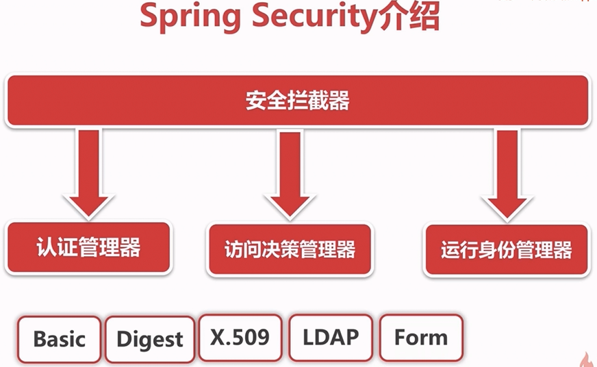
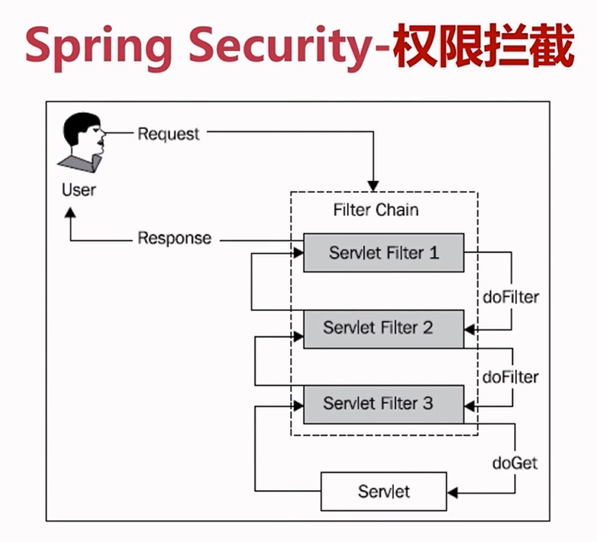
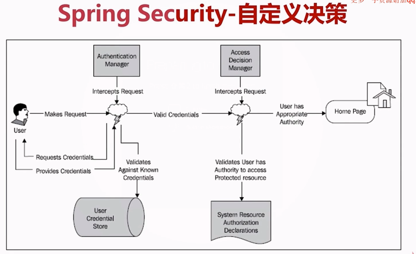

[TOC]


# 一、简介

## 1.简介





## 2.常用权限拦截器

```
FilterChainProxy
DelegatingFilterProxy
```


>- SecurityContextPersistenceFilter
>- 
>
>




### 2.1 SecurityContextPersistenceFilter

旧称为：HttpSessionContextIntegrationFilter，位于过滤器顶端，在执行其他过滤器之前，率先判断用户的session中是否已经存在一个SecurityContext了，


# 二、核心类

AuthenticationManager

AccessDecisionManager

UserDetailsService

UserDetails

Authentication


RBAC


> - AuthenticationManager
> - SecurityContextHolder：提供对SecurityContext的访问
> - SecurityContext,：持有Authentication对象和其他可能需要的信息,其中可以包含多个AuthenticationProvider
> - ProviderManager对象为AuthenticationManager接口的实现类
>         AuthenticationProvider 主要用来进行认证操作的类 调用其中的authenticate()方法去进行认证操作
>         Authentication：Spring Security方式的认证主体
>         GrantedAuthority：对认证主题的应用层面的授权，含当前用户的权限信息，通常使用角色表示
>        UserDetails：构建Authentication对象必须的信息，可以自定义，可能需要访问DB得到
>         UserDetailsService：通过username构建UserDetails对象，通过loadUserByUsername根据userName获取UserDetail对象 （可以在这里基于自身业务进行自定义的实现  如通过数据库，xml,缓存获取等）


# 三、Spring Security权限缓存

CachingUserDetailsService

EhCacheBasedUserCache


# 四、自定义决策





```
AbstractAccessDecisionManager
AccessDecisionVoter

RoleVoter
AffirmativeBased: 一票通过，只要有投票器通过，那就允许访问资源
ConsensusBased： 半数通过才允许访问资源
UnanimousBased：全体一致才允许访问资源
AuthenticatedVoter

```


