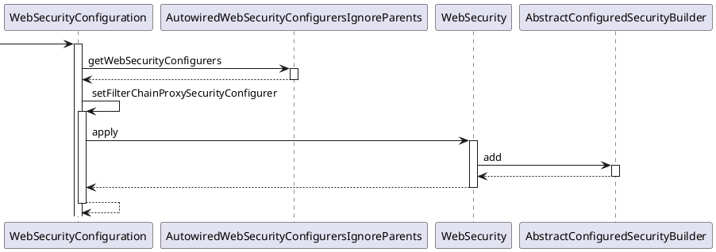
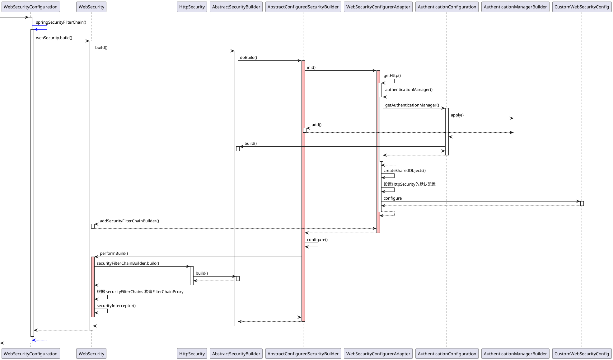
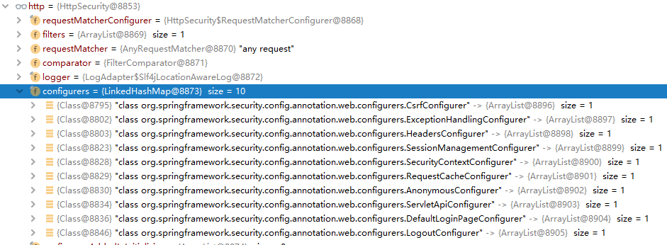
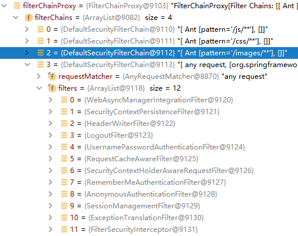
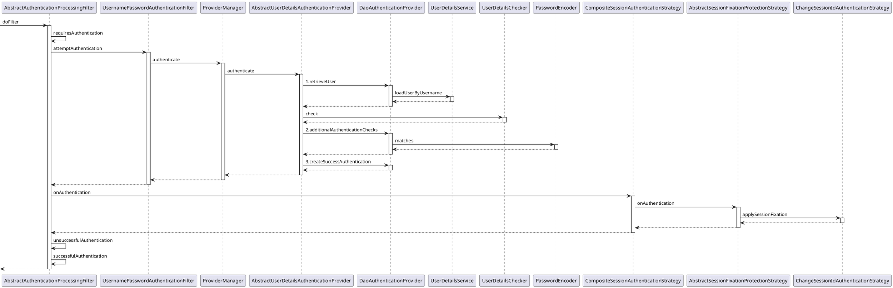

# SpringSecurity_06_源码分析

[toc]

## 推荐阅读

原理：

> - [13. 安全筛选器链_SpringSecurity中文文档](https://www.docs4dev.com/docs/zh/spring-security/4.2.10.RELEASE/reference/security-filter-chain.html)
> - [Spring Security 工作原理概览_江南一点雨](https://blog.csdn.net/u012702547/article/details/89629415)
> - [Spring Security 入门原理及实战](https://www.cnblogs.com/demingblog/p/10874753.html)
> - [Spring Security 进阶-原理篇](https://segmentfault.com/a/1190000018616620)
> - [spring security 5 (6)-认证过滤器](https://blog.csdn.net/wangb_java/article/details/86647035)

源码分析：

> - [spring boot，spring-security 自动配置源码分析](https://blog.csdn.net/zhenghuangyu/article/details/102488941)
> - [Spring Security(六)—SpringSecurityFilterChain 加载流程深度解析](https://www.cnkirito.moe/spring-security-7/)
> - [Spring Security 源码分析八：Spring Security 过滤链一 - 概念与设计](https://www.shangyang.me/2018/02/08/spring-security-sca-8-filterchains-01-concept-and-design/)
> - [Spring 揭秘 -- 寻找遗失的 web.xml](https://www.cnkirito.moe/servlet-explore/)
>
> 


## 环境准备

clone 如下仓库

>dsds

然后运行 AuthInDbApplication 即可


## 一、SpringSecurity 原理

SpringSecurity 基于Servlet过滤器（Filter）

> 在 Java Web 工程中， 一般**使用 Servlet 过滤器（ Filter）对请求进行拦截**，然后在Filter 中通过自己的验证逻辑来决定是否放行请求。同样地，Spring Security 也是基于这个原理，**在进入DispatcherServlet 前**就可以对Spring MVC 的请求进行拦截，然后通过一定的验证，从而决定是否放行请求访问系统。


默认过滤器：

```java
        WebAsyncManagerIntegrationFilter 
        SecurityContextPersistenceFilter 
        HeaderWriterFilter 
        CorsFilter 
        LogoutFilter
        RequestCacheAwareFilter
        SecurityContextHolderAwareRequestFilter
        AnonymousAuthenticationFilter
        SessionManagementFilter
        ExceptionTranslationFilter
        FilterSecurityInterceptor
        UsernamePasswordAuthenticationFilter
        BasicAuthenticationFilter
```


## 二、SpringSecurity 启动过程源码分析

SpringSecurity 主要涉及两个流程：

> - 项目启动时的自动装配
> - 项目运行时的请求拦截与处理

那么下面，将从这两个流程进行源码分析

### 1.启动时的自动装配

主要是往容器中注册一个名为`springSecurityFilterChain` 的Filter


#### 1.1 找到自动配置的入口

对于SpringBoot工程而言，许多自动配置都可以在在`spring-boot-autoconfigure`工程下 `META-INF/spring.factories` 文件中找到。

我们可以在此文件中找到 Spring Security 的配置类：

```properties
org.springframework.boot.autoconfigure.security.servlet.SecurityAutoConfiguration,\
org.springframework.boot.autoconfigure.security.servlet.UserDetailsServiceAutoConfiguration,\
org.springframework.boot.autoconfigure.security.servlet.SecurityFilterAutoConfiguration,\
org.springframework.boot.autoconfigure.security.reactive.ReactiveSecurityAutoConfiguration,\
org.springframework.boot.autoconfigure.security.reactive.ReactiveUserDetailsServiceAutoConfiguration,\
org.springframework.boot.autoconfigure.security.rsocket.RSocketSecurityAutoConfiguration,\
org.springframework.boot.autoconfigure.security.saml2.Saml2RelyingPartyAutoConfiguration,\
org.springframework.boot.autoconfigure.sendgrid.SendGridAutoConfiguration,\
org.springframework.boot.autoconfigure.session.SessionAutoConfiguration,\
org.springframework.boot.autoconfigure.security.oauth2.client.servlet.OAuth2ClientAutoConfiguration,\
org.springframework.boot.autoconfigure.security.oauth2.client.reactive.ReactiveOAuth2ClientAutoConfiguration,\
org.springframework.boot.autoconfigure.security.oauth2.resource.servlet.OAuth2ResourceServerAutoConfiguration,\
org.springframework.boot.autoconfigure.security.oauth2.resource.reactive.ReactiveOAuth2ResourceServerAutoConfiguration,\
```

暂时不考虑reactive及oauth2，只考虑servlet，这涉及到如下配置类：

```java
SecurityAutoConfiguration
UserDetailsServiceAutoConfiguration
SecurityFilterAutoConfiguration
```


三个配置类的作用大致如下：

> - `SecurityAutoConfiguration`: 主要是会往容器中注入一个名为 **springSecurityFilterChain** 的 Bean
> - `SecurityFilterAutoConfiguration`：使用 **springSecurityFilterChain** 向容器中注册一个DelegatingFilterProxyRegistrationBean  的 Filter 
> - `UserDetailsServiceAutoConfiguration`：默认提供一个 **InMemoryUserDetailsManager**，用来做基于内存的用户认证


#### 1.2 SecurityAutoConfiguration

```java
@Configuration(proxyBeanMethods = false)
@ConditionalOnClass(DefaultAuthenticationEventPublisher.class)
@EnableConfigurationProperties(SecurityProperties.class)
@Import({ SpringBootWebSecurityConfiguration.class, WebSecurityEnablerConfiguration.class,
		SecurityDataConfiguration.class })
public class SecurityAutoConfiguration {

	@Bean
	@ConditionalOnMissingBean(AuthenticationEventPublisher.class)
	public DefaultAuthenticationEventPublisher authenticationEventPublisher(ApplicationEventPublisher publisher) {
		return new DefaultAuthenticationEventPublisher(publisher);
	}

}
```


（1）当存在类`DefaultAuthenticationEventPublisher`时，会引入自定义的配置 SecurityProperties，并导入配置类  WebSecurityEnablerConfiguration、SpringBootWebSecurityConfiguration 、SecurityDataConfiguration

> - `WebSecurityEnablerConfiguration`：主要是通过注解 `@EnableWebSecurity`来启用SpringSecurity，其实就是往容器中注入一个名为`springSecurityFilterChain`的 Filter
>
>   
>
> - `SpringBootWebSecurityConfiguration `: 当用户没有自定义一个`WebSecurityConfigurerAdapter`时，提供一个默认的 WebSecurityConfigurerAdapter。但是在实际项目中，我们通常会自定义一个`WebSecurityConfigurerAdapter`，因此此配置通常不会生效。
>
>   ```java
>   @Configuration(proxyBeanMethods = false)
>   @ConditionalOnClass(WebSecurityConfigurerAdapter.class)
>   @ConditionalOnMissingBean(WebSecurityConfigurerAdapter.class)
>   @ConditionalOnWebApplication(type = Type.SERVLET)
>   public class SpringBootWebSecurityConfiguration {
>       
>   	@Configuration(proxyBeanMethods = false)
>   	@Order(SecurityProperties.BASIC_AUTH_ORDER)
>   	static class DefaultConfigurerAdapter extends WebSecurityConfigurerAdapter {
>   	}
>   }
>   ```
>
>   
>
>
> - `SecurityDataConfiguration`: 当项目中集成了 Spring Data 时，注入一个 SecurityEvaluationContextExtension，这样在使用在SpringData中使用 SpringSecurity 相关的表达式，例如：
>
>   ```java
>   @Query("UPDATE AppUser u SET u.lastLogin=:lastLogin WHERE" 
>     +" u.username = ?#{ principal?.username }")
>   public void updateLastLogin (Date lastLogin);
>   ```


（2）因此我们需要关注配置类 WebSecurityEnablerConfiguration 

```java
@Configuration(proxyBeanMethods = false)
@ConditionalOnBean(WebSecurityConfigurerAdapter.class)
@ConditionalOnMissingBean(name = BeanIds.SPRING_SECURITY_FILTER_CHAIN)
@ConditionalOnWebApplication(type = ConditionalOnWebApplication.Type.SERVLET)
@EnableWebSecurity
public class WebSecurityEnablerConfiguration {

}
```


（4）而打开此类源码，可以发现关键配置为注解`@EnableWebSecurity`，主要是导入 两个配置类`WebSecurityConfiguration`、`AuthenticationConfiguration`。

当容器中配置了 Bean`WebSecurityConfigurerAdapter`，但是没有配置Bean `springSecurityFilterChain`时，会通过`@Import`注解 导入 `WebSecurityConfiguration`


```java
@Retention(value = java.lang.annotation.RetentionPolicy.RUNTIME)
@Target(value = { java.lang.annotation.ElementType.TYPE })
@Documented
@Import({ WebSecurityConfiguration.class,
		SpringWebMvcImportSelector.class,
		OAuth2ImportSelector.class })
@EnableGlobalAuthentication
@Configuration
public @interface EnableWebSecurity {

	/**
	 * Controls debugging support for Spring Security. Default is false.
	 * @return if true, enables debug support with Spring Security
	 */
	boolean debug() default false;
}
```


然后再通过注解 `@EnableGlobalAuthentication` 导入`AuthenticationConfiguration`

```
@Retention(value = java.lang.annotation.RetentionPolicy.RUNTIME)
@Target(value = { java.lang.annotation.ElementType.TYPE })
@Documented
@Import(AuthenticationConfiguration.class)
@Configuration
public @interface EnableGlobalAuthentication {
}
```


这样我们就知道其实 SpringSecurity 的核心配置其实就在 `WebSecurityConfiguration`、`AuthenticationConfiguration`这两个配置类中。


#### 1.3 WebSecurityConfiguration 与  AuthenticationConfiguration

##### 1.3.1 WebSecurityConfiguration

```java
@Configuration(proxyBeanMethods = false)
public class WebSecurityConfiguration implements ImportAware, BeanClassLoaderAware {

   /**
	 * Creates the Spring Security Filter Chain
	 * @return the {@link Filter} that represents the security filter chain
	 * @throws Exception
	 */
	@Bean(name = AbstractSecurityWebApplicationInitializer.DEFAULT_FILTER_NAME)
	public Filter springSecurityFilterChain() throws Exception {
		boolean hasConfigurers = webSecurityConfigurers != null
				&& !webSecurityConfigurers.isEmpty();
		if (!hasConfigurers) {
			WebSecurityConfigurerAdapter adapter = objectObjectPostProcessor
					.postProcess(new WebSecurityConfigurerAdapter() {
					});
			webSecurity.apply(adapter);
		}
		return webSecurity.build();
	}

    /**
	 * Sets the {@code <SecurityConfigurer<FilterChainProxy, WebSecurityBuilder>}
	 * instances used to create the web configuration.
	 *
	 * @param objectPostProcessor the {@link ObjectPostProcessor} used to create a
	 * {@link WebSecurity} instance
	 * @param webSecurityConfigurers the
	 * {@code <SecurityConfigurer<FilterChainProxy, WebSecurityBuilder>} instances used to
	 * create the web configuration
	 * @throws Exception
	 */
	@Autowired(required = false)
	public void setFilterChainProxySecurityConfigurer(
			ObjectPostProcessor<Object> objectPostProcessor,
			@Value("#{@autowiredWebSecurityConfigurersIgnoreParents.getWebSecurityConfigurers()}") List<SecurityConfigurer<Filter, WebSecurity>> webSecurityConfigurers)
			throws Exception {
		webSecurity = objectPostProcessor
				.postProcess(new WebSecurity(objectPostProcessor));
		if (debugEnabled != null) {
			webSecurity.debug(debugEnabled);
		}

		webSecurityConfigurers.sort(AnnotationAwareOrderComparator.INSTANCE);

		Integer previousOrder = null;
		Object previousConfig = null;
		for (SecurityConfigurer<Filter, WebSecurity> config : webSecurityConfigurers) {
			Integer order = AnnotationAwareOrderComparator.lookupOrder(config);
			if (previousOrder != null && previousOrder.equals(order)) {
				throw new IllegalStateException(
						"@Order on WebSecurityConfigurers must be unique. Order of "
								+ order + " was already used on " + previousConfig + ", so it cannot be used on "
								+ config + " too.");
			}
			previousOrder = order;
			previousConfig = config;
		}
		for (SecurityConfigurer<Filter, WebSecurity> webSecurityConfigurer : webSecurityConfigurers) {
			webSecurity.apply(webSecurityConfigurer);
		}
		this.webSecurityConfigurers = webSecurityConfigurers;
	}
}
```

在此配置类中，主要是向容器中注入了Bean`springSecurityFilterChain`。
主要步骤如下：

> (1) 构造一个WebSecurity，然后从容器中获取 `WebSecurityConfigurer`类型的Bean,并将其加入到WebSecurity中。在实际项目中，我们通常会通过继承`WebSecurityConfigurerAdapter`这个类来自定义其实现。
> (2) 使用 WebSecurity.build() 方法，构建 `springSecurityFilterChain`,会依次调用WebSecurity的init()、configure()、performBuild()方法
>
> - init: 构造AuthenticationManager并加入到HttpSecurity中，设置HttpSecurity的默认配置，设置HttpSecurity的自定义配置，将 HttpSecurity 加入到WebSecurity的securityFilterChainBuilders 中。
> - configure： 空实现，留作扩展
> - performBuild：使用 WebSecurity的 securityFilterChainBuilders 去构建securityFilterChains，根据securityFilterChains构造 FilterChainProxy，设置 WebSecurity的 FilterSecurityInterceptor 加入到 WebSecurity。最后会返回FilterChainProxy。


##### 1.3.2 AuthenticationConfiguration

```java
@Configuration(proxyBeanMethods = false)
@Import(ObjectPostProcessorConfiguration.class)
public class AuthenticationConfiguration {


	@Bean
	public AuthenticationManagerBuilder authenticationManagerBuilder(
			ObjectPostProcessor<Object> objectPostProcessor, ApplicationContext context) {
		LazyPasswordEncoder defaultPasswordEncoder = new LazyPasswordEncoder(context);
		AuthenticationEventPublisher authenticationEventPublisher = getBeanOrNull(context, AuthenticationEventPublisher.class);

		DefaultPasswordEncoderAuthenticationManagerBuilder result = new DefaultPasswordEncoderAuthenticationManagerBuilder(objectPostProcessor, defaultPasswordEncoder);
		if (authenticationEventPublisher != null) {
			result.authenticationEventPublisher(authenticationEventPublisher);
		}
		return result;
	}

	@Bean
	public static GlobalAuthenticationConfigurerAdapter enableGlobalAuthenticationAutowiredConfigurer(
			ApplicationContext context) {
		return new EnableGlobalAuthenticationAutowiredConfigurer(context);
	}

	@Bean
	public static InitializeUserDetailsBeanManagerConfigurer initializeUserDetailsBeanManagerConfigurer(ApplicationContext context) {
		return new InitializeUserDetailsBeanManagerConfigurer(context);
	}

	@Bean
	public static InitializeAuthenticationProviderBeanManagerConfigurer initializeAuthenticationProviderBeanManagerConfigurer(ApplicationContext context) {
		return new InitializeAuthenticationProviderBeanManagerConfigurer(context);
	}

	public AuthenticationManager getAuthenticationManager() throws Exception {
		if (this.authenticationManagerInitialized) {
			return this.authenticationManager;
		}
		AuthenticationManagerBuilder authBuilder = this.applicationContext.getBean(AuthenticationManagerBuilder.class);
		if (this.buildingAuthenticationManager.getAndSet(true)) {
			return new AuthenticationManagerDelegator(authBuilder);
		}

		for (GlobalAuthenticationConfigurerAdapter config : globalAuthConfigurers) {
			// 向 authBuilder 中添加 EnableGlobalAuthenticationAutowiredConfigurer、InitializeAuthenticationProviderBeanManagerConfigurer、InitializeUserDetailsBeanManagerConfigurer
			authBuilder.apply(config);
		}


// 依次执行上述三个 globalAuthConfigurers 的init、configure、然后执行AuthenticationManagerBuilder的performBuild方法构建出一个 ProviderManager并返回
		authenticationManager = authBuilder.build();

		if (authenticationManager == null) {
			authenticationManager = getAuthenticationManagerBean();
		}

		this.authenticationManagerInitialized = true;
		return authenticationManager;
	}
}

```


#### 1.4 SecurityFilterAutoConfiguration

```java
	@Bean
	@ConditionalOnBean(name = DEFAULT_FILTER_NAME)
	public DelegatingFilterProxyRegistrationBean securityFilterChainRegistration(
			SecurityProperties securityProperties) {
		DelegatingFilterProxyRegistrationBean registration = new DelegatingFilterProxyRegistrationBean(
				DEFAULT_FILTER_NAME);
		registration.setOrder(securityProperties.getFilter().getOrder());
		registration.setDispatcherTypes(getDispatcherTypes(securityProperties));
		return registration;
	}
```


这里主要是代理 `springSecurityFilterChain` ，并往容器中注册了一个 DelegatingFilterProxyRegistrationBean 类型的 Filter


### 2.启动流程时序图

根据前面的内容，我们已经知道，SpringSecurity 启动流程最核心的就是 `springSecurityFilterChain`这个Bean的注册了。因此下面我们就来关注下这个Bean的注册流程。

```java
@Configuration(proxyBeanMethods = false)
public class WebSecurityConfiguration implements ImportAware, BeanClassLoaderAware {

   /**
	 * Creates the Spring Security Filter Chain
	 * @return the {@link Filter} that represents the security filter chain
	 * @throws Exception
	 */
	@Bean(name = AbstractSecurityWebApplicationInitializer.DEFAULT_FILTER_NAME)
	public Filter springSecurityFilterChain() throws Exception {
		boolean hasConfigurers = webSecurityConfigurers != null
				&& !webSecurityConfigurers.isEmpty();
		if (!hasConfigurers) {
			WebSecurityConfigurerAdapter adapter = objectObjectPostProcessor
					.postProcess(new WebSecurityConfigurerAdapter() {
					});
			webSecurity.apply(adapter);
		}
		return webSecurity.build();
	}

    /**
	 * Sets the {@code <SecurityConfigurer<FilterChainProxy, WebSecurityBuilder>}
	 * instances used to create the web configuration.
	 *
	 * @param objectPostProcessor the {@link ObjectPostProcessor} used to create a
	 * {@link WebSecurity} instance
	 * @param webSecurityConfigurers the
	 * {@code <SecurityConfigurer<FilterChainProxy, WebSecurityBuilder>} instances used to
	 * create the web configuration
	 * @throws Exception
	 */
	@Autowired(required = false)
	public void setFilterChainProxySecurityConfigurer(
			ObjectPostProcessor<Object> objectPostProcessor,
			@Value("#{@autowiredWebSecurityConfigurersIgnoreParents.getWebSecurityConfigurers()}") List<SecurityConfigurer<Filter, WebSecurity>> webSecurityConfigurers)
			throws Exception {
		webSecurity = objectPostProcessor
				.postProcess(new WebSecurity(objectPostProcessor));
		if (debugEnabled != null) {
			webSecurity.debug(debugEnabled);
		}

		webSecurityConfigurers.sort(AnnotationAwareOrderComparator.INSTANCE);

		Integer previousOrder = null;
		Object previousConfig = null;
		for (SecurityConfigurer<Filter, WebSecurity> config : webSecurityConfigurers) {
			Integer order = AnnotationAwareOrderComparator.lookupOrder(config);
			if (previousOrder != null && previousOrder.equals(order)) {
				throw new IllegalStateException(
						"@Order on WebSecurityConfigurers must be unique. Order of "
								+ order + " was already used on " + previousConfig + ", so it cannot be used on "
								+ config + " too.");
			}
			previousOrder = order;
			previousConfig = config;
		}
		for (SecurityConfigurer<Filter, WebSecurity> webSecurityConfigurer : webSecurityConfigurers) {
			webSecurity.apply(webSecurityConfigurer);
		}
		this.webSecurityConfigurers = webSecurityConfigurers;
	}
}
```


#### 2.1 setFilterChainProxySecurityConfigurer



这一步主要是为了构造一个WebSecurity：

> 首先构造一个WebSecurity，然后从容器中获取 `WebSecurityConfigurer`类型的Bean,并将其加入到WebSecurity中。在实际项目中，我们通常会通过继承`WebSecurityConfigurerAdapter`这个类来自定义其实现。


#### 2.2 springSecurityFilterChain



构造好 WebSecurity 后，就可以使用 WebSecurity 来创建并注册 springSecurityFilterChain 了。

```java

	/**
	 * Creates the Spring Security Filter Chain
	 * @return the {@link Filter} that represents the security filter chain
	 * @throws Exception
	 */
	@Bean(name = AbstractSecurityWebApplicationInitializer.DEFAULT_FILTER_NAME)
	public Filter springSecurityFilterChain() throws Exception {
		boolean hasConfigurers = webSecurityConfigurers != null
				&& !webSecurityConfigurers.isEmpty();
		if (!hasConfigurers) {
			WebSecurityConfigurerAdapter adapter = objectObjectPostProcessor
					.postProcess(new WebSecurityConfigurerAdapter() {
					});
			webSecurity.apply(adapter);
		}
		return webSecurity.build();
	}

```

程序由`webSecurity.build()`开始，之后会进入`AbstractConfiguredSecurityBuilder.doBuild()`方法，在这里会调用`WebSecurityConfigurerAdapter`的 init、configure、performBuid方法


```java
	@Override
	protected final O doBuild() throws Exception {
		synchronized (configurers) {
			buildState = BuildState.INITIALIZING;

			beforeInit();
			init();

			buildState = BuildState.CONFIGURING;

			beforeConfigure();
			configure();

			buildState = BuildState.BUILDING;

			O result = performBuild();

			buildState = BuildState.BUILT;

			return result;
		}
	}

```


##### 2.2.1 init

初始化时主要做了两件事：

> - 获取一个 `HttpSecurity`，然后将其加入到 `WebSecurity`中，后面会用其创建 `SecurityFilterChain`。
> - 然后通过设置postBuildAction，来挂载一个从容器中获取 FilterSecurityInterceptor 并加入到  `WebSecurity` 中的延迟方法，此方法会在创建完 springSecurityFilterChain 后执行

```java
	public void init(final WebSecurity web) throws Exception {
		final HttpSecurity http = getHttp();
		web.addSecurityFilterChainBuilder(http).postBuildAction(() -> {
			FilterSecurityInterceptor securityInterceptor = http
					.getSharedObject(FilterSecurityInterceptor.class);
			web.securityInterceptor(securityInterceptor);
		});
	}
```
getHttp() 这个方法很重要，SpringSecurity 的过滤器链中一些默认的过滤器就是在这个方法中设置的

```java

	/**
	 * Creates the {@link HttpSecurity} or returns the current instance
	 *
	 * ] * @return the {@link HttpSecurity}
	 * @throws Exception
	 */
	@SuppressWarnings({ "rawtypes", "unchecked" })
	protected final HttpSecurity getHttp() throws Exception {
		if (http != null) {
			return http;
		}

		DefaultAuthenticationEventPublisher eventPublisher = objectPostProcessor
				.postProcess(new DefaultAuthenticationEventPublisher());
		localConfigureAuthenticationBldr.authenticationEventPublisher(eventPublisher);

		// 1.根据 AuthenticationConfiguration 中配置的 AuthenticationManagerBuilder、InitializeUserDetailsBeanManagerConfigurer、InitializeAuthenticationProviderBeanManagerConfigurer来构建AuthenticationManager
		AuthenticationManager authenticationManager = authenticationManager();
		authenticationBuilder.parentAuthenticationManager(authenticationManager);
		authenticationBuilder.authenticationEventPublisher(eventPublisher);
		Map<Class<?>, Object> sharedObjects = createSharedObjects();

		// 2.设置 HttpSecurity 的默认配置
		http = new HttpSecurity(objectPostProcessor, authenticationBuilder,
				sharedObjects);
		if (!disableDefaults) {
			// @formatter:off
			http
				.csrf().and()
				.addFilter(new WebAsyncManagerIntegrationFilter())
				.exceptionHandling().and()
				.headers().and()
				.sessionManagement().and()
				.securityContext().and()
				.requestCache().and()
				.anonymous().and()
				.servletApi().and()
				.apply(new DefaultLoginPageConfigurer<>()).and()
				.logout();
			// @formatter:on
			ClassLoader classLoader = this.context.getClassLoader();
			List<AbstractHttpConfigurer> defaultHttpConfigurers =
					SpringFactoriesLoader.loadFactories(AbstractHttpConfigurer.class, classLoader);

			for (AbstractHttpConfigurer configurer : defaultHttpConfigurers) {
				http.apply(configurer);
			}
		}
		// 3.设置 HttpSecurity 的自定义配置
		configure(http);
		return http;
	}


```

（1）构建 authenticationManager

```java
	protected AuthenticationManager authenticationManager() throws Exception {
		if (!authenticationManagerInitialized) {
			configure(localConfigureAuthenticationBldr);
			if (disableLocalConfigureAuthenticationBldr) {
				authenticationManager = authenticationConfiguration
						.getAuthenticationManager();
			}
			else {
				authenticationManager = localConfigureAuthenticationBldr.build();
			}
			authenticationManagerInitialized = true;
		}
		return authenticationManager;
	}
```

`authenticationConfiguration.getAuthenticationManager()`会执行到配置类 `AuthenticationConfiguration`中


```java
public AuthenticationManager getAuthenticationManager() throws Exception {
   if (this.authenticationManagerInitialized) {
      return this.authenticationManager;
   }
   AuthenticationManagerBuilder authBuilder = this.applicationContext.getBean(AuthenticationManagerBuilder.class);
   if (this.buildingAuthenticationManager.getAndSet(true)) {
      return new AuthenticationManagerDelegator(authBuilder);
   }

   // 1.将EnableGlobalAuthenticationAutowiredConfigurer、InitializeAuthenticationProviderBeanManagerConfigurer、InitializeUserDetailsBeanManagerConfigurer 加入到 authBuilder
   for (GlobalAuthenticationConfigurerAdapter config : globalAuthConfigurers) {
      authBuilder.apply(config);
   }

    // 2.分别执行上述三个 GlobalAuthenticationConfigurerAdapter 的 init、configure，然后执行 AuthenticationManagerBuilder.performBuild 来构建一个 ProviderManager 并返回
   authenticationManager = authBuilder.build();

   if (authenticationManager == null) {
      authenticationManager = getAuthenticationManagerBean();
   }

   this.authenticationManagerInitialized = true;
   return authenticationManager;
}
```


获取 AuthenticationManager 时，首先会将EnableGlobalAuthenticationAutowiredConfigurer、InitializeAuthenticationProviderBeanManagerConfigurer、InitializeUserDetailsBeanManagerConfigurer 这三个GlobalAuthenticationConfigurerAdapter 加入到 authBuilder。

然后执行`authBuilder.build()` 方法时，会先执行 上面三个GlobalAuthenticationConfigurerAdapter  的init、configure方法。


```java
@Order(InitializeUserDetailsBeanManagerConfigurer.DEFAULT_ORDER)
class InitializeUserDetailsBeanManagerConfigurer
		extends GlobalAuthenticationConfigurerAdapter {

    class InitializeUserDetailsManagerConfigurer
			extends GlobalAuthenticationConfigurerAdapter {
		@Override
		public void configure(AuthenticationManagerBuilder auth) throws Exception {
			if (auth.isConfigured()) {
				return;
			}
			UserDetailsService userDetailsService = getBeanOrNull(
					UserDetailsService.class);
			if (userDetailsService == null) {
				return;
			}

			PasswordEncoder passwordEncoder = getBeanOrNull(PasswordEncoder.class);
			UserDetailsPasswordService passwordManager = getBeanOrNull(UserDetailsPasswordService.class);

			DaoAuthenticationProvider provider = new DaoAuthenticationProvider();
			provider.setUserDetailsService(userDetailsService);
			if (passwordEncoder != null) {
				provider.setPasswordEncoder(passwordEncoder);
			}
			if (passwordManager != null) {
				provider.setUserDetailsPasswordService(passwordManager);
			}
			provider.afterPropertiesSet();

			auth.authenticationProvider(provider);
		}

```

在 `InitializeUserDetailsBeanManagerConfigurer`类下的 configure 方法中，会获取一个自定义或默认配置的 UserDetailsService、PasswordEncoder，并根据这个两个Bean 来生成 DaoAuthenticationProvider ，并将其加入到  AuthenticationManagerBuilder 中。


```java
@Order(InitializeAuthenticationProviderBeanManagerConfigurer.DEFAULT_ORDER)
class InitializeAuthenticationProviderBeanManagerConfigurer
		extends GlobalAuthenticationConfigurerAdapter {
    
	class InitializeUserDetailsManagerConfigurer
			extends GlobalAuthenticationConfigurerAdapter {
		@Override
		public void configure(AuthenticationManagerBuilder auth) {
			if (auth.isConfigured()) {
				return;
			}
			AuthenticationProvider authenticationProvider = getBeanOrNull(
					AuthenticationProvider.class);
			if (authenticationProvider == null) {
				return;
			}


			auth.authenticationProvider(authenticationProvider);
		}
```

在`InitializeAuthenticationProviderBeanManagerConfigurer`类下的 configure 方法中，会获取一个 `AuthenticationProvider` 并将其加入 AuthenticationManagerBuilder 中。


接着会执行`AuthenticationManagerBuilder.performBuild ()`方法来创建一个 ProviderManager 并返回

```
protected ProviderManager performBuild() throws Exception {
   if (!isConfigured()) {
      logger.debug("No authenticationProviders and no parentAuthenticationManager defined. Returning null.");
      return null;
   }
   ProviderManager providerManager = new ProviderManager(authenticationProviders,
         parentAuthenticationManager);
   if (eraseCredentials != null) {
      providerManager.setEraseCredentialsAfterAuthentication(eraseCredentials);
   }
   if (eventPublisher != null) {
      providerManager.setAuthenticationEventPublisher(eventPublisher);
   }
   providerManager = postProcess(providerManager);
   return providerManager;
}
```

这样就创建好了authenticationManager


（2） 设置 HttpSecurity 的默认配置

```java
http = new HttpSecurity(objectPostProcessor, authenticationBuilder,
				sharedObjects);
		if (!disableDefaults) {
			// @formatter:off
			http
				.csrf().and()
				.addFilter(new WebAsyncManagerIntegrationFilter())
				.exceptionHandling().and()
				.headers().and()
				.sessionManagement().and()
				.securityContext().and()
				.requestCache().and()
				.anonymous().and()
				.servletApi().and()
				.apply(new DefaultLoginPageConfigurer<>()).and()
				.logout();
```


这一步会向 HttpSecurity  中加入一批Filter配置器，以`securityContext()`为例，会向`HttpSecurity`中添加一个 `SecurityContextConfigurer`

```java
	public SecurityContextConfigurer<HttpSecurity> securityContext() throws Exception {
		return getOrApply(new SecurityContextConfigurer<>());
	}
```

而在后面执行 `HttpSecurity.build()`方法时，会执行这些 `Configurer` 的 configure 方法，因此我们来看看 `SecurityContextConfigurer` 的  configure 方法中究竟做了什么

```java
	@Override
	@SuppressWarnings("unchecked")
	public void configure(H http) {
		securityContextRequestFilter.setAuthenticationManager(http
				.getSharedObject(AuthenticationManager.class));
		ExceptionHandlingConfigurer<H> exceptionConf = http
				.getConfigurer(ExceptionHandlingConfigurer.class);
		AuthenticationEntryPoint authenticationEntryPoint = exceptionConf == null ? null
				: exceptionConf.getAuthenticationEntryPoint(http);
		securityContextRequestFilter
				.setAuthenticationEntryPoint(authenticationEntryPoint);
		LogoutConfigurer<H> logoutConf = http.getConfigurer(LogoutConfigurer.class);
		List<LogoutHandler> logoutHandlers = logoutConf == null ? null : logoutConf
				.getLogoutHandlers();
		securityContextRequestFilter.setLogoutHandlers(logoutHandlers);
		AuthenticationTrustResolver trustResolver = http
				.getSharedObject(AuthenticationTrustResolver.class);
		if (trustResolver != null) {
			securityContextRequestFilter.setTrustResolver(trustResolver);
		}
		ApplicationContext context = http.getSharedObject(ApplicationContext.class);
		if (context != null) {
			String[] grantedAuthorityDefaultsBeanNames = context.getBeanNamesForType(GrantedAuthorityDefaults.class);
			if (grantedAuthorityDefaultsBeanNames.length == 1) {
				GrantedAuthorityDefaults grantedAuthorityDefaults = context.getBean(grantedAuthorityDefaultsBeanNames[0], GrantedAuthorityDefaults.class);
				securityContextRequestFilter.setRolePrefix(grantedAuthorityDefaults.getRolePrefix());
			}
		}
		securityContextRequestFilter = postProcess(securityContextRequestFilter);
		http.addFilter(securityContextRequestFilter);
	}
```

可以看到是加入了一个 `securityContextRequestFilter`。

同理， 设置 HttpSecurity 的默认配置时的其他操作也是使用同样的方法加入了一批 Filter 的。




可以看到 HttpSecurity 默认配置了如下10个 Configurer

```java
class org.springframework.security.config.annotation.web.configurers.CsrfConfigurer
class org.springframework.security.config.annotation.web.configurers.ExceptionHandlingConfigurer
class org.springframework.security.config.annotation.web.configurers.HeadersConfigurer
class org.springframework.security.config.annotation.web.configurers.SessionManagementConfigurer
class org.springframework.security.config.annotation.web.configurers.SecurityContextConfigurer
class org.springframework.security.config.annotation.web.configurers.RequestCacheConfigurer
class org.springframework.security.config.annotation.web.configurers.AnonymousConfigurer
class org.springframework.security.config.annotation.web.configurers.ServletApiConfigurer
class org.springframework.security.config.annotation.web.configurers.DefaultLoginPageConfigurer
class org.springframework.security.config.annotation.web.configurers.LogoutConfigurer
```


（3） 设置 HttpSecurity 的自定义配置

通常我们会自定义一个配置类继承WebSecurityConfigurerAdapter 来实现自定义的配置，如：

```java
@Configuration
@EnableWebSecurity
@EnableGlobalMethodSecurity(prePostEnabled = true)
public class WebSecurityConfiguration extends WebSecurityConfigurerAdapter {

    @Override
    protected void configure(AuthenticationManagerBuilder auth) throws Exception {
        // 基于数据库的认证
        auth.userDetailsService(detailsService())
                .passwordEncoder(passwordEncoder());
    }

    @Override
    protected void configure(HttpSecurity http) throws Exception {
        http.authorizeRequests()                            // 定义哪些URL需要被保护、哪些不需要被保护
                .antMatchers( "/login","/registry","/loginProcessing","/user/add").permitAll()   // 设置所有人都可以访问登录页面
                .anyRequest().authenticated()               // 任何请求,登录后可以访问
            .and().formLogin()                              // 定义当需要用户登录时候，转到的登录页面。
                .loginPage("/login")                        // 设置登录页面
                .loginProcessingUrl("/loginProcessing")          // 自定义的登录接口
                .defaultSuccessUrl("/home")                 // 登录成功之后，默认跳转的页面
                .failureUrl("/login?error").permitAll()     // 登录失败后，跳转到登录页面
            .and().logout().logoutSuccessUrl("/login").permitAll()  // 登出之后，跳转到登录页面
            .and().rememberMe().tokenValiditySeconds(1209600)   // 记住我
            .and().csrf().disable();                        // 关闭csrf防护

    }

    @Override
    public void configure(WebSecurity web) throws Exception {
        web.ignoring().antMatchers("/js/**", "/css/**", "/images/**");
    }


    @Bean
    PasswordEncoder passwordEncoder(){
        return PasswordEncoderFactories.createDelegatingPasswordEncoder();
        // return new BCryptPasswordEncoder();
    }

    @Bean
    UserDetailsService detailsService() {
        return new UserDetailsServiceImpl();
    }
}
```

此时就会执行这些自定义配置，设置了自定义配置后，发现 HttpSecurity 下配置的Configurer变为：

```java
// class org.springframework.security.config.annotation.web.configurers.CsrfConfigurer 被移除了
class org.springframework.security.config.annotation.web.configurers.ExceptionHandlingConfigurer
class org.springframework.security.config.annotation.web.configurers.HeadersConfigurer
class org.springframework.security.config.annotation.web.configurers.SessionManagementConfigurer
class org.springframework.security.config.annotation.web.configurers.SecurityContextConfigurer
class org.springframework.security.config.annotation.web.configurers.RequestCacheConfigurer
class org.springframework.security.config.annotation.web.configurers.AnonymousConfigurer
class org.springframework.security.config.annotation.web.configurers.ServletApiConfigurer
class org.springframework.security.config.annotation.web.configurers.DefaultLoginPageConfigurer
class org.springframework.security.config.annotation.web.configurers.LogoutConfigurer

// 新增如下三个Configurer
class org.springframework.security.config.annotation.web.configurers.ExpressionUrlAuthorizationConfigurer
class org.springframework.security.config.annotation.web.configurers.FormLoginConfigurer
class org.springframework.security.config.annotation.web.configurers.RememberMeConfigurer
```


##### 2.2.2 configure

此方法是一个空方法

```java
	public void configure(WebSecurity web) throws Exception {
	}
```


##### 2.2.3 performBuild

```java
	protected Filter performBuild() throws Exception {
		Assert.state(
				!securityFilterChainBuilders.isEmpty(),
				() -> "At least one SecurityBuilder<? extends SecurityFilterChain> needs to be specified. "
						+ "Typically this done by adding a @Configuration that extends WebSecurityConfigurerAdapter. "
						+ "More advanced users can invoke "
						+ WebSecurity.class.getSimpleName()
						+ ".addSecurityFilterChainBuilder directly");
		int chainSize = ignoredRequests.size() + securityFilterChainBuilders.size();
		List<SecurityFilterChain> securityFilterChains = new ArrayList<>(
				chainSize);
		for (RequestMatcher ignoredRequest : ignoredRequests) {
			securityFilterChains.add(new DefaultSecurityFilterChain(ignoredRequest));
		}
		for (SecurityBuilder<? extends SecurityFilterChain> securityFilterChainBuilder : securityFilterChainBuilders) {
            // 1.执行 HttpSecurity.build构建出 DefaultSecurityFilterChain
			securityFilterChains.add(securityFilterChainBuilder.build());
		}
        
        // 2.创建 FilterChainProxy
		FilterChainProxy filterChainProxy = new FilterChainProxy(securityFilterChains);
		if (httpFirewall != null) {
			filterChainProxy.setFirewall(httpFirewall);
		}
		filterChainProxy.afterPropertiesSet();

		Filter result = filterChainProxy;
		if (debugEnabled) {
			logger.warn("\n\n"
					+ "********************************************************************\n"
					+ "**********        Security debugging is enabled.       *************\n"
					+ "**********    This may include sensitive information.  *************\n"
					+ "**********      Do not use in a production system!     *************\n"
					+ "********************************************************************\n\n");
			result = new DebugFilter(filterChainProxy);
		}
		postBuildAction.run();
		return result;
	}
```


（1）HttpSecurity.build 方法会先执行前面加入到 HttpSecurity 中的那些 Configurer的init、configre方法，这样就把那些 Filter加入到 HttpSecurity 中，然后会执行 HttpSecurity.performBuild()

```java
	@Override
	protected DefaultSecurityFilterChain performBuild() {
		filters.sort(comparator);
		return new DefaultSecurityFilterChain(requestMatcher, filters);
	}
```

首先会将过滤器排序，顺序在`FilterComparator`中：

```java
final class FilterComparator implements Comparator<Filter>, Serializable {
	private static final int INITIAL_ORDER = 100;
	private static final int ORDER_STEP = 100;
	private final Map<String, Integer> filterToOrder = new HashMap<>();

	FilterComparator() {
		Step order = new Step(INITIAL_ORDER, ORDER_STEP);
		put(ChannelProcessingFilter.class, order.next());
		put(ConcurrentSessionFilter.class, order.next());
		put(WebAsyncManagerIntegrationFilter.class, order.next());
		put(SecurityContextPersistenceFilter.class, order.next());
		put(HeaderWriterFilter.class, order.next());
		put(CorsFilter.class, order.next());
		put(CsrfFilter.class, order.next());
		put(LogoutFilter.class, order.next());
		filterToOrder.put(
			"org.springframework.security.oauth2.client.web.OAuth2AuthorizationRequestRedirectFilter",
				order.next());
		filterToOrder.put(
				"org.springframework.security.saml2.provider.service.servlet.filter.Saml2WebSsoAuthenticationRequestFilter",
				order.next());
		put(X509AuthenticationFilter.class, order.next());
		put(AbstractPreAuthenticatedProcessingFilter.class, order.next());
		filterToOrder.put("org.springframework.security.cas.web.CasAuthenticationFilter",
				order.next());
		filterToOrder.put(
			"org.springframework.security.oauth2.client.web.OAuth2LoginAuthenticationFilter",
				order.next());
		filterToOrder.put(
				"org.springframework.security.saml2.provider.service.servlet.filter.Saml2WebSsoAuthenticationFilter",
				order.next());
		put(UsernamePasswordAuthenticationFilter.class, order.next());
		put(ConcurrentSessionFilter.class, order.next());
		filterToOrder.put(
				"org.springframework.security.openid.OpenIDAuthenticationFilter", order.next());
		put(DefaultLoginPageGeneratingFilter.class, order.next());
		put(DefaultLogoutPageGeneratingFilter.class, order.next());
		put(ConcurrentSessionFilter.class, order.next());
		put(DigestAuthenticationFilter.class, order.next());
		filterToOrder.put(
				"org.springframework.security.oauth2.server.resource.web.BearerTokenAuthenticationFilter", order.next());
		put(BasicAuthenticationFilter.class, order.next());
		put(RequestCacheAwareFilter.class, order.next());
		put(SecurityContextHolderAwareRequestFilter.class, order.next());
		put(JaasApiIntegrationFilter.class, order.next());
		put(RememberMeAuthenticationFilter.class, order.next());
		put(AnonymousAuthenticationFilter.class, order.next());
		filterToOrder.put(
			"org.springframework.security.oauth2.client.web.OAuth2AuthorizationCodeGrantFilter",
				order.next());
		put(SessionManagementFilter.class, order.next());
		put(ExceptionTranslationFilter.class, order.next());
		put(FilterSecurityInterceptor.class, order.next());
		put(SwitchUserFilter.class, order.next());
	}

```


然后使用 AnyRequestMatcher  和前面创建的 filters 来创建一个 DefaultSecurityFilterChain 


（2）然后使用 securityFilterChains 创建 FilterChainProxy，这样 springSecurityFilterChain 就创建好了

可以看到项目中自定义配置的 WebSecurityConfigurerAdapter 一共产生如下 12 个 Filter




```java
WebAsyncManagerIntegrationFilter
SecurityContextPersistenceFilter
HeaderWriterFilter
LogoutFilter
UsernamePasswordAuthenticationFilter
RequestCacheAwareFilter
SecurityContextHolderAwareRequestFilter
RememberMeAuthenticationFilter
AnonymousAuthenticationFilter
SessionManagementFilter
ExceptionTranslationFilter
FilterSecurityInterceptor
```


#### 2.3 注册DelegatingFilterProxyRegistrationBean

```java
@Configuration(proxyBeanMethods = false)
@ConditionalOnWebApplication(type = Type.SERVLET)
@EnableConfigurationProperties(SecurityProperties.class)
@ConditionalOnClass({ AbstractSecurityWebApplicationInitializer.class, SessionCreationPolicy.class })
@AutoConfigureAfter(SecurityAutoConfiguration.class)
public class SecurityFilterAutoConfiguration {

	private static final String DEFAULT_FILTER_NAME = AbstractSecurityWebApplicationInitializer.DEFAULT_FILTER_NAME;

	@Bean
	@ConditionalOnBean(name = DEFAULT_FILTER_NAME)
	public DelegatingFilterProxyRegistrationBean securityFilterChainRegistration(
			SecurityProperties securityProperties) {
		DelegatingFilterProxyRegistrationBean registration = new DelegatingFilterProxyRegistrationBean(
				DEFAULT_FILTER_NAME);
		registration.setOrder(securityProperties.getFilter().getOrder());
		registration.setDispatcherTypes(getDispatcherTypes(securityProperties));
		return registration;
	}
```

DelegatingFilterProxyRegistrationBean 是一个 `ServletContextInitializer`，作用是会向 Servlet 3.0+ 容器中注册一个 DelegatingFilterProxy，也就是向容器中加入 `springSecurityFilterChain` 这个Filter。

那根据 `DelegatingFilterProxyRegistrationBean` 往Servlet容器中添加 `springSecurityFilterChain` 这个Filter，这个操作是在什么时候发生的呢？

> 在应用启动时，在`ServletContextInitializerBeans`类中，会获取所有的ServletContextInitializer， 然后并将其中的`DelegatingFilterProxyRegistrationBean`注册成一个Filter

```java
   private void addServletContextInitializerBeans(ListableBeanFactory beanFactory) {
		for (Class<? extends ServletContextInitializer> initializerType : this.initializerTypes) {
			for (Entry<String, ? extends ServletContextInitializer> initializerBean : getOrderedBeansOfType(beanFactory,
					initializerType)) {
				addServletContextInitializerBean(initializerBean.getKey(), initializerBean.getValue(), beanFactory);
			}
		}
	}

	private void addServletContextInitializerBean(String beanName, ServletContextInitializer initializer,
			ListableBeanFactory beanFactory) {
		if (initializer instanceof ServletRegistrationBean) {
			Servlet source = ((ServletRegistrationBean<?>) initializer).getServlet();
			addServletContextInitializerBean(Servlet.class, beanName, initializer, beanFactory, source);
		}
		else if (initializer instanceof FilterRegistrationBean) {
			Filter source = ((FilterRegistrationBean<?>) initializer).getFilter();
			addServletContextInitializerBean(Filter.class, beanName, initializer, beanFactory, source);
		}
		else if (initializer instanceof DelegatingFilterProxyRegistrationBean) {
			String source = ((DelegatingFilterProxyRegistrationBean) initializer).getTargetBeanName();
			addServletContextInitializerBean(Filter.class, beanName, initializer, beanFactory, source);
		}
		else if (initializer instanceof ServletListenerRegistrationBean) {
			EventListener source = ((ServletListenerRegistrationBean<?>) initializer).getListener();
			addServletContextInitializerBean(EventListener.class, beanName, initializer, beanFactory, source);
		}
		else {
			addServletContextInitializerBean(ServletContextInitializer.class, beanName, initializer, beanFactory,
					initializer);
		}
	}

```

至此，启动流程完结


### 3.DelegatingFilterProxyRegistrationBean、DelegatingFilterProxy、FilterChainProxy 、SecurityFilterChain的区别

DelegatingFilterProxy 即为过滤器链`springSecurityFilterChain` 。DelegatingFilterProxy 代理了一个对象既`FilterChainProxy`，一个 FilterChainProxy 可以包含 1 个或者多个`SecurityFilterChain`对象；每一个 SecurityFilterChain 又可以包含多个不同的 Filters 进而构成一个特定的安全链，


（1）DelegatingFilterProxyRegistrationBean

DelegatingFilterProxyRegistrationBean 是一个 `ServletContextInitializer`，作用是会向 Servlet 3.0+ 容器中注册一个 DelegatingFilterProxy，也就是向容器中加入 `springSecurityFilterChain` 这个Filter。


对于 DelegatingFilterProxyRegistrationBean 类型的Bean， Spring会调用其 `getFilter() `获取一个实际的Filter的代理对象，并当做 Filter 加入到Servlet容器中

```java
	// DelegatingFilterProxyRegistrationBean 
    @Override
	public DelegatingFilterProxy getFilter() {
		return new DelegatingFilterProxy(this.targetBeanName, getWebApplicationContext()) {

			@Override
			protected void initFilterBean() throws ServletException {
				// Don't initialize filter bean on init()
			}

		};
	}
```


（2）DelegatingFilterProxy

> - Proxy for a standard Servlet Filter, delegating to a Spring-managed bean that implements the Filter interface.
> - This approach is particularly useful for Filter implementation with complex setup needs, allowing to apply the full Spring bean definition machinery to  Filter instances. 

DelegatingFilterProxy 为标准Servlet过滤器提供代理，会将具体的过滤逻辑委派给Spring容器中的实现了Filter的Bean.

注意它的包结构：org.springframework.web.filter，它本身是 Spring Web 包中的类，并不是 SpringSecurity 中的类。因为 Spring 考虑到了多种使用场景，自然希望将侵入性降到最低，所以使用了这个委托代理类来代理真正的 SpringSecurityFilterChain。

```java
package org.springframework.web.filter;

public class DelegatingFilterProxy extends GenericFilterBean {

   private WebApplicationContext webApplicationContext;
   // springSecurityFilterChain
   private String targetBeanName;
   // <1> 关键点
   private volatile Filter delegate;
   private final Object delegateMonitor = new Object();

   public DelegatingFilterProxy(String targetBeanName, WebApplicationContext wac) {
      Assert.hasText(targetBeanName, "Target Filter bean name must not be null or empty");
      this.setTargetBeanName(targetBeanName);
      this.webApplicationContext = wac;
      if (wac != null) {
         this.setEnvironment(wac.getEnvironment());
      }
   }

	@Override
	protected void initFilterBean() throws ServletException {
		synchronized (this.delegateMonitor) {
			if (this.delegate == null) {
				// If no target bean name specified, use filter name.
				if (this.targetBeanName == null) {
					this.targetBeanName = getFilterName();
				}
				// Fetch Spring root application context and initialize the delegate early,
				// if possible. If the root application context will be started after this
				// filter proxy, we'll have to resort to lazy initialization.
				WebApplicationContext wac = findWebApplicationContext();
				if (wac != null) {
					this.delegate = initDelegate(wac);
				}
			}
		}
	}

   @Override
   public void doFilter(ServletRequest request, ServletResponse response, FilterChain filterChain)
         throws ServletException, IOException {

      // 过滤器代理支持懒加载
      Filter delegateToUse = this.delegate;
      if (delegateToUse == null) {
         synchronized (this.delegateMonitor) {
            delegateToUse = this.delegate;
            if (delegateToUse == null) {
               WebApplicationContext wac = findWebApplicationContext();
               delegateToUse = initDelegate(wac);
            }
            this.delegate = delegateToUse;
         }
      }

      // 让代理过滤器执行实际的过滤行为
      invokeDelegate(delegateToUse, request, response, filterChain);
   }

   // 初始化过滤器代理
   // <2>
   protected Filter initDelegate(WebApplicationContext wac) throws ServletException {
		String targetBeanName = getTargetBeanName();
		Assert.state(targetBeanName != null, "No target bean name set");
		Filter delegate = wac.getBean(targetBeanName, Filter.class);
		if (isTargetFilterLifecycle()) {
			delegate.init(getFilterConfig());
		}
		return delegate;
	}


   // 调用代理过滤器	
   protected void invokeDelegate(
			Filter delegate, ServletRequest request, ServletResponse response, FilterChain filterChain)
			throws ServletException, IOException {

		delegate.doFilter(request, response, filterChain);
   }

}
```


<1> 可以发现 DelegatingFilterProxy 的作用其实就是为  delegate 提供代理

<2> 可以看到 delegate  其实就是Spring容器中名为 targetBeanName  的Bean，此处也就是 springSecurityFilterChain


（3）FilterChainProxy 和 SecurityFilterChain

`org.springframework.security.web.FilterChainProxy` 已经是 SpringSecurity 提供的类了，他就是真正的`springSecurityFilterChain`

```java
public class FilterChainProxy extends GenericFilterBean {
   // <1> 包含了多个 SecurityFilterChain
   private List<SecurityFilterChain> filterChains;

   public FilterChainProxy(SecurityFilterChain chain) {
      this(Arrays.asList(chain));
   }

   public FilterChainProxy(List<SecurityFilterChain> filterChains) {
      this.filterChains = filterChains;
   }

   @Override
   public void afterPropertiesSet() {
      filterChainValidator.validate(this);
   }

   public void doFilter(ServletRequest request, ServletResponse response,
         FilterChain chain) throws IOException, ServletException {
         doFilterInternal(request, response, chain);
   }

   private void doFilterInternal(ServletRequest request, ServletResponse response,
         FilterChain chain) throws IOException, ServletException {

      FirewalledRequest fwRequest = firewall
            .getFirewalledRequest((HttpServletRequest) request);
      HttpServletResponse fwResponse = firewall
            .getFirewalledResponse((HttpServletResponse) response);
	  // <1>	
      List<Filter> filters = getFilters(fwRequest);

      if (filters == null || filters.size() == 0) {
         fwRequest.reset();
         chain.doFilter(fwRequest, fwResponse);
         return;
      }

      VirtualFilterChain vfc = new VirtualFilterChain(fwRequest, chain, filters);
      vfc.doFilter(fwRequest, fwResponse);
   }

   /**
    * <1> 可能会有多个过滤器链，返回第一个和请求 URL 匹配的过滤器链
    */
   private List<Filter> getFilters(HttpServletRequest request) {
      for (SecurityFilterChain chain : filterChains) {
         if (chain.matches(request)) {
            return chain.getFilters();
         }
      }
      return null;
   }

}
```


 FilterChainProxy 内部维护了多个过滤器链，每次请求时，会根据过滤器链自身设置的请求匹配器去进行匹配，匹配成功的过滤器就可以执行自己的过滤逻辑，每个 request 最多只会经过一个 SecurityFilterChain。

SecurityFilterChain  才是真正的过滤器链

```java
public final class DefaultSecurityFilterChain implements SecurityFilterChain {
   private final RequestMatcher requestMatcher;
   private final List<Filter> filters;

   public List<Filter> getFilters() {
      return filters;
   }

   public boolean matches(HttpServletRequest request) {
      return requestMatcher.matches(request);
   }
}
```


### 4.启动过程总结

（1）注入 DelegatingFilterProxyRegistrationBean 

在启动过程，主要是往容器中注入了一个 DelegatingFilterProxyRegistrationBean 类型的Bean

（2）获取 DelegatingFilterProxy

而在Web容器启动时，会遍历所有Bean，并会根据 DelegatingFilterProxyRegistrationBean  类型的Bean 获取 DelegatingFilterProxy，

```java
	// DelegatingFilterProxyRegistrationBean 
    @Override
	public DelegatingFilterProxy getFilter() {
		return new DelegatingFilterProxy(this.targetBeanName, getWebApplicationContext()) {

			@Override
			protected void initFilterBean() throws ServletException {
				// Don't initialize filter bean on init()
			}

		};
	}
```


（3）执行过滤器链 `FilterChainProxy`

而 DelegatingFilterProxy 实际上代理了真正的`springSecurityFilterChain`，也即 FilterChainProxy。

过滤器链的入口如下：

```java
	// FilterChainProxy
    @Override
	public void doFilter(ServletRequest request, ServletResponse response,
			FilterChain chain) throws IOException, ServletException {
		boolean clearContext = request.getAttribute(FILTER_APPLIED) == null;
		if (clearContext) {
			try {
				request.setAttribute(FILTER_APPLIED, Boolean.TRUE);
				doFilterInternal(request, response, chain);
			}
			finally {
				SecurityContextHolder.clearContext();
				request.removeAttribute(FILTER_APPLIED);
			}
		}
		else {
			doFilterInternal(request, response, chain);
		}
	}

	private void doFilterInternal(ServletRequest request, ServletResponse response,
			FilterChain chain) throws IOException, ServletException {

		FirewalledRequest fwRequest = firewall
				.getFirewalledRequest((HttpServletRequest) request);
		HttpServletResponse fwResponse = firewall
				.getFirewalledResponse((HttpServletResponse) response);

        // <1> 获取过滤器链
		List<Filter> filters = getFilters(fwRequest);

		if (filters == null || filters.size() == 0) {
			if (logger.isDebugEnabled()) {
				logger.debug(UrlUtils.buildRequestUrl(fwRequest)
						+ (filters == null ? " has no matching filters"
								: " has an empty filter list"));
			}

			fwRequest.reset();

			chain.doFilter(fwRequest, fwResponse);

			return;
		}

		VirtualFilterChain vfc = new VirtualFilterChain(fwRequest, chain, filters);
        // <2> 执行过滤器链
		vfc.doFilter(fwRequest, fwResponse);
	}
```


<1> 获取过滤器链，具体的过滤器链是启动时根据`Configurer`构建的，包含如下Filter

```java
WebAsyncManagerIntegrationFilter
SecurityContextPersistenceFilter
HeaderWriterFilter
LogoutFilter
UsernamePasswordAuthenticationFilter
RequestCacheAwareFilter
SecurityContextHolderAwareRequestFilter
RememberMeAuthenticationFilter
AnonymousAuthenticationFilter
SessionManagementFilter
ExceptionTranslationFilter
FilterSecurityInterceptor
```


<2> 接着就是执行过滤器链

## 三、认证流程源码分析

前面我们知道了过滤器链执行的入口，以及过滤器链的组成。那么我们就可以开始对认证流程进行分析




(1) attemptAuthentication

```java
	public Authentication attemptAuthentication(HttpServletRequest request,
			HttpServletResponse response) throws AuthenticationException {
		if (postOnly && !request.getMethod().equals("POST")) {
			throw new AuthenticationServiceException(
					"Authentication method not supported: " + request.getMethod());
		}
		// 获取请求的用户名
		String username = obtainUsername(request);
		// 获取请求的密码
		String password = obtainPassword(request);

		if (username == null) {
			username = "";
		}

		if (password == null) {
			password = "";
		}

		username = username.trim();
		// 根据用户名和密码构建 UsernamePasswordAuthenticationToken
		UsernamePasswordAuthenticationToken authRequest = new UsernamePasswordAuthenticationToken(
				username, password);

		// Allow subclasses to set the "details" property
		setDetails(request, authRequest);

		//使用 AuthenticationManager 去执行认证逻辑, 其具体实现类为 ProviderManager. ProviderManager 主要是管理 AuthenticationProvider。 
		//具体认证逻辑的执行需要借助其实现类DaoAuthenticationProvider
		return this.getAuthenticationManager().authenticate(authRequest);
	}

```

(2) retrieveUser
```java
	protected final UserDetails retrieveUser(String username,
			UsernamePasswordAuthenticationToken authentication)
			throws AuthenticationException {
		prepareTimingAttackProtection();
		try {
			// 启动时会注入自定义或者默认的 UserDetailsService 接口的实现类，然后借其根据用户名加载 UserDetails
			UserDetails loadedUser = this.getUserDetailsService().loadUserByUsername(username);
			if (loadedUser == null) {
				throw new InternalAuthenticationServiceException(
						"UserDetailsService returned null, which is an interface contract violation");
			}
			return loadedUser;
		}
		catch (UsernameNotFoundException ex) {
			mitigateAgainstTimingAttack(authentication);
			throw ex;
		}
		catch (InternalAuthenticationServiceException ex) {
			throw ex;
		}
		catch (Exception ex) {
			throw new InternalAuthenticationServiceException(ex.getMessage(), ex);
		}
	}
```

(3) check

验证密码之前会验证下账号的有效性

```java
	private class DefaultPreAuthenticationChecks implements UserDetailsChecker {
		public void check(UserDetails user) {
			if (!user.isAccountNonLocked()) {
				logger.debug("User account is locked");

				throw new LockedException(messages.getMessage(
						"AbstractUserDetailsAuthenticationProvider.locked",
						"User account is locked"));
			}

			if (!user.isEnabled()) {
				logger.debug("User account is disabled");

				throw new DisabledException(messages.getMessage(
						"AbstractUserDetailsAuthenticationProvider.disabled",
						"User is disabled"));
			}

			if (!user.isAccountNonExpired()) {
				logger.debug("User account is expired");

				throw new AccountExpiredException(messages.getMessage(
						"AbstractUserDetailsAuthenticationProvider.expired",
						"User account has expired"));
			}
		}
	}

```

(4) additionalAuthenticationChecks
借助 PasswordEncoder 比对用户传过来的密码与根据用户名加载的密码,通过则认证成功。

```java
	protected void additionalAuthenticationChecks(UserDetails userDetails,
			UsernamePasswordAuthenticationToken authentication)
			throws AuthenticationException {
		if (authentication.getCredentials() == null) {
			logger.debug("Authentication failed: no credentials provided");

			throw new BadCredentialsException(messages.getMessage(
					"AbstractUserDetailsAuthenticationProvider.badCredentials",
					"Bad credentials"));
		}

		String presentedPassword = authentication.getCredentials().toString();

		if (!passwordEncoder.matches(presentedPassword, userDetails.getPassword())) {
			logger.debug("Authentication failed: password does not match stored value");

			throw new BadCredentialsException(messages.getMessage(
					"AbstractUserDetailsAuthenticationProvider.badCredentials",
					"Bad credentials"));
		}
	}
```


(5) sessionStrategy.onAuthentication

认证成功后，若之前已存在Session，也就是说重新登录之后，需要更新SessionId

```java
	HttpSession applySessionFixation(HttpServletRequest request) {
		//更新SessionId
		request.changeSessionId();
		return request.getSession();
	}
```

(6) successfulAuthentication

认证成功后，会将认证信息放入

```java
	protected void successfulAuthentication(HttpServletRequest request,
			HttpServletResponse response, FilterChain chain, Authentication authResult)
			throws IOException, ServletException {

		if (logger.isDebugEnabled()) {
			logger.debug("Authentication success. Updating SecurityContextHolder to contain: "
					+ authResult);
		}

		// 将认证结果放入 SecurityContextHolder，内部存储结构为 ThreadLocal，因此认证结果可在线程内共享
		SecurityContextHolder.getContext().setAuthentication(authResult);

		rememberMeServices.loginSuccess(request, response, authResult);

		// Fire event
		if (this.eventPublisher != null) {
			eventPublisher.publishEvent(new InteractiveAuthenticationSuccessEvent(
					authResult, this.getClass()));
		}

		// 执行认证成功处理器，默认是认证成功后重定向至目标页面
		successHandler.onAuthenticationSuccess(request, response, authResult);
	}

```


(7) 认证失败


```java
	/**
	*  认证失败时，会抛出异常，然后执行 unsuccessfulAuthentication
	*/
	protected void unsuccessfulAuthentication(HttpServletRequest request,
			HttpServletResponse response, AuthenticationException failed)
			throws IOException, ServletException {
		// 清空认证信息
		SecurityContextHolder.clearContext();

		if (logger.isDebugEnabled()) {
			logger.debug("Authentication request failed: " + failed.toString(), failed);
			logger.debug("Updated SecurityContextHolder to contain null Authentication");
			logger.debug("Delegating to authentication failure handler " + failureHandler);
		}

		rememberMeServices.loginFail(request, response);
		// 执行认证失败处理器，默认会重定向到 /login?error
		failureHandler.onAuthenticationFailure(request, response, failed);
	}
```


