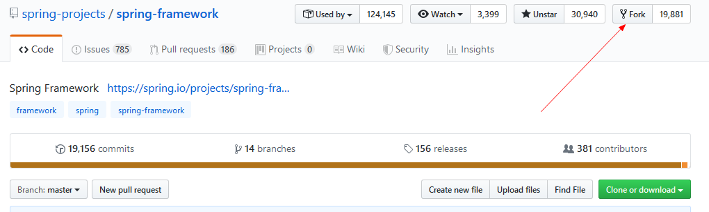
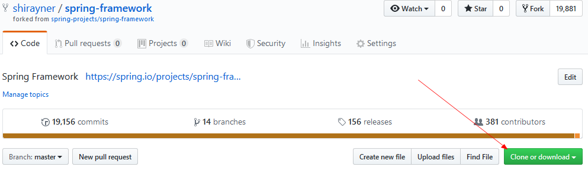
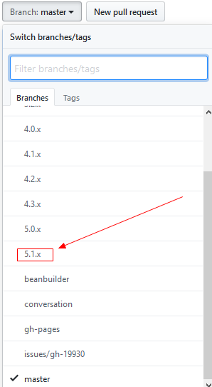
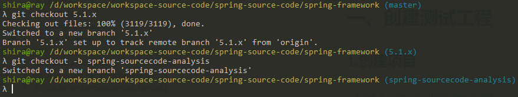
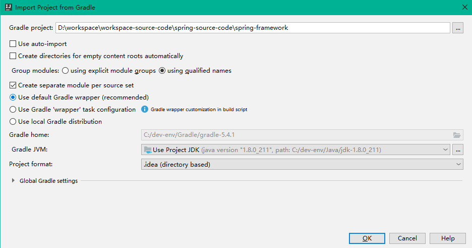

[TOC]

# 前言


Spring容器相关抽象

Spring Bean的解析及注册过程

Spring Bean的加载过程

Application Context 的功能扩展


# 一、开发工具版本


# 二、Idea导入spring-framework工程

## 1.获取Spring Framework源码

### 1.1 fork 源码

fork一份Spring Framework源码

> https://github.com/spring-projects/spring-framework





### 1.2 Clone到本地

fork完成后，在自己的仓库列表会出现刚刚fork的 spring-framework 项目，将其clone到本地。





```bash
git clone git@github.com:shirayner/spring-framework.git
```


### 1.3 新建并切换到源码解析分支




可以看到Spring目前最新的分支是 5.1.x

因此，我们将基于此分支来创建我们的源码解析分支：

```bash
# 从master分支切换到 5.1.x分支
git checkout 5.1.x

# 基于5.1.x 创建并切换到 spring-sourcecode-analysis
git checkout -b spring-sourcecode-analysis
```





## 2.导入Idea

> 参见 [import-into-idea.md](https://github.com/spring-projects/spring-framework/blob/master/import-into-idea.md) 将 spring-framework 导入Idea


### 2.1 预编译`spring-oxm`

在根目录执行如下命令来预编译`spring-oxm`

```
./gradlew :spring-oxm:compileTestJava
```


### 2.2 Idea导入spring-framework

Idea中依次选择 `File -> Open...`，然后选择 spring-framework，点击ok


这一步直接点击ok即可。




> gradle wrapper方式构建项目特点：根据项目中`gradle-wrapper.properties`的配置，下载对应版本的gradle，然后使用此gradle来构建项目。


然后等待项目构建完成即可


# 三、创建测试工程

## 1.创建项目

```properties
group = 'com.ray.study.sourcecode'
artifact ='spring-sourcecode-analysis'
```


## 2.build.gradle

```groovy
plugins {
    id 'java'
}

group 'com.ray.study.sourcecode'
version '1.0.0'

sourceCompatibility = 1.8

repositories {
    mavenCentral()
}

dependencies {
    compileOnly 'org.projectlombok:lombok:1.18.8'
    annotationProcessor 'org.projectlombok:lombok:1.18.8'
    implementation group: 'org.springframework', name: 'spring-context', version: '5.1.8.RELEASE'
    testCompile group: 'junit', name: 'junit', version: '4.12'
}

```


# 参考资料

1. [Spring5.x源码分析 | 从踩坑到放弃之环境搭建](https://blog.csdn.net/evan_leung/article/details/81714604)

   ​	