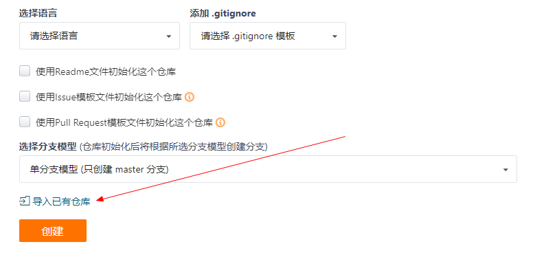
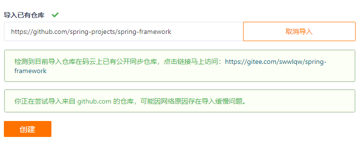
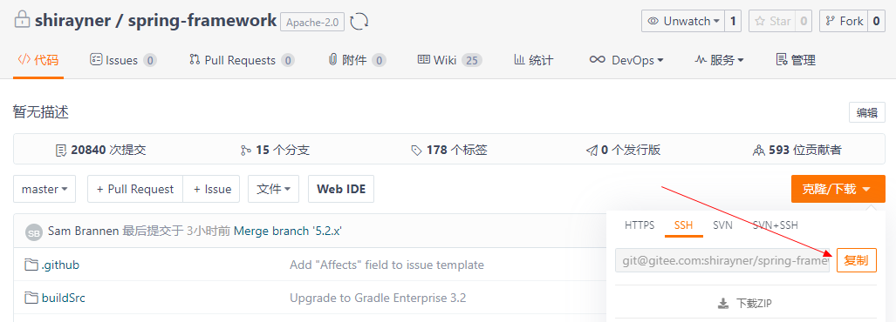
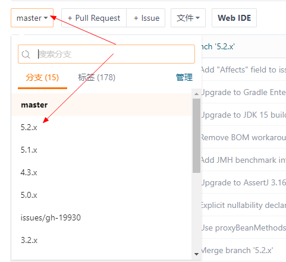
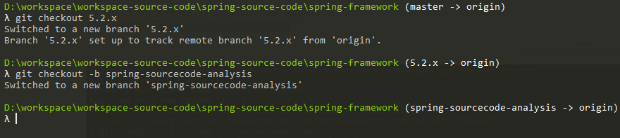
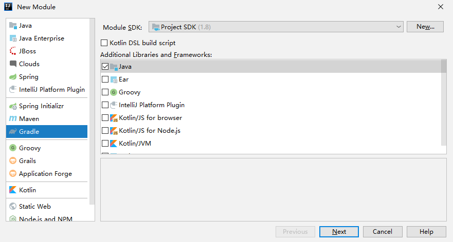
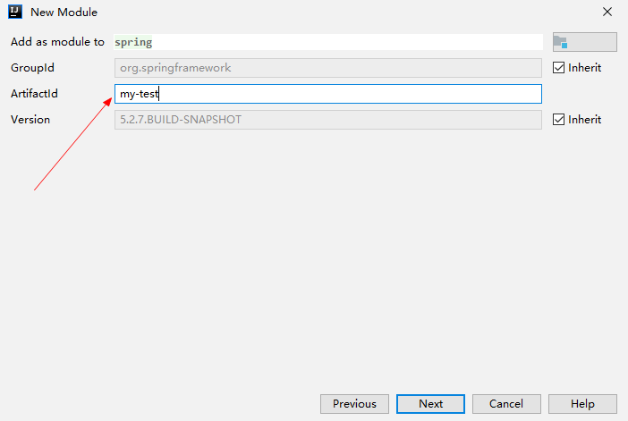

[TOC]

# 前言


Spring容器相关抽象

Spring Bean的解析及注册过程

Spring Bean的加载过程

Application Context 的功能扩展


# 一、开发工具版本


# 二、Idea导入spring-framework工程

## 1.获取Spring Framework源码

### 1.1 fork 源码

fork一份Spring Framework源码

> https://github.com/spring-projects/spring-framework


方式一： 可以直接去 github fork


方式二： 去[码云](https://gitee.com/) ->  新建仓库 -> 导入已有仓库



然后填写spring 仓库地址： https://github.com/spring-projects/spring-framework ， 然后点击创建即可




推荐方式二，下载速度快得很多很多很多


### 1.2 Clone到本地

fork完成后，在自己的仓库列表会出现刚刚fork的 spring-framework 项目，将其clone到本地。




```bash
git clone git@gitee.com:shirayner/spring-framework.git
```


### 1.3 新建并切换到源码解析分支




可以看到Spring目前最新的分支是 5.2.x

因此，我们将基于此分支来创建我们的源码解析分支：

```bash
# 从master分支切换到 5.2.x分支
git checkout 5.2.x

# 基于5.2.x 创建并切换到 spring-sourcecode-analysis
git checkout -b spring-sourcecode-analysis
```





## 2.导入Idea

> 参考：
>
> -  [import-into-idea.md](https://github.com/spring-projects/spring-framework/blob/master/import-into-idea.md)


### 2.1 预编译`spring-oxm`

在根目录执行如下命令来预编译`spring-oxm`

```
./gradlew :spring-oxm:compileTestJava
```


### 2.2 Idea导入spring-framework

Idea中依次选择 `File -> Open...`，然后选择 spring-framework，点击ok


这一步直接点击ok即可。


> gradle wrapper方式构建项目特点：根据项目中`gradle-wrapper.properties`的配置，下载对应版本的gradle，然后使用此gradle来构建项目。


然后等待项目构建完成即可


# 三、创建测试模块

为了方便编写对Spring测试的代码，我们可以在 spring-framework 工程下创建一个 `my-test` 子模块。

## 1.创建子模块

（1）spring-framework项目右键 -> New -> Module...  

这里我们选择创建一个 Gradle 工程




（2）然后输入项目坐标 `my-test`




（3）一路下一步，然后点击Finish，新模块就创建好了

## 2.添加依赖

build.gradle 中添加如下依赖

```groovy
plugins {
    id 'java'
}

group 'org.springframework'
version '5.2.7.BUILD-SNAPSHOT'

sourceCompatibility = 1.8

repositories {
    mavenCentral()
}

dependencies {
    compileOnly 'org.projectlombok:lombok:1.18.8'
    annotationProcessor 'org.projectlombok:lombok:1.18.8'
    compile(project(":spring-context"))
    testCompile group: 'junit', name: 'junit', version: '4.12'
}

```


## 3.创建测试类

（1）实体类

```java
@Data
public class MyTestBean {

	private String testStr="testStr";

}
```


（3）在 resource 目录创建配置文件`beanFactoryTest.xml`

```xml
<?xml version="1.0" encoding="UTF-8"?>
<beans xmlns="http://www.springframework.org/schema/beans"
	   xmlns:xsi="http://www.w3.org/2001/XMLSchema-instance"
	   xsi:schemaLocation="http://www.springframework.org/schema/beans http://www.springframework.org/schema/beans/spring-beans.xsd">

	<bean id="myTestBean" class="com.ray.study.spring.ioc.MyTestBean"/>

</beans>
```


（3）创建Spring容器的测试用例

```java
public class BeanFactoryTest {
	@Test
	public void testSimpleLoad() {
		BeanFactory beanFactory = new XmlBeanFactory(new ClassPathResource("beanFactoryTest.xml"));
		MyTestBean bean = (MyTestBean) beanFactory.getBean("myTestBean");
		Assert.assertEquals("testStr", bean.getTestStr());
	}
}
```


这样就可以运行测试类，进行源码的Debug了


# 参考资料

1. [Spring源码阅读环境搭建](https://www.cnblogs.com/zhangfengxian/p/11072500.html)

2. [Spring5.x源码分析 | 从踩坑到放弃之环境搭建](https://blog.csdn.net/evan_leung/article/details/81714604)

   ​	