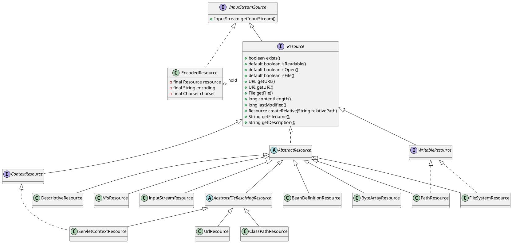

# Spring的相关抽象

[toc]

## 前言

### 推荐阅读

## 一、容器

## 二、资源

```plantuml
@startuml

interface InputStreamSource {
    +InputStream getInputStream()
}

interface Resource extends InputStreamSource {
    +boolean exists()
    +default boolean isReadable()
    +default boolean isOpen()
    +default boolean isFile()
    +URL getURL()
    +URI getURI()
    +File getFile()
    +long contentLength()
    +long lastModified()
    +Resource createRelative(String relativePath)
    +String getFilename();
    +String getDescription();
}


class EncodedResource implements InputStreamSource {
    - final Resource resource
    - final String encoding
    - final Charset charset
}
EncodedResource o- Resource : hold

abstract class AbstractResource implements Resource {

}

interface ContextResource extends Resource {

}

interface WritableResource extends Resource {

}

abstract class AbstractFileResolvingResource extends AbstractResource {

}

class BeanDefinitionResource extends AbstractResource {

}

class ByteArrayResource extends AbstractResource {

}

class DescriptiveResource extends AbstractResource {

}

class VfsResource extends AbstractResource {

}

class InputStreamResource extends AbstractResource {

}

class PathResource extends AbstractResource implements WritableResource {

}

class FileSystemResource extends AbstractResource implements WritableResource {

}

class ClassPathResource extends AbstractFileResolvingResource {

}


class UrlResource extends AbstractFileResolvingResource {

}

class ServletContextResource extends AbstractFileResolvingResource implements ContextResource {

}

@enduml
```

> - Resource: 代表资源
> - EncodedResource: 装饰器模式，为InputStreamSource添加了字符编码